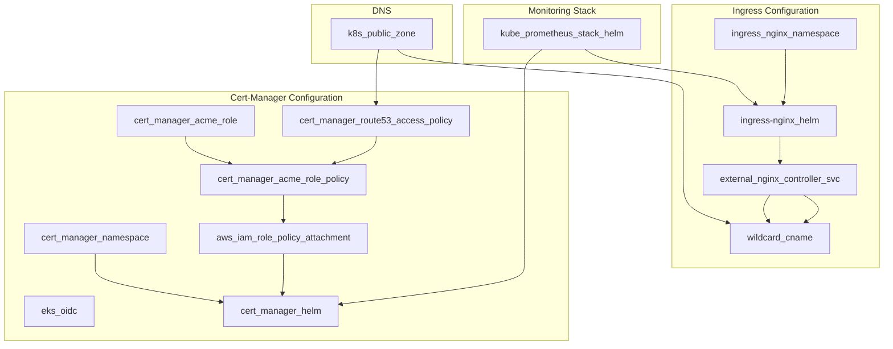

```mdx-code-block
import Tabs from '@theme/Tabs';
import TabItem from '@theme/TabItem';
```

They say ***to master a new technology, you will have to play with it***. While learning a new technology, I always write down the questions that pops up in my mind. And document it while trying to find answers. You can access my study notes at [notes.sreboy.com](https://notes.sreboy.com/). These series of articles we be a refined version of my notes. I will try to cover the most important concepts and best practices **I learned from documentations, exploring source code on github, github issues threads, other articles, youtube videos and most importantly from trying myself and combing possibilities.**


In this article we will go through the deployment of the [GoViolin](https://github.com/ZiadMansourM/GoViolin) app and the [Docker Voting App](https://github.com/dockersamples/example-voting-app). We will aim to deploy a production grade EKS cluster and apply the best practices as much as we can with the following steps:
- [X] Dockerize the GoViolin App.
    - [X] Utilize multi-stage builds.
    - [X] Build a minimal image.
    - [X] Support ***Multi-Architecture***. E.g. `amd64` and `arm64`.
    - [X] Use Github actions to build and push the image to Docker hub.
- [X] Write the manifest files for the Voting App.
- [X] Provision the EKS cluster using Terraform.
    - [X] Use Terraform basic resources only no modules.
- [X] Add and Configure Cert-Manager and Ingress Controller.
- [X] Automate dns-01 challenge by giving access to Cert-Manager Service account ***ONLY*** to modify records in Route53. We will use terraform and IRSA with oidc provider from eks to achieve that following the `principle of least privilege`.
- [X] Deploy and Expose the GoViolin App.
- [X] Deploy the Demo Voting App.
- [X] Expose Prometheus and Grafana.
- [X] Delegate the `k8s` subdomain from Namecheap to Route53, then install a wildcard CNAME record pointing at our cluster.
  - grafana.k8s.sreboy.com
  - prometheus.k8s.sreboy.com
  - goviolin.k8s.sreboy.com
  - vote.k8s.sreboy.com

We will go through many concepts in details but in a bit hurry. Because it is a `From Code to Day Two Operation` article at the end of the day. But in the coming articles we will take a deep dive into each concept e.g.:
- Docker Engine: Namespaces, cgroups, pivot_root, etc.
- Deploying two Ingress Nginx Controllers Internal and External. Using helm and VPN to access the internal resources.
- Restrict access to AWS roles by controlling ***who*** and ***how*** they can assume the role. While automating the whole process.
- Provision and monitor a highly available kubernetes from scratch. E.g. monitor Certificates expiration dates. And applying best practices to secure the cluster.
- Maintaining a HA etcd cluster in production.
- Many more...

## Dockerize GoViolin
This app is written in ***Go***. It doesn't have any database or storage dependencies. Just a simple webapp that serves a static content.

### How to run app locally

<Tabs>

<TabItem value="Method One">

```bash
go run $(ls -1 *.go | grep -v _test.go)
```

</TabItem>

<TabItem value="Method Two">

```bash
go run main.go home.go scale.go duet.go
```

</TabItem>

<TabItem value="Method Three">

```bash
go build -o main
./main
```

</TabItem>

</Tabs>


### Dockerfile
We aim for our docker [image](https://hub.docker.com/repository/docker/ziadmmh/goviolin/general) to be as minimal as possible. So we will use `multi-stage` builds to achieve this. Also, supporting `amd64` and `arm64` architectures is a *MUST* for our app. Check [REFERENCES](#references) section for useful resources. In summary, we aim for a `multi-stage` and `multi-platform` Docker image.

```Dockerfile
FROM --platform=$BUILDPLATFORM golang:1.21.5 AS builder

WORKDIR /app

COPY go.mod go.sum /app/

RUN go mod download

COPY . .

ARG TARGETOS TARGETARCH

RUN CGO_ENABLED=0 GOOS=${TARGETOS} GOARCH=${TARGETARCH} go build -o main

FROM --platform=$TARGETPLATFORM scratch
WORKDIR /app
COPY --from=builder /app/ /app/

EXPOSE 8080

LABEL org.opencontainers.image.tags="ziadmmh/goviolin:v0.0.1,ziadmmh/goviolin:latest"
LABEL org.opencontainers.image.authors="ziadmansour.4.9.2000@gmail.com"

CMD ["/app/main"]
```

:::danger
Please do NOT forget the `CGO_ENABLED=0` flag. Or you will face a weird error to bug. Enjoy this good read after you finish:
- [Debugging a weird 'file not found' error by Julia Evans](https://jvns.ca/blog/2021/11/17/debugging-a-weird--file-not-found--error/)
:::

:::warning Enable Containerd Image Store
The term multi-platform image refers to a bundle of images for multiple different architectures. Out of the box, the default builder for Docker Desktop doesn't support building multi-platform images.

Enabling the containerd image store lets you build multi-platform images and load them to your local image store.

<hr/>

The containerd image store is ***NOT*** enabled by default. To enable the feature for Docker Desktop:

1. Navigate to Settings in Docker Desktop.
2. In the General tab, check Use containerd for pulling and storing images.
3. Select Apply & Restart.
> To ***disable*** the containerd image store, clear the Use containerd for pulling and storing images checkbox.

:::

```bash title="Check Containerd Image Store is Enabled"
docker info -f '{{ .DriverStatus }}'
[[driver-type io.containerd.snapshotter.v1]]
```

### Build Image

<Tabs>

<TabItem value="Containerd Image Store">

```bash
docker build --platform linux/arm64,linux/amd64 --progress plain -t ziadmmh/goviolin:v0.0.1 --push .
```

</TabItem>

<TabItem value="Docker Buildx">

```bash
docker buildx build --platform linux/arm64,linux/amd64 --progress plain -t ziadmmh/goviolin:v0.0.1 --push .
```

</TabItem>

</Tabs>

### GitHub Actions
This is a dummy GitHub Actions workflow that builds, extracts the image labels from Dockerfile, and then pushes the image to Docker Hub [Repository](https://hub.docker.com/repository/docker/ziadmmh/goviolin/general).

:::tip
It is a better idea to use the [docker meta data action](https://github.com/docker/metadata-action). To extract the image tags from e.g. when you push a new tag to the repository.
:::


```yaml
name: Test, Build, and Push Multi-Arch Image

on:
  push:
    branches:
    - master
  workflow_dispatch:

jobs:
  test-and-build:
    runs-on: ubuntu-latest
    steps:
      - uses: actions/checkout@v4

      - name: Set up QEMU
        uses: docker/setup-qemu-action@v3

      - name: Set up Docker Buildx
        uses: docker/setup-buildx-action@v3

      - name: Run Go Tests
        run: go test ./...

      - name: Login to Docker Hub
        uses: docker/login-action@v3
        with:
          username: ${{ secrets.DOCKERHUB_USERNAME }}
          password: ${{ secrets.DOCKERHUB_TOKEN }}
      
      - name: Extract metadata from Dockerfile
        run: echo "TAGS=$(awk '/^LABEL org.opencontainers.image.tags/{gsub(/"/,"",$2); gsub(".*=",""); print }' Dockerfile)" >> $GITHUB_ENV

      - name: Build and Push Multi-Arch Docker Image
        uses: docker/build-push-action@v5
        with:
          context: .
          platforms: linux/amd64,linux/arm64
          tags: ${{ env.TAGS }}
          push: true
```

## Provision EKS Cluster
- [X] Provision: 
  1. `VPC`.
  2. `Internet Gw`.
  3. `Subnets`.
  4. `Elastic IPs`.
  5. `NAT Gateway`.
  6. `Route Tables`, `Route Tables Association`.
  7. `eks-cluster-role`, `eks-cluster-role-attachment` then `EKS Cluster`.
  8. `eks-node-group-general-role` and its Three different `eks-node-group-general-role-attachment`. Then `aws_eks_node_group`.
- [X] Install `CertManager`, `Ingress`, `Prometheus`, and `Grafana`. 
  - Configure `IAM` roles and `DNS` needed for them.
- [X] Deploy Applications/Workloads.
  - Deploy GoViolin App.
  - Deploy Voting App.

## Pre-requisites
First make sure you downloaded `aws-cli` and created `terraform` user with ***programmatic access*** from the AWS Console.

### Install AWS CLI
Follow the following link to download the latest aws-cli version compatible with your operating system:
- [Install or update to the latest version of the AWS CLI](https://docs.aws.amazon.com/cli/latest/userguide/getting-started-install.html)

```bash
aws --version
aws-cli/2.15.38 Python/3.11.8 Darwin/23.4.0 exe/x86_64 prompt/off
```

:::note
The AWS CLI `version 2` is the most recent major version of the AWS CLI and supports all of the latest features. Some features introduced in version 2 are *NOT* backported to version 1 and you must upgrade to access those features.
:::

### Create Terraform User
1. Open AWS Console then navigate to `IAM` Service.
2. Click on `Users` then `Create User`.
3. Name user `terraform`.
4. Click `Next` then `Add user to group` and name it `admin-access-automated-tools`. Attach the `AdministratorAccess` policy then click `Create user group`. `Next` again, and finally `Create User`.
5. Navigate to `terraform` user and select `Security Credentials` tab.
6. Click `Create access key` and Select under use case `Command Line Interface (CLI)`.
7. Read `Alternatives recommended` if you are okay check I understand and click `Create`.
8. Provide a description e.g. `Terraform Programmatic Access` then `Create access key`.
9. Download `.csv` file and store it in a ***safe*** place.

:::tip Access key best practices
- Never store your access key in plain text, in a code repository, or in code.
- Disable or delete access key when no longer needed.
- Enable and stick to least-privilege permissions.
- Rotate access keys regularly.
- For more details about managing access keys, see the [best practices for managing AWS access keys](https://docs.aws.amazon.com/IAM/latest/UserGuide/id_credentials_access-keys.html#securing_access-keys).
:::

```bash title="Install Access keys" {5}
cat $PATH_TO_CREDENTIALS_FILE/terraform_accessKeys.csv

# Enter region: eu-central-1
# Enter output format: json
aws configure --profile terraform

# To verify
cat ~/.aws/config
cat ~/.aws/credentials
```

## 00_Foundation
In this section we will provision the `VPC`, `Internet GW`, `Subnets`, `Elastic IPs`, `NAT Gateway`, `Route Tables`, `EKS Cluster`, `EKS Node Groups`, and `IAM` roles and policies needed.

We will be using the following Terraform providers:
- [AWS Provider](https://registry.terraform.io/providers/hashicorp/aws/latest/docs)

```hcl title="variables.tf"
variable "region" {
  description = "The AWS region to deploy the resources."
  type        = string
  default     = "eu-central-1"
}

variable "profile" {
  description = "The AWS profile to use."
  type        = string
  default     = "terraform"
}

variable "cluster_name" {
  description = "The name of the EKS cluster."
  type        = string
  default     = "eks-cluster-production"
}

```

```hcl title="providers.tf"
terraform {
  required_providers {
    aws = {
      source  = "hashicorp/aws"
      version = "5.45.0"
    }
  }
}

provider "aws" {
  region  = var.region
  profile = var.profile
}

```

### Disclaimer
Because the `main.tf` file is a bit lengthy, I will break it here to be easier for me to comment and provide addition resources for every related resources.

> A better approach would have been grouping related resources in different `.tf` files. But for the sake of simplicity I didn't do it.

### Local variable
```hcl title="main.tf"
locals {
  cluster_name = "eks-cluster-production"
  tags = {
    author                   = "ziadh"
    "karpenter.sh/discovery" = local.cluster_name
  }
}
```

### Craete VPC

You can see more at:
- [aws_vpc](https://registry.terraform.io/providers/hashicorp/aws/latest/docs/resources/vpc) terraform Resource.
- [EKS Network Requirements](https://docs.aws.amazon.com/eks/latest/userguide/network_reqs.html) documentation.

I choose the cidr block to be `10.0.0.0/16` you can choose them as per your convenience. You can visualize the subnets using [Subnet Calculator](https://www.davidc.net/sites/default/subnets/subnets.html). Also remember:

:::info Private IP Addresses
Prefix | First Ip Address | Last Ip Address | Number of Addresses
:--: | :--: | :--: | :--:
10.0.0.0/8 | 10.0.0.0 | 10.255.255.255 | 16,777,216
172.16.0.0/12 | 172.16.0.0 | 172.31.255.255 | 1,048,576
192.168.0.0/16 | 192.168.0.0 | 192.168.255.255 | 65,536
:::

```hcl title="main.tf"
resource "aws_vpc" "main" {
  cidr_block = "10.0.0.0/16"

  # Makes instances shared on the host.
  instance_tenancy = "default"

  # Required for EKS:
  # 1. Enable DNS support in the VPC.
  # 2. Enable DNS hostnames in the VPC.
  enable_dns_support   = true
  enable_dns_hostnames = true

  # Additional Arguments:
  assign_generated_ipv6_cidr_block = false

  tags = merge(local.tags, { Name = "eks-vpc" })
}
```

### Create Internet Gateway
- [aws_internet_gateway](https://registry.terraform.io/providers/hashicorp/aws/latest/docs/resources/internet_gateway) terraform Resource.

```hcl title="main.tf" 
resource "aws_internet_gateway" "main" {
  vpc_id = aws_vpc.main.id

  tags = merge(local.tags, { Name = "eks-igw" })
}
```

### Subnets
We need two public and two private subnets. Read more [here](https://aws.github.io/aws-eks-best-practices/networking/subnets/#:~:text=When%20both%20the%20public%20and%20private%20endpoints%20are%20enabled%2C%20Kubernetes%20API%20requests%20from%20within%20the%20VPC%20communicate%20to%20the%20control%20plane%20via%20the%20X%2DENIs%20within%20your%20VPC.%20Your%20cluster%20API%20server%20is%20accessible%20from%20the%20internet.).

- [aws_subnet](https://registry.terraform.io/providers/hashicorp/aws/latest/docs/resources/subnet) terraform Resource.
- [Subnet Calculator](https://www.davidc.net/sites/default/subnets/subnets.html).

<Tabs>

<TabItem value="Public Subnet 1">

```hcl title="main.tf" {9,15,16}
resource "aws_subnet" "public_1" {
  vpc_id = aws_vpc.main.id

  cidr_block        = "10.0.0.0/18"
  availability_zone = "eu-central-1a"

  # Required for EKS: Instances launched into the subnet
  # should be assigned a public IP address.
  map_public_ip_on_launch = true

  tags = merge(
    local.tags,
    {
      Name                                          = "public-eu-central-1a"
      "kubernetes.io/cluster/${local.cluster_name}" = "shared"
      "kubernetes.io/role/elb"                      = "1"
    }
  )
}
```

</TabItem>

<TabItem value="Public Subnet 2">

```hcl title="main.tf" {9,15,16}
resource "aws_subnet" "public_2" {
  vpc_id = aws_vpc.main.id

  cidr_block        = "10.0.64.0/18"
  availability_zone = "eu-central-1b"

  # Required for EKS: Instances launched into the subnet
  # should be assigned a public IP address.
  map_public_ip_on_launch = true

  tags = merge(
    local.tags,
    {
      Name                                          = "public-eu-central-1b"
      "kubernetes.io/cluster/${local.cluster_name}" = "shared"
      "kubernetes.io/role/elb"                      = "1"
    }
  )
}
```

</TabItem>

<TabItem value="Private Subnet 1">

```hcl title="main.tf" {11,12}
resource "aws_subnet" "private_1" {
  vpc_id = aws_vpc.main.id

  cidr_block        = "10.0.128.0/18"
  availability_zone = "eu-central-1a"

  tags = merge(
    local.tags,
    {
      Name                                          = "private-eu-central-1a"
      "kubernetes.io/cluster/${local.cluster_name}" = "shared"
      "kubernetes.io/role/internal-elb"             = "1"
    }
  )
}
```

</TabItem>

<TabItem value="Private Subnet 2">

```hcl title="main.tf" {11,12}
resource "aws_subnet" "private_2" {
  vpc_id = aws_vpc.main.id

  cidr_block        = "10.0.192.0/18"
  availability_zone = "eu-central-1b"

  tags = merge(
    local.tags,
    {
      Name                                          = "private-eu-central-1b"
      "kubernetes.io/cluster/${local.cluster_name}" = "shared"
      "kubernetes.io/role/internal-elb"             = "1"
    }
  )
}
```

</TabItem>

</Tabs>

:::note
Pay a close attention to:
- The `"kubernetes.io/role/elb"` tag we had on public subnets vs `"kubernetes.io/role/internal-elb"`. Read more on the docs [here](https://docs.aws.amazon.com/eks/latest/userguide/network_reqs.html#:~:text=If%20you%20want%20to%20deploy%20load%20balancers%20to%20a%20subnet%2C%20the%20subnet%20must%20have%20the%20following%20tag%3A).
- The `map_public_ip_on_launch = true` on public subnets ONLY.
- Without this tag `"kubernetes.io/cluster/${local.cluster_name}"` the EKS cluster will not be able to communicate with the nodes.
:::

### Elastic IPs and NAT GWs

- [aws_eip](https://registry.terraform.io/providers/hashicorp/aws/latest/docs/resources/eip) terraform Resource.
- [aws_nat_gateway](https://registry.terraform.io/providers/hashicorp/aws/latest/docs/resources/nat_gateway) terraform Resource.

<Tabs>

<TabItem value="Elastic IP and NAT Gw One">

```hcl title="main.tf"
resource "aws_eip" "nat_1" {
  depends_on = [aws_internet_gateway.main]
}

resource "aws_nat_gateway" "gw_1" {
  subnet_id     = aws_subnet.public_1.id
  allocation_id = aws_eip.nat_1.id

  tags = merge(local.tags, { Name = "eks-nat-gw-1" })
}
```

</TabItem>

<TabItem value="Elastic IP and NAT Gw Two">

```hcl title="main.tf"
resource "aws_eip" "nat_2" {
  depends_on = [aws_internet_gateway.main]
}

resource "aws_nat_gateway" "gw_2" {
  subnet_id     = aws_subnet.public_2.id
  allocation_id = aws_eip.nat_2.id

  tags = merge(local.tags, { Name = "eks-nat-gw-2" })
}
```

</TabItem>

</Tabs>

### RT and RTA
Route Tables and Route Tables Association section:
- [aws_route_table](https://registry.terraform.io/providers/hashicorp/aws/latest/docs/resources/route_table) terraform Resource.
- [aws_route_table_association](https://registry.terraform.io/providers/hashicorp/aws/latest/docs/resources/route_table_association) terraform Resource.

We will have three route tables and then associate each one of the four subnets with the appropriate route table.

<Tabs>

<TabItem value="Public Route Table">

```hcl title="main.tf" {6}
resource "aws_route_table" "public" {
  vpc_id = aws_vpc.main.id

  route {
    cidr_block = "0.0.0.0/0"
    gateway_id = aws_internet_gateway.main.id
  }

  tags = merge(local.tags, { Name = "eks-public-rt" })
}
```

</TabItem>

<TabItem value="Private Route Table One">

```hcl title="main.tf" {6}
resource "aws_route_table" "private_1" {
  vpc_id = aws_vpc.main.id

  route {
    cidr_block     = "0.0.0.0/0"
    nat_gateway_id = aws_nat_gateway.gw_1.id
  }

  tags = merge(local.tags, { Name = "eks-private-rt-1" })
}
```

</TabItem>

<TabItem value="Private Route Table Two">

```hcl title="main.tf" {6}
resource "aws_route_table" "private_2" {
  vpc_id = aws_vpc.main.id

  route {
    cidr_block     = "0.0.0.0/0"
    nat_gateway_id = aws_nat_gateway.gw_2.id
  }

  tags = merge(local.tags, { Name = "eks-private-rt-2" })
}
```

</TabItem>

</Tabs>

And there respective associations:

```hcl title="main.tf" {3,8}
resource "aws_route_table_association" "public_1" {
  subnet_id      = aws_subnet.public_1.id
  route_table_id = aws_route_table.public.id
}

resource "aws_route_table_association" "public_2" {
  subnet_id      = aws_subnet.public_2.id
  route_table_id = aws_route_table.public.id
}

resource "aws_route_table_association" "private_1" {
  subnet_id      = aws_subnet.private_1.id
  route_table_id = aws_route_table.private_1.id
}

resource "aws_route_table_association" "private_2" {
  subnet_id      = aws_subnet.private_2.id
  route_table_id = aws_route_table.private_2.id
}
```

### IAM roles for EKS

- [aws_iam_role](https://registry.terraform.io/providers/hashicorp/aws/latest/docs/resources/iam_role) terraform Resource.
- [aws_iam_role_policy_attachment](https://registry.terraform.io/providers/hashicorp/aws/latest/docs/resources/iam_role_policy_attachment) terraform Resource.

Note that we will attach the role to the [AmazonEKSClusterPolicy](https://github.com/SummitRoute/aws_managed_policies/blob/master/policies/AmazonEKSClusterPolicy) policy, it is managed by aws. And the ***assume_role_policy*** is responsible on who can assume this role.

This role is used by the EKS control plane to make calls to AWS API operations on your behalf.

```hcl title="main.tf"
resource "aws_iam_role" "eks_cluster" {
  name = "eks-cluster"

  assume_role_policy = <<POLICY
  {
    "Version": "2012-10-17",
    "Statement": [
      {
        "Effect": "Allow",
        "Principal": {
          "Service": "eks.amazonaws.com"
        },
        "Action": "sts:AssumeRole"
      }
    ]
  }
  POLICY
}

resource "aws_iam_role_policy_attachment" "amazon_eks_cluster_policy" {
  policy_arn = "arn:aws:iam::aws:policy/AmazonEKSClusterPolicy"
  role = aws_iam_role.eks_cluster.name
}
```

### EKS Cluster

- [aws_eks_cluster](https://registry.terraform.io/providers/hashicorp/aws/latest/docs/resources/eks_cluster) terraform Resource.

```hcl title="main.tf" {10}
resource "aws_eks_cluster" "eks" {
  name = local.cluster_name

  # Amazon Resource Name (ARN) of the IAM role that provides permission for
  # the kubernetes control plane to make calls to aws API operations on your 
  # behalf.
  role_arn = aws_iam_role.eks_cluster.arn

  # Desired Kubernetes master version
  version = "1.28"

  vpc_config {
    endpoint_private_access = false
    endpoint_public_access  = true

    # Must be in at least two subnets in two different
    # availability zones.
    subnet_ids = [
      aws_subnet.public_1.id,
      aws_subnet.public_2.id,
      aws_subnet.private_1.id,
      aws_subnet.private_2.id
    ]
  }

  depends_on = [
    aws_iam_role_policy_attachment.amazon_eks_cluster_policy
  ]

  tags = local.tags
}
```

### IAM roles for NodeGroups

We will create a role named `eks-node-group-general` and then attach three policies to that role:
- [AmazonEKSWorkerNodePolicy](https://github.com/SummitRoute/aws_managed_policies/blob/master/policies/AmazonEKSWorkerNodePolicy).
- [AmazonEKS_CNI_Policy](https://github.com/SummitRoute/aws_managed_policies/blob/master/policies/AmazonEKS_CNI_Policy).
- [AmazonEC2ContainerRegistryReadOnly](https://github.com/SummitRoute/aws_managed_policies/blob/master/policies/AmazonEC2ContainerRegistryReadOnly).

Also we control who can assume the `eks-node-group-general` by the ***assume_role_policy*** below. Which is the EKS worker nodes that will assume this role.

In case you were wondering why we need these policies, please follow the docs [here](https://docs.aws.amazon.com/eks/latest/userguide/create-node-role.html#:~:text=Before%20you%20create%20nodes%2C%20you%20must%20create%20an%20IAM%20role%20with%20the%20following%20permissions%3A) and the above links to know exactly what each policy gives permission to.

```hcl title="main.tf"
resource "aws_iam_role" "node_group_general" {
  name = "eks-node-group-general"

  assume_role_policy = <<POLICY
  {
    "Version": "2012-10-17",
    "Statement": [
      {
        "Effect": "Allow",
        "Principal": {
          "Service": "ec2.amazonaws.com"
        },
        "Action": "sts:AssumeRole"
      }
    ]
  }
  POLICY
}
```

<Tabs>

<TabItem value="AmazonEKSWorkerNodePolicy">

```hcl title="main.tf"
resource "aws_iam_role_policy_attachment" "amazon_eks_worker_node_policy_general" {
  policy_arn = "arn:aws:iam::aws:policy/AmazonEKSWorkerNodePolicy"
  role = aws_iam_role.node_group_general.name
}
```

</TabItem>

<TabItem value="AmazonEKS_CNI_Policy">

```hcl title="main.tf"
resource "aws_iam_role_policy_attachment" "amazon_eks_cni_policy_general" {
  policy_arn = "arn:aws:iam::aws:policy/AmazonEKS_CNI_Policy"
  role = aws_iam_role.node_group_general.name
}
```

</TabItem>

<TabItem value="AmazonEC2ContainerRegistryReadOnly">

```hcl title="main.tf"
resource "aws_iam_role_policy_attachment" "amazon_ec2_container_registry_read_only_general" {
  policy_arn = "arn:aws:iam::aws:policy/AmazonEC2ContainerRegistryReadOnly"
  role = aws_iam_role.node_group_general.name
}
```

</TabItem>

</Tabs>

### EKS NodeGroup

- [aws_eks_node_group](https://registry.terraform.io/providers/hashicorp/aws/latest/docs/resources/eks_node_group) terraform Resource.

```hcl title="main.tf"
resource "aws_eks_node_group" "nodes_general" {
  cluster_name    = aws_eks_cluster.eks.name
  node_group_name = "nodes-general-group"
  node_role_arn   = aws_iam_role.node_group_general.arn

  # Identifiers of EC2 subnets to associate with the EKS Node Group.
  # This will error
  # These subnets must have the following resource tags:
  # This will error
  # - kubernetes.io/cluster/CLUSTER_NAME
  # Where CLUSTER_NAME is replaced with the name of the EKS cluster.
  subnet_ids = [
    aws_subnet.private_1.id,
    aws_subnet.private_2.id
  ]

  scaling_config {
    desired_size = 2
    max_size     = 2
    min_size     = 2
  }

  # Valid Values: AL2_x86_64, BOTTLEROCKET_x86_64
  # Ref: https://docs.aws.amazon.com/eks/latest/APIReference/API_Nodegroup.html#API_Nodegroup_Contents
  ami_type = "BOTTLEROCKET_x86_64"

  # Valid Values: ON_DEMAND, SPOT
  capacity_type = "ON_DEMAND"

  disk_size = 20 # GiB

  # Force version update if existing Pods are unable to be drained
  # due to a pod disruption budget issue.
  force_update_version = false

  # Docs: https://aws.amazon.com/ec2/instance-types/
  instance_types = ["t3.medium"]

  labels = {
    role = "nodes-general"
  }

  # If not specified, then inherited from the EKS master plane.
  version = "1.28"

  depends_on = [
    aws_iam_role_policy_attachment.amazon_eks_worker_node_policy_general,
    aws_iam_role_policy_attachment.amazon_eks_cni_policy_general,
    aws_iam_role_policy_attachment.amazon_ec2_container_registry_read_only_general
  ]

  tags = local.tags
}
```

:::warning
```hcl {2-4}
scaling_config {
  desired_size = 2
  max_size     = 2
  min_size     = 2
}
```

We can not have less than 2 worker nodes in the EKS cluster. As we will add a `PodAntiAffinity` rule to the ingress-nginx controller. More later on this.
:::

### Test Foundation Layer
```bash
terraform fmt
terraform init
terraform validate
terraform plan
terraform apply
```

```bash
rm ~/.kube/config # (Optional)
aws eks --region eu-central-1 update-kubeconfig --name eks-cluster-production --profile terraform
kubectl get nodes,svc
```

## 10_Platform
In this section we will provision:
- Kube-Prometheus-Stack.
- Ingress-Nginx.
- Cert-Manager.
- Route53 with `*.k8s.sreboy.com` subdomain.

### Vars

```hcl title="variables.tf"
variable "region" {
  description = "The AWS region to deploy the resources."
  type        = string
  default     = "eu-central-1"
}

variable "profile" {
  description = "The AWS profile to use."
  type        = string
  default     = "terraform"
}

variable "cluster_name" {
  description = "The name of the EKS cluster."
  type        = string
  default     = "eks-cluster-production"
}

```

### Providers

```hcl title="providers.tf"
terraform {
  required_providers {
    aws = {
      source  = "hashicorp/aws"
      version = "5.45.0"
    }
    kubernetes = {
      source = "hashicorp/kubernetes"
      version = "2.29.0"
    }
    helm = {
      source = "hashicorp/helm"
      version = "2.13.0"
    }
  }
}

provider "aws" {
  region  = var.region
  profile = var.profile
}

data "aws_eks_cluster" "cluster" {
  name = var.cluster_name
}

data "aws_eks_cluster_auth" "cluster" {
  name = var.cluster_name
}

provider "kubernetes" {
  host = data.aws_eks_cluster.cluster.endpoint
  token = data.aws_eks_cluster_auth.cluster.token
  cluster_ca_certificate = base64decode(data.aws_eks_cluster.cluster.certificate_authority.0.data)
}

provider "helm" {
  kubernetes {
    host                   = data.aws_eks_cluster.cluster.endpoint
    token                  = data.aws_eks_cluster_auth.cluster.token
    cluster_ca_certificate = base64decode(data.aws_eks_cluster.cluster.certificate_authority.0.data)
  }
}

```

### Install with Helm
We will use terraform but I wanted to show you how to install them with helm.

```bash title="Kube Prometheus Stack"
helm repo add prometheus-community https://prometheus-community.github.io/helm-charts
helm repo update
helm search repo kube-prometheus-stack --max-col-width 23
# Release name: monitoring
# Helm chart name: kube-prometheus-stack
helm install monitoring prometheus-community/kube-prometheus-stack \
--values prometheus-values.yaml \
--version 58.1.3 \
--namespace monitoring \
--create-namespace
# Later when you are done
helm uninstall monitoring -n monitoring
```

```bash title="Ingress-Nginx"
helm repo add ingress-nginx https://kubernetes.github.io/ingress-nginx
helm repo update
helm search repo ingress-nginx --max-col-width 23
helm install ingress-nginx ingress-nginx/ingress-nginx \
--values ingress-values.yaml \
--version 4.10.0 \
--namespace ingress-nginx \
--create-namespace
# Later when you are done
helm uninstall ingress-nginx -n ingress-nginx
```


```bash title="Cert-Manager"
helm repo add jetstack https://charts.jetstack.io
helm repo update
helm search repo cert-manager --max-col-width 23
helm install cert-manager jetstack/cert-manager \
--values cert-manager-values.yaml \
--version 1.14.4 \
--namespace cert-manager \
--create-namespace
# Later when you are done
helm uninstall cert-manager -n cert-manager
```

### Draft Plan
The following is just us drafting the plan we will use Terraform not the UI. Do not worry if you did not understand a certain part we are just drafting plan. We will go into details.

1. Delegate a subdomain to Route53. `*.k8s.sreboy.com`.
  1. Create a public hosted zone in Route53.
    - Domain Name: `k8s.sreboy.com`.
  2. Create a `nameserver - NS` record in Namecheap.
  3. (Optional) Test subdomain delegation with a dummy `test.k8s.sreboy.com` in Route53 and try to resolve it with `dig +short test.k8s.sreboy.com`. Value can be anything: `10.10.10.10`. You can also use this tool to see DNS propagation [whatsmydns](https://www.whatsmydns.net/).
2. We will use IRSA: ***IAM Roles for Service Accounts*** to allow the `cert-manager` to manage the `Route53` hosted zone. 
  1. Create OpenID Connect Provider first:
    - Open eks service in AWS Console. Then under clusters select the cluster.
    - Under `Configuration` tab, Copy the `OpenID Connect Provider URL`.
    - Navigate to IAM Service then `Identity Providers`. Select `Add provider`.
    - Select `OpenID Connect`, paste url and `Get thumbprint`.
    - Under Audience: `sts.amazonaws.com`.
    - Click `Add provider`.
  2. Create an IAM policy. Name the policy `CertManagerRoute53Access`.
  ```json
  {
    "Version": "2012-10-17",
    "Statement": [
        {
            "Effect": "Allow",
            "Action": "route53:GetChange",
            "Resource": "arn:aws:route53:::change/*"
        },
        {
            "Effect": "Allow",
            "Action": [
                "route53:ChangeResourceRecordSets",
                "route53:ListResourceRecordSets"
            ],
            "Resource": "arn:aws:route53:::hostedzone/<id>"
        }
    ]
  }
  ```
  3. Craete an IAM role and ***associate it with the kubernetes service account***. Under `Roles` click `Create role`.
    - Select type of trusted entity to be `Web identity`.
    - Choose the identity provider created in step 1.
    - For Audience: `sts.amazonaws.com`.
    - Click next for permissions and attach `CertManagerRoute53Access` policy.
    - Name the role `cert-manager-acme`.
  4. To allow only our cert-manager kubernetes account to assume this role, we need to update `Trust Relationship` of the `cert-manager-acme` role. Click edit Trust Relationships:
    - First we need the name of the service account attached to the cert-manager.
    - Run `kubectl -n cert-manager get sa cert-manager` called `cert-083-cert-manager`.
    - Update the trust relationship to be:
    <Tabs>

    <TabItem value="Before">

    ```json
    {
      "Version": "2012-10-17",
      "Statement": [
        {
          "Effect": "Allow",
          "Principal": {
            "Federated": <OIDC_PROVIDER_ARN>
          },
          "Action": "sts:AssumeRoleWithWebIdentity",
          "Condition": {
            "StringEquals": {
              "oidc.eks.eu-central-1.amazonaws.com/id/<CLUSTER_ID>:aud": "sts.amazonaws.com"
            }
          }
        }
      ]
    }
    ```

    </TabItem>

    <TabItem value="After">

    ```json
    {
      "Version": "2012-10-17",
      "Statement": [
        {
          "Effect": "Allow",
          "Principal": {
            "Federated": <OIDC_PROVIDER_ARN>
          },
          "Action": "sts:AssumeRoleWithWebIdentity",
          "Condition": {
            "StringEquals": {
              "oidc.eks.eu-central-1.amazonaws.com/id/<CLUSTER_ID>:sub": "system:serviceaccount:cert-manager:cert-manager"
            }
          }
        }
      ]
    }
    ```

    </TabItem>

    </Tabs>
  5. Attach policy `CertManagerRoute53Access` to the role `cert-manager-acme`. Remember the ***assume_role_policy*** created inside the role defines who can assume this role.
3. Install `Kube Prometheus Stack` with custom `values.yaml` file.
4. Install `Ingress-Nginx` with custom `values.yaml` file.
5. Install `Cert-Manager` with custom `values.yaml` file.

### Visualize Plan
The following is a ***Simplified Dependency Graph*** made by [Mermaid](https://mermaid.js.org/).



### AWS Caller Identity

Use this data source to get the access to the effective Account ID, User ID, and ARN in which Terraform is authorized.

- [aws_caller_identity](https://registry.terraform.io/providers/hashicorp/aws/latest/docs/data-sources/caller_identity)

```hcl title="main.tf"
data "aws_caller_identity" "current" {}
```

### 

## REFERENCES
- [Faster Multi-Platform Builds: Dockerfile Cross-Compilation Guide](https://www.docker.com/blog/faster-multi-platform-builds-dockerfile-cross-compilation-guide/)
- [Containerd image store](https://docs.docker.com/desktop/containerd/)
- [Install or update to the latest version of the AWS CLI](https://docs.aws.amazon.com/cli/latest/userguide/getting-started-install.html)
- [Amazon EKS VPC and subnet requirements and considerations](https://docs.aws.amazon.com/eks/latest/userguide/network_reqs.html)
- [Mermaid Diagramming and charting tool](https://mermaid.js.org/)