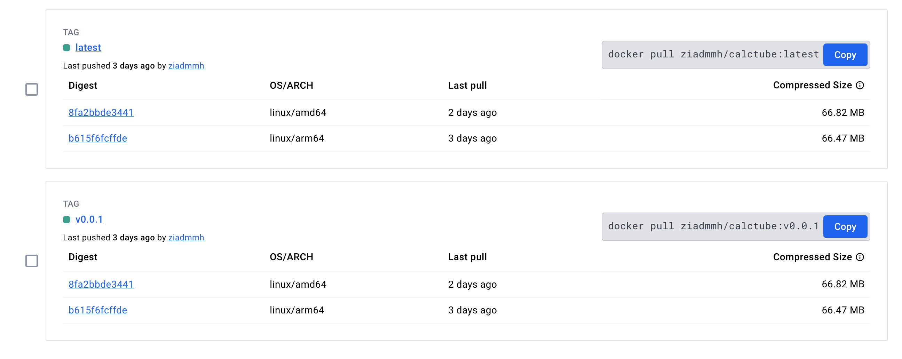
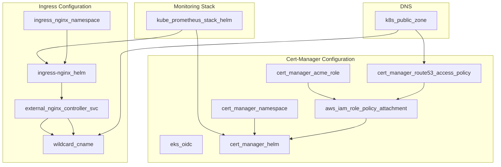
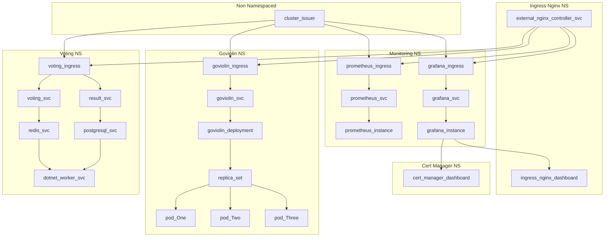
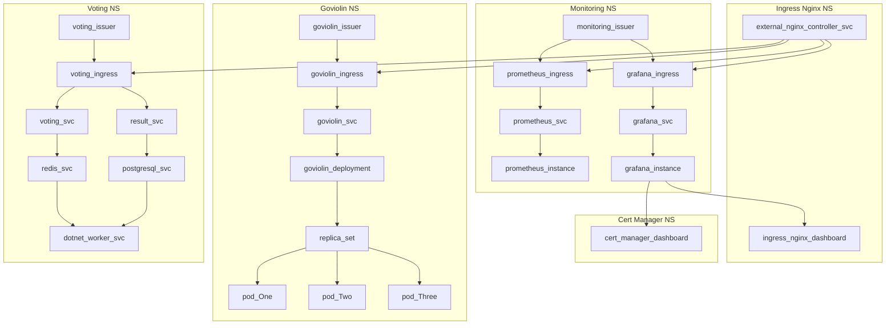

```mdx-code-block
import Tabs from '@theme/Tabs';
import TabItem from '@theme/TabItem';
```

<hr/>

<iframe src='/pages/soon.html' height="300px" width='100%' scrolling="no"></iframe> 

<hr/>

They say ***to master a new technology, you will have to play with it***. While learning a new technology, I always write down the questions that pops up in my mind. And document it while trying to find answers. You can access my study notes at [notes.sreboy.com](https://notes.sreboy.com/). 

These series of ***articles will be a refined version of my notes***. I will try to cover the most important concepts and best practices **I learned from documentations, exploring source code on github, github issues threads, other articles, youtube videos, and most importantly, through hands-on experimentation and embracing the creative chaos of exploration, much like assembling LEGO blocks, where I constantly experiment and combine different elements to learn.**

<!-- truncate -->

In this article we will deploy using ***Terraform*** as much as possible, and with the minimum ***ClickOps*** required:
- EKS cluster using terraform resources (No Modules).
- Kube Prometheus Stack with Loki (Helm).
- Two Ingress Nginx Controllers (Internal and External).
- Basic Auth for Ingress. (***Soon External auth using Keycloak with Terraform***).
- Configure Route53 with Split Horizon DNS.
- Install Cert-Manager and configure it to automate the **dns-01** challenge.
- Restrict access to Route53 records by using IRSA.
- Utilize sealed-secrets to store sensitive data in git. And Integrate it with kustomize.
- Configure AWS Client VPN and AWS IAM Identity Center with:
  - SSO: SAML based Federated Authentication.
  - Active Directory Authentication.
- Deploy ArgoCD with ***app-of-apps*** pattern. And then Deploy:
  - [CalcTube](https://github.com/ZiadMansourM/calctube).
  - [GoViolin](https://github.com/ZiadMansourM/GoViolin).
  - [Docker Voting App](https://github.com/ZiadMansourM/voting-app).
- Send ArgoCD and Alert Manager Notifications to Slack.
- Utilize kustomize to: 
  - Deploy custom dashboards to Grafana.
  - Handle Sealed Secrets and ConfigMaps.

Besides that we will discuss:
- How to build multi architecture Docker images.
- OpenVPN over Shadowsocks to bypass Deep Packet Inspection.
- Split Horizon DNS.

<hr/>

We will go through many concepts with some advanced configurations but at a quick pace. Because it is a `From Code to Day Two Operation` article at the end of the day. However, in the coming articles we will take a deep dive into each concept e.g.:
- Docker Engine: namespaces, cgroups, pivot_root, etc.
- Provision and Monitor a Highly Available Kubernetes Cluster from Scratch. E.g. monitor Certificates expiration dates. Besides, applying best practices to secure the cluster.
- Maintaining a HA etcd cluster in production.
- Many more...

<hr/>

Before we start you can access the code at:

- [Terraformed Odyssey](https://github.com/ZiadMansourM/terraformed-odyssey).
- [CalcTube](https://github.com/ZiadMansourM/calctube).
- [GoViolin](https://github.com/ZiadMansourM/GoViolin).
- [Docker Voting App](https://github.com/ZiadMansourM/voting-app).

## GoViolin
This app is written in ***Go***. It doesn't have any database or storage dependencies. Just a simple webapp that serves a static content.

### Run Locally

<Tabs>

<TabItem value="Method One">

```bash
go run $(ls -1 *.go | grep -v _test.go)
```

</TabItem>

<TabItem value="Method Two">

```bash
go run main.go home.go scale.go duet.go
```

</TabItem>

<TabItem value="Method Three">

```bash
go build -o main
./main
```

</TabItem>

</Tabs>


### Dockerfile
We aim for our docker [image](https://hub.docker.com/repository/docker/ziadmmh/goviolin/general) to be as minimal as possible. So we will use `multi-stage` builds to achieve this. Also, supporting `amd64` and `arm64` architectures is a *MUST* for our app. Check [REFERENCES](#references) section for useful resources. 

In summary, we aim for a minimal `multi-stage` and `multi-platform` Docker image:

```Dockerfile title="Dockerfile"
FROM --platform=$BUILDPLATFORM golang:1.21.5 AS builder

WORKDIR /app

COPY go.mod go.sum /app/

RUN go mod download

COPY . .

ARG TARGETOS TARGETARCH

RUN CGO_ENABLED=0 GOOS=${TARGETOS} GOARCH=${TARGETARCH} go build -o main

FROM --platform=$TARGETPLATFORM scratch
WORKDIR /app
COPY --from=builder /app/ /app/

EXPOSE 8080

LABEL org.opencontainers.image.tags="ziadmmh/goviolin:v0.0.1,ziadmmh/goviolin:latest"
LABEL org.opencontainers.image.authors="ziadmansour.4.9.2000@gmail.com"

CMD ["/app/main"]
```

:::danger
Please do NOT forget the `CGO_ENABLED=0` flag. Or you will face a weird error, that is hard to bug. Enjoy this good read after you finish :)
- [Debugging a weird 'file not found' error by Julia Evans](https://jvns.ca/blog/2021/11/17/debugging-a-weird--file-not-found--error/)
:::

:::warning Enable Containerd Image Store
The term multi-platform image refers to a bundle of images for multiple different architectures. Out of the box, the default builder for Docker Desktop doesn't support building multi-platform images.

Enabling the containerd image store lets you build multi-platform images and load them to your local image store.

<hr/>

The containerd image store is ***NOT*** enabled by default. To enable the feature for Docker Desktop:

1. Navigate to Settings in Docker Desktop.
2. In the General tab, check Use containerd for pulling and storing images.
3. Select Apply & Restart.

To ***disable*** the containerd image store, clear the Use containerd for pulling and storing images checkbox.
Please, do refer to the [docs](https://docs.docker.com/storage/containerd/) first.

:::

```bash title="Check Containerd Image Store is Enabled" {1}
docker info -f '{{ .DriverStatus }}'
[[driver-type io.containerd.snapshotter.v1]]
```

### Build Image

<Tabs>

<TabItem value="Containerd Image Store">

```bash
docker build --platform linux/arm64,linux/amd64 --progress plain -t ziadmmh/goviolin:v0.0.1 --push .
```

</TabItem>

<TabItem value="Docker Buildx">

```bash
docker buildx build --platform linux/arm64,linux/amd64 --progress plain -t ziadmmh/goviolin:v0.0.1 --push .
```

</TabItem>

</Tabs>

### GitHub Actions
This is a dummy GitHub Actions workflow that builds, extracts the image labels from Dockerfile, and then pushes the image to Docker Hub [GoViolin Repository](https://hub.docker.com/repository/docker/ziadmmh/goviolin/general).

:::tip
It is a better idea to use the [docker meta data action](https://github.com/docker/metadata-action). To extract the image tags e.g. when you push a new tag to the repository or commit hash.
:::

<details>
<summary>Click to expand</summary>

```yaml
name: Test, Build, and Push Multi-Arch Image

on:
  push:
    branches:
      - master
  workflow_dispatch:

env:
  TAGS:
  TAG_VERSION:
  REPOSITORY:
  BRANCH_NAME:

permissions: write-all

jobs:
  test-and-build:
    runs-on: ubuntu-latest
    steps:
      - uses: actions/checkout@v4

      - name: Set up QEMU
        uses: docker/setup-qemu-action@v3

      - name: Set up Docker Buildx
        uses: docker/setup-buildx-action@v3

      - name: Run Go Tests
        run: go test ./...

      - name: Login to Docker Hub
        uses: docker/login-action@v3
        with:
          username: ${{ secrets.DOCKERHUB_USERNAME }}
          password: ${{ secrets.DOCKERHUB_TOKEN }}
      
      - name: Extract metadata from Dockerfile
        run: |
          echo "TAGS=$(awk '/^LABEL org.opencontainers.image.tags/{gsub(/"/,"",$2); gsub(".*=",""); print }' Dockerfile)" >> $GITHUB_ENV
          echo "TAG_VERSION=$(echo $TAGS | cut -d: -f2)" >> $GITHUB_ENV
      
      - name: Check if TAGS is set
        run: |
          if [ -z "${{ env.TAGS }}" ]; then
            echo "TAGS environment variable is not set. Please set it before running this workflow."
            exit 1
          fi

      - name: Build and Push Multi-Arch Docker Image
        uses: docker/build-push-action@v5
        with:
          context: .
          platforms: linux/amd64,linux/arm64
          tags: ${{ env.TAGS }},ziadmmh/goviolin:latest
          push: true

      - name: Set Enviroment Variables
        run: |
          echo "REPOSITORY=ZiadMansourM/terraformed-odyssey" >> $GITHUB_ENV
          echo "BRANCH_NAME=update-goviolin-image-$RANDOM" >> $GITHUB_ENV

      - name: Checkout Code
        uses: actions/checkout@v4
        with:
          repository: ${{ env.REPOSITORY }}
          token: ${{ secrets.GH_CLI_TOKEN }}
          ref: main
          path: terraformed-odyssey

      - name: Checkout Branch and Update Image Tag
        working-directory: terraformed-odyssey/kubernetes/goviolin
        run: |
          git checkout -b "${{ env.BRANCH_NAME }}"
          rm -rf live && mkdir -p live
          kustomize edit set image ziadmmh/goviolin:${{ env.TAG_VERSION }}
          kustomize build > live/live.yaml
      
      - name: Update Image Tag and Send pull-request
        working-directory: terraformed-odyssey/kubernetes/goviolin
        run: |
          git config user.name "github-actions[bot]"
          git config user.email "41898282+github-actions[bot]@users.noreply.github.com"
          git status
          git add live/live.yaml
          git commit -m "Update goviolin image tag to ${{ env.TAGS }}"
          git push origin ${{ env.BRANCH_NAME }}
      
      - name: Create Pull Request
        working-directory: terraformed-odyssey/kubernetes/goviolin
        run: |
          echo "${{ secrets.GH_CLI_TOKEN }}" > token.txt

          gh auth login --with-token < token.txt

          gh pr create \
          --title "Update goviolin image tag to ${{ env.TAGS }}" \
          --body "This PR updates the goviolin image tag to ${{ env.TAGS }}." \
          --base "main" \
          --head "${{ env.BRANCH_NAME }}"
```

</details>


## CalcTube
I built this app to help me during my final exams. It calculates the time needed to watch a playlist on youtube. You just need to provide the playlist URL or Id and it returns the watch time corresponding to each speed.

### Code
The code is super straight forward and easy to understand. It uses the `pytube` library to interact with the YouTube API. Have a look and please reach out if you have any question ^^.

<details>
<summary>Click to expand</summary>

```py title="main.py"
from concurrent.futures import ThreadPoolExecutor
import re
import time

from fastapi import FastAPI, Request
from fastapi.responses import JSONResponse, HTMLResponse, FileResponse
from fastapi.templating import Jinja2Templates
from pydantic import BaseModel
from pytube import Playlist, YouTube


app = FastAPI()
templates = Jinja2Templates(directory="templates")

@app.get("/assets/{filename}")
async def read_item(filename: str):
    return FileResponse(f"templates/assets/{filename}")

def timeit(func):
    def wrapper(*args, **kwargs):
        print(f"Started {func.__name__}...")
        start_time = time.time()
        result = func(*args, **kwargs)
        end_time = time.time()
        print(f"Done {func.__name__} took {(end_time - start_time)*1000:.2f} ms to execute.")
        return result
    return wrapper


def get_playlist_id(link: str) -> str:
    video_pattern = r'(https?://)?(www\.)?(youtube\.com/watch\?v=)?([a-zA-Z0-9_-]+)&?list=([a-zA-Z0-9_-]+)'
    if match := re.match(video_pattern, link):
        return match[5]

    playlist_pattern = r'(https?://)?(www\.)?(youtube\.com/playlist\?list=)?([a-zA-Z0-9_-]+)'
    return match[4] if (match := re.match(playlist_pattern, link)) else link


def get_video_length(url: str) -> int:
    yt = YouTube(url)
    return yt.length


def get_playlist_duration(playlist_url: str) -> tuple[int, int, float]:
    playlist_id = get_playlist_id(playlist_url)
    playlist = Playlist(f"https://www.youtube.com/playlist?list={playlist_id}")
    video_count = len(playlist.video_urls)

    total_seconds = 0
    with ThreadPoolExecutor(max_workers=video_count) as executor:
        total_seconds = sum(executor.map(get_video_length, playlist.video_urls))

    avg_video_length = total_seconds / video_count if video_count != 0 else 0

    return total_seconds, video_count, avg_video_length


def calculate_speed_times(total_seconds: int) -> dict:
    speeds = [1, 1.25, 1.5, 1.75, 2]
    times = {}

    for speed in speeds:
        time_at_speed = total_seconds / speed
        hours = int(time_at_speed // 3600)
        minutes = int((time_at_speed % 3600) // 60)
        seconds = int(time_at_speed % 60)
        times[speed] = f"{hours} hours, {minutes} minutes, {seconds} seconds"

    return times


def format_time(seconds: float) -> str:
    hours = int(seconds // 3600)
    minutes = int((seconds % 3600) // 60)
    seconds = int(seconds % 60)
    return f"{hours} hours, {minutes} minutes, {seconds} seconds"


@timeit
def run(user_input: str):
    total_seconds, video_count, avg_video_length = get_playlist_duration(user_input)
    times = calculate_speed_times(total_seconds)

    return {
        "videoCount": video_count,
        "avgVideoLength": format_time(avg_video_length),
        "speedTimes": dict(times.items()),
    }

@app.get("/", response_class=HTMLResponse)
async def read_item(request: Request):
    print("Here")
    return templates.TemplateResponse("index.html", {"request": request})

class PlaylistUrl(BaseModel):
    playlistUrl: str

@app.post("/calculate")
async def calculate_playlist_duration(playlist_url: PlaylistUrl):
    print("there")
    response_data = run(playlist_url.playlistUrl)
    return JSONResponse(content=response_data)

```

</details>

### Dockerfile
It is actually advised to use `requirements.txt` file to install the dependencies. But for the sake of simplicity I will hard code the dependencies install directly in the Dockerfile without any version pinning.

```Dockerfile
FROM python:3.11-slim

WORKDIR /app

RUN pip install --no-cache-dir fastapi
RUN pip install --no-cache-dir uvicorn
RUN pip install --no-cache-dir pytube
RUN pip install --no-cache-dir jinja2

COPY main.py /app/
COPY templates /app/templates

EXPOSE 80

LABEL org.opencontainers.image.tags="ziadmmh/calctube:v0.0.1"
LABEL org.opencontainers.image.authors="ziadmansour.4.9.2000@gmail.com"

CMD ["uvicorn", "main:app", "--host", "0.0.0.0", "--port", "80"]
```

### GitHub Actions
Same as the GoViolin app, we will use a dummy GitHub Actions workflow that builds, extracts the image labels from Dockerfile, and then pushes the image to Docker Hub [CalcTube Repository](https://hub.docker.com/repository/docker/ziadmmh/calctube/general).

<details>
<summary>Click to expand</summary>

```yaml
name: Test, Build, and Push Multi-Arch Image

on:
  push:
    branches:
    - main
  workflow_dispatch:

env:
  TAGS:
  TAG_VERSION:
  REPOSITORY:
  BRANCH_NAME:

permissions: write-all

jobs:
  test-and-build:
    runs-on: ubuntu-latest
    steps:
      - uses: actions/checkout@v4

      - name: Set up QEMU
        uses: docker/setup-qemu-action@v3

      - name: Set up Docker Buildx
        uses: docker/setup-buildx-action@v3

      - name: Login to Docker Hub
        uses: docker/login-action@v3
        with:
          username: ${{ secrets.DOCKERHUB_USERNAME }}
          password: ${{ secrets.DOCKERHUB_TOKEN }}
      
      - name: Extract metadata from Dockerfile
        run: |
          echo "TAGS=$(awk '/^LABEL org.opencontainers.image.tags/{gsub(/"/,"",$2); gsub(".*=",""); print }' Dockerfile)" >> $GITHUB_ENV
          echo "TAG_VERSION=$(echo $TAGS | cut -d: -f2)" >> $GITHUB_ENV
      
      - name: Check if TAGS is set
        run: |
          if [ -z "${{ env.TAGS }}" ]; then
            echo "TAGS environment variable is not set. Please set it before running this workflow."
            exit 1
          fi

      - name: Build and Push Multi-Arch Docker Image
        uses: docker/build-push-action@v5
        with:
          context: .
          platforms: linux/amd64,linux/arm64
          tags: ${{ env.TAGS }},ziadmmh/calctube:latest
          push: true
```

</details>

Just double check the image tags pushed and note the `OS/ARCH` supported.



## Voting App
The voting app is no different from the above setup. Please refer to the orginal repository and my fork of it for more information. And do reach out if you have any question ^^.


## Plan
Each of your apps has its own Github repository, and github actions is responsible for building and pushing the images to Docker Hub. The images are then pulled by ArgoCD and deployed to the EKS cluster. So in total we aim for Four Repositories. The three repositories containing the code you can configure them as you like. But the `terraform-odyssey` repo which contains the applications manifests according to the GitOps principles. I have configured it as follows and that will affect how the ArgoCD will deploy the applications:

<details>
<summary>Click to expand</summary>

```bash
ziadh@Ziads-MacBook-Air terraformed-odyssey % tree
.
├── argocd
│   ├── app-of-apps
│   │   ├── calctube.yaml
│   │   ├── goviolin.yaml
│   │   ├── system.yaml
│   │   └── voting-app.yaml
│   └── root-app
│       └── root-app.yaml
├── kubernetes
│   ├── README.md
│   ├── calctube
│   │   ├── 00-namespace.yaml
│   │   ├── 01-deployment.yaml
│   │   ├── 02-service.yaml
│   │   ├── 03-ingress.yaml
│   │   ├── files
│   │   │   └── auth
│   │   ├── kustomization.yaml
│   │   └── live
│   │       └── live.yaml
│   ├── goviolin
│   │   ├── 00-namespace.yaml
│   │   ├── 01-deployment.yaml
│   │   ├── 02-service.yaml
│   │   ├── 03-ingress.yaml
│   │   ├── files
│   │   │   └── auth
│   │   ├── kustomization.yaml
│   │   └── live
│   │       └── live.yaml
│   ├── system
│   │   ├── argocd-ingress.yaml
│   │   ├── argocd-notifications-cm.yaml
│   │   ├── components
│   │   │   └── sealed-secret-config.yaml
│   │   ├── dashboards
│   │   │   ├── argocd-14584.json
│   │   │   ├── cert-manager-20842.json
│   │   │   ├── ingress-nginx-14314.json
│   │   │   └── loki-14055.json
│   │   ├── kustomization.yaml
│   │   ├── live
│   │   │   └── live.yaml
│   │   ├── monitoring-ingress.yaml
│   │   ├── sealed-argocd-notifications-secret.yaml
│   │   └── secrets
│   │       └── argocd-notifications-secret-ignore.yaml
│   └── voting-app
│       ├── db-deployment.yaml
│       ├── db-service.yaml
│       ├── ingress.yaml
│       ├── kustomization.yaml
│       ├── live
│       │   └── live.yaml
│       ├── namespace.yaml
│       ├── redis-deployment.yaml
│       ├── redis-service.yaml
│       ├── result-deployment.yaml
│       ├── result-service.yaml
│       ├── vote-deployment.yaml
│       ├── vote-service.yaml
│       └── worker-deployment.yaml
└── terraform
    ├── 00_foundation
    │   ├── 00-locals.tf
    │   ├── 01-vpc.tf
    │   ├── 02-igw.tf
    │   ├── 03-subnets.tf
    │   ├── 04-nat-gw-eip.tf
    │   ├── 05-rt-rta.tf
    │   ├── 06-eks.tf
    │   ├── 07-node-group.tf
    │   ├── providers.tf
    │   ├── terraform.tfstate
    │   ├── terraform.tfstate.backup
    │   └── variables.tf
    ├── 10_platform
    │   ├── 00-kube-prometheus-stack-loki.tf
    │   ├── 01-ingress-nginx.tf
    │   ├── 02-route53.tf
    │   ├── 03-iam-oidc.tf
    │   ├── 04-cert-manager.tf
    │   ├── 05-sealed-secret.tf
    │   ├── data.tf
    │   ├── files
    │   │   ├── cert-manager-values.yaml
    │   │   ├── external-nginx-values.yaml
    │   │   ├── internal-nginx-values.yaml
    │   │   ├── kube-prometheus-stack-values.yaml
    │   │   ├── loki-distributed-values.yaml
    │   │   └── promtail-values.yaml
    │   ├── outputs.tf
    │   ├── providers.tf
    │   ├── terraform.tfstate
    │   ├── terraform.tfstate.backup
    │   └── variables.tf
    └── 15_platform
        ├── 00-argocd.tf
        ├── 01-vpn-acm.tf
        ├── 02-vpn-iam.tf
        ├── 03-vpn-sg.tf
        ├── 04-vpn-endpoint.tf
        ├── data.tf
        ├── files
        │   └── argocd-values.yaml
        ├── metadata
        │   ├── aws-client-vpn-self-service.xml
        │   └── aws-client-vpn.xml
        ├── outputs.tf
        ├── providers.tf
        ├── terraform.tfstate
        ├── terraform.tfstate.backup
        └── variables.tf

24 directories, 89 files
```

</details>

We will go through each file in details, but for a quick overview:
- `terraform` directory contains the terraform code to provision the EKS cluster and the needed resources.
- `kubernetes` directory contains the manifests for the applications we will deploy.
- `argocd` directory contains the ArgoCD manifests for the applications and the ArgoCD itself.

Now lets discuss the contents of the `terraform` directory.

### 00_Foundation Layer
1. `VPC`.
2. `Internet Gw`.
3. `Subnets`.
4. `Elastic IPs`.
5. `NAT Gateways`.
6. `Route Tables`, `Route Tables Association`.
7. `eks-cluster-role`, `eks-cluster-role-attachment` then `EKS Cluster`.
8. `eks-node-group-general-role` and its Three different `eks-node-group-general-role-attachment`. Then `aws_eks_node_group`.

### 10_Platform Layer
1. Kube Prometheus Stack and Loki.
2. Ingress Nginx Controllers.
3. Route53 Split Horizon DNS.
4. Cert-Manager.
5. Sealed Secrets.

### 15_Platform Layer
1. ArgoCD.
2. VPN.

## Pre-requisites
First make sure you downloaded `aws-cli` and created `terraform` user with ***programmatic access*** from the AWS Console.

### AWS CLI
Follow the following link to download the latest aws-cli version compatible with your operating system:
- [Install or update to the latest version of the AWS CLI](https://docs.aws.amazon.com/cli/latest/userguide/getting-started-install.html)

```bash
aws --version
aws-cli/2.15.38 Python/3.11.8 Darwin/23.4.0 exe/x86_64 prompt/off
```

:::note
The AWS CLI `version 2` is the most recent major version of the AWS CLI and supports all of the latest features. Some features introduced in version 2 are *NOT* backported to version 1 and you must upgrade to access those features.
:::

### Terraform User
1. Open AWS Console then navigate to `IAM` Service.
2. Click on `Users` then `Create User`.
3. Name user `terraform`.
4. Click `Next` then `Add user to group` and name it `admin-access-automated-tools`. Attach the `AdministratorAccess` policy then click `Create user group`. `Next` again, and finally `Create User`.
5. Navigate to `terraform` user and select `Security Credentials` tab.
6. Click `Create access key` and Select under use case `Command Line Interface (CLI)`.
7. Read `Alternatives recommended` if you are okay check I understand and click `Create`.
8. Provide a description e.g. `Terraform Programmatic Access` then `Create access key`.
9. Download `.csv` file and store it in a ***safe*** place.

:::tip Access key best practices
- Never store your access key in plain text, in a code repository, or in code.
- Disable or delete access key when no longer needed.
- Enable and stick to least-privilege permissions.
- Rotate access keys regularly.
- For more details about managing access keys, see the [best practices for managing AWS access keys](https://docs.aws.amazon.com/IAM/latest/UserGuide/id_credentials_access-keys.html#securing_access-keys).
:::

```bash title="Install Access keys" {5}
cat $PATH_TO_CREDENTIALS_FILE/terraform_accessKeys.csv

# Enter region: eu-central-1
# Enter output format: json
aws configure --profile terraform

# To verify
cat ~/.aws/config
cat ~/.aws/credentials
```

## 00_Foundation
In this section we will provision the `VPC`, `Internet GW`, `Subnets`, `Elastic IPs`, `NAT Gateway`, `Route Tables`, `EKS Cluster`, `EKS Node Groups`, and `IAM` roles and policies needed.

Note that provisioning the `00_foundation` took from me:
- ~12 minutes to apply.
- ~11 minutes to destroy.

We will be using the following Terraform providers:
- [AWS Provider](https://registry.terraform.io/providers/hashicorp/aws/latest/docs)

### Variables

```hcl title="variables.tf"
variable "region" {
  description = "The AWS region to deploy the resources."
  type        = string
  default     = "eu-central-1"
}

variable "profile" {
  description = "The AWS profile to use."
  type        = string
  default     = "terraform"
}

variable "aws_vpc_main_cidr" {
  description = "The CIDR block of the main VPC."
  type        = string
  default     = "10.0.0.0/16"
}

variable "cluster_name" {
  description = "The name of the EKS cluster."
  type        = string
  default     = "eks-cluster-production"
}

variable "eks_master_version" {
  description = "The Kubernetes version of the EKS cluster."
  type        = string
  default     = "1.28"
}

variable "worker_nodes_k8s_version" {
  description = "The Kubernetes version of the EKS worker nodes."
  type        = string
  default     = "1.28"
}

variable "node_group_scaling_config" {
  description = "The scaling configuration for the EKS node group."

  type = object({
    desired_size = number
    max_size     = number
    min_size     = number
  })

  default = {
    desired_size = 4
    max_size     = 4
    min_size     = 4
  }
}
```

### Providers

```hcl title="providers.tf"
terraform {
  required_providers {
    aws = {
      source  = "hashicorp/aws"
      version = "5.45.0"
    }
  }
}

provider "aws" {
  region  = var.region
  profile = var.profile
}

```

### Disclaimer
Because the `main.tf` file is a bit lengthy, I will break it here to be easier for me to comment and provide addition resources for every related resources.

> A better approach would have been grouping related resources in different `.tf` files. But for the sake of simplicity I didn't do it.

> Update: I have updated the code and article to reflect the best practices.

### Local variable
```hcl title="00-locals.tf"
locals {
  tags = {
    author                   = "ziadh"
    "karpenter.sh/discovery" = var.cluster_name
  }
}
```

### Craete VPC

You can see more at:
- [aws_vpc](https://registry.terraform.io/providers/hashicorp/aws/latest/docs/resources/vpc) terraform Resource.
- [EKS Network Requirements](https://docs.aws.amazon.com/eks/latest/userguide/network_reqs.html) documentation.

I choose the cidr block to be `10.0.0.0/16` you can choose them as per your convenience. You can visualize the subnets using [Subnet Calculator](https://www.davidc.net/sites/default/subnets/subnets.html). Also remember:

:::info Private IP Addresses
Prefix | First Ip Address | Last Ip Address | Number of Addresses
:--: | :--: | :--: | :--:
10.0.0.0/8 | 10.0.0.0 | 10.255.255.255 | 16,777,216
172.16.0.0/12 | 172.16.0.0 | 172.31.255.255 | 1,048,576
192.168.0.0/16 | 192.168.0.0 | 192.168.255.255 | 65,536
:::

```hcl title="01-vpc.tf"
resource "aws_vpc" "main" {
  cidr_block = var.aws_vpc_main_cidr

  # Makes instances shared on the host.
  instance_tenancy = "default"

  # Required for EKS:
  # 1. Enable DNS support in the VPC.
  # 2. Enable DNS hostnames in the VPC.
  enable_dns_support   = true
  enable_dns_hostnames = true

  # Additional Arguments:
  assign_generated_ipv6_cidr_block = false

  tags = merge(local.tags, { Name = "eks-vpc" })
}
```

### Create Internet Gateway
- [aws_internet_gateway](https://registry.terraform.io/providers/hashicorp/aws/latest/docs/resources/internet_gateway) terraform Resource.

```hcl title="02-igw.tf" 
resource "aws_internet_gateway" "main" {
  vpc_id = aws_vpc.main.id

  tags = merge(local.tags, { Name = "eks-igw" })
}
```

### Subnets
We need two public and two private subnets. Read more [here](https://aws.github.io/aws-eks-best-practices/networking/subnets/#:~:text=When%20both%20the%20public%20and%20private%20endpoints%20are%20enabled%2C%20Kubernetes%20API%20requests%20from%20within%20the%20VPC%20communicate%20to%20the%20control%20plane%20via%20the%20X%2DENIs%20within%20your%20VPC.%20Your%20cluster%20API%20server%20is%20accessible%20from%20the%20internet.).

- [aws_subnet](https://registry.terraform.io/providers/hashicorp/aws/latest/docs/resources/subnet) terraform Resource.
- [Visual Subnet Calculator](https://www.davidc.net/sites/default/subnets/subnets.html).

<Tabs>

<TabItem value="Public Subnet 1">

```hcl title="03-subnets.tf" {9,15,16}
resource "aws_subnet" "public_1" {
  vpc_id = aws_vpc.main.id

  cidr_block        = "10.0.0.0/18"
  availability_zone = "${var.region}a"

  # Required for EKS: Instances launched into the subnet
  # should be assigned a public IP address.
  map_public_ip_on_launch = true

  tags = merge(
    local.tags,
    {
      Name                                          = "public-${var.region}a"
      "kubernetes.io/cluster/${var.cluster_name}" = "shared"
      "kubernetes.io/role/elb"                      = "1"
    }
  )
}
```

</TabItem>

<TabItem value="Public Subnet 2">

```hcl title="03-subnets.tf" {9,15,16}
resource "aws_subnet" "public_2" {
  vpc_id = aws_vpc.main.id

  cidr_block        = "10.0.64.0/18"
  availability_zone = "${var.region}b"

  # Required for EKS: Instances launched into the subnet
  # should be assigned a public IP address.
  map_public_ip_on_launch = true

  tags = merge(
    local.tags,
    {
      Name                                          = "public-${var.region}b"
      "kubernetes.io/cluster/${var.cluster_name}" = "shared"
      "kubernetes.io/role/elb"                      = "1"
    }
  )
}
```

</TabItem>

<TabItem value="Private Subnet 1">

```hcl title="03-subnets.tf" {11,12}
resource "aws_subnet" "private_1" {
  vpc_id = aws_vpc.main.id

  cidr_block        = "10.0.128.0/18"
  availability_zone = "${var.region}a"

  tags = merge(
    local.tags,
    {
      Name                                          = "private-${var.region}a"
      "kubernetes.io/cluster/${var.cluster_name}" = "shared"
      "kubernetes.io/role/internal-elb"             = "1"
    }
  )
}
```

</TabItem>

<TabItem value="Private Subnet 2">

```hcl title="03-subnets.tf" {11,12}
resource "aws_subnet" "private_2" {
  vpc_id = aws_vpc.main.id

  cidr_block        = "10.0.192.0/18"
  availability_zone = "${var.region}b"

  tags = merge(
    local.tags,
    {
      Name                                          = "private-${var.region}b"
      "kubernetes.io/cluster/${var.cluster_name}" = "shared"
      "kubernetes.io/role/internal-elb"             = "1"
    }
  )
}
```

</TabItem>

</Tabs>

:::note
Pay a close attention to:
- The `"kubernetes.io/role/elb"` tag we had on public subnets vs `"kubernetes.io/role/internal-elb"`. Read more on the docs [here](https://docs.aws.amazon.com/eks/latest/userguide/network_reqs.html#:~:text=If%20you%20want%20to%20deploy%20load%20balancers%20to%20a%20subnet%2C%20the%20subnet%20must%20have%20the%20following%20tag%3A).
- The `map_public_ip_on_launch = true` on public subnets ***ONLY***.
- Without this tag `"kubernetes.io/cluster/${var.cluster_name}"` the EKS cluster will not be able to communicate with the nodes.
:::

### Elastic IPs and NAT GWs

- [aws_eip](https://registry.terraform.io/providers/hashicorp/aws/latest/docs/resources/eip) terraform Resource.
- [aws_nat_gateway](https://registry.terraform.io/providers/hashicorp/aws/latest/docs/resources/nat_gateway) terraform Resource.

<Tabs>

<TabItem value="Elastic IP and NAT Gw One">

```hcl title="04-nat-gw-eip.tf"
resource "aws_eip" "nat_1" {
  depends_on = [aws_internet_gateway.main]
}

resource "aws_nat_gateway" "gw_1" {
  subnet_id     = aws_subnet.public_1.id
  allocation_id = aws_eip.nat_1.id

  tags = merge(local.tags, { Name = "eks-nat-gw-1" })
}
```

</TabItem>

<TabItem value="Elastic IP and NAT Gw Two">

```hcl title="04-nat-gw-eip.tf"
resource "aws_eip" "nat_2" {
  depends_on = [aws_internet_gateway.main]
}

resource "aws_nat_gateway" "gw_2" {
  subnet_id     = aws_subnet.public_2.id
  allocation_id = aws_eip.nat_2.id

  tags = merge(local.tags, { Name = "eks-nat-gw-2" })
}
```

</TabItem>

</Tabs>

### RT and RTA
Route Tables and Route Tables Association section:
- [aws_route_table](https://registry.terraform.io/providers/hashicorp/aws/latest/docs/resources/route_table) terraform Resource.
- [aws_route_table_association](https://registry.terraform.io/providers/hashicorp/aws/latest/docs/resources/route_table_association) terraform Resource.

We will have three route tables and then associate each one of the four subnets with the appropriate route table.

<Tabs>

<TabItem value="Public Route Table">

```hcl title="05-rt-rta.tf" {6}
resource "aws_route_table" "public" {
  vpc_id = aws_vpc.main.id

  route {
    cidr_block = "0.0.0.0/0"
    gateway_id = aws_internet_gateway.main.id
  }

  tags = merge(local.tags, { Name = "eks-public-rt" })
}
```

</TabItem>

<TabItem value="Private Route Table One">

```hcl title="05-rt-rta.tf" {6}
resource "aws_route_table" "private_1" {
  vpc_id = aws_vpc.main.id

  route {
    cidr_block     = "0.0.0.0/0"
    nat_gateway_id = aws_nat_gateway.gw_1.id
  }

  tags = merge(local.tags, { Name = "eks-private-rt-1" })
}
```

</TabItem>

<TabItem value="Private Route Table Two">

```hcl title="05-rt-rta.tf" {6}
resource "aws_route_table" "private_2" {
  vpc_id = aws_vpc.main.id

  route {
    cidr_block     = "0.0.0.0/0"
    nat_gateway_id = aws_nat_gateway.gw_2.id
  }

  tags = merge(local.tags, { Name = "eks-private-rt-2" })
}
```

</TabItem>

</Tabs>

And there respective associations:

```hcl title="05-rt-rta.tf" {3,8}
resource "aws_route_table_association" "public_1" {
  subnet_id      = aws_subnet.public_1.id
  route_table_id = aws_route_table.public.id
}

resource "aws_route_table_association" "public_2" {
  subnet_id      = aws_subnet.public_2.id
  route_table_id = aws_route_table.public.id
}

resource "aws_route_table_association" "private_1" {
  subnet_id      = aws_subnet.private_1.id
  route_table_id = aws_route_table.private_1.id
}

resource "aws_route_table_association" "private_2" {
  subnet_id      = aws_subnet.private_2.id
  route_table_id = aws_route_table.private_2.id
}
```

### IAM roles for EKS

- [aws_iam_role](https://registry.terraform.io/providers/hashicorp/aws/latest/docs/resources/iam_role) terraform Resource.
- [aws_iam_role_policy_attachment](https://registry.terraform.io/providers/hashicorp/aws/latest/docs/resources/iam_role_policy_attachment) terraform Resource.

Note that we will attach the role to the [AmazonEKSClusterPolicy](https://github.com/SummitRoute/aws_managed_policies/blob/master/policies/AmazonEKSClusterPolicy) policy, it is managed by aws. And the ***assume_role_policy*** is responsible on who can assume this role.

This role is used by the EKS control plane to make calls to AWS API operations on your behalf.

```hcl title="06-eks.tf"
resource "aws_iam_role" "eks_cluster" {
  name = "eks-cluster"

  assume_role_policy = <<POLICY
  {
    "Version": "2012-10-17",
    "Statement": [
      {
        "Effect": "Allow",
        "Principal": {
          "Service": "eks.amazonaws.com"
        },
        "Action": "sts:AssumeRole"
      }
    ]
  }
  POLICY
}

resource "aws_iam_role_policy_attachment" "amazon_eks_cluster_policy" {
  policy_arn = "arn:aws:iam::aws:policy/AmazonEKSClusterPolicy"
  role = aws_iam_role.eks_cluster.name
}
```

### EKS Cluster

- [aws_eks_cluster](https://registry.terraform.io/providers/hashicorp/aws/latest/docs/resources/eks_cluster) terraform Resource.

```hcl title="06-eks.tf" {10}
resource "aws_eks_cluster" "eks" {
  name = var.cluster_name

  # Amazon Resource Name (ARN) of the IAM role that provides permission for
  # the kubernetes control plane to make calls to aws API operations on your 
  # behalf.
  role_arn = aws_iam_role.eks_cluster.arn

  # Desired Kubernetes master version
  version = "1.28"

  vpc_config {
    endpoint_private_access = false
    endpoint_public_access  = true

    # Must be in at least two subnets in two different
    # availability zones.
    subnet_ids = [
      aws_subnet.public_1.id,
      aws_subnet.public_2.id,
      aws_subnet.private_1.id,
      aws_subnet.private_2.id
    ]
  }

  depends_on = [
    aws_iam_role_policy_attachment.amazon_eks_cluster_policy
  ]

  tags = local.tags
}
```

### IAM roles for NodeGroups

We will create a role named `eks-node-group-general` and then attach three policies to that role:
- [AmazonEKSWorkerNodePolicy](https://github.com/SummitRoute/aws_managed_policies/blob/master/policies/AmazonEKSWorkerNodePolicy).
- [AmazonEKS_CNI_Policy](https://github.com/SummitRoute/aws_managed_policies/blob/master/policies/AmazonEKS_CNI_Policy).
- [AmazonEC2ContainerRegistryReadOnly](https://github.com/SummitRoute/aws_managed_policies/blob/master/policies/AmazonEC2ContainerRegistryReadOnly).

Also we control who can assume the `eks-node-group-general` by the ***assume_role_policy*** below. Which is the EKS worker nodes that will assume this role.

In case you were wondering why we need these policies, please follow the docs [here](https://docs.aws.amazon.com/eks/latest/userguide/create-node-role.html#:~:text=Before%20you%20create%20nodes%2C%20you%20must%20create%20an%20IAM%20role%20with%20the%20following%20permissions%3A) and the above links to know exactly what each policy gives permission to.

```hcl title="07-node-group.tf"
resource "aws_iam_role" "node_group_general" {
  name = "eks-node-group-general"

  assume_role_policy = <<POLICY
  {
    "Version": "2012-10-17",
    "Statement": [
      {
        "Effect": "Allow",
        "Principal": {
          "Service": "ec2.amazonaws.com"
        },
        "Action": "sts:AssumeRole"
      }
    ]
  }
  POLICY
}
```

<Tabs>

<TabItem value="AmazonEKSWorkerNodePolicy">

```hcl title="07-node-group.tf"
resource "aws_iam_role_policy_attachment" "amazon_eks_worker_node_policy_general" {
  policy_arn = "arn:aws:iam::aws:policy/AmazonEKSWorkerNodePolicy"
  role = aws_iam_role.node_group_general.name
}
```

</TabItem>

<TabItem value="AmazonEKS_CNI_Policy">

```hcl title="07-node-group.tf"
resource "aws_iam_role_policy_attachment" "amazon_eks_cni_policy_general" {
  policy_arn = "arn:aws:iam::aws:policy/AmazonEKS_CNI_Policy"
  role = aws_iam_role.node_group_general.name
}
```

</TabItem>

<TabItem value="AmazonEC2ContainerRegistryReadOnly">

```hcl title="07-node-group.tf"
resource "aws_iam_role_policy_attachment" "amazon_ec2_container_registry_read_only_general" {
  policy_arn = "arn:aws:iam::aws:policy/AmazonEC2ContainerRegistryReadOnly"
  role = aws_iam_role.node_group_general.name
}
```

</TabItem>

</Tabs>

### EKS NodeGroup

- [aws_eks_node_group](https://registry.terraform.io/providers/hashicorp/aws/latest/docs/resources/eks_node_group) terraform Resource.

```hcl title="07-node-group.tf"
resource "aws_eks_node_group" "nodes_general" {
  cluster_name    = aws_eks_cluster.eks.name
  node_group_name = "nodes-general-group"
  node_role_arn   = aws_iam_role.node_group_general.arn

  # Identifiers of EC2 subnets to associate with the EKS Node Group.
  # This will error
  # These subnets must have the following resource tags:
  # This will error
  # - kubernetes.io/cluster/CLUSTER_NAME
  # Where CLUSTER_NAME is replaced with the name of the EKS cluster.
  subnet_ids = [
    aws_subnet.private_1.id,
    aws_subnet.private_2.id
  ]

  scaling_config {
    desired_size = var.node_group_scaling_config.desired_size
    max_size     = var.node_group_scaling_config.max_size
    min_size     = var.node_group_scaling_config.min_size
  }

  # Valid Values: AL2_x86_64, BOTTLEROCKET_x86_64
  # Ref: https://docs.aws.amazon.com/eks/latest/APIReference/API_Nodegroup.html#API_Nodegroup_Contents
  ami_type = "BOTTLEROCKET_x86_64"

  # Valid Values: ON_DEMAND, SPOT
  capacity_type = "ON_DEMAND"

  disk_size = 20 # GiB

  # Force version update if existing Pods are unable to be drained
  # due to a pod disruption budget issue.
  force_update_version = false

  # Docs: https://aws.amazon.com/ec2/instance-types/
  instance_types = ["t3.medium"]

  labels = {
    role = "nodes-general"
  }

  # If not specified, then inherited from the EKS master plane.
  version = "1.28"

  depends_on = [
    aws_iam_role_policy_attachment.amazon_eks_worker_node_policy_general,
    aws_iam_role_policy_attachment.amazon_eks_cni_policy_general,
    aws_iam_role_policy_attachment.amazon_ec2_container_registry_read_only_general
  ]

  tags = local.tags
}
```

:::warning
```hcl {2-4}
scaling_config {
  desired_size = 2
  max_size     = 2
  min_size     = 2
}
```

We can not have less than 2 worker nodes in the EKS cluster. As we will add a `PodAntiAffinity` rule to the ingress-nginx controller. More later on this.
:::

### Test & Verify
```bash
terraform fmt
terraform init
terraform validate
terraform plan
terraform apply
```

```bash
rm ~/.kube/config # (Optional)
aws eks --region eu-central-1 update-kubeconfig --name eks-cluster-production --profile terraform
kubectl get nodes,svc
```

## 10_Platform
In this section we will provision:
- Kube Prometheus Stack and Loki.
- Two Ingress Nginx Controllers.
- Route53 with split horizon dns.
- Cert-Manager.
- Sealed Secrets.

:::info
Provisioning the `10_platform` took from me:
- ~4 minutes to apply.
- ~2 minutes to destroy.
:::

### Vars

```hcl title="variables.tf"
variable "region" {
  description = "The AWS region to deploy the resources."
  type        = string
  default     = "eu-central-1"
}

variable "profile" {
  description = "The AWS profile to use."
  type        = string
  default     = "terraform"
}

variable "cluster_name" {
  description = "The name of the EKS cluster."
  type        = string
  default     = "eks-cluster-production"
}
```

### Providers

```hcl title="providers.tf"
terraform {
  required_providers {
    aws = {
      source  = "hashicorp/aws"
      version = "5.45.0"
    }
    kubernetes = {
      source  = "hashicorp/kubernetes"
      version = "2.29.0"
    }
    kubectl = {
      source  = "gavinbunney/kubectl"
      version = "1.14.0"
    }
    helm = {
      source  = "hashicorp/helm"
      version = "2.13.0"
    }
    tls = {
      source  = "hashicorp/tls"
      version = "4.0.5"
    }
  }
}

provider "aws" {
  region  = var.region
  profile = var.profile
}

provider "kubernetes" {
  host                   = data.aws_eks_cluster.cluster.endpoint
  token                  = data.aws_eks_cluster_auth.cluster.token
  cluster_ca_certificate = base64decode(data.aws_eks_cluster.cluster.certificate_authority.0.data)
}

provider "helm" {
  kubernetes {
    host                   = data.aws_eks_cluster.cluster.endpoint
    token                  = data.aws_eks_cluster_auth.cluster.token
    cluster_ca_certificate = base64decode(data.aws_eks_cluster.cluster.certificate_authority.0.data)
  }
}

provider "kubectl" {
  host                   = data.aws_eks_cluster.cluster.endpoint
  token                  = data.aws_eks_cluster_auth.cluster.token
  cluster_ca_certificate = base64decode(data.aws_eks_cluster.cluster.certificate_authority.0.data)
  load_config_file       = false
}
```

### Helm Intro
We will use terraform but I wanted to show you how to install them with helm.

```bash title="Kube Prometheus Stack"
helm repo add prometheus-community https://prometheus-community.github.io/helm-charts
helm repo update
helm search repo kube-prometheus-stack --max-col-width 23
# Release name: monitoring
# Helm chart name: kube-prometheus-stack
helm install monitoring prometheus-community/kube-prometheus-stack \
--values prometheus-values.yaml \
--version 58.1.3 \
--namespace monitoring \
--create-namespace
# Later when you are done
helm uninstall monitoring -n monitoring
```

```bash title="Ingress-Nginx"
helm repo add ingress-nginx https://kubernetes.github.io/ingress-nginx
helm repo update
helm search repo ingress-nginx --max-col-width 23
helm install ingress-nginx ingress-nginx/ingress-nginx \
--values ingress-values.yaml \
--version 4.10.0 \
--namespace ingress-nginx \
--create-namespace
# Later when you are done
helm uninstall ingress-nginx -n ingress-nginx
```

```bash title="Cert-Manager"
helm repo add jetstack https://charts.jetstack.io
helm repo update
helm search repo cert-manager --max-col-width 23
helm install cert-manager jetstack/cert-manager \
--values cert-manager-values.yaml \
--version 1.14.4 \
--namespace cert-manager \
--create-namespace
# Later when you are done
helm uninstall cert-manager -n cert-manager
```

### Draft Plan
The following is just us drafting the plan, as we will use Terraform not the UI. Do not worry if you did not understand a certain part we are just planning. We will go into details later:

1. Delegate a subdomain to Route53. `*.k8s.sreboy.com`.
    1. Create a public hosted zone in Route53.
        - Domain Name: `k8s.sreboy.com`.
    2. Create a `nameserver - (NS)` record in your domain register e.g. Namecheap.
    3. (Optional) Test subdomain delegation with a dummy `test.k8s.sreboy.com` in Route53 and try to resolve it with `dig +short test.k8s.sreboy.com`. Value can be anything: `10.10.10.10`. You can also use this tool to see DNS propagation [whatsmydns](https://www.whatsmydns.net/).
2. We will use IRSA: ***IAM Roles for Service Accounts*** to allow the `cert-manager` to manage the `Route53` hosted zone. 
    1. Create OpenID Connect Provider first:
        - Open eks service in AWS Console. Then under clusters select the cluster.
        - Under `Configuration` tab, Copy the `OpenID Connect Provider URL`.
        - Navigate to IAM Service then `Identity Providers`. Select `Add provider`.
        - Select `OpenID Connect`, paste url and `Get thumbprint`.
        - Under Audience: `sts.amazonaws.com`.
        - Click `Add provider`.
    2. Create an IAM policy. Name the policy `CertManagerRoute53Access`:
    ```json
    {
      "Version": "2012-10-17",
      "Statement": [
          {
              "Effect": "Allow",
              "Action": "route53:GetChange",
              "Resource": "arn:aws:route53:::change/*"
          },
          {
              "Effect": "Allow",
              "Action": [
                  "route53:ChangeResourceRecordSets",
                  "route53:ListResourceRecordSets"
              ],
              "Resource": "arn:aws:route53:::hostedzone/<id>"
          }
      ]
    }
    ```
    3. Craete an IAM role and ***associate it with the kubernetes service account***. Under `Roles` click `Create role`.
        - Select type of trusted entity to be `Web identity`.
        - Choose the identity provider created in step 1.
        - For Audience: `sts.amazonaws.com`.
        - Click next for permissions and attach `CertManagerRoute53Access` policy.
        - Name the role `cert-manager-acme`.
    4. To allow only our cert-manager kubernetes account to assume this role, we need to update `Trust Relationship` of the `cert-manager-acme` role. Click edit Trust Relationships:
        - First we need the name of the service account attached to the cert-manager.
        - Run `kubectl -n cert-manager get sa cert-manager` called `cert-083-cert-manager`.
        - Update the trust relationship to be:
        <Tabs>

        <TabItem value="Before">

        ```json
        {
          "Version": "2012-10-17",
          "Statement": [
            {
              "Effect": "Allow",
              "Principal": {
                "Federated": <OIDC_PROVIDER_ARN>
              },
              "Action": "sts:AssumeRoleWithWebIdentity",
              "Condition": {
                "StringEquals": {
                  "oidc.eks.eu-central-1.amazonaws.com/id/<CLUSTER_ID>:aud": "sts.amazonaws.com"
                }
              }
            }
          ]
        }
        ```

        </TabItem>

        <TabItem value="After">

        ```json
        {
          "Version": "2012-10-17",
          "Statement": [
            {
              "Effect": "Allow",
              "Principal": {
                "Federated": <OIDC_PROVIDER_ARN>
              },
              "Action": "sts:AssumeRoleWithWebIdentity",
              "Condition": {
                "StringEquals": {
                  "oidc.eks.eu-central-1.amazonaws.com/id/<CLUSTER_ID>:sub": "system:serviceaccount:cert-manager:cert-manager"
                }
              }
            }
          ]
        }
        ```

        </TabItem>

        </Tabs>
    5. Attach policy `CertManagerRoute53Access` to the role `cert-manager-acme`. Remember the ***assume_role_policy*** created inside the role defines who can assume this role.
3. Install `Kube Prometheus Stack` with custom `values.yaml` file.
4. Install `Ingress-Nginx` with custom `values.yaml` file.
5. Install `Cert-Manager` with custom `values.yaml` file.
6. Instal `Sealed-Secret` with custom `values.yaml` file.

### Visualize Plan
The following is a ***Simplified Dependency Graph*** made by [Mermaid](https://mermaid.js.org/).



### Data

All needed data sources from previous layer. E.g. Use the `aws_caller_identity` data source to get the access to the effective Account ID, User ID, and ARN in which Terraform is authorized.

- [aws_caller_identity](https://registry.terraform.io/providers/hashicorp/aws/latest/docs/data-sources/caller_identity)

```hcl title="data.tf"
data "aws_eks_cluster" "cluster" {
  name = var.cluster_name
}

data "aws_eks_cluster_auth" "cluster" {
  name = var.cluster_name
}

# Data Source: aws_caller_identity
# https://registry.terraform.io/providers/hashicorp/aws/latest/docs/data-sources/caller_identity
data "aws_caller_identity" "current" {}

data "kubernetes_service" "external_nginx_controller" {
  metadata {
    name      = "ingress-nginx-external-controller"
    namespace = "ingress-nginx-external"
  }

  depends_on = [
    helm_release.ingress-nginx-external
  ]
}

data "kubernetes_service" "internal_nginx_controller" {
  metadata {
    name      = "ingress-nginx-internal-controller"
    namespace = "ingress-nginx-internal"
  }

  depends_on = [
    helm_release.ingress-nginx-internal
  ]
}

data "tls_certificate" "demo" {
  url = data.aws_eks_cluster.cluster.identity.0.oidc.0.issuer
}
```

### Providers

```hcl title="providers.tf"
terraform {
  required_providers {
    aws = {
      source  = "hashicorp/aws"
      version = "5.45.0"
    }
    kubernetes = {
      source  = "hashicorp/kubernetes"
      version = "2.29.0"
    }
    kubectl = {
      source  = "gavinbunney/kubectl"
      version = "1.14.0"
    }
    helm = {
      source  = "hashicorp/helm"
      version = "2.13.0"
    }
    tls = {
      source  = "hashicorp/tls"
      version = "4.0.5"
    }
  }
}

provider "aws" {
  region  = var.region
  profile = var.profile
}

provider "kubernetes" {
  host                   = data.aws_eks_cluster.cluster.endpoint
  token                  = data.aws_eks_cluster_auth.cluster.token
  cluster_ca_certificate = base64decode(data.aws_eks_cluster.cluster.certificate_authority.0.data)
}

provider "helm" {
  kubernetes {
    host                   = data.aws_eks_cluster.cluster.endpoint
    token                  = data.aws_eks_cluster_auth.cluster.token
    cluster_ca_certificate = base64decode(data.aws_eks_cluster.cluster.certificate_authority.0.data)
  }
}

provider "kubectl" {
  host                   = data.aws_eks_cluster.cluster.endpoint
  token                  = data.aws_eks_cluster_auth.cluster.token
  cluster_ca_certificate = base64decode(data.aws_eks_cluster.cluster.certificate_authority.0.data)
  load_config_file       = false
}
```

### Variables

```hcl title="variables.tf"
variable "region" {
  description = "The AWS region to deploy the resources."
  type        = string
  default     = "eu-central-1"
}

variable "profile" {
  description = "The AWS profile to use."
  type        = string
  default     = "terraform"
}

variable "cluster_name" {
  description = "The name of the EKS cluster."
  type        = string
  default     = "eks-cluster-production"
}
```

### Outputs

```hcl title="outputs.tf"
output "internal_nginx_dns_lb" {
  description = "Internal DNS name for the NGINX Load Balancer."
  value       = data.kubernetes_service.internal_nginx_controller.status.0.load_balancer.0.ingress.0.hostname
}

output "ns_records" {
  description = "The name servers for the public hosted zone"
  value       = aws_route53_zone.public.name_servers
}

output "external_nginx_dns_lb" {
  description = "External DNS name for the NGINX Load Balancer."
  value       = data.kubernetes_service.external_nginx_controller.status.0.load_balancer.0.ingress.0.hostname
}

output "issuer_url_oidc" {
  description = "Issuer URL for the OpenID Connect identity provider."
  value       = data.aws_eks_cluster.cluster.identity.0.oidc.0.issuer
}

output "issuer_url_oidc_replaced" {
  description = "Issuer URL for the OpenID Connect identity provider without https://."
  value       = replace(data.aws_eks_cluster.cluster.identity.0.oidc.0.issuer, "https://", "")
}
```


### Kube Prometheus Stack

- [helm_release](https://registry.terraform.io/providers/hashicorp/helm/latest/docs/resources/release) terraform Resource.

```hcl title="00-kube-prometheus-stack-loki.tf"
resource "helm_release" "kube_prometheus_stack" {
  name             = "monitoring"
  namespace        = "monitoring"
  repository       = "https://prometheus-community.github.io/helm-charts"
  chart            = "kube-prometheus-stack"
  version          = "58.1.3"
  timeout          = 300
  atomic           = true
  create_namespace = true

  values = [
    "${file("files/kube-prometheus-stack-values.yaml")}"
  ]
}

resource "helm_release" "loki-distributed" {
  name             = "loki"
  namespace        = "monitoring"
  repository       = "https://grafana.github.io/helm-charts"
  chart            = "loki-distributed"
  version          = "0.79.0"
  timeout          = 300
  atomic           = true
  create_namespace = true

  values = [
    "${file("files/loki-distributed-values.yaml")}"
  ]

  depends_on = [helm_release.kube_prometheus_stack]
}

resource "helm_release" "promtail" {
  name             = "promtail"
  namespace        = "monitoring"
  repository       = "https://grafana.github.io/helm-charts"
  chart            = "promtail"
  version          = "6.15.5"
  timeout          = 300
  atomic           = true
  create_namespace = true

  values = [
    "${file("files/promtail-values.yaml")}"
  ]
}
```

#### Custom values.yaml

I provided inline comments explaining each value customized in the `kube-prometheus-stack-values.yaml` file.

<details>
<summary>Click Me (`kube-prometheus-stack-values.yaml`)</summary>

```yaml title="kube-prometheus-stack-values.yaml"
---
# Ref: https://github.com/prometheus-community/helm-charts/blob/main/charts/kube-prometheus-stack/values.yaml

# Since we are using eks. The control plane is abstracted away from us.
# We do NOT need to manage ETCD, scheduler, controller-manager, and API server.
# The following will disable alerts for etcd and kube-scheduler.
defaultRules:
  rules:
    etcd: false
    kubeScheduler: false

# Then disable servicemonitors for them
kubeControllerManager:
  enabled: false
kubeScheduler:
  enabled: false
kubeEtcd:
  enabled: false

# Add a custom labels to discover ServiceMonitors
prometheus:
  prometheusSpec:
    ## If true, a nil or {} value for prometheus.prometheusSpec.serviceMonitorSelector will cause the
    ## prometheus resource to be created with selectors based on values in the helm deployment,
    ## which will also match the servicemonitors created
    ##
    serviceMonitorSelectorNilUsesHelmValues: false

    serviceMonitorSelector: {}
      # matchLabels:
        # Prometheus will watch servicemonitors objects
        # with the following label:
        # e.g. app.kubernetes.io/monitored-by: prometheus
        # prometheus: monitor
    serviceMonitorNamespaceSelector: {}
      # matchLabels:
        # By default, prometheus will ONLY detect servicemonitors
        # in its own namespace `monitoring`. Instruct prometheus
        # to select service monitors in all namespaces with the
        # following label:
        # e.g. app.kubernetes.io/part-of: prometheus
        # monitoring: prometheus


# Last thing update common labels.
# If you did NOT add it. Prometheus Operator
# will IGNORE default service monitors created
# by this helm chart. Consequently, the prometheus 
# targets section will be empty.
# commonLabels:
#   prometheus: monitor
#   monitoring: prometheus

# Optionally, you can update the grafana admin password
grafana:
  adminPassword: testing321
  additionalDataSources:
  - name: Loki
    type: loki
    url: http://loki-loki-distributed-query-frontend.monitoring:3100
```

</details>

<details>
<summary>Click Me (`loki-distributed-values.yaml`)</summary>

```yaml title="loki-distributed-values.yaml"
---
# Ref: https://github.com/grafana/helm-charts/blob/main/charts/loki-distributed/values.yaml
loki:
  serviceMonitor:
    enabled: true
```

</details>

<details>
<summary>Click Me (`promtail-values.yaml`)</summary>

```yaml title="promtail-values.yaml"
---
# Ref: https://github.com/grafana/helm-charts/blob/main/charts/promtail/values.yaml
config:
  clients:
    - url: "http://loki-loki-distributed-gateway/loki/api/v1/push"
```

</details>


### Ingress Nginx

<Tabs>

<TabItem value="External Ingress">

```hcl title="01-ingress-nginx.tf" {2,3,16}
resource "helm_release" "ingress-nginx-external" {
  name             = "ingress-nginx-external"
  namespace        = "ingress-nginx-external"
  repository       = "https://kubernetes.github.io/ingress-nginx"
  chart            = "ingress-nginx"
  version          = "4.0.1"
  timeout          = 300
  atomic           = true
  create_namespace = true

  depends_on = [
    helm_release.kube_prometheus_stack
  ]

  values = [
    "${file("files/external-nginx-values.yaml")}"
  ]
}
```

</TabItem>

<TabItem value="Internal Ingress">

```hcl title="01-ingress-nginx.tf" {2,3,16}
resource "helm_release" "ingress-nginx-internal" {
  name             = "ingress-nginx-internal"
  namespace        = "ingress-nginx-internal"
  repository       = "https://kubernetes.github.io/ingress-nginx"
  chart            = "ingress-nginx"
  version          = "4.0.1"
  timeout          = 300
  atomic           = true
  create_namespace = true

  depends_on = [
    helm_release.kube_prometheus_stack
  ]

  values = [
    "${file("files/internal-nginx-values.yaml")}"
  ]
}
```

</TabItem>

</Tabs>

<details>
<summary>Click Me (`external-nginx-values.yaml`)</summary>

```yaml title="external-nginx-values.yaml"
---
# Ref: https://github.com/kubernetes/ingress-nginx/blob/main/charts/ingress-nginx/values.yaml

controller:
  # name: controller
  # -- Election ID to use for status update, by default it uses the controller name combined with a suffix of 'leader'
  # electionID: ""
  config:
    # https://github.com/kubernetes/ingress-nginx/blob/main/docs/user-guide/nginx-configuration/configmap.md#compute-full-forwarded-for
    compute-full-forwarded-for: "true"
    # https://github.com/kubernetes/ingress-nginx/blob/main/docs/user-guide/nginx-configuration/configmap.md#use-forwarded-headers
    use-forwarded-headers: "true"
    # https://github.com/kubernetes/ingress-nginx/blob/main/docs/user-guide/nginx-configuration/configmap.md#proxy-body-size
    proxy-body-size: "0"
  
  # This name we will reference this particular ingress controller
  # incase you have multiple ingress controllers, you can use
  # `ingressClassName` to specify which ingress controller to use.
  # ALSO: For backwards compatibility with ingress.class annotation, use ingressClass. Algorithm is as follows, first ingressClassName is considered, if not present, controller looks for ingress.class annotation. 
  # Ref: https://github.com/kubernetes/ingress-nginx/tree/main/charts/ingress-nginx
  # E.g. very often we have `internal` and `external` ingresses in the same cluster.
  ingressClass: external-nginx

  # New kubernetes APIs starting from 1.18 let us create an ingress class resource
  ingressClassResource:
    name: external-nginx
    # ENABLED: Create the IngressClass or not
    enabled: true
    # DEFAULT: If true, Ingresses without ingressClassName get assigned to this IngressClass on creation. Ingress creation gets rejected if there are multiple default IngressClasses. Ref: https://kubernetes.io/docs/concepts/services-networking/ingress/#default-ingress-class
    default: false
    # Ref: https://kubernetes.github.io/ingress-nginx/user-guide/multiple-ingress/#using-ingressclasses
    controllerValue: "k8s.io/ingress-nginx-external"

  # Pod Anti-Affinity Role: deploys nginx ingress pods on a different nodes
  # very helpful if you do NOT want to disrupt services during kubernetes rolling
  # upgrades.
  # IMPORTANT: try always to use it.
  affinity:
    podAntiAffinity:
      requiredDuringSchedulingIgnoredDuringExecution:
      - labelSelector:
          matchExpressions:
          - key: app.kubernetes.io/name
            operator: In
            values:
            - ingress-nginx
        topologyKey: "kubernetes.io/hostname"
  
  # Should at least be 2 or configured auto-scaling
  replicaCount: 1

  # Admission webhooks: verifies the configuration before applying the ingress.
  # E.g. syntax error in the configuration snippet annotation, the generated
  # configuration becomes invalid
  admissionWebhooks:
    enabled: true

  # Ingress is always deployed with some kind of a load balancer. You may use
  # annotations supported by your cloud provider to configure it. E.g. in AWS
  # you can use `aws-load-balancer-type` as the default is `classic`.
  service:
    annotations:
      # Ref: https://kubernetes-sigs.github.io/aws-load-balancer-controller/v2.2/guide/service/annotations/
      service.beta.kubernetes.io/aws-load-balancer-name: "load-balancer-external"
      service.beta.kubernetes.io/aws-load-balancer-type: nlb
      # service.beta.kubernetes.io/aws-load-balancer-cross-zone-load-balancing-enabled: "true"

  # We want to enable prometheus metrics on the controller
  metrics:
    enabled: true
    serviceMonitor:
      enabled: true
      # additionalLabels:
      #   prometheus: monitor
```

</details>

<details>
<summary>Click Me (`internal-nginx-values.yaml`)</summary>

```yaml title="internal-nginx-values.yaml"
---
# Ref: https://github.com/kubernetes/ingress-nginx/blob/main/charts/ingress-nginx/values.yaml

controller:
  # name: controller
  # -- Election ID to use for status update, by default it uses the controller name combined with a suffix of 'leader'
  # electionID: ""
  config:
    # https://github.com/kubernetes/ingress-nginx/blob/main/docs/user-guide/nginx-configuration/configmap.md#compute-full-forwarded-for
    compute-full-forwarded-for: "true"
    # https://github.com/kubernetes/ingress-nginx/blob/main/docs/user-guide/nginx-configuration/configmap.md#use-forwarded-headers
    use-forwarded-headers: "true"
    # https://github.com/kubernetes/ingress-nginx/blob/main/docs/user-guide/nginx-configuration/configmap.md#proxy-body-size
    proxy-body-size: "0"
  
  # This name we will reference this particular ingress controller
  # incase you have multiple ingress controllers, you can use
  # `ingressClassName` to specify which ingress controller to use.
  # ALSO: For backwards compatibility with ingress.class annotation, use ingressClass. Algorithm is as follows, first ingressClassName is considered, if not present, controller looks for ingress.class annotation. 
  # Ref: https://github.com/kubernetes/ingress-nginx/tree/main/charts/ingress-nginx
  # E.g. very often we have `internal` and `external` ingresses in the same cluster.
  ingressClass: internal-nginx

  # New kubernetes APIs starting from 1.18 let us create an ingress class resource
  ingressClassResource:
    name: internal-nginx
    # ENABLED: Create the IngressClass or not
    enabled: true
    # DEFAULT: If true, Ingresses without ingressClassName get assigned to this IngressClass on creation. Ingress creation gets rejected if there are multiple default IngressClasses. Ref: https://kubernetes.io/docs/concepts/services-networking/ingress/#default-ingress-class
    default: true
    # Ref: https://kubernetes.github.io/ingress-nginx/user-guide/multiple-ingress/#using-ingressclasses
    controllerValue: "k8s.io/ingress-nginx-internal"

  # Pod Anti-Affinity Role: deploys nginx ingress pods on a different nodes
  # very helpful if you do NOT want to disrupt services during kubernetes rolling
  # upgrades.
  # IMPORTANT: try always to use it.
  affinity:
    podAntiAffinity:
      requiredDuringSchedulingIgnoredDuringExecution:
      - labelSelector:
          matchExpressions:
          - key: app.kubernetes.io/name
            operator: In
            values:
            - ingress-nginx
        topologyKey: "kubernetes.io/hostname"
  
  # Should at least be 2 or configured auto-scaling
  replicaCount: 1

  # Admission webhooks: verifies the configuration before applying the ingress.
  # E.g. syntax error in the configuration snippet annotation, the generated
  # configuration becomes invalid
  admissionWebhooks:
    enabled: true

  # Ingress is always deployed with some kind of a load balancer. You may use
  # annotations supported by your cloud provider to configure it. E.g. in AWS
  # you can use `aws-load-balancer-type` as the default is `classic`.
  service:
    external:
      enabled: false
    internal:
      enabled: true
      annotations:
        # Ref: https://kubernetes-sigs.github.io/aws-load-balancer-controller/v2.2/guide/service/annotations/
        # if you want to have an internal load balancer with only private
        # IP address. That you can use within your VPC. you can use:
        # Ref: https://docs.aws.amazon.com/elasticloadbalancing/latest/userguide/how-elastic-load-balancing-works.html
        service.beta.kubernetes.io/aws-load-balancer-type: nlb
        service.beta.kubernetes.io/aws-load-balancer-name: "load-balancer-internal"
        service.beta.kubernetes.io/aws-load-balancer-schema: "internal"
        # service.beta.kubernetes.io/aws-load-balancer-cross-zone-load-balancing-enabled: "true"

  # We want to enable prometheus metrics on the controller
  metrics:
    enabled: true
    serviceMonitor:
      enabled: true
      # additionalLabels:
      #   prometheus: monitor
```

</details>


### Route53
It is time to create the public and private hosted zone in Route53, as I have said before we will implement the split horizon dns. I registered my domain name from `Namecheap` and we will delegate the subdomain `k8s.sreboy.com` to Route53.

**Why do we need to delegate the subdomain to Route53?** Because we want to use the `cert-manager` to manage the `Route53` hosted zone. This is done using the `IAM Roles for Service Accounts` (IRSA). Much more easily to be done on Route53 than on Namecheap.

Basically, the steps are:
1. Create Public Hosted Zone in Route53.
2. Create a `NS` record in Namecheap to delegate the subdomain to Route53.
3. (Optionally) Test the delegation with a dummy record.

Resources Used:
- [aws_route53_zone](https://registry.terraform.io/providers/hashicorp/aws/latest/docs/resources/route53_zone) terraform Resource.

<Tabs>

<TabItem value="Public Hosted Zone">

```hcl title="02-route53.tf" {6,12}
resource "aws_route53_zone" "public" {
  name = "k8s.sreboy.com"
}

resource "aws_route53_record" "wildcard_cname" {
  zone_id = aws_route53_zone.public.zone_id
  name    = "*"
  type    = "CNAME"
  ttl     = "300"

  records = [
    data.kubernetes_service.external_nginx_controller.status.0.load_balancer.0.ingress.0.hostname
  ]
}
```

</TabItem>

<TabItem value="Private Hosted Zone">

```hcl title="02-route53.tf" {4-6,10,16}
resource "aws_route53_zone" "private" {
  name = "k8s.sreboy.com"

  vpc {
    vpc_id = data.aws_eks_cluster.cluster.vpc_config.0.vpc_id
  }
}

resource "aws_route53_record" "internal_wildcard_cname" {
  zone_id = aws_route53_zone.private.zone_id
  name    = "*"
  type    = "CNAME"
  ttl     = "300"

  records = [
    data.kubernetes_service.internal_nginx_controller.status.0.load_balancer.0.ingress.0.hostname
  ]
}
```

</TabItem>

</Tabs>

::::warning Retarded Namecheap API
Namecheap have a very retarded API. See [docs](https://www.namecheap.com/support/api/intro/#:~:text=You%20should%20whitelist%20at%20least%20one%20IP%20before%20your%20API%20access%20will%20begin%20to%20work.%20Please%20keep%20in%20mind%20that%20only%20IPv4%20addresses%20can%20be%20used.). They require you to whitelist the IP address of the server you are calling their API from. You can NOT add a cider only a static IP address and you have only 10 IP addresses to whitelist. Along side with other hilarious decisions from their API design wise e.g. while adding or updating a record you can DELETE all your previous records if you forgot to set mode from `OVERWRITE` to `MERGE` and if you are calling the API raw you do have to include all your previous records in the call. It is a joke (a bad one).


So, instead of using terraform:

- [namecheap_domain_records](https://registry.terraform.io/providers/namecheap/namecheap/latest/docs/resources/domain_records) terraform resource.

```hcl
resource "namecheap_domain_records" "delegate_to_route53" {
  domain = "sreboy.com"

  for_each = aws_route53_zone.k8s.name_servers

  record {
    hostname = "k8s"
    type = "NS"
    address = each.value
  }
}
```

I will do it from the UI of Namecheap once the public hosted zone is created in Route53.

:::tip
You can use `shadowsocks` if your ISP does not provide static IP address service like me. Then just white list the Elastic IP of this shadowsocks server. I learned that after I finished writing the article :)
:::
::::

### Cert-Manager
Now it is time to install the `cert-manager`. We will use the `cert-manager` to manage and automate obtaining and renewing SSL certificates for our services.

It is the same part as the block called `Cert-Manager Configuration` in the graph above. But I will divide them into separate blocks for better understanding.

```hcl title="03-iam-oidc.tf"
resource "aws_iam_openid_connect_provider" "eks_oidc" {
  url             = data.aws_eks_cluster.cluster.identity.0.oidc.0.issuer
  client_id_list  = ["sts.amazonaws.com"]
  thumbprint_list = [data.tls_certificate.demo.certificates[0].sha1_fingerprint]
}
```

```hcl title="04-cert-manager.tf"
resource "aws_iam_policy" "cert_manager_route53_access" {
  name        = "CertManagerRoute53Access"
  description = "Policy for cert-manager to manage Route53 hosted zone"
  depends_on = [
    aws_route53_zone.public,
    aws_route53_zone.private,
  ]
  policy = <<EOF
{
  "Version": "2012-10-17",
  "Statement": [
    {
      "Effect": "Allow",
      "Action": "route53:GetChange",
      "Resource": "arn:aws:route53:::change/*"
    },
    {
      "Effect": "Allow",
      "Action": [
        "route53:ChangeResourceRecordSets",
        "route53:ListResourceRecordSets"
      ],
      "Resource": [
        "arn:aws:route53:::hostedzone/${aws_route53_zone.public.zone_id}",
        "arn:aws:route53:::hostedzone/${aws_route53_zone.private.zone_id}"
      ]
    }
  ]
}
EOF

  # [1]: The first Statement is to be able to get the current state 
  # of the request, to find out if dns record changes have been 
  # propagated to all route53 dns servers. 
  # [2]: The second statement one to update dns records such as txt 
  # for acme challange. We need to replace `<id>` with the hosted zone id.
}

resource "aws_iam_role" "cert_manager_acme" {
  name               = "cert-manager-acme"
  assume_role_policy = <<EOF
{
  "Version": "2012-10-17",
  "Statement": [
    {
      "Effect": "Allow",
      "Principal": {
        "Federated": "arn:aws:iam::${data.aws_caller_identity.current.account_id}:oidc-provider/${replace(data.aws_eks_cluster.cluster.identity.0.oidc.0.issuer, "https://", "")}"
      },
      "Action": "sts:AssumeRoleWithWebIdentity",
      "Condition": {
        "StringEquals": {
          "${replace(data.aws_eks_cluster.cluster.identity.0.oidc.0.issuer, "https://", "")}:sub": "system:serviceaccount:cert-manager:cert-manager"
        }
      }
    }
  ]
}
EOF
}

resource "aws_iam_role_policy_attachment" "cert_manager_acme" {
  role       = aws_iam_role.cert_manager_acme.name
  policy_arn = aws_iam_policy.cert_manager_route53_access.arn
}

resource "helm_release" "cert-manager" {
  name             = "cert-manager"
  namespace        = "cert-manager"
  repository       = "https://charts.jetstack.io"
  chart            = "cert-manager"
  version          = "1.14.4"
  timeout          = 300
  atomic           = true
  create_namespace = true

  depends_on = [
    aws_iam_role_policy_attachment.cert_manager_acme,
  ]

  values = [
    <<YAML
installCRDs: true
# Helm chart will create the following CRDs:
# - Issuer
# - ClusterIssuer
# - Certificate
# - CertificateRequest
# - Order
# - Challenge


# Enable prometheus metrics, and create a service
# monitor object
prometheus:
  # Ref: https://github.com/cert-manager/cert-manager/blob/master/deploy/charts/cert-manager/README.template.md#prometheusenabled--bool
  enabled: true
  servicemonitor:
    enabled: true
    # Incase we had more than one prometheus instance
    # prometheusInstance: monitor


# DNS-01 Route53
serviceAccount:
  annotations:
    eks.amazonaws.com/role-arn: ${aws_iam_role.cert_manager_acme.arn}
extraArgs:
# You need to provide the following to be able to use the IAM role.
# If you are using cluster issuer you need to replace it with:
- --cluster-issuer-ambient-credentials
- --issuer-ambient-credentials
# - --enable-certificate-owner-ref=true
- --dns01-recursive-nameservers-only
- --dns01-recursive-nameservers=8.8.8.8:53,1.1.1.1:53
    YAML
  ]
}
```

<Tabs>

<TabItem value="Public Cluster Issuer">

```hcl title="04-cert-manager.tf" {24}
resource "kubectl_manifest" "cert_manager_cluster_issuer_public" {
  depends_on = [
    helm_release.cert-manager
  ]

  yaml_body = yamlencode({
    "apiVersion" = "cert-manager.io/v1"
    "kind"       = "ClusterIssuer"
    "metadata" = {
      "name" = "letsencrypt-dns01-production-cluster-issuer-public"
    }
    "spec" = {
      "acme" = {
        "server" = "https://acme-v02.api.letsencrypt.org/directory"
        "email"  = "ziadmansour.4.9.2000@gmail.com"
        "privateKeySecretRef" = {
          "name" = "letsencrypt-production-dns01-public-key-pair"
        }
        "solvers" = [
          {
            "dns01" = {
              "route53" = {
                "region"       = "${var.region}"
                "hostedZoneID" = "${aws_route53_zone.public.zone_id}"
              }
            }
          }
        ]
      }
    }
  })
}
```

</TabItem>

<TabItem value="Private Cluster Issuer">

```hcl title="04-cert-manager.tf" {24}
resource "kubectl_manifest" "cert_manager_cluster_issuer_private" {
  depends_on = [
    helm_release.cert-manager
  ]

  yaml_body = yamlencode({
    "apiVersion" = "cert-manager.io/v1"
    "kind"       = "ClusterIssuer"
    "metadata" = {
      "name" = "letsencrypt-dns01-production-cluster-issuer-private"
    }
    "spec" = {
      "acme" = {
        "server" = "https://acme-v02.api.letsencrypt.org/directory"
        "email"  = "ziadmansour.4.9.2000@gmail.com"
        "privateKeySecretRef" = {
          "name" = "letsencrypt-production-dns01-private-key-pair"
        }
        "solvers" = [
          {
            "dns01" = {
              "route53" = {
                "region"       = "${var.region}"
                "hostedZoneID" = "${aws_route53_zone.private.zone_id}"
              }
            }
          }
        ]
      }
    }
  })
}
```

</TabItem>

</Tabs>


### Test & Verify
- [ ] Verify that the dns delegation for the subdomain is working successfully.
    - Use [whatsmydns](https://www.whatsmydns.net/) to check the DNS propagation. Enter `k8s.sreboy.com` and see if the `NS` records are propagated. you should see the same output produced by output `ns_records` run `terraform output ns_records` to see them again.
- [ ] Verify that the wildcard CNAME record is created in Route53:
    - Run `dig +short test.k8s.sreboy.com` and see if it resolves to the external load balancer of the ingress-nginx controller. 
    - Or any other subdomain it is a wildcard `dig +short <*>.k8s.sreboy.com`.
- [ ] Before You move to the ***NEXT*** layer:
    - Run:    
```bash
cd terraformed-odyssey/kubernetes/system

# Create Secret 
kubectl create secret generic argocd-notifications-secret -n argocd --from-literal slack-token=<slack-token> --dry-run=client -o yaml > secrets/argocd-notifications-secret.yaml
# Do NOT Forget to add annotations as in here:
# Ref: https://github.com/ZiadMansourM/terraformed-odyssey/blob/main/kubernetes/system/secrets/.gitkeep

# Then Seal the Secret
kubeseal --controller-name sealed-secrets --controller-namespace sealed-secrets --format yaml < secrets/argocd-notifications-secret-ignore.yaml > sealed-argocd-notifications-secret.yaml
```

## 15_Platform
In this layer, we will deploy:
- ArgoCD using app-of-apps pattern.
- AWS Client VPN using various authentication methods and over a proxy.

:::tip
You can use kustomize or define yaml variables inside the yaml files. Do what you feel comfortable with. I will use the yaml files directly for simplicity.
:::

### Visualize Plan
It is an overly simplified graph. Just to help you visualize. And in which namespace objects exists e.g. where the dashboards are deployed ...etc.


<Tabs>

<TabItem value="Cluster Issuer">



</TabItem>

<TabItem value="Namespaced Issuer">



</TabItem>

</Tabs>

### Cert-Manager Issuers

<Tabs>

<TabItem value="Cluster Issuer">

```yaml title="issuers.yaml" {2,14,15}
apiVersion: cert-manager.io/v1
kind: ClusterIssuer
metadata:
  name: letsencrypt-dns01-production-cluster-issuer
spec:
  acme:
    server: https://acme-v02.api.letsencrypt.org/directory
    email: ziadmansour.4.9.2000@gmail.com
    privateKeySecretRef:
      name: letsencrypt-production-dns01-key-pair
    solvers:
    - dns01:
        route53:
          region: eu-central-1
          hostedZoneID: Z10172763D2LB47VXDFP9
```

</TabItem>

<TabItem value="Monitoring Issuer">

```yaml title="issuers.yaml" {2,15,16}
apiVersion: cert-manager.io/v1
kind: Issuer
metadata:
  name: letsencrypt-dns01-production
  namespace: monitoring
spec:
  acme:
    server: https://acme-v02.api.letsencrypt.org/directory
    email: ziadmansour.4.9.2000@gmail.com
    privateKeySecretRef:
      name: letsencrypt-production-dns01-key-pair
    solvers:
    - dns01:
        route53:
          region: eu-central-1
          hostedZoneID: Z10172763D2LB47VXDFP9
```

</TabItem>

<TabItem value="Goviolin Issuer">

```yaml title="issuers.yaml" {2,15,16}
apiVersion: cert-manager.io/v1
kind: Issuer
metadata:
  name: letsencrypt-dns01-production
  namespace: goviolin
spec:
  acme:
    server: https://acme-v02.api.letsencrypt.org/directory
    email: ziadmansour.4.9.2000@gmail.com
    privateKeySecretRef:
      name: letsencrypt-production-dns01-key-pair
    solvers:
    - dns01:
        route53:
          region: eu-central-1
          hostedZoneID: Z10172763D2LB47VXDFP9
```

</TabItem>

<TabItem value="Voting Issuer">

```yaml title="issuers.yaml" {2,15,16}
apiVersion: cert-manager.io/v1
kind: Issuer
metadata:
  name: letsencrypt-dns01-production
  namespace: voting
spec:
  acme:
    server: https://acme-v02.api.letsencrypt.org/directory
    email: ziadmansour.4.9.2000@gmail.com
    privateKeySecretRef:
      name: letsencrypt-production-dns01-key-pair
    solvers:
    - dns01:
        route53:
          region: eu-central-1
          hostedZoneID: Z10172763D2LB47VXDFP9
```

</TabItem>

</Tabs>

### Monitoring Namespace Ingress
```yaml title="ingress-monitoring-ns.yaml"
apiVersion: networking.k8s.io/v1
kind: Ingress
metadata:
  name: monitoring-ns-ingress
  namespace: monitoring
  annotations:
    cert-manager.io/issuer: letsencrypt-dns01-production-cluster-issuer
spec:
  ingressClassName: external-nginx
  tls:
  - hosts:
    - grafana.k8s.sreboy.com
    secretName: grafana-goviolin-k8s-sreboy-com-key-pair
  - hosts:
    - prometheus.k8s.sreboy.com
    secretName: prometheus-goviolin-k8s-sreboy-com-key-pair
  rules:
  - host: grafana.k8s.sreboy.com
    http:
      paths:
      - path: /
        pathType: Prefix
        backend:
          service:
            name: monitoring-grafana
            port:
              number: 80
  - host: prometheus.k8s.sreboy.com
    http:
      paths:
      - path: /
        pathType: Prefix
        backend:
          service:
            name: monitoring-kube-prometheus-prometheus
            port:
              number: 9090
```

### Goviolin Namespace
```yaml title="goviolin.yaml"
apiVersion: v1
kind: Namespace
metadata:
  name: goviolin
---
apiVersion: apps/v1
kind: Deployment
metadata:
  name: goviolin
  namespace: goviolin
spec:
  replicas: 3
  selector:
    matchLabels:
      app: goviolin
  template:
    metadata:
      labels:
        app: goviolin
    spec:
      containers:
      - name: goviolin
        image: ziadmmh/goviolin:v0.0.1
        ports:
        - containerPort: 8080
---
apiVersion: v1
kind: Service
metadata:
  name: goviolin
  namespace: goviolin
spec:
  selector:
    app: goviolin
  ports:
    - protocol: TCP
      port: 80
      targetPort: 8080
  type: ClusterIP

---
apiVersion: networking.k8s.io/v1
kind: Ingress
metadata:
  name: goviolin
  namespace: goviolin
  annotations:
    cert-manager.io/issuer: letsencrypt-dns01-production-cluster-issuer
spec:
  ingressClassName: external-nginx
  tls:
  - hosts:
    - goviolin.k8s.sreboy.com
    secretName: goviolin-k8s-sreboy-com-key-pair
  rules:
  - host: goviolin.k8s.sreboy.com
    http:
      paths:
      - path: /
        pathType: Prefix
        backend:
          service:
            name: goviolin
            port:
              number: 80
---
```

### Custom Dashboards
We are using the `Kube Prometheus Stack`. It is like the defacto solution to deploy Prometheus and Grafana on kubernetes. It has default targets and dashboards already configured.

Also, it has a unique and an easy way to add custom dashboards:
- Visit [Grafana Dashboards](https://grafana.com/grafana/dashboards/)
- Choose the dashboards you like, say:
  - For Cert Manger: id `20842` AND download json `cert-manager-20842.json`.
  - For Ingress Nginx: id `14314` AND download json `ingress-nginx-14314.json`.
- Run the following commands:
```bash
kubectl create configmap cert-manager-dashboard-20842 --from-file=$PWD/dashboards/cert-manager-20842.json --dry-run=client -o yaml > cert-manager-dashboard-20842.yaml

kubectl create configmap ingress-nginx-dashboard-14314 --from-file=$PWD/dashboards/ingress-nginx-14314.json --dry-run=client -o yaml > ingress-nginx-dashboard-14314.yaml
```

We are ***NOT*** finished yet:
```bash title="Current working directory like this:"
ziadh@Ziads-MacBook-Air files % tree
.
├── cert-manager-dashboard-20842.yaml
├── dashboards
│   ├── cert-manager-20842.json
│   └── ingress-nginx-14314.json
├── goviolin.yaml
├── ingress-nginx-dashboard-14314.yaml
├── issuers.yaml
└── monitoring.yaml

1 directory, 7 files
```

Now you need to `vi cert-manager-dashboard-20842.yaml` and `vi ingress-nginx-dashboard-14314.yaml` and add the following lines:
```yaml
labels:
  grafana_dashboard: "1"
```

This is how grafana discovers the dashboards and registers them.

<details>
<summary>cert-manager-dashboard-20842.yaml</summary>

```yaml
apiVersion: v1
data:
  cert-manager-20842.json: |-
    {
        "annotations": {
          "list": [
            {
              "builtIn": 1,
              "datasource": {
                "type": "grafana",
                "uid": "-- Grafana --"
              },
              "enable": true,
              "hide": true,
              "iconColor": "rgba(0, 211, 255, 1)",
              "name": "Annotations & Alerts",
              "type": "dashboard"
            }
          ]
        },
        "description": "The dashboard gives an overview of the SSL certs managed by cert-manager in Kubernetes",
        "editable": true,
        "fiscalYearStartMonth": 0,
        "gnetId": 20842,
        "graphTooltip": 0,
        "links": [],
        "panels": [
          {
            "datasource": {
              "type": "prometheus",
              "uid": "${datasource}"
            },
            "description": "The number if available certificates",
            "fieldConfig": {
              "defaults": {
                "color": {
                  "mode": "thresholds"
                },
                "mappings": [],
                "noValue": "0",
                "thresholds": {
                  "mode": "absolute",
                  "steps": [
                    {
                      "color": "green",
                      "value": null
                    }
                  ]
                }
              },
              "overrides": []
            },
            "gridPos": {
              "h": 8,
              "w": 8,
              "x": 0,
              "y": 0
            },
            "id": 1,
            "options": {
              "colorMode": "value",
              "graphMode": "none",
              "justifyMode": "auto",
              "orientation": "auto",
              "reduceOptions": {
                "calcs": [
                  "lastNotNull"
                ],
                "fields": "",
                "values": false
              },
              "showPercentChange": false,
              "textMode": "value",
              "wideLayout": true
            },
            "pluginVersion": "10.4.0",
            "targets": [
              {
                "datasource": {
                  "type": "prometheus",
                  "uid": "${datasource}"
                },
                "disableTextWrap": false,
                "editorMode": "code",
                "exemplar": false,
                "expr": "count(certmanager_certificate_ready_status{condition=\"True\", exported_namespace=~\"$namespace\"})",
                "fullMetaSearch": false,
                "includeNullMetadata": true,
                "instant": true,
                "legendFormat": "__auto",
                "range": false,
                "refId": "A",
                "useBackend": false
              }
            ],
            "title": "Valid Certificates",
            "type": "stat"
          },
          {
            "datasource": {
              "type": "prometheus",
              "uid": "${datasource}"
            },
            "description": "The number of certificates that will expire within the next 14 days",
            "fieldConfig": {
              "defaults": {
                "color": {
                  "mode": "thresholds"
                },
                "mappings": [],
                "noValue": "0",
                "thresholds": {
                  "mode": "absolute",
                  "steps": [
                    {
                      "color": "green",
                      "value": null
                    },
                    {
                      "color": "#EAB839",
                      "value": 1
                    }
                  ]
                }
              },
              "overrides": []
            },
            "gridPos": {
              "h": 8,
              "w": 8,
              "x": 8,
              "y": 0
            },
            "id": 3,
            "options": {
              "colorMode": "value",
              "graphMode": "none",
              "justifyMode": "auto",
              "orientation": "auto",
              "reduceOptions": {
                "calcs": [
                  "lastNotNull"
                ],
                "fields": "",
                "values": false
              },
              "showPercentChange": false,
              "textMode": "auto",
              "wideLayout": true
            },
            "pluginVersion": "10.4.0",
            "targets": [
              {
                "datasource": {
                  "type": "prometheus",
                  "uid": "${datasource}"
                },
                "disableTextWrap": false,
                "editorMode": "code",
                "exemplar": false,
                "expr": "count(certmanager_certificate_expiration_timestamp_seconds{exported_namespace=~\"$namespace\"} < (time()+(14*24*3600)))",
                "fullMetaSearch": false,
                "includeNullMetadata": true,
                "instant": true,
                "legendFormat": "{{exported_namespace}}/{{name}}",
                "range": false,
                "refId": "A",
                "useBackend": false
              }
            ],
            "title": "Expiring Certificates",
            "type": "stat"
          },
          {
            "datasource": {
              "type": "prometheus",
              "uid": "${datasource}"
            },
            "description": "Total number of HTTP requests",
            "fieldConfig": {
              "defaults": {
                "color": {
                  "mode": "thresholds"
                },
                "mappings": [],
                "noValue": "0",
                "thresholds": {
                  "mode": "absolute",
                  "steps": [
                    {
                      "color": "text",
                      "value": null
                    }
                  ]
                }
              },
              "overrides": []
            },
            "gridPos": {
              "h": 8,
              "w": 8,
              "x": 16,
              "y": 0
            },
            "id": 2,
            "options": {
              "colorMode": "value",
              "graphMode": "none",
              "justifyMode": "auto",
              "orientation": "auto",
              "reduceOptions": {
                "calcs": [
                  "lastNotNull"
                ],
                "fields": "",
                "values": false
              },
              "showPercentChange": false,
              "textMode": "auto",
              "wideLayout": true
            },
            "pluginVersion": "10.4.0",
            "targets": [
              {
                "datasource": {
                  "type": "prometheus",
                  "uid": "${datasource}"
                },
                "disableTextWrap": false,
                "editorMode": "code",
                "exemplar": false,
                "expr": "sum(certmanager_http_acme_client_request_count)",
                "fullMetaSearch": false,
                "includeNullMetadata": true,
                "instant": true,
                "legendFormat": "__auto",
                "range": false,
                "refId": "A",
                "useBackend": false
              }
            ],
            "title": "Total ACME Requests",
            "type": "stat"
          },
          {
            "datasource": {
              "type": "prometheus",
              "uid": "${datasource}"
            },
            "description": "Time before the certificates expire",
            "fieldConfig": {
              "defaults": {
                "color": {
                  "mode": "thresholds"
                },
                "mappings": [],
                "min": 0,
                "thresholds": {
                  "mode": "absolute",
                  "steps": [
                    {
                      "color": "red",
                      "value": null
                    },
                    {
                      "color": "orange",
                      "value": 14
                    },
                    {
                      "color": "green",
                      "value": 30
                    },
                    {
                      "color": "dark-green",
                      "value": 60
                    }
                  ]
                },
                "unit": "d"
              },
              "overrides": []
            },
            "gridPos": {
              "h": 10,
              "w": 12,
              "x": 0,
              "y": 8
            },
            "id": 5,
            "options": {
              "displayMode": "gradient",
              "maxVizHeight": 300,
              "minVizHeight": 16,
              "minVizWidth": 8,
              "namePlacement": "left",
              "orientation": "horizontal",
              "reduceOptions": {
                "calcs": [
                  "lastNotNull"
                ],
                "fields": "",
                "values": false
              },
              "showUnfilled": true,
              "sizing": "auto",
              "valueMode": "color"
            },
            "pluginVersion": "10.4.0",
            "targets": [
              {
                "datasource": {
                  "type": "prometheus",
                  "uid": "${datasource}"
                },
                "editorMode": "code",
                "exemplar": false,
                "expr": "sort_desc(certmanager_certificate_expiration_timestamp_seconds{exported_namespace=~\"$namespace\"} - time())/(24*3600)",
                "format": "time_series",
                "instant": true,
                "legendFormat": "{{name}}",
                "range": false,
                "refId": "A"
              }
            ],
            "title": "Time to Expiration",
            "type": "bargauge"
          },
          {
            "datasource": {
              "type": "prometheus",
              "uid": "${datasource}"
            },
            "description": "Time before the certificates are automatically renewed",
            "fieldConfig": {
              "defaults": {
                "color": {
                  "mode": "thresholds"
                },
                "mappings": [],
                "min": 0,
                "thresholds": {
                  "mode": "absolute",
                  "steps": [
                    {
                      "color": "green",
                      "value": null
                    }
                  ]
                },
                "unit": "d"
              },
              "overrides": []
            },
            "gridPos": {
              "h": 10,
              "w": 12,
              "x": 12,
              "y": 8
            },
            "id": 6,
            "options": {
              "displayMode": "gradient",
              "maxVizHeight": 300,
              "minVizHeight": 16,
              "minVizWidth": 8,
              "namePlacement": "left",
              "orientation": "horizontal",
              "reduceOptions": {
                "calcs": [
                  "lastNotNull"
                ],
                "fields": "",
                "values": false
              },
              "showUnfilled": true,
              "sizing": "auto",
              "valueMode": "color"
            },
            "pluginVersion": "10.4.0",
            "targets": [
              {
                "datasource": {
                  "type": "prometheus",
                  "uid": "${datasource}"
                },
                "editorMode": "code",
                "exemplar": false,
                "expr": "sort(certmanager_certificate_renewal_timestamp_seconds{exported_namespace=~\"$namespace\"} - time())/(24*3600)",
                "format": "time_series",
                "instant": true,
                "legendFormat": "{{name}}",
                "range": false,
                "refId": "A"
              }
            ],
            "title": "Time to Automatic Renewal",
            "type": "bargauge"
          },
          {
            "datasource": {
              "type": "prometheus",
              "uid": "${datasource}"
            },
            "description": "Time before the certificates expire",
            "fieldConfig": {
              "defaults": {
                "color": {
                  "mode": "palette-classic"
                },
                "custom": {
                  "axisBorderShow": false,
                  "axisCenteredZero": false,
                  "axisColorMode": "text",
                  "axisLabel": "",
                  "axisPlacement": "auto",
                  "barAlignment": 0,
                  "drawStyle": "line",
                  "fillOpacity": 0,
                  "gradientMode": "none",
                  "hideFrom": {
                    "legend": false,
                    "tooltip": false,
                    "viz": false
                  },
                  "insertNulls": false,
                  "lineInterpolation": "linear",
                  "lineWidth": 1,
                  "pointSize": 5,
                  "scaleDistribution": {
                    "type": "linear"
                  },
                  "showPoints": "auto",
                  "spanNulls": false,
                  "stacking": {
                    "group": "A",
                    "mode": "none"
                  },
                  "thresholdsStyle": {
                    "mode": "off"
                  }
                },
                "mappings": [],
                "thresholds": {
                  "mode": "absolute",
                  "steps": [
                    {
                      "color": "green",
                      "value": null
                    }
                  ]
                },
                "unit": "d"
              },
              "overrides": []
            },
            "gridPos": {
              "h": 9,
              "w": 24,
              "x": 0,
              "y": 18
            },
            "id": 4,
            "options": {
              "legend": {
                "calcs": [],
                "displayMode": "list",
                "placement": "right",
                "showLegend": true
              },
              "tooltip": {
                "mode": "single",
                "sort": "none"
              }
            },
            "targets": [
              {
                "datasource": {
                  "type": "prometheus",
                  "uid": "${datasource}"
                },
                "editorMode": "code",
                "expr": "(certmanager_certificate_expiration_timestamp_seconds{exported_namespace=~\"$namespace\"} - time())/(24*3600)",
                "instant": false,
                "legendFormat": "{{name}}",
                "range": true,
                "refId": "A"
              }
            ],
            "title": "Time to Expiration",
            "type": "timeseries"
          }
        ],
        "schemaVersion": 39,
        "tags": [
          "k8s",
          "cert-manager"
        ],
        "templating": {
          "list": [
            {
              "current": {
                "selected": true,
                "text": "Prometheus",
                "value": "PBFA97CFB590B2093"
              },
              "hide": 0,
              "includeAll": false,
              "multi": false,
              "name": "datasource",
              "options": [],
              "query": "prometheus",
              "queryValue": "",
              "refresh": 1,
              "regex": "",
              "skipUrlSync": false,
              "type": "datasource"
            },
            {
              "allValue": ".*",
              "current": {
                "selected": true,
                "text": "All",
                "value": "$__all"
              },
              "datasource": {
                "type": "prometheus",
                "uid": "${datasource}"
              },
              "definition": "label_values(exported_namespace)",
              "hide": 0,
              "includeAll": true,
              "multi": false,
              "name": "namespace",
              "options": [],
              "query": {
                "qryType": 1,
                "query": "label_values(exported_namespace)",
                "refId": "PrometheusVariableQueryEditor-VariableQuery"
              },
              "refresh": 1,
              "regex": "",
              "skipUrlSync": false,
              "sort": 0,
              "type": "query"
            }
          ]
        },
        "time": {
          "from": "now-6h",
          "to": "now"
        },
        "timepicker": {},
        "timezone": "browser",
        "title": "Cert-manager-Kubernetes",
        "uid": "cdhrcds8aosg0c",
        "version": 1,
        "weekStart": ""
    }
kind: ConfigMap
metadata:
  labels:
    grafana_dashboard: "1"
  namespace: cert-manager
  name: cert-manager-dashboard-20842
```

</details>

<details>
<summary>ingress-nginx-dashboard-14314.yaml</summary>

```yaml
apiVersion: v1
data:
  ingress-nginx-14314.json: |
    {
        "__inputs": [
          {
            "name": "DS_PROMETHEUS",
            "label": "Prometheus",
            "description": "",
            "type": "datasource",
            "pluginId": "prometheus",
            "pluginName": "Prometheus"
          }
        ],
        "__requires": [
          {
            "type": "grafana",
            "id": "grafana",
            "name": "Grafana",
            "version": "6.7.0"
          },
          {
            "type": "datasource",
            "id": "prometheus",
            "name": "Prometheus",
            "version": "5.0.0"
          },
          {
            "type": "panel",
            "id": "singlestat",
            "name": "Singlestat",
            "version": "5.0.0"
          }
        ],
        "annotations": {
          "list": [
            {
              "builtIn": 1,
              "datasource": "-- Grafana --",
              "enable": true,
              "hide": true,
              "iconColor": "rgba(0, 211, 255, 1)",
              "name": "Annotations & Alerts",
              "type": "dashboard"
            },
            {
              "datasource": "",
              "enable": true,
              "expr": "sum(changes(nginx_ingress_controller_config_last_reload_successful_timestamp_seconds{instance!=\"unknown\",controller_class=~\"$controller_class\",namespace=~\"$namespace\"}[30s])) by (controller_class)",
              "hide": false,
              "iconColor": "rgba(255, 96, 96, 1)",
              "limit": 100,
              "name": "Config Reloads",
              "showIn": 0,
              "step": "30s",
              "tagKeys": "controller_class",
              "tags": [],
              "titleFormat": "Config Reloaded",
              "type": "tags"
            }
          ]
        },
        "editable": true,
        "gnetId": 14314,
        "graphTooltip": 0,
        "id": 35,
        "iteration": 1619515274866,
        "links": [],
        "panels": [
          {
            "collapsed": false,
            "datasource": null,
            "gridPos": {
              "h": 1,
              "w": 24,
              "x": 0,
              "y": 0
            },
            "id": 31,
            "panels": [],
            "title": "Overview",
            "type": "row"
          },
          {
            "cacheTimeout": null,
            "colorBackground": false,
            "colorValue": false,
            "colors": [
              "#299c46",
              "rgba(237, 129, 40, 0.89)",
              "#d44a3a"
            ],
            "datasource": "",
            "decimals": 1,
            "description": "This is the total number of requests made in this period (top-right period selected)",
            "fieldConfig": {
              "defaults": {
                "custom": {}
              },
              "overrides": []
            },
            "format": "short",
            "gauge": {
              "maxValue": 100,
              "minValue": 0,
              "show": false,
              "thresholdLabels": false,
              "thresholdMarkers": true
            },
            "gridPos": {
              "h": 3,
              "w": 3,
              "x": 0,
              "y": 1
            },
            "id": 8,
            "interval": null,
            "links": [],
            "mappingType": 1,
            "mappingTypes": [
              {
                "name": "value to text",
                "value": 1
              },
              {
                "name": "range to text",
                "value": 2
              }
            ],
            "maxDataPoints": 100,
            "nullPointMode": "connected",
            "nullText": null,
            "postfix": "",
            "postfixFontSize": "50%",
            "prefix": "",
            "prefixFontSize": "50%",
            "rangeMaps": [
              {
                "from": "null",
                "text": "N/A",
                "to": "null"
              }
            ],
            "sparkline": {
              "fillColor": "rgba(31, 118, 189, 0.18)",
              "full": false,
              "lineColor": "rgb(31, 120, 193)",
              "show": false
            },
            "tableColumn": "",
            "targets": [
              {
                "expr": "sum(increase(nginx_ingress_controller_requests{ controller_class=~\"$controller_class\", ingress=~\"$ingress\", namespace=~\"$namespace\", controller_pod=~\"$pod\"}[${__range_s}s]))",
                "format": "time_series",
                "intervalFactor": 1,
                "legendFormat": "",
                "refId": "A"
              }
            ],
            "thresholds": "",
            "timeFrom": null,
            "timeShift": null,
            "title": "Requests (period)",
            "type": "singlestat",
            "valueFontSize": "100%",
            "valueMaps": [
              {
                "op": "=",
                "text": "N/A",
                "value": "null"
              }
            ],
            "valueName": "current"
          },
          {
            "cacheTimeout": null,
            "colorBackground": false,
            "colorValue": false,
            "colors": [
              "#299c46",
              "rgba(237, 129, 40, 0.89)",
              "#d44a3a"
            ],
            "datasource": null,
            "decimals": 1,
            "description": "This is the percentage of successful requests over the entire period in the top-right hand corner.\n\nNOTE: Ignoring 404s in this metric, since a 404 is a normal response for errant/invalid request.  This helps prevent this percentage from being affected by typical web scanners and security probes.",
            "fieldConfig": {
              "defaults": {
                "custom": {}
              },
              "overrides": []
            },
            "format": "percentunit",
            "gauge": {
              "maxValue": 100,
              "minValue": 0,
              "show": false,
              "thresholdLabels": false,
              "thresholdMarkers": true
            },
            "gridPos": {
              "h": 3,
              "w": 2,
              "x": 3,
              "y": 1
            },
            "id": 14,
            "interval": null,
            "links": [],
            "mappingType": 1,
            "mappingTypes": [
              {
                "name": "value to text",
                "value": 1
              },
              {
                "name": "range to text",
                "value": 2
              }
            ],
            "maxDataPoints": 100,
            "nullPointMode": "connected",
            "nullText": null,
            "postfix": "",
            "postfixFontSize": "50%",
            "prefix": "",
            "prefixFontSize": "50%",
            "rangeMaps": [
              {
                "from": "null",
                "text": "N/A",
                "to": "null"
              }
            ],
            "sparkline": {
              "fillColor": "rgba(31, 118, 189, 0.18)",
              "full": false,
              "lineColor": "rgb(31, 120, 193)",
              "show": true
            },
            "tableColumn": "",
            "targets": [
              {
                "expr": "sum(\n  rate(\n    nginx_ingress_controller_requests{status!~\"[4-5].*\", controller_class=~\"$controller_class\", ingress=~\"$ingress\", namespace=~\"$namespace\", controller_pod=~\"$pod\"}[${__range_s}s]\n      )\n   )   \n/ \n(\n  sum(\n    rate(\n      nginx_ingress_controller_requests{ controller_class=~\"$controller_class\", ingress=~\"$ingress\", namespace=~\"$namespace\", controller_pod=~\"$pod\"}[${__range_s}s]\n        )\n     ) - \n  (\n  sum(\n    rate(\n      nginx_ingress_controller_requests{status=~\"404|499\", controller_class=~\"$controller_class\", ingress=~\"$ingress\",namespace=~\"$namespace\", controller_pod=~\"$pod\"}[${__range_s}s]\n        )\n     ) \n  or vector(0)\n  )\n)",
                "format": "time_series",
                "interval": "",
                "intervalFactor": 1,
                "legendFormat": "",
                "refId": "A"
              }
            ],
            "thresholds": "",
            "timeFrom": null,
            "timeShift": null,
            "title": "% Success (period)",
            "type": "singlestat",
            "valueFontSize": "80%",
            "valueMaps": [
              {
                "op": "=",
                "text": "N/A",
                "value": "null"
              }
            ],
            "valueName": "current"
          },
          {
            "cacheTimeout": null,
            "colorBackground": false,
            "colorValue": false,
            "colors": [
              "#299c46",
              "rgba(237, 129, 40, 0.89)",
              "#d44a3a"
            ],
            "datasource": null,
            "decimals": 0,
            "description": "This is the number of new connections made to the controller in the last minute.  NOTE: This metric does not support the Ingress, Namespace variables, as this is at a lower-level than the actual application.  It does support the others though (Env, Controller Class, Pod)",
            "fieldConfig": {
              "defaults": {
                "custom": {}
              },
              "overrides": []
            },
            "format": "none",
            "gauge": {
              "maxValue": 100,
              "minValue": 0,
              "show": false,
              "thresholdLabels": false,
              "thresholdMarkers": true
            },
            "gridPos": {
              "h": 3,
              "w": 2,
              "x": 5,
              "y": 1
            },
            "id": 6,
            "interval": null,
            "links": [],
            "mappingType": 1,
            "mappingTypes": [
              {
                "name": "value to text",
                "value": 1
              },
              {
                "name": "range to text",
                "value": 2
              }
            ],
            "maxDataPoints": 100,
            "nullPointMode": "connected",
            "nullText": null,
            "postfix": "",
            "postfixFontSize": "50%",
            "prefix": "",
            "prefixFontSize": "50%",
            "rangeMaps": [
              {
                "from": "null",
                "text": "N/A",
                "to": "null"
              }
            ],
            "sparkline": {
              "fillColor": "rgba(31, 118, 189, 0.18)",
              "full": false,
              "lineColor": "rgb(31, 120, 193)",
              "show": false
            },
            "tableColumn": "",
            "targets": [
              {
                "expr": "sum(avg_over_time(nginx_ingress_controller_nginx_process_connections{state=~\"active\", state=~\"active\",  controller_class=~\"$controller_class\", controller_pod=~\"$pod\"}[$__interval]))",
                "format": "time_series",
                "interval": "2m",
                "intervalFactor": 1,
                "legendFormat": "{{ingress}}",
                "refId": "A"
              }
            ],
            "thresholds": "",
            "timeFrom": null,
            "timeShift": null,
            "title": "Conns (2m)",
            "type": "singlestat",
            "valueFontSize": "80%",
            "valueMaps": [
              {
                "op": "=",
                "text": "N/A",
                "value": "null"
              }
            ],
            "valueName": "current"
          },
          {
            "cacheTimeout": null,
            "colorBackground": false,
            "colorValue": false,
            "colors": [
              "#299c46",
              "rgba(237, 129, 40, 0.89)",
              "#d44a3a"
            ],
            "datasource": null,
            "decimals": 0,
            "description": "The number of HTTP requests made in the last 1 minute window",
            "fieldConfig": {
              "defaults": {
                "custom": {}
              },
              "overrides": []
            },
            "format": "short",
            "gauge": {
              "maxValue": 100,
              "minValue": 0,
              "show": false,
              "thresholdLabels": false,
              "thresholdMarkers": true
            },
            "gridPos": {
              "h": 3,
              "w": 2,
              "x": 7,
              "y": 1
            },
            "id": 7,
            "interval": null,
            "links": [],
            "mappingType": 1,
            "mappingTypes": [
              {
                "name": "value to text",
                "value": 1
              },
              {
                "name": "range to text",
                "value": 2
              }
            ],
            "maxDataPoints": 100,
            "nullPointMode": "connected",
            "nullText": null,
            "postfix": "",
            "postfixFontSize": "50%",
            "prefix": "",
            "prefixFontSize": "50%",
            "rangeMaps": [
              {
                "from": "null",
                "text": "N/A",
                "to": "null"
              }
            ],
            "sparkline": {
              "fillColor": "rgba(31, 118, 189, 0.18)",
              "full": false,
              "lineColor": "rgb(31, 120, 193)",
              "show": false
            },
            "tableColumn": "",
            "targets": [
              {
                "expr": "sum(increase(nginx_ingress_controller_requests{ controller_class=~\"$controller_class\", ingress=~\"$ingress\", namespace=~\"$namespace\", controller_pod=~\"$pod\"}[$__interval]))",
                "format": "time_series",
                "interval": "2m",
                "intervalFactor": 1,
                "legendFormat": "",
                "refId": "A"
              }
            ],
            "thresholds": "",
            "timeFrom": null,
            "timeShift": null,
            "title": "Reqs (2m)",
            "type": "singlestat",
            "valueFontSize": "80%",
            "valueMaps": [
              {
                "op": "=",
                "text": "N/A",
                "value": "null"
              }
            ],
            "valueName": "current"
          },
          {
            "cacheTimeout": null,
            "colorBackground": true,
            "colorValue": false,
            "colors": [
              "#d44a3a",
              "rgba(237, 129, 40, 0.89)",
              "#299c46"
            ],
            "datasource": null,
            "description": "This is the percentage of successful requests over the last minute.\n\nNOTE: Ignoring 404s in this metric, since a  404 is a normal response for errant requests",
            "fieldConfig": {
              "defaults": {
                "custom": {}
              },
              "overrides": []
            },
            "format": "percentunit",
            "gauge": {
              "maxValue": 100,
              "minValue": 0,
              "show": false,
              "thresholdLabels": false,
              "thresholdMarkers": true
            },
            "gridPos": {
              "h": 3,
              "w": 3,
              "x": 9,
              "y": 1
            },
            "id": 13,
            "interval": null,
            "links": [],
            "mappingType": 1,
            "mappingTypes": [
              {
                "name": "value to text",
                "value": 1
              },
              {
                "name": "range to text",
                "value": 2
              }
            ],
            "maxDataPoints": 100,
            "nullPointMode": "connected",
            "nullText": null,
            "postfix": "",
            "postfixFontSize": "50%",
            "prefix": "",
            "prefixFontSize": "50%",
            "rangeMaps": [
              {
                "from": "null",
                "text": "N/A",
                "to": "null"
              }
            ],
            "sparkline": {
              "fillColor": "rgba(31, 118, 189, 0.18)",
              "full": false,
              "lineColor": "rgb(31, 120, 193)",
              "show": true
            },
            "tableColumn": "",
            "targets": [
              {
                "expr": "sum(rate(nginx_ingress_controller_requests{status!~\"[4-5].*\", controller_class=~\"$controller_class\", ingress=~\"$ingress\", namespace=~\"$namespace\", controller_pod=~\"$pod\"}[$__interval])) / \n(sum(rate(nginx_ingress_controller_requests{ controller_class=~\"$controller_class\", ingress=~\"$ingress\", namespace=~\"$namespace\", controller_pod=~\"$pod\"}[$__interval])) - \n(sum(rate(nginx_ingress_controller_requests{status=~\"404|499\", controller_class=~\"$controller_class\", ingress=~\"$ingress\", namespace=~\"$namespace\", controller_pod=~\"$pod\"}[$__interval])) or vector(0)))",
                "format": "time_series",
                "interval": "2m",
                "intervalFactor": 1,
                "legendFormat": "",
                "refId": "A"
              }
            ],
            "thresholds": "0.8,0.9",
            "timeFrom": null,
            "timeShift": null,
            "title": "% Success (2m)",
            "type": "singlestat",
            "valueFontSize": "100%",
            "valueMaps": [
              {
                "op": "=",
                "text": "N/A",
                "value": "null"
              }
            ],
            "valueName": "current"
          },
          {
            "cacheTimeout": null,
            "colorBackground": false,
            "colorValue": true,
            "colors": [
              "#73BF69",
              "#73BF69",
              "#73BF69"
            ],
            "datasource": "",
            "decimals": 0,
            "description": "This is the number of successful requests in the last minute.  Successful being 1xx or 2xx by the standard HTTP definition.",
            "fieldConfig": {
              "defaults": {
                "custom": {}
              },
              "overrides": []
            },
            "format": "short",
            "gauge": {
              "maxValue": 100,
              "minValue": 0,
              "show": false,
              "thresholdLabels": false,
              "thresholdMarkers": true
            },
            "gridPos": {
              "h": 3,
              "w": 3,
              "x": 12,
              "y": 1
            },
            "id": 12,
            "interval": null,
            "links": [],
            "mappingType": 1,
            "mappingTypes": [
              {
                "name": "value to text",
                "value": 1
              },
              {
                "name": "range to text",
                "value": 2
              }
            ],
            "maxDataPoints": 100,
            "nullPointMode": "connected",
            "nullText": null,
            "postfix": "",
            "postfixFontSize": "50%",
            "prefix": "",
            "prefixFontSize": "50%",
            "rangeMaps": [
              {
                "from": "null",
                "text": "N/A",
                "to": "null"
              }
            ],
            "sparkline": {
              "fillColor": "rgba(31, 118, 189, 0.18)",
              "full": true,
              "lineColor": "rgb(31, 120, 193)",
              "show": true
            },
            "tableColumn": "",
            "targets": [
              {
                "expr": "sum(increase(nginx_ingress_controller_requests{status=~\"(1|2).*\",  controller_class=~\"$controller_class\", ingress=~\"$ingress\", namespace=~\"$namespace\", controller_pod=~\"$pod\"}[$__interval])) or vector(0)",
                "format": "time_series",
                "interval": "2m",
                "intervalFactor": 1,
                "legendFormat": "",
                "refId": "A"
              }
            ],
            "thresholds": "",
            "title": "HTTP 1/2xx (2m)",
            "transparent": true,
            "type": "singlestat",
            "valueFontSize": "150%",
            "valueMaps": [
              {
                "op": "=",
                "text": "N/A",
                "value": "null"
              }
            ],
            "valueName": "current"
          },
          {
            "cacheTimeout": null,
            "colorBackground": false,
            "colorPrefix": false,
            "colorValue": true,
            "colors": [
              "#3274D9",
              "#3274D9",
              "#3274D9"
            ],
            "datasource": "",
            "decimals": 0,
            "description": "This is the number of 3xx requests in the last minute.",
            "fieldConfig": {
              "defaults": {
                "custom": {}
              },
              "overrides": []
            },
            "format": "short",
            "gauge": {
              "maxValue": 100,
              "minValue": 0,
              "show": false,
              "thresholdLabels": false,
              "thresholdMarkers": true
            },
            "gridPos": {
              "h": 3,
              "w": 3,
              "x": 15,
              "y": 1
            },
            "id": 10,
            "interval": null,
            "links": [],
            "mappingType": 1,
            "mappingTypes": [
              {
                "name": "value to text",
                "value": 1
              },
              {
                "name": "range to text",
                "value": 2
              }
            ],
            "maxDataPoints": 100,
            "nullPointMode": "connected",
            "nullText": null,
            "postfix": "",
            "postfixFontSize": "50%",
            "prefix": "",
            "prefixFontSize": "50%",
            "rangeMaps": [
              {
                "from": "null",
                "text": "N/A",
                "to": "null"
              }
            ],
            "sparkline": {
              "fillColor": "rgba(31, 118, 189, 0.18)",
              "full": true,
              "lineColor": "rgb(31, 120, 193)",
              "show": true
            },
            "tableColumn": "",
            "targets": [
              {
                "expr": "sum(increase(nginx_ingress_controller_requests{status=~\"3.*\",  controller_class=~\"$controller_class\", ingress=~\"$ingress\", namespace=~\"$namespace\", controller_pod=~\"$pod\"}[2m]))  or vector(0)",
                "format": "time_series",
                "interval": "$__interval",
                "intervalFactor": 1,
                "legendFormat": "",
                "refId": "A"
              }
            ],
            "thresholds": "",
            "title": "HTTP 3xx (2m)",
            "transparent": true,
            "type": "singlestat",
            "valueFontSize": "150%",
            "valueMaps": [
              {
                "op": "=",
                "text": "N/A",
                "value": "null"
              }
            ],
            "valueName": "current"
          },
          {
            "cacheTimeout": null,
            "colorBackground": false,
            "colorValue": true,
            "colors": [
              "#FF9830",
              "#FF9830",
              "#FF9830"
            ],
            "datasource": "",
            "decimals": 0,
            "description": "This is the number of 4xx requests in the last minute.",
            "fieldConfig": {
              "defaults": {
                "custom": {}
              },
              "overrides": []
            },
            "format": "short",
            "gauge": {
              "maxValue": 100,
              "minValue": 0,
              "show": false,
              "thresholdLabels": false,
              "thresholdMarkers": true
            },
            "gridPos": {
              "h": 3,
              "w": 3,
              "x": 18,
              "y": 1
            },
            "id": 18,
            "interval": null,
            "links": [],
            "mappingType": 1,
            "mappingTypes": [
              {
                "name": "value to text",
                "value": 1
              },
              {
                "name": "range to text",
                "value": 2
              }
            ],
            "maxDataPoints": 100,
            "nullPointMode": "connected",
            "nullText": null,
            "postfix": "",
            "postfixFontSize": "50%",
            "prefix": "",
            "prefixFontSize": "50%",
            "rangeMaps": [
              {
                "from": "null",
                "text": "N/A",
                "to": "null"
              }
            ],
            "sparkline": {
              "fillColor": "rgba(31, 118, 189, 0.18)",
              "full": true,
              "lineColor": "rgb(31, 120, 193)",
              "show": true
            },
            "tableColumn": "",
            "targets": [
              {
                "expr": "sum(increase(nginx_ingress_controller_requests{status=~\"4.*\",  controller_class=~\"$controller_class\", ingress=~\"$ingress\", namespace=~\"$namespace\", controller_pod=~\"$pod\"}[$__interval]))  or vector(0)",
                "format": "time_series",
                "interval": "2m",
                "intervalFactor": 1,
                "legendFormat": "",
                "refId": "A"
              }
            ],
            "thresholds": "",
            "title": "HTTP 4xx (2m)",
            "transparent": true,
            "type": "singlestat",
            "valueFontSize": "150%",
            "valueMaps": [
              {
                "op": "=",
                "text": "N/A",
                "value": "null"
              }
            ],
            "valueName": "current"
          },
          {
            "cacheTimeout": null,
            "colorBackground": false,
            "colorValue": true,
            "colors": [
              "#F2495C",
              "#F2495C",
              "#F2495C"
            ],
            "datasource": "",
            "decimals": 0,
            "description": "This is the number of 5xx requests in the last minute.",
            "fieldConfig": {
              "defaults": {
                "custom": {}
              },
              "overrides": []
            },
            "format": "short",
            "gauge": {
              "maxValue": 100,
              "minValue": 0,
              "show": false,
              "thresholdLabels": false,
              "thresholdMarkers": true
            },
            "gridPos": {
              "h": 3,
              "w": 3,
              "x": 21,
              "y": 1
            },
            "id": 11,
            "interval": null,
            "links": [],
            "mappingType": 1,
            "mappingTypes": [
              {
                "name": "value to text",
                "value": 1
              },
              {
                "name": "range to text",
                "value": 2
              }
            ],
            "maxDataPoints": 100,
            "nullPointMode": "connected",
            "nullText": null,
            "postfix": "",
            "postfixFontSize": "50%",
            "prefix": "",
            "prefixFontSize": "50%",
            "rangeMaps": [
              {
                "from": "null",
                "text": "N/A",
                "to": "null"
              }
            ],
            "sparkline": {
              "fillColor": "rgba(31, 118, 189, 0.18)",
              "full": true,
              "lineColor": "rgb(31, 120, 193)",
              "show": true
            },
            "tableColumn": "",
            "targets": [
              {
                "expr": "sum(increase(nginx_ingress_controller_requests{status=~\"5.*\", controller_class=~\"$controller_class\", ingress=~\"$ingress\", namespace=~\"$namespace\", controller_pod=~\"$pod\"}[$__interval])) or vector(0)",
                "format": "time_series",
                "interval": "2m",
                "intervalFactor": 1,
                "legendFormat": "",
                "refId": "A"
              }
            ],
            "thresholds": "",
            "title": "HTTP 5xx (2m)",
            "transparent": true,
            "type": "singlestat",
            "valueFontSize": "150%",
            "valueMaps": [
              {
                "op": "=",
                "text": "N/A",
                "value": "null"
              }
            ],
            "valueName": "current"
          },
          {
            "aliasColors": {},
            "bars": false,
            "dashLength": 10,
            "dashes": false,
            "datasource": null,
            "description": "This is a total number of requests broken down by the ingress.  This can help get a sense of scale in relation to each other.",
            "fieldConfig": {
              "defaults": {
                "custom": {},
                "links": []
              },
              "overrides": []
            },
            "fill": 1,
            "fillGradient": 0,
            "gridPos": {
              "h": 8,
              "w": 8,
              "x": 0,
              "y": 4
            },
            "hiddenSeries": false,
            "id": 2,
            "legend": {
              "avg": false,
              "current": false,
              "max": false,
              "min": false,
              "show": false,
              "total": false,
              "values": false
            },
            "lines": true,
            "linewidth": 1,
            "links": [],
            "nullPointMode": "null",
            "options": {
              "alertThreshold": true
            },
            "paceLength": 10,
            "percentage": false,
            "pluginVersion": "7.4.3",
            "pointradius": 2,
            "points": false,
            "renderer": "flot",
            "seriesOverrides": [],
            "spaceLength": 10,
            "stack": false,
            "steppedLine": false,
            "targets": [
              {
                "expr": "sum(increase(nginx_ingress_controller_requests{ controller_class=~\"$controller_class\", ingress=~\"$ingress\", namespace=~\"$namespace\", controller_pod=~\"$pod\"}[$__interval])) by (ingress)",
                "format": "time_series",
                "interval": "2m",
                "intervalFactor": 1,
                "legendFormat": "{{ingress}}",
                "refId": "A"
              }
            ],
            "thresholds": [],
            "timeFrom": null,
            "timeRegions": [],
            "timeShift": null,
            "title": "HTTP Requests / Ingress",
            "tooltip": {
              "shared": true,
              "sort": 0,
              "value_type": "individual"
            },
            "type": "graph",
            "xaxis": {
              "buckets": null,
              "mode": "time",
              "name": null,
              "show": true,
              "values": []
            },
            "yaxes": [
              {
                "$$hashKey": "object:3838",
                "format": "short",
                "label": null,
                "logBase": 1,
                "max": null,
                "min": null,
                "show": true
              },
              {
                "$$hashKey": "object:3839",
                "format": "short",
                "label": null,
                "logBase": 1,
                "max": null,
                "min": null,
                "show": true
              }
            ],
            "yaxis": {
              "align": false,
              "alignLevel": null
            }
          },
          {
            "aliasColors": {
              "HTTP 101": "dark-green"
            },
            "bars": false,
            "dashLength": 10,
            "dashes": false,
            "datasource": null,
            "description": "The breakdown of the various HTTP status codes of the requests handled within' this period that matches the variables chosen above.\n\nThis chart helps notice and dive into which service is having failures and of what kind.",
            "fieldConfig": {
              "defaults": {
                "custom": {},
                "links": []
              },
              "overrides": []
            },
            "fill": 1,
            "fillGradient": 0,
            "gridPos": {
              "h": 8,
              "w": 8,
              "x": 8,
              "y": 4
            },
            "hiddenSeries": false,
            "id": 3,
            "legend": {
              "avg": false,
              "current": false,
              "max": false,
              "min": false,
              "show": true,
              "total": false,
              "values": false
            },
            "lines": true,
            "linewidth": 1,
            "links": [],
            "nullPointMode": "null as zero",
            "options": {
              "alertThreshold": true
            },
            "paceLength": 10,
            "percentage": false,
            "pluginVersion": "7.4.3",
            "pointradius": 2,
            "points": false,
            "renderer": "flot",
            "seriesOverrides": [
              {
                "$$hashKey": "object:154",
                "alias": "/HTTP [1-2].*/i",
                "color": "#37872D"
              },
              {
                "$$hashKey": "object:155",
                "alias": "/HTTP 4.*/i",
                "color": "#C4162A"
              },
              {
                "$$hashKey": "object:156",
                "alias": "HTTP 404",
                "color": "#FF9830"
              },
              {
                "$$hashKey": "object:285",
                "alias": "HTTP 499",
                "color": "#FA6400"
              },
              {
                "$$hashKey": "object:293",
                "alias": "/HTTP 5.*/i",
                "color": "#C4162A"
              }
            ],
            "spaceLength": 10,
            "stack": false,
            "steppedLine": false,
            "targets": [
              {
                "expr": "sum(increase(nginx_ingress_controller_requests{ controller_class=~\"$controller_class\", ingress=~\"$ingress\", namespace=~\"$namespace\", controller_pod=~\"$pod\"}[$__interval])) by (status)",
                "format": "time_series",
                "interval": "2m",
                "intervalFactor": 1,
                "legendFormat": "HTTP {{status}}",
                "refId": "A"
              }
            ],
            "thresholds": [],
            "timeFrom": null,
            "timeRegions": [],
            "timeShift": null,
            "title": "HTTP Status Codes",
            "tooltip": {
              "shared": true,
              "sort": 0,
              "value_type": "individual"
            },
            "type": "graph",
            "xaxis": {
              "buckets": null,
              "mode": "time",
              "name": null,
              "show": true,
              "values": []
            },
            "yaxes": [
              {
                "$$hashKey": "object:182",
                "format": "short",
                "label": null,
                "logBase": 1,
                "max": null,
                "min": null,
                "show": true
              },
              {
                "$$hashKey": "object:183",
                "format": "short",
                "label": null,
                "logBase": 1,
                "max": null,
                "min": null,
                "show": true
              }
            ],
            "yaxis": {
              "align": false,
              "alignLevel": null
            }
          },
          {
            "aliasColors": {},
            "bars": true,
            "dashLength": 10,
            "dashes": false,
            "datasource": null,
            "description": "The total number of HTTP requests made within' each period",
            "fieldConfig": {
              "defaults": {
                "custom": {},
                "links": []
              },
              "overrides": []
            },
            "fill": 1,
            "fillGradient": 0,
            "gridPos": {
              "h": 8,
              "w": 8,
              "x": 16,
              "y": 4
            },
            "hiddenSeries": false,
            "id": 4,
            "legend": {
              "avg": false,
              "current": false,
              "max": false,
              "min": false,
              "show": false,
              "total": false,
              "values": false
            },
            "lines": false,
            "linewidth": 1,
            "links": [],
            "nullPointMode": "null",
            "options": {
              "alertThreshold": true
            },
            "paceLength": 10,
            "percentage": false,
            "pluginVersion": "7.4.3",
            "pointradius": 2,
            "points": false,
            "renderer": "flot",
            "seriesOverrides": [],
            "spaceLength": 10,
            "stack": false,
            "steppedLine": false,
            "targets": [
              {
                "expr": "sum(increase(nginx_ingress_controller_requests{ controller_class=~\"$controller_class\", ingress=~\"$ingress\", namespace=~\"$namespace\", controller_pod=~\"$pod\"}[$__interval]))",
                "format": "time_series",
                "interval": "5m",
                "intervalFactor": 1,
                "legendFormat": "{{ingress}}",
                "refId": "A"
              }
            ],
            "thresholds": [],
            "timeFrom": null,
            "timeRegions": [],
            "timeShift": null,
            "title": "Total HTTP Requests",
            "tooltip": {
              "shared": true,
              "sort": 0,
              "value_type": "individual"
            },
            "type": "graph",
            "xaxis": {
              "buckets": null,
              "mode": "time",
              "name": null,
              "show": false,
              "values": []
            },
            "yaxes": [
              {
                "format": "short",
                "label": null,
                "logBase": 1,
                "max": null,
                "min": null,
                "show": true
              },
              {
                "format": "short",
                "label": null,
                "logBase": 1,
                "max": null,
                "min": null,
                "show": false
              }
            ],
            "yaxis": {
              "align": false,
              "alignLevel": null
            }
          },
          {
            "collapsed": false,
            "datasource": null,
            "gridPos": {
              "h": 1,
              "w": 24,
              "x": 0,
              "y": 12
            },
            "id": 33,
            "panels": [],
            "title": "Latency",
            "type": "row"
          },
          {
            "aliasColors": {},
            "bars": false,
            "dashLength": 10,
            "dashes": false,
            "datasource": null,
            "decimals": 1,
            "description": "This graph can help assess and help us meet SLA requirements as far as the responsive time of our services.\n\nFor a more detailed latency graph broken out by ingress please open the closed tab at the bottom because it is very CPU intensive.",
            "fieldConfig": {
              "defaults": {
                "custom": {},
                "links": []
              },
              "overrides": []
            },
            "fill": 1,
            "fillGradient": 0,
            "gridPos": {
              "h": 8,
              "w": 12,
              "x": 0,
              "y": 13
            },
            "hiddenSeries": false,
            "id": 29,
            "legend": {
              "alignAsTable": true,
              "avg": true,
              "current": false,
              "hideEmpty": true,
              "hideZero": true,
              "max": true,
              "min": true,
              "rightSide": true,
              "show": true,
              "total": false,
              "values": true
            },
            "lines": true,
            "linewidth": 1,
            "links": [],
            "nullPointMode": "null",
            "options": {
              "alertThreshold": true
            },
            "percentage": false,
            "pluginVersion": "7.4.3",
            "pointradius": 2,
            "points": false,
            "renderer": "flot",
            "seriesOverrides": [
              {
                "$$hashKey": "object:294",
                "alias": "Average",
                "color": "#F2495C",
                "fill": 0,
                "points": true
              },
              {
                "$$hashKey": "object:316",
                "alias": "0.95",
                "color": "rgb(44, 0, 182)"
              },
              {
                "$$hashKey": "object:422",
                "alias": "0.9",
                "color": "#1F60C4"
              },
              {
                "$$hashKey": "object:430",
                "alias": "0.75",
                "color": "#8AB8FF",
                "fill": 1
              },
              {
                "$$hashKey": "object:440",
                "alias": "0.5",
                "color": "rgb(255, 255, 255)",
                "fill": 0
              },
              {
                "$$hashKey": "object:4144",
                "alias": "0.99",
                "color": "#8F3BB8",
                "fill": 0
              }
            ],
            "spaceLength": 10,
            "stack": false,
            "steppedLine": false,
            "targets": [
              {
                "expr": "histogram_quantile(\n  0.99,\n  sum by (le)(\n    rate(\n      nginx_ingress_controller_request_duration_seconds_bucket{\n        status!=\"404|500|304|499\",\n        controller_class=~\"$controller_class\",\n        ingress=~\"$ingress\",\n        namespace=~\"$namespace\",\n        controller_pod=~\"$pod\"\n      }[$__interval]\n    )\n  )\n)",
                "format": "time_series",
                "interval": "5m",
                "intervalFactor": 1,
                "legendFormat": "0.99",
                "refId": "A"
              },
              {
                "expr": "histogram_quantile(\n  0.95,\n  sum by (le)(\n    rate(\n      nginx_ingress_controller_request_duration_seconds_bucket{\n        status!=\"404|500|304|499\",\n        controller_class=~\"$controller_class\",\n        ingress=~\"$ingress\",\n        namespace=~\"$namespace\",\n        controller_pod=~\"$pod\"\n      }[$__interval]\n    )\n  )\n)",
                "format": "time_series",
                "hide": false,
                "interval": "5m",
                "intervalFactor": 1,
                "legendFormat": "0.95",
                "refId": "B"
              },
              {
                "expr": "histogram_quantile(\n  0.9,\n  sum by (le)(\n    rate(\n      nginx_ingress_controller_request_duration_seconds_bucket{\n        status!=\"404|500|304|499\",\n        controller_class=~\"$controller_class\",\n        ingress=~\"$ingress\",\n        namespace=~\"$namespace\",\n        controller_pod=~\"$pod\"\n      }[$__interval]\n    )\n  )\n)",
                "format": "time_series",
                "hide": false,
                "interval": "5m",
                "intervalFactor": 1,
                "legendFormat": "0.9",
                "refId": "C"
              },
              {
                "expr": "histogram_quantile(\n  0.5,\n  sum by (le)(\n    rate(\n      nginx_ingress_controller_request_duration_seconds_bucket{\n        status!=\"404|500|304|499\",\n        controller_class=~\"$controller_class\",\n        ingress=~\"$ingress\",\n        namespace=~\"$namespace\",\n        controller_pod=~\"$pod\"\n      }[$__interval]\n    )\n  )\n)",
                "format": "time_series",
                "hide": false,
                "interval": "5m",
                "intervalFactor": 1,
                "legendFormat": "0.5",
                "refId": "D"
              },
              {
                "expr": "histogram_quantile(\n  0.75,\n  sum by (le)(\n    rate(\n      nginx_ingress_controller_request_duration_seconds_bucket{\n        status!=\"404|500|304|499\",\n        controller_class=~\"$controller_class\",\n        ingress=~\"$ingress\",\n        namespace=~\"$namespace\",\n        controller_pod=~\"$pod\"\n      }[$__interval]\n    )\n  )\n)",
                "format": "time_series",
                "hide": false,
                "interval": "5m",
                "intervalFactor": 1,
                "legendFormat": "0.75",
                "refId": "E"
              },
              {
                "expr": "(\n\n(sum(increase(nginx_ingress_controller_request_duration_seconds_bucket{\n    status!=\"404|500|304\",\n    controller_class=~\"$controller_class\",\n    ingress=~\"$ingress\",\n    namespace=~\"$namespace\",\n    controller_pod=~\"$pod\",\n    le=\"0.01\"\n}[$__interval]))\n* 0.01)\n\n+\n\n((sum(increase(nginx_ingress_controller_request_duration_seconds_bucket{\n    status!=\"404|500|304\",\n    controller_class=~\"$controller_class\",\n    ingress=~\"$ingress\",\n    namespace=~\"$namespace\",\n    controller_pod=~\"$pod\",\n    le=\"0.1\"\n}[$__interval]))\n-\nsum(increase(nginx_ingress_controller_request_duration_seconds_bucket{\n    status!=\"404|500|304\",\n    controller_class=~\"$controller_class\",\n    ingress=~\"$ingress\",\n    namespace=~\"$namespace\",\n    controller_pod=~\"$pod\",\n    le=\"0.01\"\n}[$__interval])))\n* 0.1)\n\n+\n\n((sum(increase(nginx_ingress_controller_request_duration_seconds_bucket{\n    status!=\"404|500|304\",\n    controller_class=~\"$controller_class\",\n    ingress=~\"$ingress\",\n    namespace=~\"$namespace\",\n    controller_pod=~\"$pod\",\n    le=\"1\"\n}[$__interval]))\n-\nsum(increase(nginx_ingress_controller_request_duration_seconds_bucket{\n    status!=\"404|500|304\",\n    controller_class=~\"$controller_class\",\n    ingress=~\"$ingress\",\n    namespace=~\"$namespace\",\n    controller_pod=~\"$pod\",\n    le=\"0.1\"\n}[$__interval])))\n* 1)\n\n+\n\n((sum(increase(nginx_ingress_controller_request_duration_seconds_bucket{\n    status!=\"404|500|304\",\n    controller_class=~\"$controller_class\",\n    ingress=~\"$ingress\",\n    namespace=~\"$namespace\",\n    controller_pod=~\"$pod\",\n    le=\"10\"\n}[$__interval]))\n-\nsum(increase(nginx_ingress_controller_request_duration_seconds_bucket{\n    status!=\"404|500|304\",\n    controller_class=~\"$controller_class\",\n    ingress=~\"$ingress\",\n    namespace=~\"$namespace\",\n    controller_pod=~\"$pod\",\n    le=\"1\"\n}[$__interval])))\n* 10 )\n\n+\n\n((sum(increase(nginx_ingress_controller_request_duration_seconds_bucket{\n    status!=\"404|500|304\",\n    controller_class=~\"$controller_class\",\n    ingress=~\"$ingress\",\n    namespace=~\"$namespace\",\n    controller_pod=~\"$pod\",\n    le=\"30\"\n}[$__interval]))\n-\nsum(increase(nginx_ingress_controller_request_duration_seconds_bucket{\n    status!=\"404|500|304\",\n    controller_class=~\"$controller_class\",\n    ingress=~\"$ingress\",\n    namespace=~\"$namespace\",\n    controller_pod=~\"$pod\",\n    le=\"10\"\n}[$__interval])))\n* 30 )\n\n+\n\n((sum(increase(nginx_ingress_controller_request_duration_seconds_bucket{\n    status!=\"404|500|304\",\n    controller_class=~\"$controller_class\",\n    ingress=~\"$ingress\",\n    namespace=~\"$namespace\",\n    controller_pod=~\"$pod\",\n    le=\"60\"\n}[$__interval]))\n-\nsum(increase(nginx_ingress_controller_request_duration_seconds_bucket{\n    status!=\"404|500|304\",\n    controller_class=~\"$controller_class\",\n    ingress=~\"$ingress\",\n    namespace=~\"$namespace\",\n    controller_pod=~\"$pod\",\n    le=\"30\"\n}[$__interval])))\n* 60 )\n\n+\n\n((sum(increase(nginx_ingress_controller_request_duration_seconds_bucket{\n    status!=\"404|500|304\",\n    controller_class=~\"$controller_class\",\n    ingress=~\"$ingress\",\n    namespace=~\"$namespace\",\n    controller_pod=~\"$pod\",\n    le=\"+Inf\"\n}[$__interval]))\n-\nsum(increase(nginx_ingress_controller_request_duration_seconds_bucket{\n    status!=\"404|500|304\",\n    controller_class=~\"$controller_class\",\n    ingress=~\"$ingress\",\n    namespace=~\"$namespace\",\n    controller_pod=~\"$pod\",\n    le=\"60\"\n}[$__interval])))\n* 120 )\n\n) / \n\nsum(increase(nginx_ingress_controller_request_duration_seconds_bucket{\n    status!=\"404|500|304\",\n    controller_class=~\"$controller_class\",\n    ingress=~\"$ingress\",\n    namespace=~\"$namespace\",\n    controller_pod=~\"$pod\",\n    le=\"+Inf\"\n}[$__interval]))\n",
                "format": "time_series",
                "hide": false,
                "interval": "5m",
                "intervalFactor": 1,
                "legendFormat": "Average",
                "refId": "F"
              }
            ],
            "thresholds": [],
            "timeFrom": null,
            "timeRegions": [],
            "timeShift": null,
            "title": "Latency (Average Percentiles)",
            "tooltip": {
              "shared": true,
              "sort": 2,
              "value_type": "individual"
            },
            "type": "graph",
            "xaxis": {
              "buckets": null,
              "mode": "time",
              "name": null,
              "show": true,
              "values": []
            },
            "yaxes": [
              {
                "$$hashKey": "object:1035",
                "format": "s",
                "label": null,
                "logBase": 1,
                "max": null,
                "min": null,
                "show": true
              },
              {
                "$$hashKey": "object:1036",
                "format": "short",
                "label": null,
                "logBase": 1,
                "max": null,
                "min": null,
                "show": false
              }
            ],
            "yaxis": {
              "align": false,
              "alignLevel": null
            }
          },
          {
            "cards": {
              "cardPadding": null,
              "cardRound": null
            },
            "color": {
              "cardColor": "#C4162A",
              "colorScale": "linear",
              "colorScheme": "interpolateTurbo",
              "exponent": 0.5,
              "mode": "spectrum"
            },
            "dataFormat": "tsbuckets",
            "datasource": null,
            "description": "This graph can help assess and help us meet SLA requirements as far as the responsive time of our services.\n\nFor a more detailed latency graph broken out by ingress please open the closed tab at the bottom because it is very CPU intensive.",
            "fieldConfig": {
              "defaults": {
                "custom": {}
              },
              "overrides": []
            },
            "gridPos": {
              "h": 8,
              "w": 12,
              "x": 12,
              "y": 13
            },
            "heatmap": {},
            "hideZeroBuckets": false,
            "highlightCards": true,
            "id": 27,
            "legend": {
              "show": true
            },
            "links": [],
            "pluginVersion": "7.4.3",
            "reverseYBuckets": false,
            "targets": [
              {
                "expr": "sum by (le)(\n  increase(\n    nginx_ingress_controller_request_duration_seconds_bucket{\n      status!=\"404\",status!=\"500\",\n      controller_class =~ \"$controller_class\",\n      namespace =~ \"$namespace\",\n      ingress =~ \"$ingress\"\n    }[$__interval]\n  )\n)",
                "format": "time_series",
                "hide": false,
                "interval": "5m",
                "intervalFactor": 1,
                "legendFormat": "{{le}}",
                "refId": "D"
              }
            ],
            "timeFrom": null,
            "timeShift": null,
            "title": "Latency Heatmap",
            "tooltip": {
              "show": true,
              "showHistogram": false
            },
            "type": "heatmap",
            "xAxis": {
              "show": true
            },
            "xBucketNumber": null,
            "xBucketSize": null,
            "yAxis": {
              "decimals": 0,
              "format": "s",
              "logBase": 1,
              "max": null,
              "min": null,
              "show": true,
              "splitFactor": null
            },
            "yBucketBound": "auto",
            "yBucketNumber": null,
            "yBucketSize": null
          },
          {
            "collapsed": false,
            "datasource": null,
            "gridPos": {
              "h": 1,
              "w": 24,
              "x": 0,
              "y": 21
            },
            "id": 35,
            "panels": [],
            "title": "Connections",
            "type": "row"
          },
          {
            "aliasColors": {
              "New Connections": "purple"
            },
            "bars": true,
            "dashLength": 10,
            "dashes": false,
            "datasource": null,
            "description": "NOTE: This does not work per ingress/namespace\n\nThis is the number of new connections opened by the controller",
            "fieldConfig": {
              "defaults": {
                "custom": {},
                "links": []
              },
              "overrides": []
            },
            "fill": 1,
            "fillGradient": 0,
            "gridPos": {
              "h": 8,
              "w": 12,
              "x": 0,
              "y": 22
            },
            "hiddenSeries": false,
            "id": 5,
            "legend": {
              "avg": false,
              "current": false,
              "max": false,
              "min": false,
              "show": false,
              "total": false,
              "values": false
            },
            "lines": false,
            "linewidth": 1,
            "links": [],
            "nullPointMode": "null",
            "options": {
              "alertThreshold": true
            },
            "paceLength": 10,
            "percentage": false,
            "pluginVersion": "7.4.3",
            "pointradius": 2,
            "points": false,
            "renderer": "flot",
            "seriesOverrides": [],
            "spaceLength": 10,
            "stack": false,
            "steppedLine": false,
            "targets": [
              {
                "expr": "sum(increase(nginx_ingress_controller_nginx_process_connections{state=~\"active\",  controller_class=~\"$controller_class\", controller_pod=~\"$pod\"}[$__interval]))",
                "format": "time_series",
                "interval": "2m",
                "intervalFactor": 1,
                "legendFormat": "New Connections",
                "refId": "A"
              }
            ],
            "thresholds": [],
            "timeFrom": null,
            "timeRegions": [],
            "timeShift": null,
            "title": "New Connections Opened (Controller / Ingress Pod)",
            "tooltip": {
              "shared": true,
              "sort": 0,
              "value_type": "individual"
            },
            "type": "graph",
            "xaxis": {
              "buckets": null,
              "mode": "time",
              "name": null,
              "show": false,
              "values": []
            },
            "yaxes": [
              {
                "$$hashKey": "object:3252",
                "format": "short",
                "label": null,
                "logBase": 1,
                "max": null,
                "min": null,
                "show": true
              },
              {
                "$$hashKey": "object:3253",
                "format": "short",
                "label": null,
                "logBase": 1,
                "max": null,
                "min": null,
                "show": false
              }
            ],
            "yaxis": {
              "align": false,
              "alignLevel": null
            }
          },
          {
            "aliasColors": {
              "Connections": "rgb(255, 200, 4)"
            },
            "bars": true,
            "dashLength": 10,
            "dashes": false,
            "datasource": null,
            "description": "NOTE: This does not work per ingress/namespace\n\nThe total number of connections opened to our ingresses.  If you have a CDN in front of our services, it is not unusual for this to be very low.  If/when we use something like websockets with a persistent connection this can/will be very high.",
            "fieldConfig": {
              "defaults": {
                "custom": {},
                "links": []
              },
              "overrides": []
            },
            "fill": 1,
            "fillGradient": 0,
            "gridPos": {
              "h": 8,
              "w": 12,
              "x": 12,
              "y": 22
            },
            "hiddenSeries": false,
            "id": 22,
            "legend": {
              "avg": false,
              "current": false,
              "max": false,
              "min": false,
              "show": false,
              "total": false,
              "values": false
            },
            "lines": false,
            "linewidth": 1,
            "links": [],
            "nullPointMode": "null",
            "options": {
              "alertThreshold": true
            },
            "paceLength": 10,
            "percentage": false,
            "pluginVersion": "7.4.3",
            "pointradius": 2,
            "points": false,
            "renderer": "flot",
            "seriesOverrides": [],
            "spaceLength": 10,
            "stack": false,
            "steppedLine": false,
            "targets": [
              {
                "expr": "sum(avg_over_time(nginx_ingress_controller_nginx_process_connections{state=~\"active\", state=~\"active\",  controller_class=~\"$controller_class\", controller_pod=~\"$pod\"}[$__range]))",
                "format": "time_series",
                "intervalFactor": 1,
                "legendFormat": "Connections",
                "refId": "A"
              }
            ],
            "thresholds": [],
            "timeFrom": null,
            "timeRegions": [],
            "timeShift": null,
            "title": "Total Connections Open (Controller / Ingress Pod)",
            "tooltip": {
              "shared": true,
              "sort": 0,
              "value_type": "individual"
            },
            "type": "graph",
            "xaxis": {
              "buckets": null,
              "mode": "time",
              "name": null,
              "show": false,
              "values": []
            },
            "yaxes": [
              {
                "$$hashKey": "object:3098",
                "format": "short",
                "label": null,
                "logBase": 1,
                "max": null,
                "min": null,
                "show": true
              },
              {
                "$$hashKey": "object:3099",
                "format": "short",
                "label": null,
                "logBase": 1,
                "max": null,
                "min": null,
                "show": false
              }
            ],
            "yaxis": {
              "align": false,
              "alignLevel": null
            }
          },
          {
            "collapsed": true,
            "datasource": null,
            "gridPos": {
              "h": 1,
              "w": 24,
              "x": 0,
              "y": 30
            },
            "id": 24,
            "panels": [
              {
                "aliasColors": {},
                "bars": false,
                "dashLength": 10,
                "dashes": false,
                "datasource": null,
                "description": "",
                "fieldConfig": {
                  "defaults": {
                    "custom": {},
                    "links": []
                  },
                  "overrides": []
                },
                "fill": 1,
                "fillGradient": 0,
                "gridPos": {
                  "h": 9,
                  "w": 24,
                  "x": 0,
                  "y": 38
                },
                "hiddenSeries": false,
                "id": 25,
                "legend": {
                  "alignAsTable": true,
                  "avg": true,
                  "current": false,
                  "max": true,
                  "min": true,
                  "rightSide": true,
                  "show": true,
                  "total": false,
                  "values": true
                },
                "lines": true,
                "linewidth": 1,
                "links": [],
                "nullPointMode": "null",
                "options": {
                  "alertThreshold": true
                },
                "paceLength": 10,
                "percentage": false,
                "pluginVersion": "7.4.3",
                "pointradius": 2,
                "points": false,
                "renderer": "flot",
                "seriesOverrides": [],
                "spaceLength": 10,
                "stack": false,
                "steppedLine": false,
                "targets": [
                  {
                    "expr": "sum(\n  rate(\n    nginx_ingress_controller_requests{status!~\"[4-5].*\", controller_class=~\"$controller_class\", ingress=~\"$ingress\", namespace=~\"$namespace\", controller_pod=~\"$pod\"}[${__range_s}s]\n      )\n   ) by (ingress)\n/ \n(\n  sum(\n    rate(\n      nginx_ingress_controller_requests{ controller_class=~\"$controller_class\", ingress=~\"$ingress\", namespace=~\"$namespace\", controller_pod=~\"$pod\"}[${__range_s}s]\n        )\n     ) by (ingress)\n     - \n  (\n  sum(\n    rate(\n      nginx_ingress_controller_requests{status=~\"404|499\", controller_class=~\"$controller_class\", ingress=~\"$ingress\",namespace=~\"$namespace\", controller_pod=~\"$pod\"}[${__range_s}s]\n        )\n     ) by (ingress)\n  or vector(0)\n  )\n)",
                    "format": "time_series",
                    "interval": "",
                    "intervalFactor": 1,
                    "legendFormat": "{{ingress}}",
                    "refId": "A"
                  }
                ],
                "thresholds": [],
                "timeFrom": null,
                "timeRegions": [],
                "timeShift": null,
                "title": "Percentage of Success (non-2xx) - By Ingress",
                "tooltip": {
                  "shared": true,
                  "sort": 0,
                  "value_type": "individual"
                },
                "type": "graph",
                "xaxis": {
                  "buckets": null,
                  "mode": "time",
                  "name": null,
                  "show": true,
                  "values": []
                },
                "yaxes": [
                  {
                    "$$hashKey": "object:108",
                    "decimals": null,
                    "format": "percentunit",
                    "label": null,
                    "logBase": 1,
                    "max": "1",
                    "min": "0",
                    "show": true
                  },
                  {
                    "$$hashKey": "object:109",
                    "format": "short",
                    "label": null,
                    "logBase": 1,
                    "max": null,
                    "min": null,
                    "show": false
                  }
                ],
                "yaxis": {
                  "align": false,
                  "alignLevel": null
                }
              },
              {
                "aliasColors": {},
                "bars": false,
                "dashLength": 10,
                "dashes": false,
                "datasource": null,
                "fieldConfig": {
                  "defaults": {
                    "custom": {},
                    "links": []
                  },
                  "overrides": []
                },
                "fill": 1,
                "fillGradient": 0,
                "gridPos": {
                  "h": 13,
                  "w": 24,
                  "x": 0,
                  "y": 47
                },
                "hiddenSeries": false,
                "id": 16,
                "legend": {
                  "alignAsTable": true,
                  "avg": true,
                  "current": false,
                  "max": true,
                  "min": true,
                  "rightSide": false,
                  "show": true,
                  "sort": "avg",
                  "sortDesc": false,
                  "total": false,
                  "values": true
                },
                "lines": true,
                "linewidth": 1,
                "links": [],
                "nullPointMode": "null",
                "options": {
                  "alertThreshold": true
                },
                "percentage": false,
                "pluginVersion": "7.4.3",
                "pointradius": 2,
                "points": false,
                "renderer": "flot",
                "seriesOverrides": [],
                "spaceLength": 10,
                "stack": false,
                "steppedLine": false,
                "targets": [
                  {
                    "expr": "histogram_quantile(0.99, sum(rate(nginx_ingress_controller_request_duration_seconds_bucket{status!=\"404\",status!=\"500\", controller_class=~\"$controller_class\", ingress=~\"$ingress\", namespace=~\"$namespace\", controller_pod=~\"$pod\"}[5m])) by (le, ingress))",
                    "format": "time_series",
                    "intervalFactor": 1,
                    "legendFormat": "p99 {{ ingress }}",
                    "refId": "A"
                  },
                  {
                    "expr": "histogram_quantile(0.95, sum(rate(nginx_ingress_controller_request_duration_seconds_bucket{status!=\"404\",status!=\"500\", controller_class=~\"$controller_class\", ingress=~\"$ingress\", namespace=~\"$namespace\", controller_pod=~\"$pod\"}[5m])) by (le, ingress))",
                    "format": "time_series",
                    "intervalFactor": 1,
                    "legendFormat": "p95 {{ ingress }}",
                    "refId": "B"
                  },
                  {
                    "expr": "histogram_quantile(0.90, sum(rate(nginx_ingress_controller_request_duration_seconds_bucket{status!=\"404\",status!=\"500\", controller_class=~\"$controller_class\", ingress=~\"$ingress\", namespace=~\"$namespace\", controller_pod=~\"$pod\"}[5m])) by (le, ingress))",
                    "format": "time_series",
                    "intervalFactor": 1,
                    "legendFormat": "p90 {{ ingress }}",
                    "refId": "C"
                  }
                ],
                "thresholds": [],
                "timeFrom": null,
                "timeRegions": [],
                "timeShift": null,
                "title": "Latency (per ingress)",
                "tooltip": {
                  "shared": true,
                  "sort": 0,
                  "value_type": "individual"
                },
                "type": "graph",
                "xaxis": {
                  "buckets": null,
                  "mode": "time",
                  "name": null,
                  "show": true,
                  "values": []
                },
                "yaxes": [
                  {
                    "format": "s",
                    "label": null,
                    "logBase": 1,
                    "max": null,
                    "min": null,
                    "show": true
                  },
                  {
                    "format": "short",
                    "label": null,
                    "logBase": 1,
                    "max": null,
                    "min": null,
                    "show": false
                  }
                ],
                "yaxis": {
                  "align": false,
                  "alignLevel": null
                }
              }
            ],
            "title": "CPU Intensive / Optional Graphs",
            "type": "row"
          }
        ],
        "refresh": "1m",
        "schemaVersion": 27,
        "style": "dark",
        "tags": [
          "ingress",
          "nginx",
          "networking",
          "services",
          "k8s"
        ],
        "templating": {
          "list": [
            {
              "allValue": ".*",
              "current": {
                "selected": true,
                "text": [
                  "All"
                ],
                "value": [
                  "$__all"
                ]
              },
              "datasource": "",
              "definition": "label_values(nginx_ingress_controller_config_hash, controller_class) ",
              "description": null,
              "error": null,
              "hide": 0,
              "includeAll": true,
              "label": "Controller Class",
              "multi": true,
              "name": "controller_class",
              "options": [],
              "query": {
                "query": "label_values(nginx_ingress_controller_config_hash, controller_class) ",
                "refId": "prometheus-controller_class-Variable-Query"
              },
              "refresh": 1,
              "regex": "",
              "skipUrlSync": false,
              "sort": 1,
              "tagValuesQuery": "",
              "tags": [],
              "tagsQuery": "",
              "type": "query",
              "useTags": false
            },
            {
              "allValue": ".*",
              "current": {
                "selected": true,
                "tags": [],
                "text": [
                  "All"
                ],
                "value": [
                  "$__all"
                ]
              },
              "datasource": "",
              "definition": "label_values(nginx_ingress_controller_requests{ controller_class=~\"$controller_class\"},namespace)",
              "description": null,
              "error": null,
              "hide": 0,
              "includeAll": true,
              "label": "Namespace",
              "multi": true,
              "name": "namespace",
              "options": [],
              "query": {
                "query": "label_values(nginx_ingress_controller_requests{ controller_class=~\"$controller_class\"},namespace)",
                "refId": "prometheus-namespace-Variable-Query"
              },
              "refresh": 1,
              "regex": "",
              "skipUrlSync": false,
              "sort": 1,
              "tagValuesQuery": "",
              "tags": [],
              "tagsQuery": "",
              "type": "query",
              "useTags": false
            },
            {
              "allValue": null,
              "current": {
                "selected": true,
                "text": [
                  "All"
                ],
                "value": [
                  "$__all"
                ]
              },
              "datasource": "",
              "definition": "label_values(nginx_ingress_controller_requests{namespace=~\"$namespace\",controller_class=~\"$controller_class\"}, ingress) ",
              "description": null,
              "error": null,
              "hide": 0,
              "includeAll": true,
              "label": "Ingress",
              "multi": true,
              "name": "ingress",
              "options": [],
              "query": {
                "query": "label_values(nginx_ingress_controller_requests{namespace=~\"$namespace\",controller_class=~\"$controller_class\"}, ingress) ",
                "refId": "prometheus-ingress-Variable-Query"
              },
              "refresh": 2,
              "regex": "",
              "skipUrlSync": false,
              "sort": 1,
              "tagValuesQuery": "",
              "tags": [],
              "tagsQuery": "",
              "type": "query",
              "useTags": false
            },
            {
              "allValue": ".*",
              "current": {
                "selected": true,
                "text": [
                  "All"
                ],
                "value": [
                  "$__all"
                ]
              },
              "datasource": "",
              "definition": "label_values(nginx_ingress_controller_config_hash{controller_class=~\"$controller_class\"}, controller_pod) ",
              "description": null,
              "error": null,
              "hide": 0,
              "includeAll": true,
              "label": "Ingress Pod",
              "multi": true,
              "name": "pod",
              "options": [],
              "query": {
                "query": "label_values(nginx_ingress_controller_config_hash{controller_class=~\"$controller_class\"}, controller_pod) ",
                "refId": "StandardVariableQuery"
              },
              "refresh": 1,
              "regex": "",
              "skipUrlSync": false,
              "sort": 1,
              "tagValuesQuery": "",
              "tags": [],
              "tagsQuery": "",
              "type": "query",
              "useTags": false
            }
          ]
        },
        "time": {
          "from": "now-3h",
          "to": "now"
        },
        "timepicker": {
          "refresh_intervals": [
            "10s",
            "30s",
            "1m",
            "5m",
            "15m",
            "30m",
            "1h",
            "2h",
            "1d"
          ],
          "time_options": [
            "5m",
            "15m",
            "1h",
            "6h",
            "12h",
            "24h",
            "2d",
            "7d",
            "30d"
          ]
        },
        "timezone": "",
        "title": "Kubernetes Nginx Ingress Prometheus NextGen",
        "description": "Nginx Ingress Controller via Prometheus Metrics Dashboard created for DevOps Nirvana @ https://github.com/DevOps-Nirvana",
        "uid": "k8s-nginx-ingress-prometheus-ng",
        "version": 27
    }
kind: ConfigMap
metadata:
  labels:
    grafana_dashboard: "1"
  namespace: ingress-nginx
  name: ingress-nginx-dashboard-14314
```

</details>


### Apply 

```bash
kubectl apply -f 15_platform/files/
```

### Verify 15_Platform Layer
- [X] Cert-Manager is able to serve challenges.
```bash title="Watch the certificates being issued"
kubectl get certificates -A -w
kubectl get challenges -A -w
```
- [X] (***Important***) Cert Manager is able to create TXT records in Route53.
- [X] External Access through:
  - grafana.k8s.sreboy.com
  - prometheus.k8s.sreboy.com
  - goviolin.k8s.sreboy.com
- [X] Verify Default Prometheus Targets are created.
- [X] Verify Default Grafana Dashboards are created.
- [X] Verify Cert Manager, Ingress `Targets` and `Custom Dashboards` are created.

## REFERENCES
- [Faster Multi-Platform Builds: Dockerfile Cross-Compilation Guide](https://www.docker.com/blog/faster-multi-platform-builds-dockerfile-cross-compilation-guide/)
- [Containerd image store](https://docs.docker.com/desktop/containerd/)
- [Install or update to the latest version of the AWS CLI](https://docs.aws.amazon.com/cli/latest/userguide/getting-started-install.html)
- [Amazon EKS VPC and subnet requirements and considerations](https://docs.aws.amazon.com/eks/latest/userguide/network_reqs.html)
- [Mermaid Diagramming and charting tool](https://mermaid.js.org/)