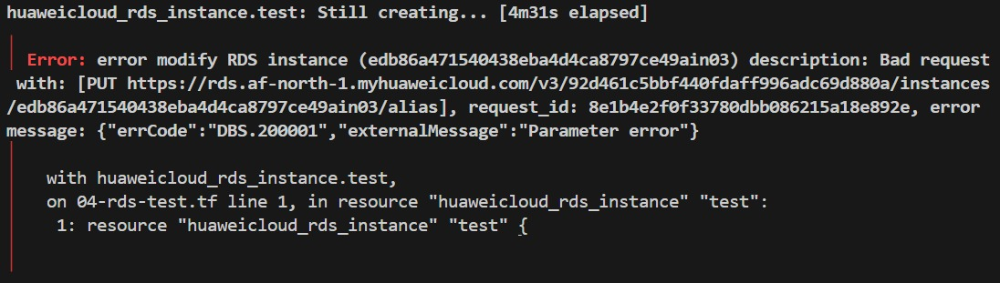

```mdx-code-block
import Tabs from '@theme/Tabs';
import TabItem from '@theme/TabItem';
```

<hr/>

<iframe src='/pages/soon.html' height="300px" width='100%' scrolling="no"></iframe> 

<hr/>

<!-- truncate -->

## Cairo Region
It has been over 30 days since I started experimenting with Huawei Cloud (HwC) in the Cairo Region, I was lucky enough to be amongst the first to try out HwC Cairo Region and received $2000 to explore all the services I was interested in. Now, it’s time to share my experiences so far.

Despite encountering some annoying bugs, I must say that Huawei Cloud has been very receptive to my feedback, diligently investigating every issue I reported. And providing generous compensation in return.

## AWS vs HwC
In this section, I’ll discuss _in a hurry_ the most significant and annoying differences I’ve noticed between AWS and HwC:
1. Their managed kubernetes service or `Cloud Container Engine - CCE` which is equivalent to AWS EKS:
    - CCE offering with High Availability (HA) mode (three master nodes), is significantly more expensive than AWS’s EKS. Specifically, it costs 7.2 times more. Even with a one-year advance purchase, it is 5.7 times the price of EKS!
    - For the non-HA mode, it is still 2.4 times the price of EKS, and 1.89 times the price if purchased for one year in advance.
2. Unstable Terraform Provider::
    - The Terraform provider for HwC is currently unreliable. Its behavior is unpredictable, filled with flaky fixes, and often triggers the creation of new cluster resources even with minor changes. Summary, Their terraform provider is a complete mess! The most annoying to me was the fact that `Changing this parameter will create a new cluster resource.` is scattered around all their provider resources' documentation.
    - E.g. changing the `cluster_version` of CCE will trigger a creation of a new cluster!
    - If you tried to add a description parameter to `huaweicloud_rds_instance` resource as mentioned in the docs, it will cause a vague error saying `Parameter error`! Good luck debugging that ^^.



    - After solving the above error you will scratch your head for a while trying to figure how to bind an EiP to your RDS instance just as you have done to the other objects. Then only to figure out that required a special workaround from their team because of some limitation in the API, we will see all the details in the RDS layer.
    - And unfortunately, much much more! There are many other issues that I encountered, making the provider quite frustrating to use.
3. Multiple Terraform Providers, HwC offers three different Terraform providers, none of which are verified or official:
    - **HuaweiCloud provider**: This is the one I used and the most popular on GitHub [huaweicloud/huaweicloud](https://registry.terraform.io/providers/huaweicloud/huaweicloud/latest).
    - **Huawei Cloud Stack Terraform provider**: [huaweicloud/hcs](https://registry.terraform.io/providers/huaweicloud/hcs/latest).
    - **Huawei Cloud Stack Online Provider**: [huaweicloud/hcso](https://registry.terraform.io/providers/huaweicloud/hcso/latest).
    - Additionally, many more can be found [here](https://github.com/huaweicloud). Also, the `huaweicloud/huaweicloud` is not listed under Huawei Cloud user in the providers [list page](https://registry.terraform.io/namespaces/huaweicloud). However, they are all under the same GitHub organization, so I felt it was okay to trust it.

## Terraform Layers
We will have seven layers in our terraform scripts:
1. Layer: `00_persistent` containing the shared bandwidth and EiPs.
2. Layer: `10_infrastructure` containing the vpc, subnets, nat gw, and elb.
3. Layer: `15_cluster` containing the cce instance, node pools and Cluster Auto Scaler. Plus, respective security groups.
4. Layer: `20_admin` containing the ecs admin machine and its eip and security group.
5. Layer: `30_platform` we will deploy metrics server, Kube Prometheus Stack, Ingress Nginx.
6. Layer: `40_gitlab` we will deploy gitlab helm chart and see how to manage PVs in CCE.
7. Layer: `50_rds` RDS with PostgreSQL 15.

## References
- [Huawei Cloud Terraform Provider.](https://registry.terraform.io/providers/huaweicloud/huaweicloud/latest/docs)
- [Huawei Cloud Price Calculator.](https://www.huaweicloud.com/intl/en-us/pricing/calculator.html)
