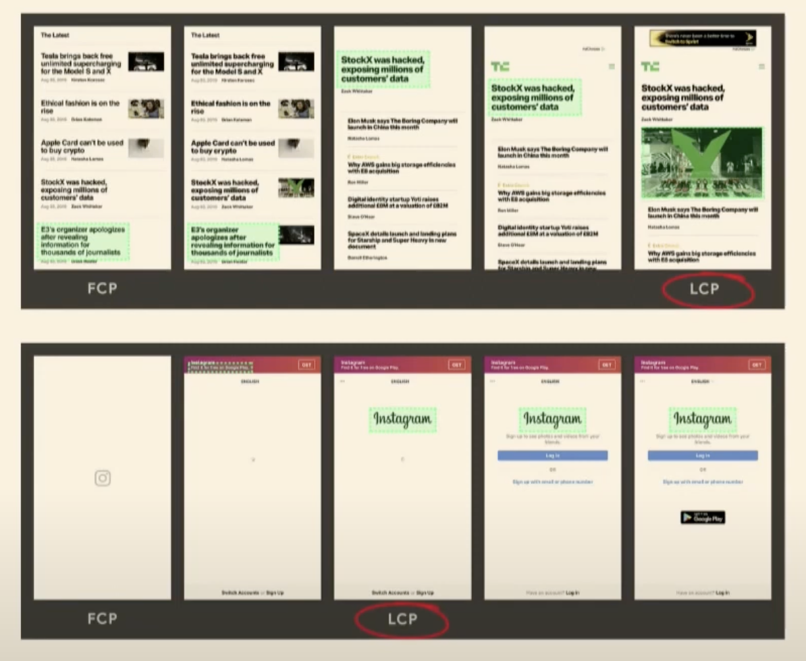
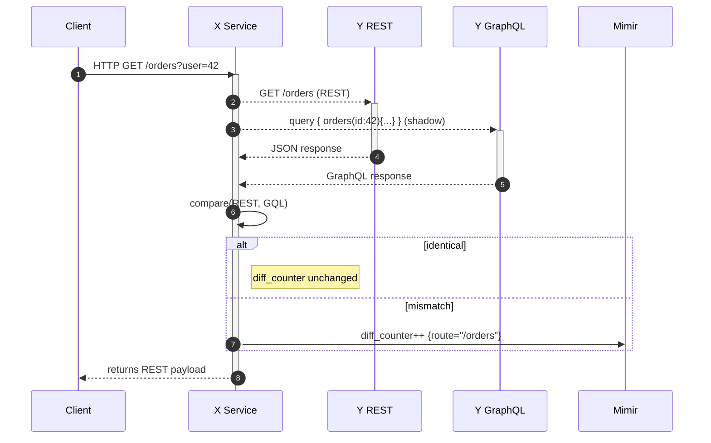
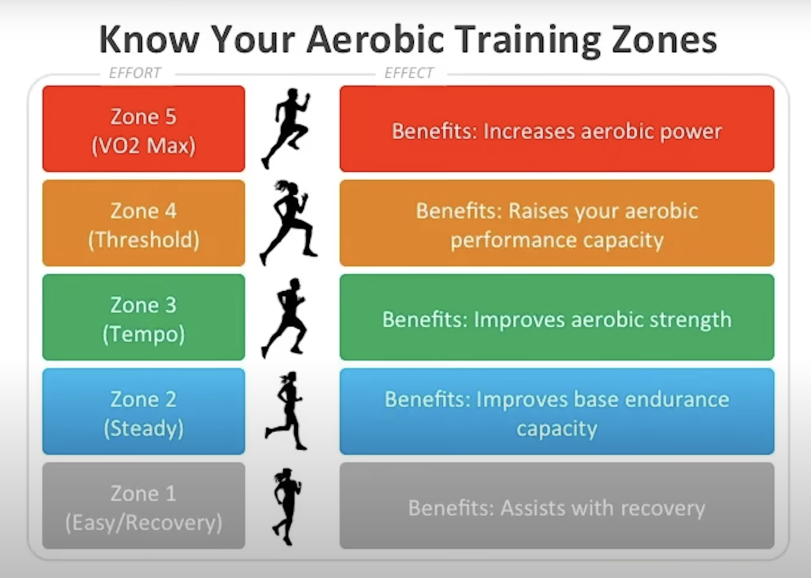
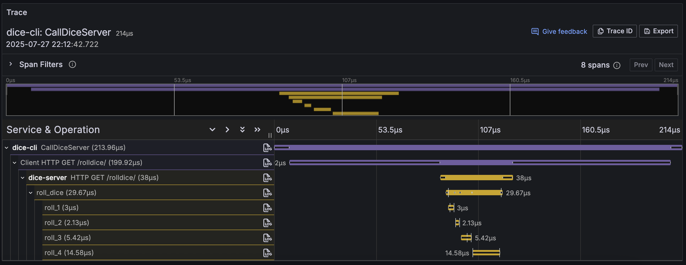
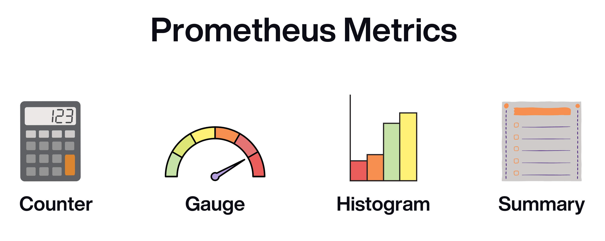
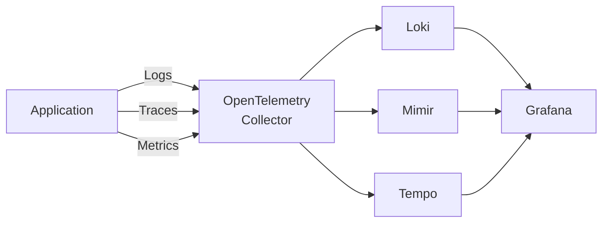
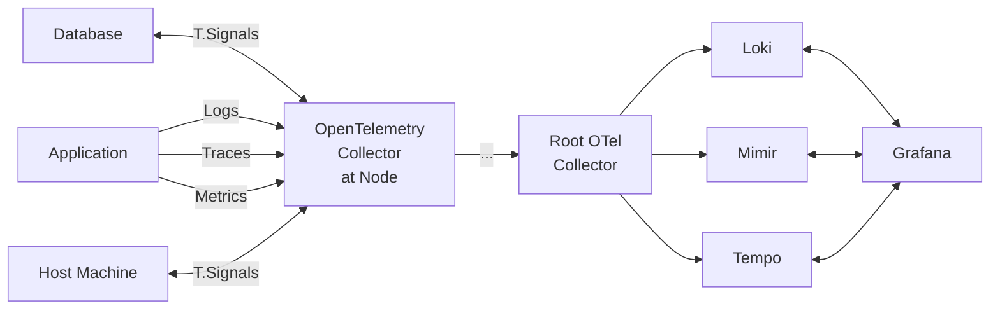

```mdx-code-block
import Tabs from '@theme/Tabs';
import TabItem from '@theme/TabItem';
```

## Unified Observability 101
Because we are bounded by time today, we will:
1. Have a quick Helicopter view 🚁 over many sub topics. **We will dive deep later!**
    - Please, take notes.
2. Few advanced/useful use cases at the end.
3. Please take note of **ALL** your questions since it is recorded, I would love to discuss them.


### Why we are doing this Series?

> Observability is a unique experience for each company.

1. For Seasond Professionals:
    - Instead of "What is o11y?" they should be receiving questions that can not be answered by a simple google search.
    - If they wanna talk about a specific usecase, they should NOT have to start from scratch.

<!-- truncate -->

## Agenda
1. Why this series?
2. Running Analogy + Key takeways:
    - o11y is unique experience for each company.
    - Metric Design is crucial.
3. One Job: Avoid One.
4. Terminologies and Architecture quick overview.
5. Deep Dive:
    - Logs.
    - Metrics.
    - Traces.
    - OpenTelemetry.
        - Context propagation.
        - API / SDK.
        - Collector.
    - Datastores:
        - loki vs ES vs VictoriaLogs.
        - Mimir vs Prometheus vs VictoriaMetrics.
        - Tempo vs Jaeger vs VictoriaTraces.
    - Alerting.
6. Full Demo:
    - Backend: NodeJS / FastAPI.
    - Frontend: ReactJS.
    - Database: PostgreSQL.
    - Reverse Proxy: Nginx.
7. Advanced Usecases:
    - Funnel Report.
    - PostgreSQL Replication Monitoring.
    - Profiling.
    - eBPF.
    - Client side o11y "web, mobile".
    - Shadow Deployment: Decouple Release from Deployment.



<hr/>



<hr/>

## Running Analogy

:::info MOST IMPORTANT TAKEAWAY
You might think it is irrelevant to our topic, but it insanly is!

Please bear with me ^^
:::

While I was preparing for this session, I reliased last september I turnned 25 years old!


### Goal
Since, I am Getting Old!😅 
> My Goal: **Better Cardioc Health (Upcoiming Three Month).**

<hr/>

### Research My Options



After some internet search I found that:

Best form of running for your heart health is **Zone 2** Training:
- Zone 2: **steady-state-cardio workout** performed at 60-70% of your maximum heart rate.
- You do not want to be bouncing between different zones / training intensities. ***No AVG here!***
- You have to stay within Zone 2 throughtout the duration of exercise session.
- Talk Test:
    - Your Zone 2 pace is the level of intensity at which **you can still maintain a conversation with someone**.
    - If you are **on the phone with someone, they could tell you are exercising, but you can still maintain majority of the conversation.**

### Measure my progress (v1)
1. Find my zone 2 pace: 7.5 km/h.
2. Stay within this pace for 60 minutes session four days of a week [Saturday, Sunday, Tuesday, Wedesday].
3. I bought **Apple Watch Ultra 2** to make sure I keep 7.5 km/h pace 😉

### First week Test (Weird)
- Saturday (✅): I was able to maintain 7.5 km/h for 60 minutes.
- Sunday (✅): I was able to maintain 7.5 km/h for 60 minutes.
- Tuesday (✅): I was able to maintain 7.5 km/h for 60 minutes.
    - But I was super tired, although it was after a rest day. ***That is weird!***
- Wednesday (✅): I was able to maintain 7.5 km/h for 60 minutes.
    - Same as Tuesday, Exausted! ***That is indeed weird!***

> Week Two and Three: ***I am still able to maintain 7.5 km/h for 60 minutes***, but I am still exausted after each session.

### What is happening?
1. The metric I choose (7.5 km/h) was always green ✅. 
    - **I am not happy!**
    - Three Weeks and My Health is ↘️ ↘️ ↘️
    - (If user is not happy, no metric else matters).
    - **Always Remember**: Nines do not matter if users are unhappy.
        - 99.999 They call it "Five Nines" in the o11y world.
2. **I was lost focusing on the wrong metric.**
    - I was focusing on the **pace** (7.5 km/h) and invested a LOT of money in the Ultra 2 watch to measure it.
3. It could be:
    - Poor Sleep quality:
        - Nick Pain.
        - Acid Reflux.
        - Bed is not comfortable.
    - I am not eating/hydrating well.
    - Breathing Technique.
    - ...etc

### Measure my progress (v2)
Each day I willl record:
1. Sleep Quality (1-10): My watch can measure it or I can rate it myself.
2. Water Intake (in Liters).
3. Nutrition Intake (in Calories).
4. Breathing Technique (1-10). 

At the end of the first week I had few suspects:
- Sleep Quality: 4/10 >>> Nick Pain >>> Changed my pillow.
- Water Intake: 1.5 Liters daily >>> I was not drinking enough water.
- I usually be on the phone while running, so I was not focusing on my breathing technique.

At the second week (still no progress):
- Focused on water intake: 2.5 Liters daily.
- Stopped using the phone while running, and choose ***Inhale for 3 steps, exhale for 3***.

> I immediately felt the difference, and on the upcoming two weeks I achieved my goal!!

### Key Takeaways
- Be specific/SMART about your goals. **Invest in research.**
    - Profiling.
    - Replication monitoring.
- Metric Design is crucial and devide them into ***Primary and Secondary metrics***.
- Fast iteration can make up for a lot; it’s usually ok to be wrong if you iterate quickly.
- ***Super Important to enrich your metrics with Context!***
    - They are meaningless without context.
    - Remember: **Context is Everything**.
- Imporatnt to Correlate your telmetry signals.
    - You can jump from one metric to another easily in a specific time frame.
    - Using a specific time frame You can easily see all metrics.
    - e.g. I was tired last Tuesday >>> Yes >>> Sleep Quality was 1.5/10....etc
- Always make data driven decisions.
- Do Not invest 💰💰💰 into meaningless gears Upfront!

:::warning
Vendors Should not determine what you can measure.
:::

## Game Time (One Job: Avoid One)

Each player roll dice four times, if you roll a 1 in any of the four rolls, you lose.

### Probability of losing

<details>

<summary>Click me</summary>

- P(no 1 on a single roll) = 5/6
- P(no 1 in 4 independent rolls) = (5/6)^4 = 625/1296 ≈ 0.4822539
- P(lose) = 1 - P(no 1 in 4 rolls) = 1 - (5/6)^4 ≈ 0.5177461 ≈ 51.77%

</details>

## Terminologies + Quick Code Snippets
Let's clarify some terms to unify our language.

### Instrumentation
Intrumentation is the process of adding o11y code to your application. 

Result, now your app emit telemetry signals:
- Logs
- Traces
- Metrics

#### Types of Instrumentation:
- Auto: Apple Watch
- Manual: Metrics we collected about: sleep quality, water intake, nutrition intake, breathing technique...etc

:::tip 
Best Time to instrument your code is while you are writing the feature.
:::

### Telmetry Signals (o11y Pillars)
- Logs.
- Traces.
- Metrics.
- Profiling `skip`.

### Logs

What you need to know:
1. Log Levels: 
    - `DEBUG`: Detailed information, diagnosing problems.
    - `INFO`: Confirmation that things are working as expected.
    - `WARNING`: An indication that something unexpected happened.
    - `ERROR`: An error occurred, but the application is still running.
    - `CRITICAL`: A serious error, indicating that the program may not be able to continue running.

### Traces
Can be defined as: `The path of a request through your application.`.

Traces give us the big picture of what happens when a request is made to an application. Whether your application is a monolith with a single database or a sophisticated mesh of services, traces are essential to understanding the full “path” a request takes in your application.

We can say that:
- A trace represents a single end-to-end operation. 
- Traces are composed of spans, which are records for a single function or operation.

<Tabs>

<TabItem value="Hello Span">

```json title="hello span"
{
  "name": "hello",
  "context": {
    "trace_id": "5b8aa5a2d2c872e8321cf37308d69df2",
    "span_id": "051581bf3cb55c13"
  },
  "parent_id": null,
  "start_time": "2022-04-29T18:52:58.114201Z",
  "end_time": "2022-04-29T18:52:58.114687Z",
  "attributes": {
    "http.route": "some_route1"
  },
  "events": [
    {
      "name": "Guten Tag!",
      "timestamp": "2022-04-29T18:52:58.114561Z",
      "attributes": {
        "event_attributes": 1
      }
    }
  ]
}
```

</TabItem>

<TabItem value="hello-greetings span">

```json title="hello-greetings span"
{
  "name": "hello-greetings",
  "context": {
    "trace_id": "5b8aa5a2d2c872e8321cf37308d69df2",
    "span_id": "5fb397be34d26b51"
  },
  "parent_id": "051581bf3cb55c13",
  "start_time": "2022-04-29T18:52:58.114304Z",
  "end_time": "2022-04-29T22:52:58.114561Z",
  "attributes": {
    "http.route": "some_route2"
  },
  "events": [
    {
      "name": "hey there!",
      "timestamp": "2022-04-29T18:52:58.114561Z",
      "attributes": {
        "event_attributes": 1
      }
    },
    {
      "name": "bye now!",
      "timestamp": "2022-04-29T18:52:58.114585Z",
      "attributes": {
        "event_attributes": 1
      }
    }
  ]
}
```

</TabItem>

<TabItem value="hello-salutations span">

```json
{
  "name": "hello-salutations",
  "context": {
    "trace_id": "5b8aa5a2d2c872e8321cf37308d69df2",
    "span_id": "93564f51e1abe1c2"
  },
  "parent_id": "051581bf3cb55c13",
  "start_time": "2022-04-29T18:52:58.114492Z",
  "end_time": "2022-04-29T18:52:58.114631Z",
  "attributes": {
    "http.route": "some_route3"
  },
  "events": [
    {
      "name": "hey there!",
      "timestamp": "2022-04-29T18:52:58.114561Z",
      "attributes": {
        "event_attributes": 1
      }
    }
  ]
}
```

</TabItem>

</Tabs>

<br/>



What you need to know:
- Trace: A collection of spans they all belong to the same request.
- Span: A single unit of work within a trace.
- Root Span: The first span in a trace, its parent span id is `null`.
- We can attach attributes, events and links to spans.
- Span has a start time and an end time and a status: 
    - Status: `OK`, `Error`, `UnSet`.
- Relationships between spans:
    - Parent-Child: A span can have one parent and multiple children.
    - Sibling: Spans that share the same parent.

<Tabs>

<TabItem value="General Example">

```go title="Sample Code"
package dice

import (
    "context"
    "fmt"
    "math/rand"

    "go.opentelemetry.io/otel/attribute"
    "go.opentelemetry.io/otel/codes"
)

var tracer = otel.Tracer("dice-server")

func rollSingleDice(ctx context.Context, rollNumber int) (int, error) {
    ctx, span := tracer.Start(ctx, fmt.Sprintf("roll_%d", rollNumber))
    defer span.End()

    roll := 1 + rand.Intn(6) // simulate the dice

    span.SetAttributes(
        attribute.Int("roll.number", rollNumber),
        attribute.Int("roll.value", roll),
    )

    if roll == 1 {
        err := fmt.Errorf("unlucky roll")
        span.RecordError(err)
        span.SetStatus(codes.Error, err.Error())
        return roll, err
    }

    return roll, nil
}
```

</TabItem>

<TabItem value="Parent-Child Example">

```go title="Sample Code"
package main

import (
    "context"

    "go.opentelemetry.io/otel"
    "go.opentelemetry.io/otel/codes"
)

var tracer = otel.Tracer("example")

func handleRequest(ctx context.Context) {
    ctx, span := tracer.Start(ctx, "handle_request") // PARENT span
    defer span.End()

    dbQuery(ctx)      // CHILD 1  (sibling #1)
    externalCall(ctx) // CHILD 2  (sibling #2)

    // span.SetStatus(codes.Ok, "request finished") NOT RECOMMENDED
func dbQuery(ctx context.Context) {
    _, span := tracer.Start(ctx, "db_query")           // inherits parent context
    defer span.End()

    // …simulate DB work…
    // span.SetStatus(codes.Ok, "db ok") NOT RECOMMENDED
}

func externalCall(ctx context.Context) {
    _, span := tracer.Start(ctx, "external_call")      // same parent, so sibling of dbQuery
    defer span.End()

    // …simulate HTTP call…
    span.SetStatus(codes.Ok, "http ok")
}
```

</TabItem>

</Tabs>

### Metrics
Can be defined as: `A numerical representation of a system's performance or behavior.`.



What you need to know:
- Types of Metrics:
    - Counter: Value that only increases.
        - Used to count events, e.g. number of requests.
    - Gauge: Value that can go up or down.
        - Used to measure values that can fluctuate, e.g. memory usage.
    - Histogram: Samples observations into buckets.
        - Used to measure the distribution of values, e.g. request duration or response size.
    - Summary: skip for now, similar to histogram.

```go title="Sample Code"
package metrics

import (
    "net/http"
    "time"

    "go.opentelemetry.io/otel"
    "go.opentelemetry.io/otel/attribute"
    "go.opentelemetry.io/otel/metric"
)

var meter = otel.GetMeterProvider().Meter("http")

// ─── instruments ──────────────────────────────────────────────────────────────
var (
    requestCounter = metric.Must(meter).
        Int64Counter("http_requests_total")

    // Prom‑style “in‑flight gauge” (UpDownCounter ⇢ Gauge in Prometheus)
    inFlight = metric.Must(meter).
        Int64UpDownCounter("http_inflight_requests")

    requestDuration = metric.Must(meter).
        Float64Histogram("http_request_duration_seconds",
            metric.WithExplicitBucketBoundaries(
                0.005, 0.01, 0.025, 0.05, 0.1, 0.25, 0.5, 1, 2, 5,
            ),
        )
)

// ─── tiny response wrapper to capture status code ─────────────────────────────
type recorder struct {
    http.ResponseWriter
    status int
}

func (r *recorder) WriteHeader(code int) {
    r.status = code
    r.ResponseWriter.WriteHeader(code)
}

// ─── middleware that touches only the three metrics ───────────────────────────
func Instrument(next http.Handler) http.Handler {
    return http.HandlerFunc(func(w http.ResponseWriter, r *http.Request) {
        ctx := r.Context()

        ctx, span := tracer.Start(ctx, fmt.Sprintf("HTTP %s %s", r.Method, r.URL.Path))
        defer span.End()

        inFlight.Add(ctx, 1)                    // GAUGE (+1)

        start := time.Now()
        rec := &recorder{ResponseWriter: w, status: http.StatusOK}
        next.ServeHTTP(rec, r)

        elapsed := time.Since(start).Seconds()
        requestDuration.Record(ctx, elapsed)    // HISTOGRAM

        // COUNTER: Track final request with status code for complete traffic metrics
        requestCounter.Add(ctx, 1, metric.WithAttributes(
            attribute.String("method", r.Method),
            attribute.String("route", r.URL.Path),
            attribute.Int("status_code", rec.status),
        ))

        inFlight.Add(ctx, -1)                   // GAUGE (‑1)
    })
}
```

### OTel
When we say open telemetry, we could mean three different things:
- **OTel Collector:** A service that captures, transforms, and exports telemetry signals.
    - Usually deployed as a sidecar, on each server / worker-node.
- **OTel API/SDK:** The libraries you use to instrument your code.
- **OTel Protocol:** The protocol used to send telemetry signals, e.g. OTLP.

<hr/>



<hr/>



<hr/>

#### OTel NO-OP Implementation
OTel NO-OP implementation is a way to ensure that your instrumented code works even if the OpenTelemetry SDK is not initialized. This is useful for libraries that want to provide instrumentation without requiring the user to set up the SDK.

And incase an error occurs during the initialization of the SDK, your ***instrumented code will still work and will not crash***.

```bash
no-op % tree
.
├── README.md
├── interfaces
│   └── interfaces.go
├── api
│   └── api.go
├── sdk
│   └── sdk.go
├── go.mod
├── main.go
└── library
    └── library.go

4 directories, 7 files
```

<Tabs>

<TabItem value="interfaces.go">

```go title="interfaces.go"
package interfaces

// Span defines the interface for a span.
type Span interface {
    End()
}

// Tracer defines the interface for a tracer.
type Tracer interface {
    StartSpan(name string) Span
}
```

</TabItem>

<TabItem value="api.go">

```go title="api.go"
// Package api provides the global TracerProvider and no-op implementations
// for the OpenTelemetry API. It ensures instrumented code works even if
// the SDK is uninitialized.
package api

import "github.com/ZiadMansourM/no-op/interfaces"

// noOpSpan is a no-op implementation of interfaces.Span.
type noOpSpan struct{}

// End is a no-op method.
func (n *noOpSpan) End() {}

// noOpTracer is a no-op implementation of interfaces.Tracer.
type noOpTracer struct{}

// StartSpan returns a no-op span.
func (n *noOpTracer) StartSpan(name string) interfaces.Span {
    return &noOpSpan{}
}

// Global TracerProvider
var tracerProvider interfaces.Tracer = &noOpTracer{}

// Tracer provides the current tracer.
func Tracer() interfaces.Tracer {
    return tracerProvider
}

// SetTracerProvider sets the tracer provider.
func SetTracerProvider(provider interfaces.Tracer) {
    tracerProvider = provider
}
```

</TabItem>

<TabItem value="sdk.go">

```go title="sdk.go"
// Package sdk provides real implementations of the Tracer and Span interfaces.
package sdk

import (
    "fmt"

    "github.com/ZiadMansourM/no-op/interfaces"
)

// RealSpan is a real implementation of Span.
type RealSpan struct {
    name string
}

// End finishes the span.
func (r *RealSpan) End() {
    fmt.Printf("Span ended: %s\n", r.name)
}

// RealTracer is a real implementation of Tracer.
type RealTracer struct{}

// StartSpan starts a real span.
func (r *RealTracer) StartSpan(name string) interfaces.Span {
    fmt.Printf("Span started: %s\n", name)
    return &RealSpan{name: name}
}
```

</TabItem>

<TabItem value="library.go">

```go title="library.go"
// Package library simulates an instrumented library using the OpenTelemetry API.
package library

import (
    "fmt"

    "github.com/ZiadMansourM/no-op/api"
)

// InstrumentedFunction demonstrates a function that uses the OpenTelemetry API.
func InstrumentedFunction() {
    tracer := api.Tracer()

    span := tracer.StartSpan("instrumented_function")
    fmt.Println("Doing some work in the instrumented function...")
    span.End()
}
```

</TabItem>

<TabItem value="main.go">

```go title="main.go"
// Package main demonstrates the usage of the OpenTelemetry API and SDK.
package main

import (
    "fmt"

    "github.com/ZiadMansourM/no-op/api"
    "github.com/ZiadMansourM/no-op/library"
    "github.com/ZiadMansourM/no-op/sdk"
)

func main() {
    fmt.Println("Running without SDK initialized:")
    library.InstrumentedFunction()

    fmt.Println("\nInitializing SDK...")
    api.SetTracerProvider(&sdk.RealTracer{})
    library.InstrumentedFunction()
}
```

</TabItem>

</Tabs>


#### Output

```bash 
no-op % go run .
Running without SDK initialized:
Doing some work in the instrumented function...

Initializing SDK...
Span started: instrumented_function
Doing some work in the instrumented function...
Span ended: instrumented_function
```

## How it can Go South
1. Too many cooks spoil the broth.
2. Adapting unnessessary complexity: ***Tool overload is real***.
    - e.g. using a shared library for all teams "early".
    - Using a specific vendor instead of staying unified with Tools we use.
    - e.g. we need frontend o11y "funnel report" so Google Analytics `YOU HAVE LOST`.
3. Teams do not see any value in instrumenting their code.
    - Purden.
    - Waste of Time.
    - ..etc

:::warning According to the 3rd Annual Observability Survey
Complexity, noise, and cost are named the top hurdles to observability success.
:::

## Refrences
- [3rd Annual Observability Survey - Grafana Labs](https://grafana.com/observability-survey/)
- [From RUM to Front-End Observability with OpenTelemetry - Purvi Kanal, Honeycomb](https://youtu.be/l2_wsvv-Rhs?si=8_CPf5RW3kLzmcUB)
- [OpenTelemetry Documentation](https://opentelemetry.io/docs/)
- [OTel Collector Contrib Repo](https://github.com/open-telemetry/opentelemetry-collector-contrib)
