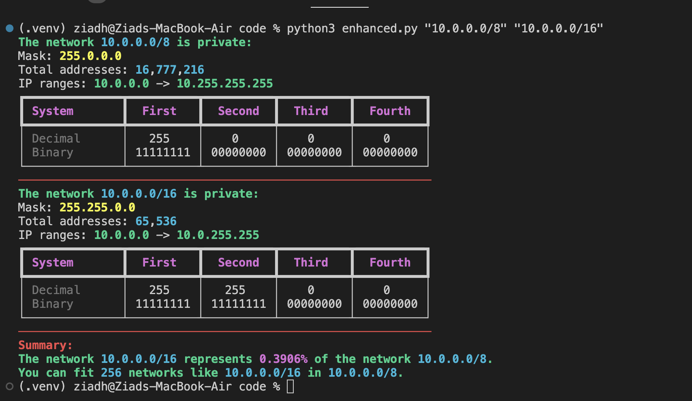

```mdx-code-block
import Tabs from '@theme/Tabs';
import TabItem from '@theme/TabItem';
```

# Introduction

## AWS Cloud Practitioner Certification
It is aimed at individuals who have the knowledge and skills necessary to effectively demonstrate an overall understanding of the AWS Cloud, independent of specific technical roles addressed by other AWS Certifications. It validates an examinee’s ability to:
- Define what the AWS Cloud is and the basic global infrastructure.
- Describe basic AWS Cloud architectural principles.
- Describe the AWS Cloud value proposition.
- Describe key services on the AWS platform and their common use cases (for example, compute and analytics).
- Describe basic security and compliance aspects of the AWS platform and the shared security model.
- Define the billing, account management, and pricing models.


## Read Exam Guide pdf

## Models of Cloud Computing
- Cloud only.
- Hybrid.
- On-premises or Private Cloud.

:::warning
Multi cloud is not Hybrid cloud.
:::

## Interact with AWS
1. Console.
2. AWS CLI.
3. AWS SDKs.


## Benefits of Cloud Computing
1. Trade Upfront Expense for Variable Expense.
:::note CapEx vs OpEx
- **Upfront Expense**: Capital Expenditure (CapEx). Large upfront investment in hardware before use.
- **Variable Expense**: Operational Expenditure (OpEx). Pay for your usage. Give back when not using.
:::

2. Stop Focusing on Underlying Infrastructure.
:::note Focus on Customers
Instead of focusing about Data Centers. Focus on your customers.
:::

3. Stop Guessing Capacity.
:::note Limited Scalability
- limited by hardware limitations and vendor supply limits.
- **Extreme Scalability**: Scale in/out and experiment with load/performance as much as needed.
- Pay for what you use.
:::

4. Benefit from Massive Economies of Scale.
:::note Smaller Scale vs Economies of Scale
- **Smaller Scale**: Pay higher prices based on only your usage, with no price drops per unit.
- **Economies of Scale**: Benefit from customers' aggregated usage, and pay less per unit used.
:::

5. Increase Provision Speed and Business Agility.

6. Global Deployment Options.


## Economics Model of AWS
1. "Low consumption" Free Tier.
2. On Demand.
:::note
You pay for the size you ask for.
- 2 Processors 16 GigaBytes RAM 10 Hours.
:::

3. Reservations.
:::info
- 1 Year or 3 Years Commitment.
- Deep discount `66%, 72%`.
- You can sell it to someone else.
#### Example:
Buy a `16 GB, 2 Processor` machine for 1 year.
:::danger
If you decide to stop using it, you still pay for it.
:::

4. Volume Discounts.

:::note
As your per unit usage go up, the price per unit goes down.
- The more you use, the lower it costs per unit.
:::

5. Price Drops.
:::note
- From 2006 till 2023, the price of AWS services has been dropping 129 times.
- Usually, the price drops with new versions.
:::tip S3 Bucket Price Drop
- In 2006, 1 GB costed **15 cents**.
- In 2023, 1 GB costs **0.023 cents**.
:::

## Cloud Design Principles
- Design for failure and nothing will fail.
- Decouple your components.
- Implement elasticity.
- Think parallel.

:::tip AWS well-architected framework
There is a deeper framework for AWS Architecture, but it is not part of the Cloud Practitioner exam.
:::

### Design for Failure
- What should happen if a component fails?
> Increase **resiliency** and availability "auto recovery".

### Decouple your components
- What happens if a component is overwhelmed?
- What happens if one component went down?
- No data loss "Loosely Coupled with Queues" or "Scaling layer".

### Implement Elasticity
- Limited option for expansion and contraction.
> Better cost && Better performance.

### Think Parallel
- 1 server do it in 36 hours.
- 3 servers do it in 12 hours.
- 36 servers do it in 1 hour.


## Shared Responsibility Model

### Security Old Way
1. Securing data centers to allow entry of only authorized personnel.
2. Securing the networking and connectivity within the data center.
3. Securing the servers.
4. Securing OS and ensuring it is patched and up-to-date.
5. Securing the applications deployed.
6. **You own the security end-end**.

### IaaS
- EC2.

### PaaS
- RDS.
- Lambda.
- S3.

### SaaS
- AWS Chime.
- AWS WorkMail.
- AWS WorkDocs.


## What is Compliance?
Organizations operating in a specific industry must adhere to the rules and laws specific to that industry:
- Finance.
- Healthcare.
- Government.

e.g. HIPAA / HITECH, PCI DSS, GDPR. 

> Customer Compliance Center.
> AWS Audit Manager

### AWS Config 


### Service Control Policies (SCPs)
- Control which services and features are available to accounts in a member of an organization.


## Resources for Security of AWS
- AWS Web Application Firewall (WAF).
:::note
- WAF components.
:::
- AWS Shield.
- AWS Network Firewall.

## Security Resources Detection
- AWS Inspector. 
- AWS GuardDuty.
- AWS Detective.
- AWS Config.
- AWS Security Hub.
- AWS CloudTrail.
- AWS Security Lake.
- AWS Macie.

## Security Resources Management
- Firewall Manager.
- Resource Access Manager.
- AWS Cognito.
- AWS IAM.

## Private Ip addresses
:::tip Private IP Addresses
Prefix | First Ip Address | Last Ip Address | Number of Addresses
:--: | :--: | :--: | :--:
10.0.0.0/8 | 10.0.0.0 | 10.255.255.255 | 16,777,216
172.16.0.0/12 | 172.16.0.0 | 172.31.255.255 | 1,048,576
192.168.0.0/16 | 192.168.0.0 | 192.168.255.255 | 65,536
:::

:::danger CIDR block size must be between /16 and /28.
AWS VPC require that the CIDR block size must be between /16 and /28.
:::

```py title="main.py"
from ipaddress import ip_network

# Define the network
network = ip_network('172.31.0.0/16')

# Determine if the network is private
is_private = network.is_private

# Calculate the total number of addresses
total_addresses = network.num_addresses

# Get the first and last IP address in the network
first_ip = network.network_address
last_ip = network.broadcast_address


print(f'The network {network} is {"private" if is_private else "public"}:')
print(f'Mask: {network.netmask}')
print(f'Total addresses: {total_addresses:,}')
print(f'IP ranges: {first_ip} -> {last_ip}')
```

```bash title="Example Output" {1,7,13}
ziadh@Ziads-MacBook-Air code % python3 main.py
The network 172.31.0.0/16 is private:
Mask: 255.255.0.0
Binary mask: 11111111.11111111.00000000.00000000
Total addresses: 65,536
IP ranges: 172.31.0.0 -> 172.31.255.255
ziadh@Ziads-MacBook-Air code % python3 main.py
The network 172.31.0.0/20 is private:
Mask: 255.255.240.0
Binary mask: 11111111.11111111.11110000.00000000
Total addresses: 4,096
IP ranges: 172.31.0.0 -> 172.31.15.255
ziadh@Ziads-MacBook-Air code % python3 main.py
The network 172.31.16.0/20 is private:
Mask: 255.255.240.0
Binary mask: 11111111.11111111.11110000.00000000
Total addresses: 4,096
IP ranges: 172.31.16.0 -> 172.31.31.255
```

<details>
<summary>Enhanced Code Version</summary>

<details>
<summary>See code</summary>

```py title="enhanced_main.py"
from ipaddress import ip_network
import sys
from rich.console import Console
from rich.table import Table

# Initialize rich console
console = Console()

def print_network_info(network):
    console.print(f'The network [bold cyan]{network}[/bold cyan] is {"private" if network.is_private else "public"}:', style="bold green")
    console.print(f'Mask: [bold yellow]{network.netmask}[/bold yellow]')
    console.print(f'Total addresses: [bold]{network.num_addresses:,}[/bold]')
    console.print(f'IP ranges: [bold]{network.network_address}[/bold] -> [bold]{network.broadcast_address}[/bold]')

    binary_mask_with_dots = '.'.join([
        f'{int(octet):08b}' 
        for octet in network.netmask.packed
    ])

    # Create a table for binary mask representation
    binary_mask_table = Table(show_header=True, header_style="bold magenta")
    binary_mask_table.add_column("System", style="dim", width=12)
    binary_mask_table.add_column("First", justify="center")
    binary_mask_table.add_column("Second", justify="center")
    binary_mask_table.add_column("Third", justify="center")
    binary_mask_table.add_column("Fourth", justify="center")

    binary_mask_table.add_row(
        "Decimal", 
        str(network.netmask).split('.')[0], 
        str(network.netmask).split('.')[1], 
        str(network.netmask).split('.')[2],
        str(network.netmask).split('.')[3]
    )

    binary_mask_table.add_row(
        "Binary", 
        binary_mask_with_dots.split('.')[0], 
        binary_mask_with_dots.split('.')[1], 
        binary_mask_with_dots.split('.')[2],
        binary_mask_with_dots.split('.')[3]
    )

    console.print(binary_mask_table)
    # Print colored footer to separate the outputs
    console.print("─" * 60, style="bold Red")

# Assuming the first argument is the network CIDR
cider = sys.argv[1]  
network = ip_network(cider)

print_network_info(network)

# Example for a second network, if provided
if len(sys.argv) > 2:
    cider_two = sys.argv[2]
    network_two = ip_network(cider_two)
    print_network_info(network_two)

    # Print "Summary:" in Red as header for summary section
    console.print("[bold red]Summary:[/bold red]")

    # Check if network_two is a subnet of network
    if network_two.subnet_of(network):
        console.print(f"The network [bold cyan]{network_two}[/bold cyan] is a subnet of [bold cyan]{network}[/bold cyan].", style="bold green")
        # Calculate and print the percentage
        percentage_network2_in_network1 = (network_two.num_addresses / network.num_addresses) * 100
        console.print(f"- [bold cyan]{network_two}[/bold cyan] represents [bold magenta]{percentage_network2_in_network1:.4f}%[/bold magenta] of the network [bold cyan]{network}[/bold cyan].", style="bold green")

        # How many of network_two can fit in network
        console.print(f"- You can fit [bold]{int(network.num_addresses / network_two.num_addresses)}[/bold] networks like [bold cyan]{network_two}[/bold cyan] in [bold cyan]{network}[/bold cyan].", style="bold green")
    else:
        console.print(f"The network [bold cyan]{network_two}[/bold cyan] is not a subnet of [bold cyan]{network}[/bold cyan].", style="bold green")

```

</details>

<Tabs>
<TabItem value="Bash">

```bash title="Example Output"
(.venv) ziadh@Ziads-MacBook-Air code % python3 enhanced.py "10.0.0.0/8" "10.0.0.0/16"
The network 10.0.0.0/8 is private:
Mask: 255.0.0.0
Total addresses: 16,777,216
IP ranges: 10.0.0.0 -> 10.255.255.255
┏━━━━━━━━━━━━━━┳━━━━━━━━━━┳━━━━━━━━━━┳━━━━━━━━━━┳━━━━━━━━━━┓
┃ System       ┃  First   ┃  Second  ┃  Third   ┃  Fourth  ┃
┡━━━━━━━━━━━━━━╇━━━━━━━━━━╇━━━━━━━━━━╇━━━━━━━━━━╇━━━━━━━━━━┩
│ Decimal      │   255    │    0     │    0     │    0     │
│ Binary       │ 11111111 │ 00000000 │ 00000000 │ 00000000 │
└──────────────┴──────────┴──────────┴──────────┴──────────┘
────────────────────────────────────────────────────────────
The network 10.0.0.0/16 is private:
Mask: 255.255.0.0
Total addresses: 65,536
IP ranges: 10.0.0.0 -> 10.0.255.255
┏━━━━━━━━━━━━━━┳━━━━━━━━━━┳━━━━━━━━━━┳━━━━━━━━━━┳━━━━━━━━━━┓
┃ System       ┃  First   ┃  Second  ┃  Third   ┃  Fourth  ┃
┡━━━━━━━━━━━━━━╇━━━━━━━━━━╇━━━━━━━━━━╇━━━━━━━━━━╇━━━━━━━━━━┩
│ Decimal      │   255    │   255    │    0     │    0     │
│ Binary       │ 11111111 │ 11111111 │ 00000000 │ 00000000 │
└──────────────┴──────────┴──────────┴──────────┴──────────┘
────────────────────────────────────────────────────────────
Summary:
The network 10.0.0.0/16 represents 0.3906% of the network 10.0.0.0/8.
You can fit 256 networks like 10.0.0.0/16 in 10.0.0.0/8.
(.venv) ziadh@Ziads-MacBook-Air code % 
```

</TabItem>

<TabItem value="Screen Shot">

</TabItem>
</Tabs>

</details>
