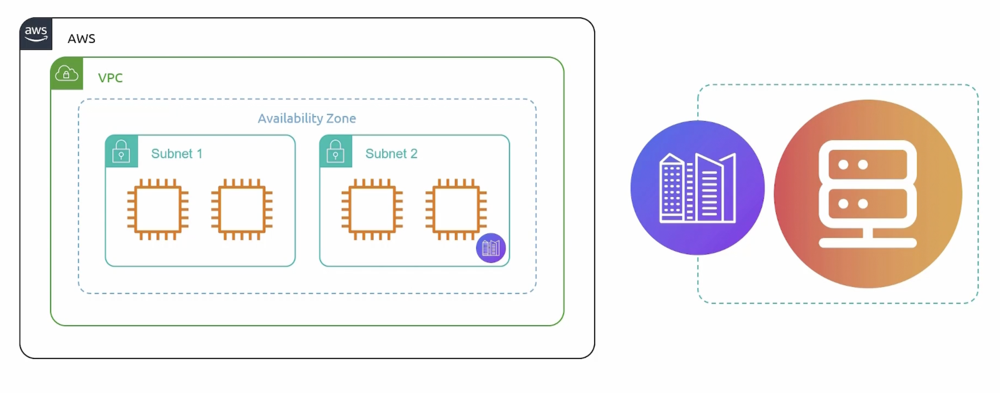
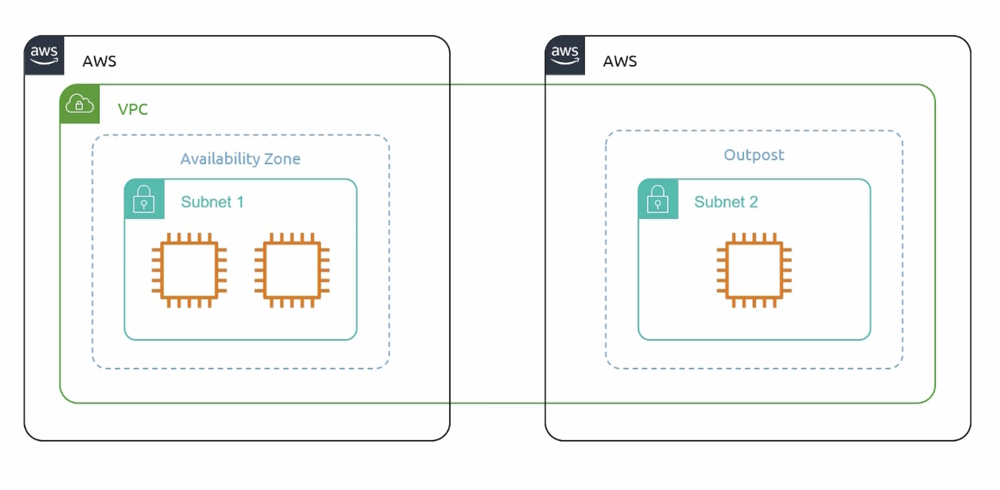

```mdx-code-block
import Tabs from '@theme/Tabs';
import TabItem from '@theme/TabItem';
```

## Pre-requisites
```bash title="Create SSH Key Pair"
ssh-keygen -t ed25519 -C "Jenkins key"
ssh-keygen -q -t ed25519 -C "Jenkins key ZiadMansourM" -f /Users/ziadh/.ssh/temp/jenkins/jenkins -N ""
```

## EC2

### EC2 Instance Types
- **General Purpose**: Balanced compute, memory, and networking resources.
- **Compute Optimized**: High performance processors.
- **Memory Optimized**: High memory to CPU ratio.
- **Storage Optimized**: High storage to CPU ratio.
- **GPU Optimized**: Specialized for graphic intensive applications.


### AMi
- **Amazon Machine Image**: A template that contains the software configuration (OS, application server, and applications) required to launch your instance.

#### Types of AMI
- **Public AMI**: Available to everyone.
- **Private AMI**: Available to specific accounts or owners.
- **Shared AMI**: Available to specific accounts or owners.

:::tip AMI Creation
You can create an AMI from an existing EC2 instance and launch a new instance from the created AMI. E.g. Create `users`, `install dependencies`, and `configure firewall` settings then create an AMI from the instance.


:::

### Instance Lifecycle


### User Data
Bootstrap script that runs when the instance is launched. Has a limit of `16 KB`.

### ELB && ASG
- **Elastic Load Balancer (ELB)**: Distributes incoming traffic across multiple targets.
- **Auto Scaling Group (ASG)**: Ensures that you have the correct number of EC2 instances running to handle the load across multiple availability zones.


### Launch Templates
A specification of different launch parameters for an EC2 instance. Used in an Auto Scaling Group.

:::tip EC2 Launch Templates 
Provide an easy way to define and launch EC2 instances that conform to the company's standards, including security and governance, and can be used repeatedly to streamline the launch process.
:::


### Instance Placements


### EC2 Purchasing Options


:::note Dedicated hosts vs instances
- `Dedicated hosts` are physical servers with EC2 instance capacity fully dedicated to your use. They can help you reduce costs by allowing you to use your existing server-bound software licenses.

- `Dedicated instances` are Amazon EC2 instances that run in a VPC on hardware that's dedicated to a single customer. Your Dedicated instances are `physically isolated` at the host hardware level from instances that belong to other AWS accounts.
:::


### IMP Notes
:::note AMI ID
AMI ID is a unique identifier for an AMI in a region. So, it is `region specific`.
:::

### Image Builder


#### Golden Image 
A pre-configured image that is used as a template for creating new instances.


#### Steps


#### Features


### Elastic Network Interfaces (ENI)
A virtual network interface that can be attached to ec2 instances in a VPC.


:::note Primary and Secondary ENI

:::

#### Features


## Elastic Beanstalk
AWS Elastic Beanstalk is a service for deploying and managing applications in the AWS Cloud without having to worry about the infrastructure. It automates the deployment process, including provisioning, load balancing, auto-scaling, and application health monitoring.


### Environment Types


### Features


## Lightsail
Amazon Lightsail is designed for projects with low, predictable pricing. It provides a simple virtual private server (VPS) solution that includes everything needed to launch a project quickly — instances, storage, databases, and networking.


### Features


### Benefits


## Elastic Container Service (ECS)
Like kubernetes and Apache Mesos. AWS proprietary container orchestration service.

### ECS Launch Types


### ECS on EC2


### ECS on Fargate
:::tip AWS Fargate
AWS Fargate is a serverless, pay-as-you-go compute engine that lets you focus on building applications without managing servers. Moving tasks such as server management, resource allocation, and scaling to AWS does not only improve your operational posture, but also accelerates the process of going from idea to production on the cloud, and lowers the total cost of ownership. You can check docs [here](https://aws.amazon.com/fargate/).
:::


### EC2 vs Fargate


### ECS Task
The configuration of what to run inside the container.

<hr/>


<hr/>


<hr/>


### ECS Service


### ECS LB


## Elastic Kubernetes Service (EKS)
Managed kubernetes service by AWS.


### Why EKS


### Worker Nodes


### Self Managed Nodes


### Managed Node Groups


### Fargate


### EKS Cluster


#### Connect


### EKSCTL
eksctl is a simple CLI tool for creating clusters on EKS. You can check the repo [here](https://github.com/eksctl-io/eksctl).


## Elastic Container Registry (ECR)
Fully managed container registry that makes it easy to store, manage, and deploy Docker container images.


### CICD Pipeline


### Benefits


## App Runner
Fully managed service that makes it easy for developers to quickly deploy containerized web applications and APIs at scale. Without worrying about managing the infrastructure.


### Features


## AWS Batch
Fully managed batch processing at any scale.

### Jobs Lifecycle


### Components


### Benefits


## Lambda


### Features


## Step Functions
Serverless function orchestrator that makes it easy to sequence AWS Lambda functions and multiple AWS services into business-critical applications.

:::note AWS Step Functions
Allow coordination of multiple ETL jobs involving AWS Lambda functions and human approval steps. It provides a visual workflow to sequence Lambda functions and other AWS services.
:::

### State Machine
A state machine is a collection of states that can do work and transition between states.


## Serverless Application Model (SAM)
An extension of AWS CloudFormation that provides a simplified way of defining serverless resources.

### SAM Template


### SAM CLI


### SAM Deploy


### SAM Repository


### SAM Repo Features


## Amplify
Complete solution for mobile and web app development.


### Amplify Studio
Visual builder for building full-stack applications.


### Amplify Features


## Outposts
Fully managed service that extends AWS infrastructure, AWS services, APIs, and tools to virtually any customer datacenter, co-location space, or on-premises facility for a truly consistent hybrid experience.

Use same AWS APIs, tools, and infrastructure across on-premises and the cloud.


Outposts is a family of a fully managed solutions delivering AWS infrastructure and services to virtually any on-premises or edge location for a truly consistent hybrid experience.

What happens is that AWS will deliver a fully managed and configurable server rack to your on-premises location. This server rack will be pre-configured with AWS services and infrastructure. You can then use the same AWS APIs, tools, and infrastructure across on-premises and the cloud.

You provide the power, network, and space. And outpost will connect to the nearest AWS region over an AWS Direct Connect link or VPN.

Basically, run AWS services on-premises.


Instances in your outpost can securely connect to other instances in your VPC through a private IP address.



It will end up looking like this, you got aws cloud and your on-premises outpost.




### Benefits


## EKS Anywhere


### Benefits


## ECS Anywhere


### Benefits


## VMWare Cloud on AWS
- **vSphere**: VMware's virtualization platform.
- **vSAN**: VMware's software-defined storage.
- **NSX-T**: VMware's software-defined networking. Network virtualization and security platform.


### Use Cases


## Snow Cone
Small, portable, rugged, and secure edge computing and data transfer device.


### Snow family
Snow family is a collection of physical devices for edge computing and data transfer. But we will focus on snowcone and snowball edge. Because, they have compute capabilities.


### Snowcone


### Benefits


## Results


## Wrong Answers
