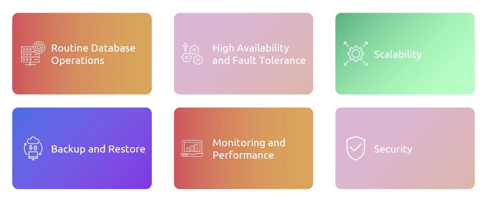
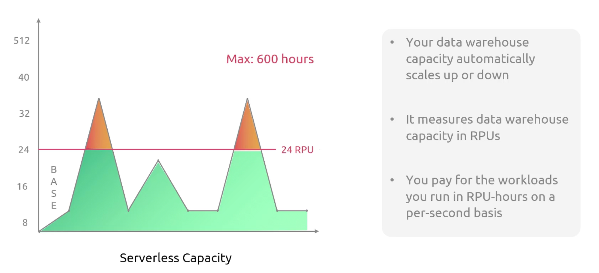
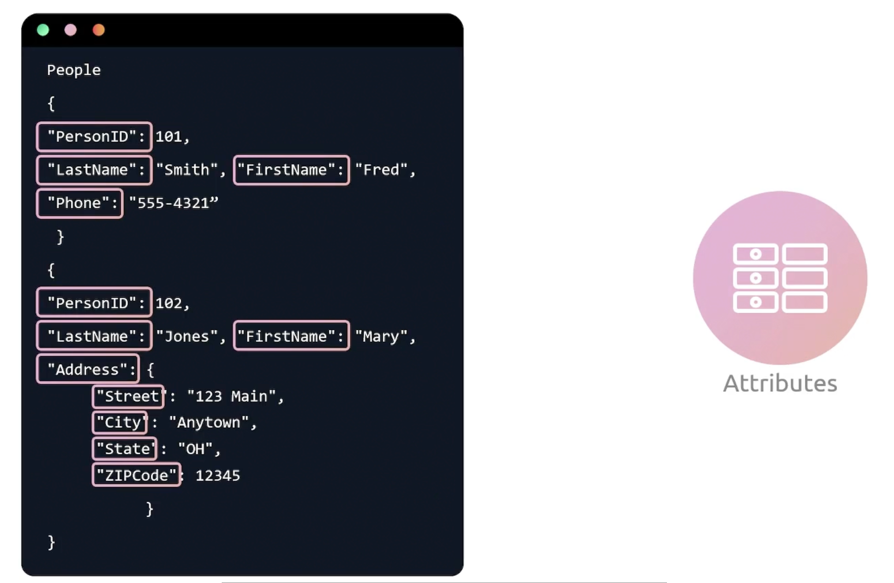

```mdx-code-block
import Tabs from '@theme/Tabs';
import TabItem from '@theme/TabItem';
```

## Database Services


## RDS 
RDS is a managed relational database service that provides you six familiar database engines to choose from, including Amazon Aurora, PostgreSQL, MySQL, MariaDB, Oracle, and Microsoft SQL Server.

### Why RDS
- **Routine Database Operations**: Routine backups, restore, software patching, monitoring, scaling, and replication. `If you lose the data, your application is gone`.
- **High Availability and Fault Tolerance**: Multi-AZ deployments, read replicas, and automated failover.
- **Scalability**: Vertical and horizontal scaling.
- **Security**: Encryption at rest and in transit, network isolation, and IAM integration.




### RDS benefits


### RDS Components


### Instance Types
- **General Purpose**: Good for a variety of workloads.
- **Memory Optimized**: Good for memory-intensive workloads.


## RDS Deployment Types
RDS has different deployment types, such as single-AZ, multi-AZ, read replicas, and cross-region read replicas. To choose the right deployment type, you need to consider the workload, the availability requirements, and the performance requirements.

### Single RDS DB Instance
In a single Availability Zone. Also, in the event of a failure, all your data is lost.


### Multi-AZ RDS DB Instance 
In two different Availability Zones. In the event of a failure, the secondary instance is promoted to the primary instance.


### Read Replica 
In the same or different region. It is used for read-heavy workloads. It can be promoted to a standalone database instance.

:::note Model
Read Replicas are `active-active` from read perspective. All previous deployments has been `single-instance` or `active-standby`.
:::


:::note Key Points

:::

### Cross Region Read Replicas


:::note Key Notes

:::

### Multi-AZ Cluster


### Blue-Green Deployment


:::note Key Points

:::

## RDS Storage Types
- **General Purpose SSD**: Good for a variety of workloads.
- **Provisioned IOPS SSD**: Good for I/O-intensive workloads.
- **Magnetic**: Good for workloads with low I/O requirements.

:::note IOPS
IOPS is a measure of the number of read and write operations that a storage device can perform in a second. A common unit of measurement for storage system performance based on drive speed and workload type.
:::

### General Purpose SSD


### Provisioned IOPS SSD


### Magnetic Storage


## RDS Configuration
- **Parameter Groups**: A collection of parameters and settings that control the behavior of the database instance. You can tune `performance`, `security` and `resource allocation`.
- **Option Groups**: Used to manage features such as encryption, performance enhancements, and security. You can attach an option group to a db instance to enable specific features.
- **Subnet Groups**: Define the subnets and the availability zones in which you want to deploy the database instance. Help control the network configuration of the database instance.
- **Security Groups**: Control inbound and outbound traffic to and from your db instance. Like which ip addresses are allowed to connect to the db instance.
- **Snapshots**: A point-in-time backup of the database instance. You can use them to restore your database.
- **Parameter Store**: Store configuration data for application. Sensitive information.
- **Performance Insights**: Feature that helps you analyze performance of your database instance. And provide a visual representation of the database load and query execution patterns.
- **Enhanced Monitoring**: Allows you to collect additional metrics and insights on your database instance to assist with troubleshooting and performance optimization.
- **Audit and Log data**: Help you track database activity and security related events.
- **SSL and Encryption**: RDS supports encryption `at rest` and `in transit`.

## RDS Features


## Aurora
Cloud native, relational database engine that offers next generation commercial-grade database features. While providing cost-efficiency. Designed to provide high performance scalability, and durability at a fraction of the cost of traditional database solutions.

Aurora has full compatibility with MySQL and PostgreSQL. It can act a drop-in replacement for those database solutions. 

### Why Aurora


### Aurora Architecture


<hr/>


:::tip Segments
Half of the copies are `full segments`, while contains both `data pages` and `log records` for the 10GB portion of the volume. The other half are tail segments, which contain only log records.
:::

The distributed design, ensures higher throughput and overall lower latency.


:::tip Gossip Protocol
Aurora utilizes a gossip protocol for node block repair. This protocol helps in quickly identifying discrepancies and repairing data. So, that we can reduce recovery time in distributed systems.

Gossip protocol is a communication protocol used by nodes to disseminate information about the state of the system. It is used to maintain consistency between nodes and to avoid the need for a centralized server to manage the state of the system.
:::

## Aurora Components
The following is an Aurora db cluster:


:::tip Cluster Volume
A cluster volume is a virtual database storage volume that spans multiple Availability Zones. With each AZ having a copy of the database / cluster data.
:::

## Aurora Types
- **Provisioned**: Good for predictable workloads. Plan compute requirements ahead of time. You can `manually` scale the compute and storage capacity. Works with `Aurora Global`. You can have low-latency global reads.
- **Serverless**: Good for unpredictable workloads. Aurora Serverless automatically adjusts the database capacity based on the workload. It is a `fully managed` database service. You can have `auto-scaling` and `pause` the database when not in use. You will be charged only for the resources consumed. When you use aurora v2 you get access to aurora global.


### Aurora Global
A cluster that can perform read-write and multiple clusters that can perform read-only operations. Each cluster has its own virtual storage volume. However data is replicated from the primary cluster to the secondary clusters.


### Aurora Serverless V2


### Serverless V1 vs V2


### Aurora Integration


## RDS Proxy


### Benefits


## Redshift


### What is Redshift


### Redshift Components


### Redshift Cluster
The core infrastructure component of a Redshift data warehouse. A cluster is composed of a one or more compute nodes. If two or more compute nodes are present, then an additional node is designated as the leader node. Which will handle the external communication and query coordination.

### Redshift Features


## Redshift Serverless
Can go as low as three dollars per hour. 

:::note Data warehouse Capacity
Redshift measures data warehouse capacity in Redshift processing units (RPUs). An RPU is a combination of memory, storage, and compute resources. It is a measure of the processing capacity of the data warehouse cluster.
:::

<Tabs>

<TabItem value="Redshift Provisioned">


</TabItem>

<TabItem value="Redshift Serverless">



</TabItem>

</Tabs>

You will have base RPU and Max Capacity.


### Redshift RPUs
- **Base Capacity**: Describes the minimum capacity that is always available to the data warehouse. It is the minimum number of RPUs that are always available to the data warehouse. The default value is `128 RPUs`. You can adjust the value between `8` and `512` RPUs.

:::note One RPU
One RPU is equivalent to 16 GB of memory.
:::

:::tip 
- With 8~24 RPUs, you can support up to 128 TB of data.
- Minimum 32 RPUs, for more than 128 TB of data.
:::

### Benefits


## DynamoDB
Solves the problem of managing and scaling `NoSQL` databases. Provides a fully managed serverless and highly available database solution. Eliminating the complexities of database administration. Also, designed to handle high-traffic applications. Offering seamless scalability and low access latency access to data. Ensures data consistency, durability and automatic sharding. Simple and straight "Don't worry about database maintenance".


### DynamoDB Components
- **Tables**: Similar to a table in a relational database. A collection of data.
- **Items**: Similar to a row in a relational database. A collection of attributes. Each table contains zero or more items.
- **Attributes**: An item is a collection of attributes. Each attribute has a name and a value.

#### Example
Schemaless, you can have different attributes for different items.

<Tabs>

<TabItem value="Table">


</TabItem>

<TabItem value="Item">


</TabItem>

<TabItem value="Attributes">



</TabItem>

<TabItem value="Primary Key">


</TabItem>

</Tabs>


:::warning Nested Attributes
DynamoDB supports nested attributes up to 32 levels deep.
:::


### Partition Primary Key


### Composite Primary Key


### Secondary Indexes
Each table can have up to 20 global secondary indexes and 5 local secondary indexes.


### DynamoDB Streams
A stream default TTL is 24 hours. E.g. Welcome new user, send a welcome email.


### DynamoDB Table Classes
- **Standard Access**: Default class offering full performance.
- **Standard Infrequent Access**: Good for workloads with less infrequent accessed data.
- **On-Demand**: No capacity planning needed. Pay per read and write with automatic scaling.


### DynamoDB Features


### DynamoDB Integration


