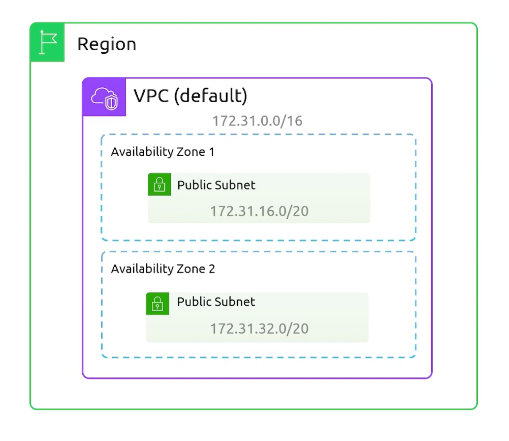
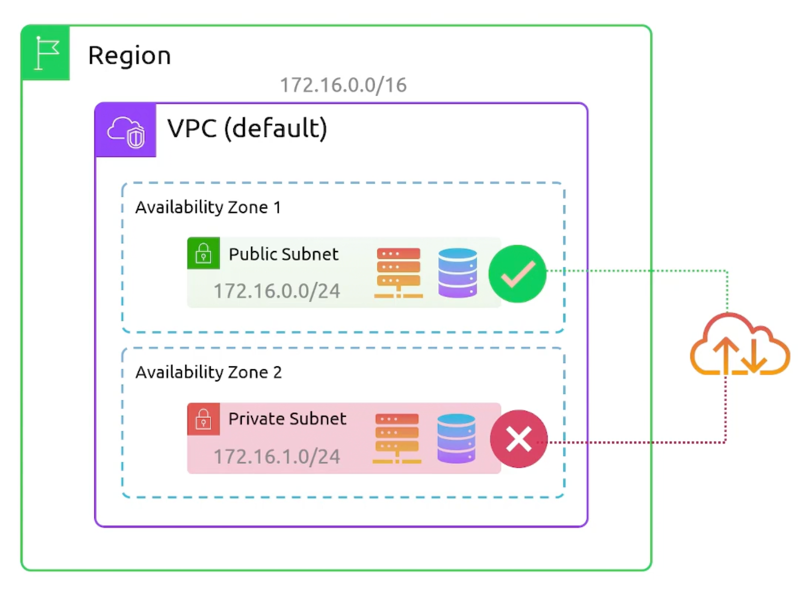

## Perquisites
:::info Private IP Addresses
Prefix | First Ip Address | Last Ip Address | Number of Addresses
:--: | :--: | :--: | :--:
10.0.0.0/8 | 10.0.0.0 | 10.255.255.255 | 16,777,216
172.16.0.0/12 | 172.16.0.0 | 172.31.255.255 | 1,048,576
192.168.0.0/16 | 192.168.0.0 | 192.168.255.255 | 65,536
:::

## VPC
Stands for `Virtual Private Cloud`. Allows us to isolate recourses from other resources. VPC gives you full control over networking in the cloud:
- Subnetting.
- Routing.
- Firewalls "NACLS, Security Groups".
- Gateways.

::::note
:::danger VPC Limitations
VPCs are `region specific`. They can't span more than one region.
:::
VPCs by default act as `network boundaries`.
::::

:::note VPC CIDR block
- Every VPC has a `CIDR block` that defines the range of IP addresses that resources in the VPC can use.
- A CIDR can be anywhere from `/16` to `/28`.
:::

:::tip VPC Other Features
- You can enable an `Optional` secondary IPv4 CIDR block.
- You can enable `IPv6` `/56` CIDR block.
- You can have up to `5 IPv6` CIDR blocks, but this limits is adjustable.
:::

### Default VPC
:::warning Default VPC
Default VPCs allow internet connectivity for all your resources by default.
:::

::::info VPC Default Configuration
- `/16` IPv4 CIDR block `172.31.0.0/16` (65,536 addresses).

:::danger Default Subnets
- For every availability zone: One `/20` default subnet (4,096 addresses) is `created`.
- Auto-assign public IP addresses is `enabled` by default inside each default subnet.
:::

::::

:::info VPC DEFAULT Internet Access Configuration
- Default VPCs have an `Internet Gateway` attached by default.
- A route that points all traffic `0.0.0.0/0` to the Internet Gateway.
- Devices in the default subnets will be accessible from the internet.
- Default Security Group that allows all outbound traffic.
- Default `Network Access Control List - NACL` that allows all traffic in and out.
:::

## Subnets
Are groups of IP addresses within your VPC. 

:::warning Subnet Limitations
- Subnets reside within a single AZ.
- Subnets within a VPC must be within the CIDR range.
- subnets can't overlap with other subnets in the VPC.
- Subnets block size must be between `/16` and `/28`.
- subnets can be made `public` or `private`.

:::

:::tip Subnets Features
- A subnet allows for an `Optional IPv6 /56` CIDR block.
- A subnet can be configured to be IPv6 only.
- By default, subnets can talk to other subnets within the same VPC. Without the need for anything.
:::

:::warning Reserved IP Addresses
The `first four` IP addresses and the `last` IP address in each subnet CIDR block are reserved by AWS.

#### Example `192.168.10.0/24`:
    1. `192.168.10.0`  Network Address.
    2. `192.168.10.1` (VPC Router) Reserved by `AWS`.
    3. `192.168.10.2` (DNS) Reserved by `AWS`.
    4. `192.168.10.3` (Future use) Reserved by `AWS`.
    5. last IP address of a subnet (`192.168.10.255`) is reserved as the broadcast address.

