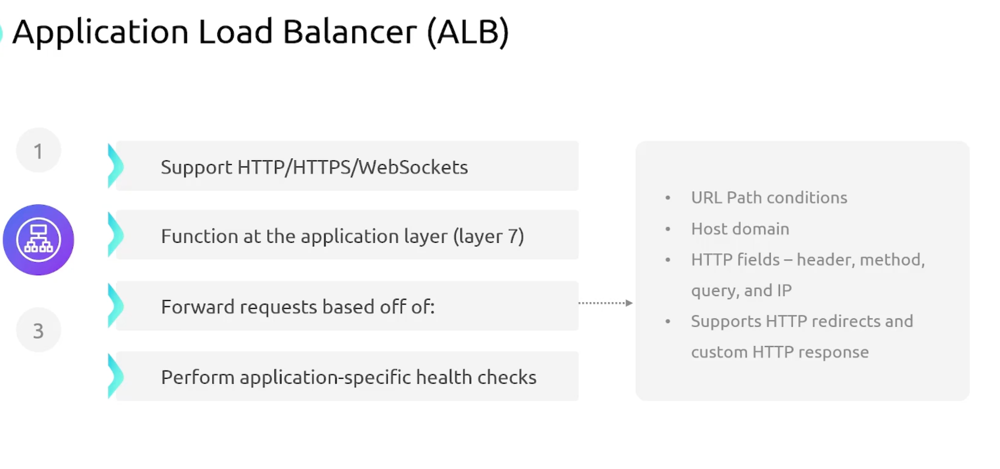

```mdx-code-block
import Tabs from '@theme/Tabs';
import TabItem from '@theme/TabItem';
```

## Perquisites
:::info Private IP Addresses
Prefix | First Ip Address | Last Ip Address | Number of Addresses
:--: | :--: | :--: | :--:
10.0.0.0/8 | 10.0.0.0 | 10.255.255.255 | 16,777,216
172.16.0.0/12 | 172.16.0.0 | 172.31.255.255 | 1,048,576
192.168.0.0/16 | 192.168.0.0 | 192.168.255.255 | 65,536
:::

:::info Port Ranges
- For TCP and UDP, a port number is a 16-bit unsigned integer, thus ranging from 0 to 65535.
- Ephemeral ports are `1024` to `65,535`.

Port Range | Description
:--: | :--:
0 - 1023 | Well Known Ports
1024 - 49,151 | Registered Ports
49152 - 65,535 | Dynamic and/or Private Ports
:::

## VPC
Stands for `Virtual Private Cloud`. Allows us to isolate recourses from other resources. VPC gives you full control over networking in the cloud:
- Subnetting.
- Routing.
- Firewalls "NACLS, Security Groups".
- Gateways.

::::note
:::danger VPC Limitations
VPCs are `region specific`. They can't span more than one region.
:::
VPCs by default act as `network boundaries`.
::::

:::note VPC CIDR block
- Every VPC has a `CIDR block` that defines the range of IP addresses that resources in the VPC can use.
- A CIDR can be anywhere from `/16` to `/28`.
:::

:::tip VPC Other Features
- You can enable an `Optional` secondary IPv4 CIDR block.
- You can enable `IPv6` `/56` CIDR block.
- You can have up to `5 IPv6` CIDR blocks, but this limits is adjustable.
:::

### Default VPC
:::warning Default VPC
Default VPCs allow internet connectivity for all your resources by default.
:::

::::info VPC Default Configuration
- `/16` IPv4 CIDR block `172.31.0.0/16` (65,536 addresses).

:::danger Default Subnets
- For every availability zone: One `/20` default subnet (4,096 addresses) is `created`.
- Auto-assign public IP addresses is `enabled` by default inside each default subnet.
:::


::::

:::info VPC DEFAULT Internet Access Configuration
- Default VPCs have an `Internet Gateway` attached by default.
- A route that points all traffic `0.0.0.0/0` to the Internet Gateway.
- Devices in the default subnets will be accessible from the internet.
- Default Security Group that allows all outbound traffic.
- Default `Network Access Control List - NACL` that allows all traffic in and out.
:::

## Subnets
Are groups of IP addresses within your VPC. 

:::warning Subnet Limitations
- Subnets reside within a single AZ.
- Subnets within a VPC must be within the CIDR range.
- subnets can't overlap with other subnets in the VPC.
- Subnets block size must be between `/16` and `/28`.
- subnets can be made `public` or `private`.


:::

:::tip Subnets Features
- A subnet allows for an `Optional IPv6 /56` CIDR block.
- A subnet can be configured to be IPv6 only.
- By default, subnets can talk to other subnets within the same VPC. Without the need for anything.
:::

:::warning Reserved IP Addresses
The `first four` IP addresses and the `last` IP address in each subnet CIDR block are reserved by AWS.

#### Example `192.168.10.0/24`:
    1. `192.168.10.0`  Network Address.
    2. `192.168.10.1` (VPC Router) Reserved by `AWS`.
    3. `192.168.10.2` (DNS) Reserved by `AWS`.
    4. `192.168.10.3` (Future use) Reserved by `AWS`.
    5. last IP address of a subnet (`192.168.10.255`) is reserved as the broadcast address.
:::

## Routing in a VPC
- Every VPC has a `vpc-router`.
- This router has an interface in each subnet.
- Can be reached for `network+1` Ip address.
    - For subnet `192.168.1.0/24` the router interface in the subnet is `192.168.1.1`.
- The purpose of the router is to direct traffic between subnets and in/out of the VPC.
- You can configure the router with `Route Tables`.

### Route Tables
- A set of rules that the router uses to forward network traffic.
- One default route table is created automatically for each VPC.
- Each rule is called a `route`.
- The router will compare the destination IP address of the packet to the routes in the route table.

:::warning Routes overlap
In case of overlapping routes, `pick the rule that has a larger prefix`. `/16` is larger than `/8`.
:::

:::note Default Route
All route tables have exactly one route by default. This route sends all traffic to the `local` VPC.
:::

:::warning Subnet / Route Table Association
- A subnet can only be associated with one route table at a time.
- Multiple subnets can be associated with the same route table.
:::

### Why would we need multiple route tables?
You might have different rules:
    - Public subnets associated with public-route-table.
    - Private subnets associated with private-route-table.


## Internet Gateway
- An `Internet Gateway` is a virtual router that connects a VPC to the internet.
- When you create a subnet, it will be `private` by default.
- Internet Gateway is attached to the VPC.
- `region-resilient`: Cover all AZs in the region.
- `A VPC can have up to one Internet Gateway attached to it`.
- An Internet Gateway can only be attached to a single VPC at a time.

<Tabs>

<TabItem value="Public Subnet">

    

</TabItem>


<TabItem value="Private Subnet">


</TabItem>

</Tabs>


### How to make a subnet public?
1. Create an Internet Gateway (`IGW`).
2. Attach the `IGW` to the VPC.
3. Create a custom route table. Configure a `default route` pointing to the `IGW`.
4. Associate the public subnet with the custom route table.

:::warning 
Your public IP is associated to your private IP. Linked together.
> If you have multiple interfaces, each can have a public IP.
:::


## NAT Gateway
- `NAT` stands for `Network Address Translation`.
- A NAT Gateway is a highly available AWS `managed service` that allows your resources in a private subnet to access the internet.
- Pricing: You pay hourly for the NAT Gateway and for the data processed.
- `NAT Gateway` is NOT region-resilient. AZ-reliant service. Need one NATGW per AZ.
- `NAT Gateway` uses an `Elastic IP` address.
- `NAT Gateways` are deployed to a public subnet to have internet access.
- Route tables for private subnets should have a default route pointing to the `NAT Gateway`.
- A `NAT Gateway` supports up to `5 Gbps` of bandwidth and automatically scales up to `100 Gbps`.

<Tabs>

<TabItem value="NAT Gateway">


</TabItem>

<TabItem value="NAT Gateway HA">


</TabItem>

</Tabs>

:::warning Intra-AZ bandwidth cost
If you need to egress traffic via a NATGW that is not in the same AZ you will incur `intra-AZ` bandwidth costs of `0.01 USD/GB` in addition to the `0.045 USD/GB` NATGW bandwidth.
:::

## DNS Resolution in VPCs
- Query `169.254.169.253` for DNS resolution.
- Second IP address of the `VPC`.


:::tip Enable domain names for Public IPs
By default, only private IP addresses will get a domain name. You can enable domain names for public IP addresses by: 
1. Enabling `enableDnsHostnames` when you craete a `VPC`.
2. Enabling `enableDnsSupport` when you create a `VPC`.
:::


## Elastic IP Addresses
A static IP address designed for dynamic cloud computing.
:::danger EC2 Public IP
When you stop and start or reboot an EC2 instance, the public IP address `will change`.
:::

:::tip Elastic IP
- You can assign security groups to an Elastic IP.
- They are specific to a region.
- Comes from `Amazon's pool of public IP addresses` or you can bring your own IP address.
:::

## Security Groups and NACLs
Security Groups and NACLs act as `firewalls`.

### Firewall Types

<Tabs>

<TabItem value="Stateless Firewall">


</TabItem>

<TabItem value="Stateful Firewall">


</TabItem>

</Tabs>


### NACLs
- Purpose: filter traffic at the subnet level. Meaning filtering traffic entering and leaving the subnet.
- NACLs are `stateless` firewalls by default.
- NACLs don't filter traffic within a subnet.
- NACLs stands for `Network Access Control Lists`.
- `Every subnet in a VPC must be associated with a NACL`.

:::note
You can have multiple subnets associated with the same NACL. But a subnet can only be associated with one NACL at a time.
:::

:::danger NACLs can NOT filter traffic to and from
- Amazon Domain Name Service (DNS).
- Amazon Dynamic Host Configuration Protocol (DHCP).
- Amazon EC2 instance metadata.
- Amazon ECS task metadata endpoints.
- License activation for Windows instances.
- Amazon Time Sync Service.
- Reserved IP addresses used by default VPC router.
:::


### Security Groups
- Purpose: filter traffic at individual resources level `EC2, LB, RDS...etc`.
- Security Groups are `stateful` firewalls by default.
- By default, all inbound traffic is `denied` and all outbound traffic is `allowed`.
- Specific to a VPC.

:::tip Filter Source
Instead of hardcoding Private IP addresses in the source field, you can use the `security group ID` of the source security group. E.g. database security group allows traffic from web security group.
:::


### NACLs vs Security Groups
- Security Groups when there are no rules, it `denies` all traffic.
- NACLs rules are either `allow` or `deny` traffic.
- NACKs have `numbered` rules. Ordered and evaluated in order. The smaller the earlier.
- You can assign multiple security groups to a single resource. Rules get `Merged`.


## Elastic Load Balancer
- AWS load balancers service.
- AWS offers three types of load balancers:
    1. Application Load Balancer.
    2. Network Load Balancer.
    3. Classic Load Balancer.


<Tabs>

<TabItem value="ELB Overview">


</TabItem>

<TabItem value="ELB Nodes">


</TabItem>

</Tabs>


### Classic Load Balancer


### Application Load Balancer


<Tabs>

<TabItem value="Application LB">



</TabItem>

<TabItem value="Certificate Termination">


</TabItem>

</Tabs>


### Network Load Balancer


<Tabs>

<TabItem value="Network LB">


</TabItem>

<TabItem value="Certificate Termination">


</TabItem>

</Tabs>


### Cross-Zone Load Balancing


### Deployment Modes
1. Public Load Balancers:
    - Deployed on public subnets.
    - Access by users across public internet.
2. Private/Internal Load Balancers:
    - Deployed on private subnets.
    - Accessible only from organization's aws network.

### ELB Architecture Example


### Listeners and Target Groups


## VPN
- Stands for `Virtual Private Network`.
- VPN Connects VPCs to on-premises data centers.
- A virtual private gateway is the Amazon-side endpoint for your VPN, attachable to `one` VPC. And it will `terminate the connection`.
- Customer Gateway is the on-premises side endpoint for your VPN. And it will `terminate the connection`.


<Tabs>

<TabItem value="VPN Overview">


</TabItem>

<TabItem value="VPN Detailed">


</TabItem>

</Tabs>


### VPN Routing

:::note
- On-premises network can be set `statically` in a route table. Or `dynamically` exchanged via BGP.
- `Border Gateway Protocol - BGP` routing protocol.
:::


### VPN Pricing
- Charged for each available VPN connection per hour.
- Charged for data transfer out from the AWS side to the internet.

:::note You will be charged for
- Per hour for each VPN connection.
- Egress data out of the AWS side to the internet.
:::

### VPN Gateway Limits
- Maximum bandwidth per VPN tunnel: 1.25 Gbps.
- Maximum packets per second: 140,000 packet.
- Maximum transmission unit: 1,466 bytes.

:::tip ECMP
You can use `ECMP` to increase the bandwidth of your VPN connection. `Equal Cost Multi-Path` routing. Across multiple VPN tunnels.
:::

