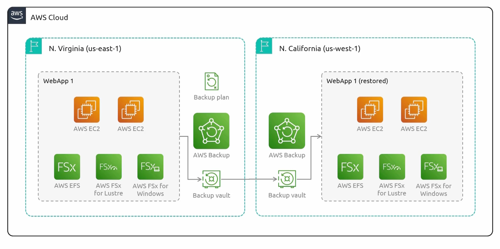

```mdx-code-block
import Tabs from '@theme/Tabs';
import TabItem from '@theme/TabItem';
```

## Pre-requisites
- [ ] Understand file systems types.
:::note File Systems
- **Windows File System** - FAT, NTFS, exFAT
- **macOS** - HFS, APFS, HFS+
- **Linux** - EXT2/3/4, XFS, JFS, Btrfs
:::


## Elastic Block Store (EBS)
- Breaks data into blocks and stores them across a number of physical devices. Each with a unique identifier.
- A collection of blocks can be presented to an operating system as a `volume`.
- Create a `file system` on top of this volume.
- We can also present them as a `hard drive` to the operating system. Which allow us to install an operating system on it. And make it `bootable`.
- **Summary**: Block storage are both `mountable` and `bootable`.


:::warning Multi-Attach
- Certain EBS volumes can be attached to multiple EC2 instances. This is called `multi-attach`.
- Your application must be intelligent enough to have multiple instances write to the same data at the same time. **Data Corruption alert**.
- Database Cluster is a good example of multi-attach. Master node writes to the volume and the slave node reads from it.
:::

:::note EBS Resilience
- EBS volumes are `replicated` within the same availability zone.
- Both EC2 and EBS needs to be in the `same availability zone`.
:::


### EBS multi-az replication
We have an EBS volume in `us-east-1a` and we want to move it to `us-east-1b`. We can do this by taking a `snapshot` of the volume and then deploy an EBS volume in `us-east-1b`. Snapshots are stored in `S3` and are `region specific`.


### EBS multi-region replication
- Copy snapshots from one region to another.


### Volume Types


- **General Purpose SSD**: 
    - (gp2): General purpose, balances price and performance. `Default` volume type.
    - (gp3): General purpose, balances price and performance. Higher performance and lower cost `20%`.
- **Provisioned IOPS SSD**:
    - Highest performance SSD volume for mission-critical low-latency or high-throughput workloads.
    - (io2):
    - (io2) - Block Express: 
    - (io1): 
- **Throughput Optimized HDD** and **Cold HDD**:
    - They have hard disk drives.
    - Throughput optimized HDD: Low cost, frequently accessed throughput-intensive workloads.
    - Cold HDD: Lowest cost, infrequently accessed workloads.
- **Magnetic**:
    - Previous generation. Packed by magnetic drives. Suitable for workloads where data is accessed infrequently.
    


### EBS demo
:::note Volume Devices Names
- `/dev/xvda` is the root volume.
- Newer Linux kernels may rename your devices to `/dev/xvdf`  through `/dev/xvdp` internally, even when the device name entered is `/dev/sdf` through `/dev/sdp`.
:::


```bash title="Attach EBS Volume"
lsblk
# [1]: Verify if the device volume has filesystem on it. "data" means no filesystem.
sudo file -s /dev/xvdf
sudo mkfs -t xfs /dev/xvdf
sudo file -s /dev/xvdf # Verify
# [2]: Mount the volume
sudo mkdir /mnt/data
sudo mount /dev/xvdf /mnt/data
# [3]: Verify if the volume is mounted
df -k
# [4]: Persist the volume. 
sudo blkid 
sudo vi /etc/fstab
sudo sh -c 'echo "UUID=4c16e25e-2203-432d-b4f7-0e3c9ce5238a /mnt/data xfs defaults,nofail" >> /etc/fstab'
sudo mount -a # but it's already mounted.

sudo sh -c 'echo "Hello World" > /mnt/data/hello.txt'
sudo umount /mnt/data
```

:::note 
- `/mnt`: Mount point for a temporarily mounted filesystem.
- `/media`: Mount point for removable media
:::

## Instance Store
`Temporary` block storage for EC2 instances. It is physically attached to the host computer. It is `ephemeral` and `non-persistent`.

:::warning EC2 Instance Store Support
- Not all EC2 instances support instance store volumes.
- Rebooting an instance will not delete the data on the instance store. But `stopping and starting` the instance will.
:::

## EFS (Elastic File System)
- First of two `file storage` services provided by AWS. `EFS` and `FSx`.
- Supports `NFSv4` protocol. 
- Does not work with windows based ec2 instances. Only Linux.
- You can mount EFS to multiple EC2 instances.
- `VPC Specific`. Visible through `Mount Targets`.
- Mount targets are `subnet specific`. Just an IP address.


### EFS Storage Classes
1. **Standard Storage Class**: 
    - Multi-AZ resilience and the highest levels of durability and availability.
    - `EFS Standard`.
    - `EFS Standard-IA`.
2. **One Zone Storage Class**:
    - The choice of additional savings by choosing to save your data in a single availability zone.
    - `EFS One Zone`.
    - `EFS One Zone-IA`.

### EFS Performance Modes
Handle `Throughput`, `Latency` and `IOPS`. Needed for broad range of workloads.

1. **General Purpose Performance Mode**:
    - Latency-sensitive Applications:
        - e.g. web serving, content management, home directories, and general file serving.
2. **Elastic Throughput Mode**:
    - Automatically scale throughput performance up or down to meet the needs of your workload activities.
3. **Max I/O Performance Mode**:
    - Higher levels of aggregate throughput and operations per second.
4. **Provisioned Throughput Mode**:
    - Level of throughput the file system can drive independent of the file system's size or burst credit balance.
5. **Bursting Throughput Mode**:
    - Scales with the amount of storage in your file system and supports bursting to higher levels for up to 12 hours per day.

### Setup EFS on EC2
```bash title="Setup EFS on EC2"
# Install amazon-efs-utils
sudo dnf -y install amazon-efs-utils
sudo mount.efs efs:id /mnt/efs
```

## FSx (File Storage)
- Fully managed file system storage service that provides high performance file storage. wide range of workloads.

### With FSx
No need to worry about:
- Provisioning file servers and storage volumes.
- Replicating data.
- Patching file server.
- Addressing hardware failures.
- Performing manual backups.

### Benefits
- Storage.
- Managed.
- Scalable.
- Shared Access.
- Backup.

### FSx for Windows File Server
- Supports `Server Message Block (SMB)` protocol.
- You can easily integrate it with Microsoft Active Directory.
- It supports data deduplication.
- You can set quotas.

### FSx for Lustre
Optimized for high-performance parallel file processing. It is used for machine learning, high-performance computing.
- Provides low-latency, high-throughput access to data.
- Build on the Luster file system.
- Integrates seamlessly with other AWS services like S3, DataSync and AWS Batch.
- You can easily scale the file systems's capacity and throughput.

:::note
Amazon FSx for Lustre is optimized for high-performance computing (HPC), machine learning, and media data processing workflows, providing a high-performance file system used in compute-intensive environments.
:::

### FSx for NetApp ONTAP
- Offeres high-performance storage that is accessible from `linux`, `MacOS` and `Windows`. Via `NFS`, `SMB`, and `iSCSI` protocols.
- Can scale you r file system up or down in response to workload demands.
- Can perform: `Snapshots`, `Replication`, `Clones`, ...etc.

### FSx for OpenZFS
- Built on top of the open-source OpenZFS file system.
- Supports access from `Linux`, `MacOS`, and `Windows` via `NFS` protocol.
- Utilizes the power OpenZFS capabilities including `data compression`, `snapshots`, `clones`, ...etc.
- Built-in data protection and security features.

### Deployment Options
- FSx for Windows, ONTAP, and OpenZFS support:
    - `Single-AZ`.
    - `Multi-AZ`.
- FSx for Lustre supports:
    - `Single-AZ`.

### FSx Comparison


## S3 (Simple Storage Service)
Object storage service. That provides industry-leading scalability, data availability, security, and performance. 

:::note Bucket Naming
S3 bucket names must be globally unique across all AWS accounts.
:::

### S3 Availability

:::tip
S3 is `region specific`. But inside console it will list all the buckets from all regions.
:::


### S3 Restrictions
- S3 can handle `unlimited` amount of objects.
- Maximum size of an object is `5TB`.
- An AWS account supports `100 buckets` by default. But this number can be increased to `1,000` by requesting a service limit increase.


### Storage Classes
Provides different levels of data access, resiliency, and cost.


### S3 Standard (default)
Objects are replicated across at least `three AZs`. You get `eleven 9's` of durability. low latency. Charged `per GB per month` and for `egrees` data transfer.

### S3 Standard-IA (Infrequent Access)
For data that is accessed less frequently, but requires rapid access when needed. Lower storage cost than S3 Standard. Charged `per GB per month` and for `egrees` data transfer.

Also, eleven 9's of durability. And objects are replicated across at least `three AZs`.

:::warning Extra Charges
- Every time you access an object, you will be charged for a `retrieval fee`.
- At minimum, you will be charged for `30 days` of storage.
- Minimum object size charge is `128KB`.
:::

### S3 One Zone-IA
Objects are stored in a single AZ. Cheaper than S3 Standard-IA. Immediate access when needed. But less resilient than S3 Standard-IA. Data is still `replicated within the same AZ`.

:::warning Extra Charges
- Every time you access an object, you will be charged for a `retrieval fee`.
- At minimum, you will be charged for `30 days` of storage.
- Minimum object size charge is `128KB`.
:::


### S3 Glacier-instant
All about data that is rarely accessed. Archived data. Data is retrieved immediately. And replicated across at least `three AZs`. And provides `eleven 9's` of durability. Charged per GB per month and for `egrees` data transfer.

:::warning Extra Charges
- Every time you access an object, you will be charged for a `retrieval fee`.
- At minimum, you will be charged for `90 days` of storage.
- Minimum object size charge is `128KB`.
:::


### S3 Glacier Flexible
Not immediately accessible. Not publicly accessible. 

#### Options to retrieve data
- **Bulk**: 5-12 hours.
- **Expedited**: 1-5 minutes.
- **Standard**: 3-5 hours.

:::warning Extra Charges
- Every time you access an object, you will be charged for a `retrieval fee`.
- At minimum, you will be charged for `90 days` of storage.
- Minimum object size charge is `40KB`.
:::

:::tip what happens
During retrieval, objects are stored in s3 Standard-IA class temporarily.
:::

### S3 Glacier Deep Archive
Cheapest storage class. Not immediately accessible. Not publicly accessible.

:::warning Extra Charges
- Every time you access an object, you will be charged for a `retrieval fee`.
- At minimum, you will be charged for `180 days` of storage.
- Minimum object size charge is `40KB`.
:::

#### Options to retrieve data
- **Standard**: 12 hours.
- **Bulk**: 48 hours.

:::tip what happens
During retrieval, objects are stored in s3 Standard-IA class temporarily.
:::

### S3 Intelligent-Tiering
- Automatically reduces storage costs by intelligently moving data to the most cost-effective access tier.
- Apart from the cost of a storage class an object gets assigned to, all objects will also incur a monthly `monitoring and automation` fee per `1,000` objects.


### S3 Versioning
- Versioning is on a `per-bucket` basis.
- E.g. Upload might overwrite an existing object with same key.
- Buckets states:
    - Unversioned.
    - Versioning Enabled.
    - Versioning Suspended.

:::warning Versioning
Once you enable versioning, you can't disable it. But you can `suspend` it.
:::


:::danger Restore Deleted Object
You can restore a deleted object. By, deleting the delete marker.
> You can delete specific versions by select then `permanently delete`. No going back tho.
:::

### Visioning Pricing
You will be charged for all versions. e.g. version-one is 10 GB and version-two is 5 GB. You will be charged for 15 GB.


### Multi-factor Authentication (MFA) Delete


### S3 ACl and Resource Policies
:::tip default access
By default, all S3 buckets and objects are `private`. Only the `owner` and `root` account can access them.
:::

:::note Resource Policies
Resource policies determines who has access to an S3 resource.

- `Sid`: is an arbitrary name that identifies the statement within the policy.
- `Principal`: determines who this policy applies to. e.g. `AWS` or `Service`.
- `Effect`: has two values `Allow` or `Deny`.
- `Action`: takes a list of actions that the policy will allow or deny.
- `Resource`: takes a list of resources' arn that the policy will apply to.
- `Condition`: takes a list of conditions that must be met for the policy to be applied. 
:::

### IAM Policies vs Resource Policies
- **IAM Policies**: Attached to a user, group, or role. Determines what actions a user can perform. `Can only be applied to authenticated AWS users`.
- **Resource Policies**: Attached to a resource. Determines who can access the resource and what actions they can perform. Can be applied to `authenticated`, `unauthenticated` and `anonymous` users.
- They work together. E.g. we have to make sure that the IAM policy and the resource policy are not denying the user access to the resource.


### S3 ACL
Has a legacy access control mechanism that provides IAM. Not recommended to use. It was inflexible and had only five rules. You can't apply the, to a group of objects. `Can be used but not recommended`.


### S3 Bucket Policies
- You can find examples [here](https://docs.aws.amazon.com/AmazonS3/latest/userguide/example-bucket-policies.html).
- Actions list [here](https://docs.aws.amazon.com/AmazonS3/latest/API/API_Operations.html).


### S3 Pre-signed URLs

#### Overview


#### Membership Play Video


#### Membership Upload Video


:::note
- When creating a pre-signed URL, an expiration date must be provided.
- Expiration duration of maximum 7 days using an IAM user is provided.
- If an IAM user does not have access to an S3 bucket, a pre-signed URL can still be generated using that account.
- The pre-signed URL doesn't give you access to a bucket; however, it allows you to send a request to S3 as the user that generated the pre-signed URL.
:::


### S3 Access Points

<Tabs>

<TabItem value="Bucket Policies">


</TabItem>

<TabItem value="Access Points">


</TabItem>

</Tabs>


### Access Points with VPCs


### Access Point Policy

You can view docs examples [here](https://docs.aws.amazon.com/AmazonS3/latest/userguide/access-points-policies.html#access-points-policy-examples).


### S3 Tips

:::tip S3 Object Lock
S3 Object Lock prevents object `deletion` or `modification` for a fixed period, helping to comply with regulatory requirements.
:::

:::tip S3 Multi-Part Upload
Multipart upload allows you to upload a single object as a set of parts. Each part is a contiguous portion of the object's data. You can upload these object parts independently and in any order. If transmission of any part fails, you can retransmit that part without affecting other parts. After all parts of your object are uploaded, Amazon S3 assembles these parts and creates the object. In general, when your object size reaches 100 MB, you should consider using multipart uploads instead of uploading the object in a single operation. Check docs [here](https://docs.aws.amazon.com/AmazonS3/latest/userguide/mpuoverview.html).
:::

:::tip S3 Analytics
By using Amazon S3 analytics Storage Class Analysis you can analyze storage access patterns to help you decide when to transition the right data to the right storage class. This new Amazon S3 analytics feature observes data access patterns to help you determine when to transition less frequently accessed STANDARD storage to the STANDARD_IA (IA, for infrequent access) storage class. Check docs [here](https://docs.aws.amazon.com/AmazonS3/latest/userguide/analytics-storage-class.html).
:::

:::tip S3 Lifecycle configuration
To manage your objects so that they are stored cost effectively throughout their lifecycle, configure their Amazon S3 Lifecycle. An S3 Lifecycle configuration is a set of rules that define actions that Amazon S3 applies to a group of objects. There are two types of actions:

- `Transition actions` – These actions define when objects transition to another storage class. For example, you might choose to transition objects to the S3 Standard-IA storage class 30 days after creating them, or archive objects to the S3 Glacier Flexible Retrieval storage class one year after creating them. For more information, see Using Amazon S3 storage classes. Note: `There are costs associated with lifecycle transition requests`.

- `Expiration actions` – These actions define when objects expire. Amazon S3 deletes expired objects on your behalf. Note: `Lifecycle expiration costs depend on when you choose to expire objects`.

You can check the docs [here](https://docs.aws.amazon.com/AmazonS3/latest/userguide/object-lifecycle-mgmt.html)
:::


:::tip S3 Event Notifications
You can use the Amazon S3 Event Notifications feature to receive notifications when certain events happen in your S3 bucket. To enable notifications, add a notification configuration that identifies the events that you want Amazon S3 to publish. Make sure that it also identifies the destinations where you want Amazon S3 to send the notifications. You store this configuration in the notification subresource that's associated with a bucket. You can check the docs [here](https://docs.aws.amazon.com/AmazonS3/latest/userguide/EventNotifications.html).
:::


## AWS Backup 
AWS Backup and Disaster Recovery.

### Disaster Recovery
The process of planning and responding to events that could cause `data loss` or `downtime`. Types can be:
- **Natural**: Earthquakes, floods, hurricanes, ...etc.
- **Man-made**: Cyber attacks, human error, ...etc.


### Why Disaster Recovery


### Backup vs Disaster Recovery
- **Backup**: 
    - Creates copies of data to restore it in case of data loss.
    - An essential part of disaster recovery.
- **Disaster Recovery**:
    - Encompasses a broader strategy, including backup.
    - Includes planning for system and application recovery.


### S3 for Disaster Recovery


### EBS Snapshots for Disaster Recovery
Point-in-Time Copies of EBS Volumes. crucial rule in protecting EC2 instances and data protection.


### AWS Backup
A fully managed backup service that makes it easy to `centralize` and `automate` the backup of data across AWS services.


#### Components
- **Backup Vault**: A container that stores backups.
- **Backup Plan**: A policy that defines how backups are created and managed.
- **Recovery Point**: A backup of a resource.


#### Example



### Supported AWS resources
For a comprehensive list of supported resources, check [here](https://docs.aws.amazon.com/aws-backup/latest/devguide/whatisbackup.html#supported-resources).


### Monitoring Integrations
- AWS Organizations.
- AWS CloudTrail.
- AWS EventBridge.
- AWS CloudWatch.
- AWS SNS.

## Elastic Disaster Recovery (DRS)


### Failover
- Failover from On-Premises to AWS.
- Failover from AWS region to another AWS region.
- Failover from Other Cloud Platform to AWS.

### DRS Philosophy
- **Source Server**: The server that you want to protect. You have to tell DRS what servers you want to protect.
- **Replication Agent**: Installed on the source server. It is responsible for replicating the data to the target server.

:::tip Staging Area
Basically, a subnet where EC2 instances will be deployed. So that they can receive the replicated data from our source servers.
:::

:::tip Three Different Components
- **On-Premises Subnet**: The one we wanna protect. Will have the replication agent installed.
- **Staging Area Subnet**: The one where the EC2 instances will be deployed. To receive the replicated data. And essentially, archive it.
- **Production Subnet**: The one we will failover to.
:::

### Recovery Servers


## Storage Gateway
A hybrid cloud storage service that enables your on-premises applications to seamlessly use AWS cloud storage. It can be a virtual machine or a physical server that you deploy to your `on-premise` environment.


### Storage Gateway Types
For whatever storage protocol you are using, you can use the appropriate storage gateway type.
- **Volume**.
- **File**.
- **Tape**.


### Volume Mode
It provides two modes:
1. **Cached Mode**: Data center extension.


2. **Stored Mode**: The entire dataset is stored on-premises. And a copy of the data is stored `asynchronously` in the cloud as EBS snapshots.


### File Mode


### Tape Mode
- VTL (Virtual Tape Library) stored in S3.
- VTS (Virtual Tape Shelf) stored in Glacier.
- Can support a size of `100 GB` to `5 TB`.


## Quiz Results


## Wrong Answers
