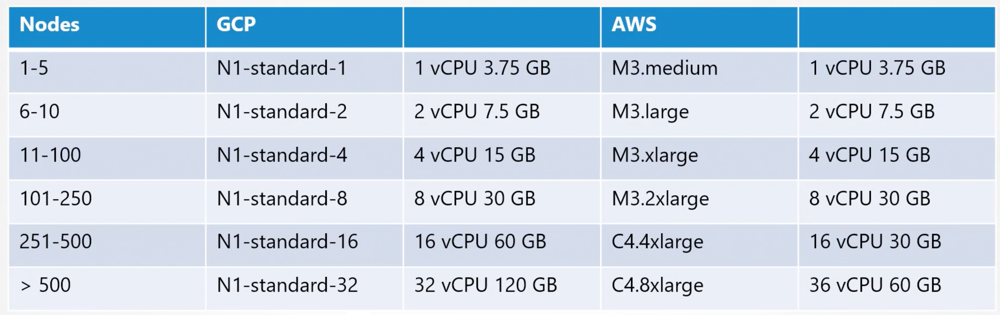
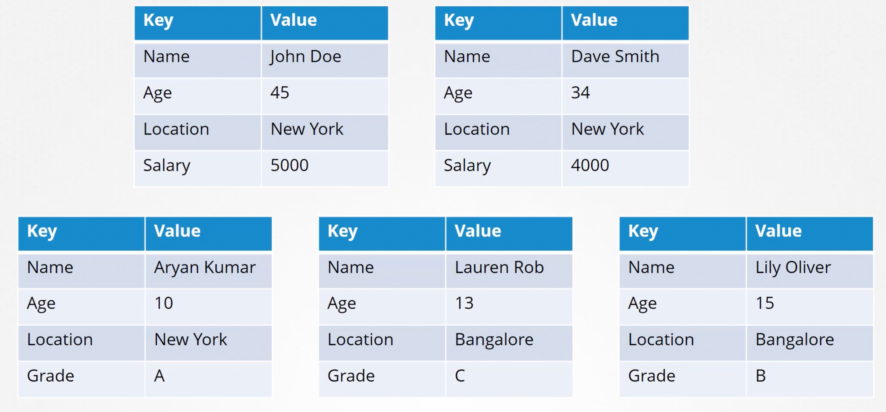
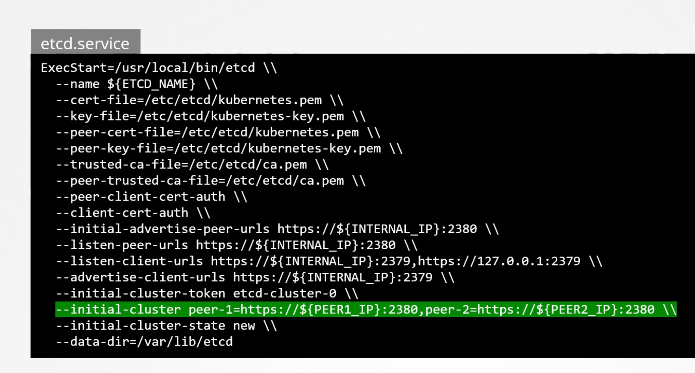

```mdx-code-block
import Tabs from '@theme/Tabs';
import TabItem from '@theme/TabItem';
```

In this section we will discuss designing a Kubernetes cluster. We have a few important questions first. 

**What is the purpose of the cluster?!** Is it for learning, Development, Testing or Production?

**What is the Cloud Adoption at the organization?!** Do you prefer the cluster to be managed or self hosted? **What kind of Workloads are you planning to run on the cluster?** **How many applications are to be hosted?!** Few or many?

**What kind of applications are going to be hosted on the cluster?!** Web applications, Big Data or analytics? As depending on the type of the application the resource requirements may vary.

**What type of network traffic are these applications expecting?!** Continuous heavy traffic or ***burst***? 

## Break Down Questions
If you want to deploy a cluster for learning purposes, Then a solution based on Minikube or a single node cluster with kubeadm on GCP/AWS is sufficient.

TO deploy a cluster for development purposes or testing, then a multi-node cluster with a single Master and multiple Worker nodes would help. Setup using kubeadm tool or quick provision on GCP/AWS...etc.

But Production Level Clusters is a different story.

## Production Level Clusters
For hosting a production grade application, a HA multi-node cluster with multiple Master  nodes is recommended. Use kubeadm or Kops on AWS for example. You can have up to `5000` Nodes in the Cluster. And Up to `150,000` Pods. With a maximum of `300,000` total containers. And Up too `100` Pods per Node.

Depending on the size of the cluster the resources required by the nodes may vary.



GCP and AWS automatically select the best instance type for the nodes. Based on the number of nodes in the cluster.

Use `kubeadm` for on-premises clusters. And `Kops` for AWS. `GKE` for GCP. `AKS` for Azure.

### Storage 
Depending on the workloads configured, your nodes and the next configuration may differ:
- High Performance - SSD Based Storage.
- Multiple Concurrent Connections - Network Based Storage.
- Persistent Shared VOlumes for shared access across multiple Pods. Consider `Persistent Storage Volumes`. Also, consider defining different classes of storage and allocating the right class to the right applications.
- Label Nodes with specific disk types.
- Use Node Selectors to assign applications to nodes with specific disk types.

### Nodes
- The nodes in the cluster can be Virtual or Physical Machines. We will deploy VMs on VirtualBox environments has nodes of our cluster. We can deploy on VMs or Physical Machines or Cloud Instances.
- Minimum of 4 Node Cluster (1 Master and 3 Worker Nodes).
- Master vs Worker Nodes.
- Linux X86_64 Architecture.

### Master Nodes
Typically, we would have all the components of the Kubernetes Control Plane running on the Master Node. However, in larger clusters, we may choose to separate the ETCD clusters from the master nodes to its own dedicated nodes.

## Kubernetes Infrastructure
We will discuss the different choices available for the infrastructure hosting a kubernetes cluster.

Kubernetes can be deployed on a various systems in different ways. Starting with Laptops tp VMs within an organization or on Cloud Providers. Depending on the requirements of the cloud ecosystem, and the kind of applications to be hosted, the infrastructure can be chosen.

### Laptop
On a supported linux machine, we can get started with installing binaries manually and setting up a local cluster. However, that is too tedious especially if getting started.

On windows on the other hand you can not setup a cluster natively. There are no windows binaries available. You must rely on a virtualization software like Hyper-V or Vmware Workstation or VirtualBox to create Linux VMs on which you can run kubernetes.

There are also solutions available to run kubernetes components as Docker containers on windows VMs. But even then the DOcker images are linux based and under the hood they run a small linux OS created by Hyper-V for running Linux docker containers.

**What are some of the solutions available for running kubernetes on a laptop?!**

MiniKube deploys a single node cluster easily. It relies on one of the virtualization softwares like Oracle VirtualBox, to create VM that run the kubernetes cluster components. 

The kubeadm tool can be used to deploy a `single node` or a `multi-node` cluster real quick, before this you must provision the required hosts with supported configurations.

So the difference between the first two, minikube and kubeadm. Is that minikube configure VM by itself, while kubeadm requires the VMs to be provisioned before hand.

MiniKube is a single node cluster, while kubeadm can be used to deploy a multi-node cluster.

Deploying a kubernetes cluster locally is only for learning, development and testing purposes ONLY.

### Production Grade Clusters
For production purposes there are many ways to get started with a kubernetes cluster. Both in private or a public cloud environment. We can categorize them as `Turnkey Solutions` or `Hosted Solutions (Managed)`.

#### Turnkey Solutions
Turnkey solutions are where you provision the required VMs and use some kind if tools or scripts to configure the kubernetes cluster on them.

At the end of the day, you are responsible for:
- Provisioning the VMs.
- Configuring the VMs.
- Use scripts to deploy the kubernetes cluster.
- Maintain the VMs.

E.g. Kubernetes on AWS using Kops.

#### Hosted Solutions
Are more like kubernetes as a service solution. Where the cluster along with the required VMs are deployed by the cloud provider. The provider would: provision the VMs, configure the VMs, install kubernetes, maintain the VMs and the cluster.

E.g. GKE on GCP lets you deploy a kubernetes cluster in a matter of minutes, AKS on Azure, EKS on AWS.

### Turnkey Solutions
***Openshift is a popular on-premises kubernetes platform by RedHat***. OpenShift is an open source container application platform and is built on top of Kubernetes. It provides a set of additional tools and a nice GUI to create and manage `kubernetes constructs`. And easily integrates with CI/CD pipelines.

Cloud Foundry Container Runtime is an open-source project from Cloud Foundry that helps in deploying and managing highly available kubernetes clusters using their open-source tool called `BOSH`.

If you wish to leverage your existing VMware environment for kubernetes, then `Vmware Cloud PKS` Solution is one that should be evaluated.

Vagrant provides a set of useful scripts to deploy a kubernetes cluster on different cloud service providers. 

All of these solutions makes it easy to deploy and manage a kubernetes cluster privately within an organization. You must have a set of virtual machines with supported configuration in place. They are a few of the many kubernetes certified solutions. But there are many more Check kubernetes documentation page.

### Hosted Solutions
Google Container Engine - GKE is a very popular kubernetes as a service offering on Google Cloud Platform.

Openshift Online is an offering from RedHat where you can gain access to fully functional kubernetes cluster online. 

Azure has the Azure Kubernetes Service - AKS. And Finally, Amazon Elastic Container Service for Kubernetes - EKS. Is Amazon's hosted kubernetes offering.

**What is our choice for this section?!** Local kubernetes cluster from scratch on our local system by creating several virtual machines on VirtualBox.

### Design
Our final design has three nodes. One Master Node and Two Worker Nodes. To be deployed on a laptop with virtual machines provisioned on VirtualBox.


## High Availability k8s Cluster
***What happens when you lose the master node in a kubernetes cluster?!*** As long as the workers are up and the containers are alive, the applications are still running. Users can access the application until things starts to fail. E.g. a container or a Pod on a worker node crashes. If that Pod was part of a replica set, then the replication controller on the master node needs to instruct the worker node to load a new Pod. But, the master is not available. And so, are the controllers and schedulers on the master. There is no one to recreate the Pod and no one to schedule the Pod on a worker node. Similarly, since the kube-apiserver is not available, you can not access the cluster externally through `kubectl` or through API for management purposes. 

Which is why you must consider multiple master nodes in a high availability configuration in a production grade cluster. A high availability configuration is where you have redundancy across every component in the cluster so aa to avoid a single point of failure.

The master nodes, worker nodes, applications, storage, network,...etc.

Our focus now would be on the master and control plane components. We looked at three node cluster with one master and two worker nodes. In a HA setup we have the same components running on the new master as well.

**How does that work?!**

Running multiple instances if the same components? Are they going to do the same thing twice? How do they share the work among themselves? That differs based on what they do. We know that the API server responsible for receiving requests and processing them or providing information about the cluster. They work on one request at a time. So, the api server on all the cluster nodes can be alive and running at the same time in an `active-active` configuration.

SO far in this course we know that the kubectl utility talks to the kube-apiserver to get things done. And we point the kubectl to reach the master node at port `6443`. This is configured in the kubeconfig file. With the two master `https://master-one:6443` and `https://master-two:6443`. We can send the request to either one of them but we should not be sending the same request to both of them. So it is better to have a load balancer of some kind, configured in the front of the master nodes `https://master-lb:6443`. 

***What about the scheduler or the controller manager?!***

These are controllers that watch the state of the cluster and take actions. E.g. the controller manager consists of controllers like the replication controller, that is constantly watching the state of the Pods and taking necessary actions. If multiple instances of these runs in parallel, they might duplicate the work. resulting in more pods than actually required. The same is true with the scheduler. As such, they must ***NOT*** run in parallel. They run in an `active-standby` mode. 

**Who decides which among the two is the active and which is the passive?!** This is achieved through a leader election process. So how does that work? Let us look for controller manager for instance. When a controller manager process is configured, you may specify the leader elect option which is by default set to true. `kube-controller-manager --leader-elect=true`. With this option enabled, when the controller manager process starts, it tries to gain a lease or a lock on an endpoint object in kubernetes named as `kube-controller-manager Endpoint`. Which ever process first update the endpoint with this information gains the lease and becomes the active of the two. The other process becomes the passive. It holds the lock for the lease duration `--leader-elect-lease-duration 15s`. By default it is 15 seconds. The active process then renews the lease `--leader-elect-renew-deadline 10s`. By default it is 10 seconds. Both the processes tries to become the leader `--leader-elect-retry-period 2s`. By default it is 2 seconds. That way if one process fails, the second process can acquire the lease and become the active.

The scheduler follows a similar approach. And has the same command line options.

### Etcd
We discussed the `kube-apiserver`, `kube-scheduler` and `kube-controller-manager`. Next up is the `etcd`. With ETCD there are two topologies that you can configure in kubernetes. 

***One*** is the `Stacked control plane nodes topology` where etcd is part of the kubernetes master nodes. This is:
- Easier to setup and manage.
- Fewer servers.
- `Risk during failures`.

But if one node goes down both an ETCD member and control plane instance is lost and redundancy is compromised.


***The Other*** is where etcd is separated form the control plane nodes and run its own set of servers. This is called `External ETCD Topology`. Compared to the previous topology, it is:
- Less risky during failures.
- `Harder to setup and manage`.
- `More servers`.
As a failed control plane node does not impact the etcd cluster and the data it stores. However, it is more complex and harder to setup and requires twice the number of servers for external etcd nodes. 

Remember the API server is the only component that talks to the etcd server. And if you looked in the `kube-apiserver` configuration option. You have a set of options specifying where the etcd cluster is `--etcd-servers=http://etcd-one:2379,http://etcd-two:2379,http://etcd-three:2379`. So, regardless of the topology we use and wherever we configure etcd servers, weather in the same server or on a separate server. Ultimately, we need to make sure that the API server is pointing to the right address of the etcd cluster.

Remember, etcd is a distributed system, so the apiserver or any other component that wishes to talk to to it. Can reach the etcd server at any of its instances. You can read and write data through any of the available etcd server instances.

Now with HA in mind we decided to change the design two be two masters and two worker nodes. Also, we have the load balancer in front of the master nodes. Total of five nodes in the cluster. 

## Etcd HA
Before configuring kubernetes in an HA setup, we must first configure etcd in an HA setup. We will focus on cluster configuration of etcd. 

**What is etcd?!** A distributed reliable key-value store that is simple, secure and fast. Traditionally, data was organized and stored in tables. A key value store, stores information in the form of documents or pages. So each individual gets a document, and all information about that individual is stored within that document. These files can be of any format or structure and changes to one file does not affect the others. In this case the working individuals can have their files with salary fields. While you code store and retrieve simple keys-values when your data gets complex you typically end up transacting in data formats like JSON or YAMl. That is what etcd is and how you quickly get started with it. We also mentioned that etcd is distributed. 

***What does distributed mean?!*** Previously, we had etcd on a single server. But it is a database and may be storing critical data. So, it is possible to have your datastore across multiple servers. Now we have three servers all running etcd on port `2379`. And all maintaining an ***IDENTICAL*** copy of the database. So, if you lose one you still have two copies of your data. 

***How does it ensure the data on all the nodes are consistent?!***

You can write to any instance and read the data from any instance. Etcd ensures that the same consistent copy of the data is available on all instances at the same time. *So, how does it do that?!* With reads it is easy. Since all the data is available across all nodes. You can easily read it from any node. But that is not the case with writes. What if two write requests coming on two different nodes at the same time? Which one goes through? E.g. we have a write coming in on node-one for `name=John` and on node-three for `name=Joe`. It is forbidden to have two different data on two different nodes. When we said etcd can write through any instance, that was not entirely true. etcd does not process the writes on each node. Instead only one of the instances is responsible for processing the writes. Internally, the nodes elect a leader among them. Of the total instances, one node becomes the leader and the other nodes become the followers. 

If the write came in through the leader node, the leader processes the write. The leader makes sure that the other nodes are sent a copy of the data. If the write came in through any of the follower nodes. Then they forward the writes to the leader internally. and then the leader processes the writes. Again when the writes are processed, the leader ensures that copies of the write are distributed to other instances in the cluster. 

Thus, a write is only considered complete if the leader gets consent from other members in the cluster. ***How do they elect the leader?!*** ***And how do they ensure a write is propagated across all instances?!***

Etcd implements distributed consensus using the `Raft Consensus Protocol`. In a three node cluster. When the cluster is setup we have three nodes that do not have a leader elected. RAFT algorithm uses random timers for initiating requests. E.g. a random timer is kicked off on the three managers the first one to finish the timer sends out a request to the other nodes requesting permission to be the leader. The other managers on receiving the request, respond with their vote and the node assumes the leader role. Now that it is elected the leader it sends out notification at regular intervals to other masters informing them that it is continuing to assume the rule of the leader. 

In case the other nodes do not receive a notification from the leader at some point in the time which could either be due to the leader going down or losing network connectivity. The nodes initiate a new election process among themselves and a new leader is identified. Going back to our previous example where a write comes in. It is processed by the leader and then replicated to the other nodes in the cluster. The write is considered to be complete only when it is replicated to the other instances in the cluster. 

We said that the etcd cluster is highly available. So, even if we lose a node it should still function. E.g. a new write comes in but one of the follower nodes is not responding. Hence, the leader is able to only write to one follower node out of the two followers. **Is the write considered to be complete?!** Does it wait for the third node to be up? Or does it fail? 

A write is considered to be complete if it can be written on the majority of the nodes in the cluster. E.g. in this case of three nodes and one follower down. The majority is two. So, if the data can be written on two of the nodes, then it is considered to be complete. If the third node was to come online then the data is copied to it as well. 

> Majority **=** Quorum **=** (N / 2) + 1 **--->** floor( **(N / 2) + 1** ) 

Quorum is the minimum number of nodes that must be available for the cluster to function properly or make a successful write. 

<Tabs>

<TabItem value="Tabular">


</TabItem>

<TabItem value="Key-Value">



</TabItem>

</Tabs>


Below is a table showing cluster of size of 1 to 7 and their respective quorum values.

Instances | Quorum | Fault Tolerance
:--: | :--: | :--:
1 | 1 | 0
2 | 2 | 0
***3*** | ***2*** | ***1***
4 | 3 | 1
***5*** | ***3*** | ***2***
6 | 4 | 2
***7*** | ***4*** | ***3***

We can tell from what is above that having two instances is like having one instance it does not offer you any real value as quorum can not be met. Which is why it is recommended to have a minimum of three instances in an etcd cluster. That way it offers a fault tolerance of at least one node. As if we lost one we still have one quorum and the cluster will continue to function. So, the (first_column - second_column) equals the fault_tolerance. Which is the number of nodes that you can afford to lose while keeping the cluster alive. 

Summing up a one or two nodes etcd cluster are out of consideration. Three and four have the same fault tolerance of one. Five and six have the same fault tolerance of two. When deciding on the number of the master nodes it is ***recommended*** to select an odd number. 

E.g. if we have a six node cluster and due to a disruption in the network it fails and causes the network to partition into two. Now we have four nodes in one and two on the other. In this case the group with four nodes have a quorum and continues to operate normally. However if the network got partitioned into a different way, resulting in nodes being distributed evenly. Each group node has three nodes only. But since we originally had six manager nodes. The quorum for the cluster to stay alive is four. But now neither of the groups have a quorum. So it results in ***cluster crash***.

So with even number of nodes there is a possibility of the cluster failing during network segmentation. Incase we had an odd number of managers originally say seven. Then after the network partition we have four in one segment and three in the other. Then our cluster still lives on the group of four managers as it meets the quorum requirement of four. No matter how the network partitions their are better chances for the cluster to survive a network segmentation with odd number of nodes.

> Having more than five instances is really not necessary. As the fault tolerance is already at two which is enough.

### Install etcd 
1. Download the latest binary from the etcd github releases page.
2. Extract it and create the required directory structure.
3. Copy over the certificate files generated for Etcd.
4. Then configure the etcd service file.

```bash
wget -q --https-only https://github.com/etcd-io/etcd/releases/download/v3.5.13/etcd-v3.5.13-linux-amd64.tar.gz
tar -xvf etcd-v3.5.13-linux-amd64.tar.gz
mv etcd-v3.5.13-linux-amd64/etcd* /usr/local/bin/
mkdir -p /etc/etcd /var/lib/etcd
cp ca.pem kubernetes-key.pem kubernetes.pem /etc/etcd/
```

What is important in step four is to note that the initial cluster option where we passing the peers's information. That is how each etcd service knows that it is part of a cluster and where its peers are. 

```bash
--initial-cluster etcd-one=https://${PEER_ONE_IP}:2380,etcd-two=https://${PEER_TWO_IP}:2380,etcd-three=https://${PEER_THREE_IP}:2380
```



Once installed and configured, use the `etcdctl` utility to store and retrieve data. 

### etcdctl
The `etcdctl` utility has two API versions. The `v2` and `v3`. The commands works different in each version. Version Two is Default. But we will use Version Three. So set an environment variable `export ETCDCTL_API=3`. Otherwise the the below commands won't work.

```bash
etcdctl put name john
etcdctl get name
# Get all keys
etcdctl get / --prefix --keys-only
```

Going back to our design. **How many nodes should our cluster have?!** In an HA environment, as we now know having one or two instances does not really make any since. As using one node in either case will leave you without quorum. And thus render the cluster non-functional. Hence, the minimum required nodes in an HA setup is `three`. We also discussed why we prefer odd number of instances over even above. Having even number of instances can leave the cluster without quorum in certain network partition scenarios. So we are left with 3,5,7 and any odd number above that. Three is a good start but if you require a higher level of fault tolerance then 5 is better. And anything above that is just unnecessary. 

Our final design would also go for the `Stacked Control Plane Nodes Topology`. 

## Kubernetes The Hard Way
Installing Kubernetes the hard way can help you gain a better understanding of putting together the different components manually.

An optional series on this is available on our YouTube channel here:
- [Install Kubernetes Cluster from Scratch.](https://youtube.com/playlist?list=PL2We04F3Y_41jYdadX55fdJplDvgNGENo&si=iAuHQ17E38WswUda)
- [Install Kubernetes Cluster from Scratch GitHub Repository.](https://github.com/mmumshad/kubernetes-the-hard-way)

## Kubernetes From Scratch

### Setup Kubeadm
In this section we will use kubeadm tool, which can be used to bootstrap a kubernetes cluster. The kubeadm tool helps us set up a multi-node cluster using kubernetes best practices.

The kubernetes cluster consists of various components and security and certifications requirements to enable the communication between all the components. Installing all of these various components individually across different nodes and modifying all of the necessary configuration files to make sure all the components points to each other and setting up certificates to make it work, is a tedious task. Kubeadm helps us by taking care of all of these tasks.

The steps to setup a kubernetes cluster using the kubeadm tool at a high level are:
1. Access to multiple systems or VMs provisioned. Basically, nodes for the cluster. Physical, Virtual...etc. Once provisioned, designate one as the master. And the rest as worker nodes.
2. Install a container runtime on ***ALL*** the hosts. E.g. Containerd. 
3. Install `kubeadm`, on ***ALL*** the nodes.
4. Initialize the master node using `kubeadm init`. During this process all of the required components are installed and configured on the master server. Once initialized, but prior to joining the worker nodes to the cluster, we must ensure that the network prerequisites are met. Normal network connectivity is ***NOT*** enough for this. As we know kubernetes requires a special network solution between the master and the worker nodes. Called Pod Network.
5. Provision the Pod Network. Once the Pod network is set up. We are all set to go on having the worker nodes join the master node.
6. Worker nodes join the cluster. Once they all have joined the master node. We can then move on to deploying applications on the cluster.

### Demo
In this demo we will discuss how to provision VMs required with Vagrant for our kubernetes cluster, that would include a single master node and two worker nodes. 

We will accomplish this by using two peaces of software. Vagrant and VirtualBox "Hypervisor". Vagrant is an automation tool that helps in setting up and managing virtual machines. 

#### Pre-requisites
- [ ] Install VirtualBox.
- [ ] Install Vagrant.

#### Steps
1. Clone Repository from [here](https://github.com/mmumshad/kubernetes-the-hard-way).
2. Run the following:
```bash
vagrant status
vagrant up
vagrant ssh kube-master
logout
vagrant ssh kube-node-one
vagrant ssh kube-node-two
uptime
logout
```

#### Kubeadm
We have all the VMs to setup the kubernetes cluster. We will now install the kubeadm tool on all the nodes. One Master and Two Worker Nodes.

```bash
# [1]: Ref documentation https://kubernetes.io/docs/setup/production-environment/tools/kubeadm/install-kubeadm/
```

```bash
# [2]: Install Containerd on ***ALL*** the nodes.
cat <<EOF | sudo tee /etc/modules-load.d/k8s.conf
overlay
br_netfilter
EOF

sudo modprobe overlay
sudo modprobe br_netfilter

# sysctl params required by setup, params persist across reboots
cat <<EOF | sudo tee /etc/sysctl.d/k8s.conf
net.bridge.bridge-nf-call-iptables  = 1
net.bridge.bridge-nf-call-ip6tables = 1
net.ipv4.ip_forward                 = 1
EOF

# Apply sysctl params without reboot
sudo sysctl --system

# Verify that the br_netfilter, overlay modules are loaded by running the following commands:
lsmod | grep br_netfilter
lsmod | grep overlay

# Verify that the net.bridge.bridge-nf-call-iptables, net.bridge.bridge-nf-call-ip6tables, and net.ipv4.ip_forward system variables are set to 1 in your sysctl config by running the following command:
sysctl net.bridge.bridge-nf-call-iptables net.bridge.bridge-nf-call-ip6tables net.ipv4.ip_forward
```

Install Containerd from [here](https://github.com/containerd/containerd/blob/main/docs/getting-started.md).

```bash
# Setup the repository on ALL three nodes.
# Add Docker's official GPG key:
sudo apt-get update
sudo apt-get install ca-certificates curl
sudo install -m 0755 -d /etc/apt/keyrings
sudo curl -fsSL https://download.docker.com/linux/ubuntu/gpg -o /etc/apt/keyrings/docker.asc
sudo chmod a+r /etc/apt/keyrings/docker.asc

# Add the repository to Apt sources:
echo \
  "deb [arch=$(dpkg --print-architecture) signed-by=/etc/apt/keyrings/docker.asc] https://download.docker.com/linux/ubuntu \
  $(. /etc/os-release && echo "$VERSION_CODENAME") stable" | \
  sudo tee /etc/apt/sources.list.d/docker.list > /dev/null
sudo apt-get update
```

```bash
# Install the containerd on ALL nodes
sudo apt-get install containerd.io
systemctl status containerd
```

Read through Cgroups. Summary if you have a systemd init system, you have to use the `systemd` cgroup driver. But the cgroupfs is the default driver. ***Kubelet and container runtime must use the very same Cgroup driver***. 

We will set both of them to use the `systemd` driver. First we need to know what our ***init system*** is by running `ps -p 1`. 

#### Configuring the systemd Cgroup Driver
You can follow the docs [here]( sudo apt-get install docker-ce docker-ce-cli containerd.io docker-buildx-plugin docker-compose-plugin).

Delete all the configurations at `/etc/containerd/config.toml` Then paste:
```toml
[plugins."io.containerd.grpc.v1.cri".containerd.runtimes.runc]
  [plugins."io.containerd.grpc.v1.cri".containerd.runtimes.runc.options]
    SystemdCgroup = true
```

```bash
sudo systemctl restart containerd
```

> Now the runtime is installed in all the three nodes.

#### Install Kubeadm, Kubelet, Kubectl
Check the docs [here](https://kubernetes.io/docs/setup/production-environment/tools/kubeadm/install-kubeadm/#installing-kubeadm-kubelet-and-kubectl).

> We need `kubeadm` on ***ALL*** three nodes.

#### Initialize control plane node
Check the docs [here](https://kubernetes.io/docs/setup/production-environment/tools/kubeadm/create-cluster-kubeadm/#initializing-your-control-plane-node).


Following only on master node.
```bash
ip a # Get private ip address of the master node 
# say result was 192.168.56.2/24
sudo kubeadm init --pod-network-cidr 10.244.0.0/16 --apiserver-advertise-address 192.168.56.2
# Do not delete what is on your screen
# An admin.conf file is generated. So that we can actually connect
# to the cluster

# Create a .kube directory 
mkdir -p $HOME/.kube
sudo cp -i /etc/kubernetes/admin.conf $HOME/.kube/config
sudo chown $(id -u):$(id -g) $HOME/.kube/config

kubectl get po
```

Deploy the pod network
```bash
kubectl apply -f [podnetwork].yaml
# Check docs from here: https://kubernetes.io/docs/concepts/cluster-administration/addons/
kubectl apply -f https://reweave.azurewebsites.net/k8s/v1.28/net.yaml

kubectl get po -A

# Check out the things to watch out for in the docs
# make sure the --pod-network-cidr is eq to 
kubectl -n kube-system get ds weave-net

# ADD the yaml below


# COPY THE JOIN COMMAND YOU SEE IN THE TERMINAL
kubeadm token create --print-join-command
kubeadm token create --print-join-command 2> /dev/null
```

```yaml
env:
  - name: IPALLOC_RANGE
    value: 10.244.0.0/16
```

### Summary
1. Get VMs "One master and two worker nodes".
2. Install Containerd on ***ALL*** the nodes.
3. - Configure Cgroup driver on ***ALL*** nodes used by your `init-system`. To be the same for kubelet and containerd.
4. Install Kubeadm, Kubelet and Kubectl on ***ALL*** the nodes.
5. Initialize control plane node.
    - Save Join Command.
    - `--pod-network-cidr`.
    - `--apiserver-advertise-address`.
    - `Configure Kubectl`.
6. Deploy Pod network.
    - make sure the --pod-network-cidr is eq to the `IPALLOC_RANGE` env variable in the pod network yaml.
7. Join the worker nodes to the cluster.

### Practice Test
```bash title="On both nodes"
# set net.bridge.bridge-nf-call-iptables to 1
cat <<EOF | sudo tee /etc/modules-load.d/k8s.conf
br_netfilter
EOF

cat <<EOF | sudo tee /etc/sysctl.d/k8s.conf
net.bridge.bridge-nf-call-ip6tables = 1
net.bridge.bridge-nf-call-iptables = 1
EOF

sudo sysctl --system

# container runtime has already been installed on both nodes

# Check OS version
cat /etc/*release

# Install kubeadm, kubelet and kubectl on both nodes
sudo apt-get update
sudo apt-get install -y apt-transport-https ca-certificates curl

sudo mkdir -m 755 /etc/apt/keyrings

curl -fsSL https://pkgs.k8s.io/core:/stable:/v1.29/deb/Release.key | sudo gpg --dearmor -o /etc/apt/keyrings/kubernetes-apt-keyring.gpg

echo 'deb [signed-by=/etc/apt/keyrings/kubernetes-apt-keyring.gpg] https://pkgs.k8s.io/core:/stable:/v1.29/deb/ /' | sudo tee /etc/apt/sources.list.d/kubernetes.list

sudo apt-get update

# To see the new version labels
sudo apt-cache madison kubeadm

sudo apt-get install -y kubelet=1.29.0-1.1 kubeadm=1.29.0-1.1 kubectl=1.29.0-1.1

sudo apt-mark hold kubelet kubeadm kubectl
```

Initialize Control Plane Node (Master Node):
1. `apiserver-advertise-address` - Use the IP address allocated to `eth0` on the controlplane node.
2. `apiserver-cert-extra-sans` - Set it to `controlplane`.
3. `pod-network-cidr` - Set to `10.244.0.0/16`.

Once done, set up the default `kubeconfig` file and wait for node to be part of the cluster.
```bash
IP_ADDR=$(ip addr show eth0 | grep -oP '(?<=inet\s)\d+(\.\d+){3}')
kubeadm init --apiserver-cert-extra-sans=controlplane --apiserver-advertise-address $IP_ADDR --pod-network-cidr=10.244.0.0/16
# Or
kubeadm init --apiserver-advertise-address 192.4.146.3 --apiserver-cert-extra-sans controlplane --pod-network-cidr 10.244.0.0/16

mkdir -p $HOME/.kube
sudo cp -i /etc/kubernetes/admin.conf $HOME/.kube/config
sudo chown $(id -u):$(id -g) $HOME/.kube/config

kubeadm join 192.4.146.3:6443 --token a95srf.1z9fvg5ksyai41qn \
        --discovery-token-ca-cert-hash sha256:7a4b08b953a8384c25ed3f5848047f48f46e7eabf0855e78f14b8c6413f925a6
```

To install a network plugin, we will go with Flannel as the default choice. For inter-host communication, we will utilize the eth0 interface.

Please ensure that the Flannel manifest includes the appropriate options for this configuration.

Refer to the official documentation for the procedure.
```bash
kubectl apply -f https://github.com/flannel-io/flannel/releases/latest/download/kube-flannel.yml


curl -LO https://raw.githubusercontent.com/flannel-io/flannel/v0.20.2/Documentation/kube-flannel.yml

vi kube-flannel.yml
```

```yaml
- args:
  - --iface=eth0
  - --ip-masq
  - --kube-subnet-mgr
```

```bash
kubectl apply -f kube-flannel.yml
kubectl get nodes
```

## Failure Scenarios

### Control Plane Node Failure
```bash
kubectl get nodes
kubectl get po
kubectl -n kube-system get po

service kube-apiserver status
service kube-controller-manager status
service kube-scheduler status
service etcd status

service kubelet status
service kube-proxy status

# Check the logs of the control plane components
kubectl -n kube-system logs kube-apiserver-master

sudo journalctl -u kube-apiserver

# Worker Nodes
service kubelet status
systemctl status containerd
service containerd status
sudo journalctl -u kubelet

journalctl -u kubelet -f

# Use systemctl to restart the kubelet service
systemctl restart kubelet
```

## Network Plugin in Kubernetes
There are several plugins available, and these are some:

1. Weave Net:
    - `kubectl apply -f https://github.com/weaveworks/weave/releases/download/v2.8.1/weave-daemonset-k8s.yaml`
2. Flannel:
    - `kubectl apply -f https://raw.githubusercontent.com/coreos/flannel/2140ac876ef134e0ed5af15c65e414cf26827915/Documentation/kube-flannel.yml`
    - Note: As of now, ***flannel does not support Kubernetes network policies***.
3. Calico:
    - `curl https://docs.projectcalico.org/manifests/calico.yaml -O`
    - `kubectl apply -f calico.yaml`
    - Calico is said to have the most advanced cni network plugin. 

In the CKA and CKAD exams, you won’t be asked to install the cni plugin. But if asked, you will be provided with the exact URL to install it.

***Note: If there are multiple CNI configuration files in the directory, the kubelet uses the configuration file that comes first by name in lexicographic order.***

## DNS in Kubernetes
Kubernetes uses CoreDNS. CoreDNS is a flexible, extensible DNS server that can serve as the Kubernetes cluster DNS.

### Memory and Pods
In large scale Kubernetes clusters, CoreDNS’s memory usage is predominantly affected by the number of Pods and Services in the cluster. Other factors include the size of the filled DNS answer cache and the rate of queries received (QPS) per CoreDNS instance.

Kubernetes resources for coreDNS are:
- ServiceAccount named `coredns`.
- ClusterRoles named `coredns` and `kube-dns`.
- ClusterRoleBindings named `coredns` and `kube-dns`.
- Deployment named `coredns`.
- ConfigMap named `coredns`.
- Service named `kube-dns`.

While analyzing the coreDNS deployment, you can see that the Corefile plugin consists of an important configuration, which is defined as a configmap.

Port 53 is used for DNS resolution:
```toml title="Corefile"
kubernetes cluster.local in-addr.arpa ip6.arpa {
   pods insecure
   fallthrough in-addr.arpa ip6.arpa
   ttl 30
}
```

This is the backend to k8s for cluster. local and reverse domains. `proxy . /etc/resolv.conf`.

Forward out of cluster domains directly to right authoritative DNS server.

### Troubleshooting issues related to coreDNS
1. If you find CoreDNS pods in a pending state first check that the network plugin is installed.
2. coredns pods have `CrashLoopBackOff` or `Error` state.
    If you have nodes that are running SELinux with an older version of Docker, you might experience a scenario where the coredns pods are not starting. To solve that, you can try one of the following options:
    1. Upgrade to a newer version of Docker.
    2. Disable SELinux.
    3. Modify the coredns deployment to set `allowPrivilegeEscalation` to true: `kubectl -n kube-system get deploy coredns -o yaml | sed 's/allowPrivilegeEscalation: false/allowPrivilegeEscalation: true/g' | kubectl apply -f -`
    4. Another cause for CoreDNS to have `CrashLoopBackOff` is when a CoreDNS Pod deployed in Kubernetes detects a loop.

    There are many ways to work around this issue; some are listed here:
    - Add the following to your kubelet config yaml:` _resolvConf: _` This flag tells `kubelet` to pass an alternate `resolv.conf` to Pods. For systems using `systemd-resolved`, `/run/systemd/resolve/resolv.conf` is typically the location of the “real” resolv.conf, although this can be different depending on your distribution.
    - Disable the local DNS cache on host nodes, and restore `/etc/resolv.conf` to the original.
    - A quick fix is to edit your `Corefile`, replacing `forward . /etc/resolv.conf` with the IP address of your upstream DNS, for example `forward . 8.8.8.8`. But this only fixes the issue for `CoreDNS`, `kubelet` will continue to forward the invalid `resolv.conf` to all default dnsPolicy Pods, leaving them unable to resolve DNS.
3. If `CoreDNS` pods and the `kube-dns` service is working fine, check the kube-dns service has valid `endpoints`. `kubectl -n kube-system get ep kube-dns`. If there are no endpoints for the service, inspect the service and make sure it uses the correct selectors and ports.


## Kube-Proxy
kube-proxy is a network proxy that runs on each node in the cluster. kube-proxy maintains network rules on nodes. These network rules allow network communication to the Pods from network sessions inside or outside of the cluster.

In a cluster configured with kubeadm, you can find kube-proxy as a ***daemonset***.

kubeproxy is responsible for watching services and endpoint associated with each service. When the client is going to connect to the service using the virtual IP the kubeproxy is responsible for sending traffic to actual pods.

If you run a `kubectl describe ds kube-proxy -n kube-system` you can see that the kube-proxy binary runs with the following command inside the kube-proxy container.

```yaml
command:
- /usr/local/bin/kube-proxy
- --config=/var/lib/kube-proxy/config.conf
- --hostname-override=$(NODE_NAME)
```

So it fetches the configuration from a configuration file i.e., `/var/lib/kube-proxy/config.conf` and we can override the hostname with the node name at which the pod is running.

In the config file, we define the `clusterCIDR`, `kubeproxy` mode, `ipvs`, `iptables`, `bindaddress`, `kube-config` etc.

#### Troubleshooting issues related to kube-proxy
1. Check kube-proxy pod in the kube-system namespace is running.
2. Check kube-proxy logs.
3. Check configmap is correctly defined and the config file for running kube-proxy binary is correct.
4. kube-config is defined in the config map.
5. check kube-proxy is running inside the container. `netstat -plan | grep kube-proxy`.


#### Example
```bash
kubectl -n kube-system describe configmap kube-proxy
kubectl -n kube-system edit ds kube-proxy
```

## JsonPath
```bash
kubectl get nodes -o jsonpath='{.items[*].metadata.name}{"\n"}{.items[*].status.capacity.cpu}'

# Better version:
# master 4
# node1 2
kubectl get nodes -o jsonpath='{range .items[*]}{.metadata.name}{"\t"}{.status.capacity.cpu}{"\n"}{end}'

kubectl get nodes -o custom-columns=<COLUMN_NAME>:<JSON_PATH>

# The custom columns assumes the query is for EACH item in the list.
kubectl get nodes -o custom-columns=NODE:.metadata.name,CPU:.status.capacity.cpu

# Sort
kubectl get nodes -o custom-columns=NODE:.metadata.name,CPU:.status.capacity.cpu --sort-by=.status.capacity.cpu
```

### Practice
```bash title="Retrieve the osImages of all the nodes"
k get nodes -o json | egrep --color 'osImage|$'
# status.nodeInfo.osImage
kubectl get nodes -o jsonpath='{.items[*].status.nodeInfo.osImage}'
kubectl get nodes -o custom-columns=NODE:.metadata.name,OS:.status.nodeInfo.osImage
```

```bash title="Get names form Kubeconfig file"
kubectl config view --kubeconfig=/root/my-kube-config

kubectl --kubeconfig /root/my-kube-config config view -o json

k --kubeconfig /root/my-kube-config config view -o jsonpath='{.users[*].name}'

# Identify the context configured for the aws-user
kubectl config view --kubeconfig=my-kube-config -o jsonpath="{.contexts[?(@.context.user=='aws-user')].name}"
```

```bash title="Sort PVs based on capacity"
k get pv -o jsonpath='{.items[*].spec.capacity}'

kubectl get pv --sort-by=.spec.capacity.storage

kubectl get pv -o custom-columns=PVNAME:.metadata.name,CAPACITY:.spec.capacity.storage
```

#### Get keys
```json
{
    "key1": "val1",
    "key2": "val2",
    "key3": {
        "key31":"val31",
        "key32":"val32"
    }
}
```

```bash
# Use json path with this query '$.key3.*~'
cat file.json | jsonpath '$.key3.*~'
[
  "key31",
  "key32"
]
```


## References
- [Installing kubeadm.](https://kubernetes.io/docs/setup/production-environment/tools/kubeadm/install-kubeadm/)
- [Installing Kubernetes the kubeadm way on Apple Silicon.](https://github.com/kodekloudhub/certified-kubernetes-administrator-course/tree/master/kubeadm-clusters/apple-silicon)
- [Debug Services.](https://kubernetes.io/docs/tasks/debug/debug-application/debug-service/)
- [Debugging DNS Resolution.](https://kubernetes.io/docs/tasks/administer-cluster/dns-debugging-resolution/)


