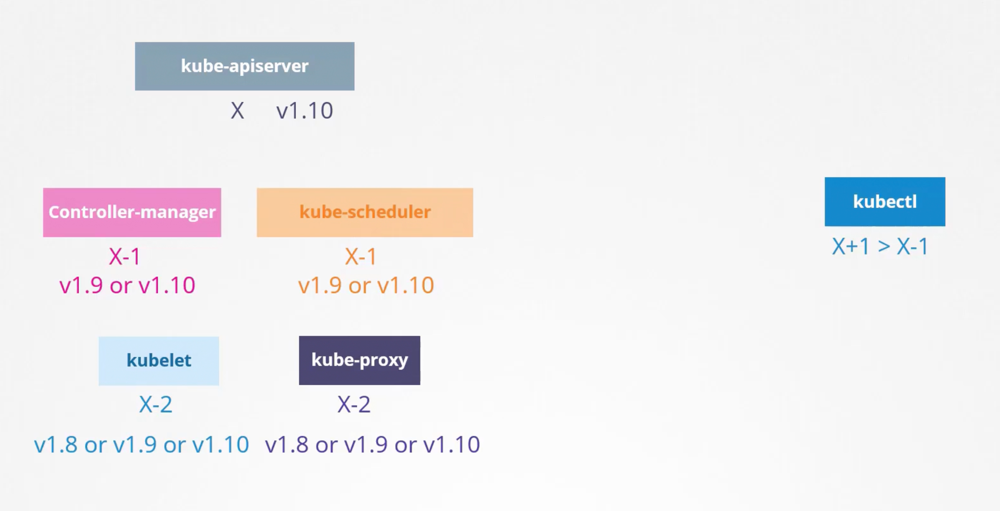
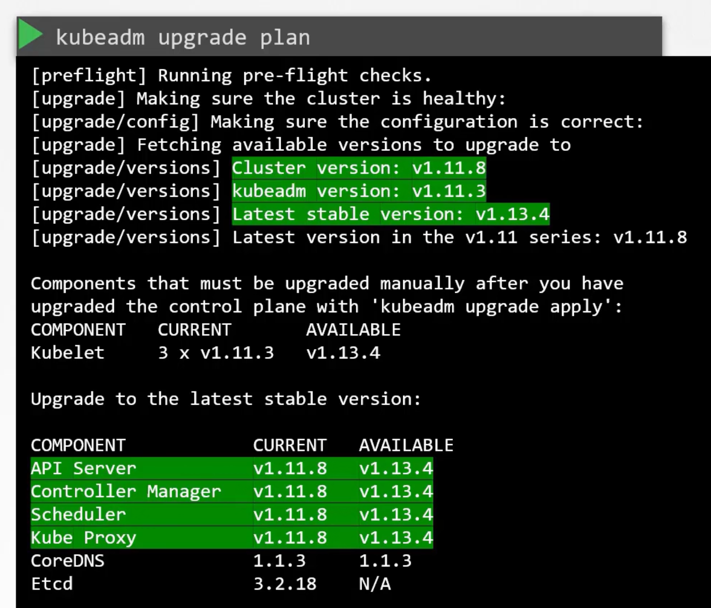

```mdx-code-block
import Tabs from '@theme/Tabs';
import TabItem from '@theme/TabItem';
```

In this section, we will discuss cluster maintenance related topics. `Operating system upgrades`, also the implications of `losing a node` in the cluster. Or when you take a node out of the cluster for maintenance. E.g. for applying patches or upgrading the OS. Then we will discuss `Cluster Upgrade` but before we will tackle `Kubernetes releases and versioning`.

Also, best practices for `upgrading Kubernetes` When to upgrade, and what version to upgrade to. End to end upgrade to a cluster. With live applications.

Finally, we will discuss `Backup and Restore` strategies for Kubernetes clusters. Including `etcd` backup and restore. And how to backup and restore the entire cluster. Disaster recovery strategies.

## OS Upgrades
Taken down nodes as part of your cluster for maintenance. E.g. for applying patches or upgrading the OS. This is a common task in a production environment. You need to make sure that your applications are still running and that the cluster is still healthy.

If the node came back online immediately, the kubectl process starts and the pods come back online. But if the node is down for more than five minutes, then the pods are terminated from that node. Kubernetes will consider them as dead. If the pods were a part of a replicaset, then they are recreated on other nodes. And when the node come back online after the pod eviction time, it comes up blank. But any pods that were running on that node and without a replicaset will be just gone.

A more safer way is to: `drain` the node before taking it down. `kubectl drain <node-name>`. This will evict all the pods from the node. The pods will be gracefully terminated. And recreated on other nodes. This node will be marked as `Unschedulable`. No new pods will be scheduled on this node. Until you specifically remove this restriction.

After you finish the maintenance, you can `uncordon` the node. `kubectl uncordon <node-name>`. This will allow the pods to be scheduled on this node again.

:::warning
The pods that were removed, will not automatically fall back to the node. 
:::

You can also `cordon` the node. `kubectl cordon <node-name>`. This will prevent new pods from being scheduled on this node. But the existing pods will continue to run.


```bash title="Drain a node" {1,6,19}
kubectl get po -o custom-columns=POD:.metadata.name,NODE:.spec.nodeName
POD                     NODE
blue-667bf6b9f9-8kmlj   node01
blue-667bf6b9f9-dqkl7   controlplane
blue-667bf6b9f9-pzpmx   node01
kubectl drain <node-name> --ignore-daemonsets
node/node01 cordoned
Warning: ignoring DaemonSet-managed Pods: kube-flannel/kube-flannel-ds-pmhzp, kube-system/kube-proxy-plbns
evicting pod default/blue-667bf6b9f9-pzpmx
evicting pod default/blue-667bf6b9f9-8kmlj
pod/blue-667bf6b9f9-pzpmx evicted
pod/blue-667bf6b9f9-8kmlj evicted
node/node01 draine
kubectl get po -o custom-columns=POD:.metadata.name,NODE:.spec.nodeName
POD                     NODE
blue-667bf6b9f9-2vthg   controlplane
blue-667bf6b9f9-dqkl7   controlplane
blue-667bf6b9f9-l6tk7   controlplane
kubectl uncordon node01
node/node01 uncordoned
```

## Kubernetes Releases 
When you install a Kubernetes cluster, we install a specific version of Kubernetes. You can see that when you run `kubectl get nodes`. 

Kubernetes release versions follows three parts: `Major.Minor.Patch`. Every few month a minor version is released. With new features and functionalities. Patches are released more often. With critical bug fixes and security patches.

Just like any popular software, Kubernetes follows a standard software release versioning procedure. The first Major version was `v1.0` in July 2015. The current latest is [here](https://kubernetes.io/releases/).

Whatever we have seen between `v1.0` and `v1.29` are `STABLE` releases.

Apart from the stable releases, there are also `ALPHA` and `BETA` releases. All the bug fixes and improvements first go into a release tagged `ALPHA`. In this release, the feature are disabled by default and maybe buggy. Then from there they make their way to the `BETA` release. Where the features are well tested. And the new features are enabled by default. Finally, they make their way to the main `STABLE` release.

Download the desired version from github kubernetes releases page. Download the `kubernetes.tar.gz` file. Extract it to find executables for all k8s components. The downloaded pkg when extracted has all the control plain components. All of them of the `SAME` version. But, remember there are other components within the control plane that do not have the same version. E.g. `etcd` and `coredns`.

The `etcd` cluster and `coredns` servers have their own versions as they are separate projects. The release notes provides information about the supported versions of externally dependent components like `etcd` and `coredns`.

## Api References
- [The Kubernetes API.](https://kubernetes.io/docs/concepts/overview/kubernetes-api/)
- [API Conventions.](https://github.com/kubernetes/community/blob/master/contributors/devel/sig-architecture/api-conventions.md)
- [Changing the API.](https://github.com/kubernetes/community/blob/master/contributors/devel/sig-architecture/api_changes.md)

## Cluster Upgrade Process
We will keep dependencies for external components like `etcd` and `coredns` aside for now. And focus on the core control plane components. E.g.: `kube-apiserver`, `kube-controller-manager`, `kube-scheduler`, `kube-proxy`, `kubelet` and `kubectl`.

**Is it mandatory for all these components to be of the same version?**

No, it is not. But since the `kube-apiserver` is the primary component, which all other components talk to. None of the other components should ever be at a version higher than the `kube-apiserver`. The `controller-manager`, `scheduler`, can be at one version lower. The `kubelet` and `kube-proxy` can be at two versions lower.

This is not the case with `kubectl`. It can be at any version. This permissible skew in versions allows us to carry out live upgrades. We can upgrade component by component if we wanted. 



### When to Upgrade
Say you are running `v1.10` and kubernetes releases `v1.11` and `v1.12`. `At any time kubernetes supports only up to the recent three minor versions`. Before the release of `v1.13`, it would be a good time to upgrade your cluster to the next release.

**So how do we upgrade? Do we upgrade directly from `v1.10` to `v1.13`?**

No, The recommended approach is to upgrade _**one minor version at a time**_. 

:::tip Reasons for Gradual Upgrades
- **API Compatibility**:  Kubernetes maintains API compatibility within minor versions. Upgrading one minor version at a time greatly reduces the risk of breaking changes that could disrupt your applications due to removed or modified API objects.

- **Feature Deprecation**:  Kubernetes has a deprecation policy. While features might be deprecated over multiple releases, you may encounter removed features with larger jumps, impacting your manifests. Gradual upgrades give you time to adapt.

- **Component Compatibility**: Different Kubernetes components (kubelet, kube-apiserver, etc.) might have version skew tolerances. Gradual upgrades help you stay within those tolerances for smoother operation.

- **Bug Mitigation**: Sometimes bug fixes and security patches are backported into supported minor versions. Sticking to one-step upgrades increases your chances of including those fixes without the risk of bigger changes.

- **Easier Troubleshooting**: If something goes wrong with an upgrade, a smaller version change makes it easier to isolate the cause and potentially roll back.
:::

:::warning steps when upgrading
1. **Read Release Notes**: Meticulously review the release notes for v1.12, v1.13, and  v1.14 to identify:
- API deprecations/removals that might impact your deployments.
- Breaking changes in features you use.
- Important bug fixes or security patches you'd want to include.
2. **Backup**: Before starting the upgrade, ensure you have a backup of your cluster state, including etcd data. While the risk of significant data loss during a single minor version Kubernetes upgrade is relatively low, taking backups is always a wise precaution.
3. **Iterative Updates**: Upgrade to 1.12 first, test thoroughly, then to 1.13, and so on. This might require updating manifests to adapt to changes if needed.
4. **Testing**: Have a robust testing plan at each upgrade stage. Include regression testing for your applications and cluster functionality to catch potential breakages earlier.

#### Additional Considerations

- **Add-on Compatibility**: Check compatibility of any add-ons (ingress controllers, storage providers, etc.) with the target Kubernetes version.
- **Downtime Strategy**: Depending on your setup (control plane redundancy, etc.), prepare for potential downtime during control plane upgrades.
:::

:::tip Backups: What and Why
1. etcd Backups:
    - etcd is Kubernetes' distributed key-value store. It contains the entire state of your cluster.
    - **Absolutely Essential**: Back up etcd before upgrading, as this is your most critical data store for restoring the cluster if anything goes severely wrong.
2. Persistent Volumes (PVs):
    - If your applications rely on data stored in PVs, your backup strategy depends on the type of storage the PVs use:
        - **Cloud Providers**: Often, cloud-provided storage has built-in snapshot/backup capabilities. Make sure you have recent snapshots.
        - **Network Storage Solutions**: Consult your storage solution's documentation for backup procedures.
3. ConfigMaps and Secrets (Optional):
    - These typically store application configurations and sensitive data.
    - **Recommended but not always critical**: If they aren't managed outside the cluster or through GitOps, back these up too. Tools like Velero can help.

#### Why Backups Might Be Less Critical for Minor Upgrades
- **API Compatibility**: Minor version upgrades don't tend to break API objects dramatically.
- **Data Plane Focused**: Minor upgrades usually focus on upgrading components rather than changing fundamental data structures.

#### Still, Better Safe Than Sorry
- **Peace of mind**: Backups provide a safety net if `unforeseen issues pop up`.
- **Quick Rollbacks**: With backups, a problematic upgrade is more easily addressed by rolling back.

#### Process Matters Too:
- **Automated Upgrades**: Tools like `kubeadm` often have integrated backup/rollback capabilities.
- **Well-Tested Cluster Setup**: If you have extensive testing and confidence in your configuration, the risk is further reduced.

#### Summary:
While the need for full backups before each minor upgrade might be debatable based on your setup and risk tolerance, `backing up etcd is non-negotiable`. Consider backing up other components for an extra layer of resilience.
:::

The upgrade process depends on how your cluster was set up. 

**If it is a managed cluster**, then the cloud provider will take care of the upgrade with just a few clicks. 

**If you used tools like `kubeadm`**, then the tool can help you plan and execute the upgrade.

**If you deployed the cluster from scratch**, then you manually upgrade the different components of the cluster yourself.

In this section we will discuss how to upgrade a cluster that was set up using `kubeadm`. So you have a cluster with master and worker nodes. Running in production. The nodes and the components are running at `v1.10`. Upgrading the cluster involves two major steps:
1. Upgrading the control plane.
2. Upgrading the worker nodes.

While the master is being upgraded, the control plane components such as `kube-apiserver`, `kube-scgeduler` and `kube-controller-manager` go down briefly. Note that the master going down does not affect the worker nodes. But all management operations are down. You can not access the cluster using `kubectl` or other kubernetes APIs. The controller manager does not function either, so if a pod was to fail, it would not be restarted. But as long as the nodes are up, the pods will continue to run. Now the master node is at `v1.11`. The worker nodes are still at `v1.10`. The next step is to upgrade the worker nodes.

There are different strategies to upgrade the worker nodes. The most common approach is to upgrade one node at a time. While we are doing so just move the workloads to other nodes. 

Another approach is to upgrade all the worker nodes at once. This is a risky approach. But if you have a large number of nodes, then this approach might be faster. But, it will cause downtime for the applications running on the cluster.

Also another interesting approach is to add new nodes with the new version. Can be easily done in cloud environments. And decommission the old nodes. Move workloads to the new nodes. This approach is the least risky. But it is also the most expensive.

### Example
kubeadm has an upgrade command that can help you upgrade the control plane components. `kubeadm upgrade plan` will show you the plan. E.g. current cluster version, kubeadm version, and the latest stable version. Then it lists all the control plane components and their versions.



Also, tells you that after you upgrade the control plane, you need to upgrade the `kubelet` manually. `Remember kubeadm does not install or upgrade kubelet`. 

Finally it gives you the command to upgrade the cluster `kubeadm upgrade apply v1.13.4`. And notifies you to first upgrade the kubeadm to `v1.13.4`. 

> The kubeadm tool also follows the same software versioning as kubernetes. 

We go one minor version at a time, highly dependant on your cluster setup. But `always start with control plane nodes then worker nodes`:
1. Make sure you are using `pkgs.k8s.io` as package repository. The `apt.kubernetes.io` and `yum.kubernetes.io` are deprecated. Then do `apt-get update`. `Both on ALL the master and worker nodes`.
2. Upgrade kubeadm on the master node. 
3. Upgrade the control plane with `kubeadm`.
4. Drain the nodes first, then upgrade the kubelet and kubectl on Master node. And restart kubelet service. Finally, uncordon the node.
5. Repeat the above steps for all control plane nodes. Just the normal above steps but run `kubeadm upgrade node` instead of `apply`.
6. Next Worker Nodes, one at a time.
    1. Drain the node.
    2. Upgrade kubeadm on the worker node.
    3. Upgrade kubelet on the worker node.
    4. Update node configuration for the new kubelet version using `kubeadm`.
    5. Restart kubelet service.
    6. Uncordon the node.
    7. `Repeat for all worker nodes`.

> You may or may not have kubelet running on the master node. If cluster setup with by kubeadm then you have kubelet running on the master node as it is running control plane components as pods. But if your setup was from scratch, then you will not see the master node in the output of `kubectl get nodes`. 

```sh title="Upgrade Our Cluster from v1.11.8 to v1.13.4"
# ---> Step One 
cat /etc/*release* # check the OS version, say Ubuntu
# This will error
# `WARNING` do NOT forget to change the version in the following commands, there is different pkg repo for each minor version. E.g. 1.29 if you are at 1.28 and want to reach 1.29.
echo "deb [signed-by=/etc/apt/keyrings/kubernetes-apt-keyring.gpg] https://pkgs.k8s.io/core:/stable:/v1.28/deb/ /" | sudo tee /etc/apt/sources.list.d/kubernetes.list 
curl -fsSL https://pkgs.k8s.io/core:/stable:/v1.28/deb/Release.key | sudo gpg --dearmor -o /etc/apt/keyrings/kubernetes-apt-keyring.gpg
apt-get update
# You need to determine which patch version you want to upgrade to.
apt update
apt-cache madison kubeadm # 1.29.3-1.1

# ---> Step Two
apt-get upgrade -y kubeadm=1.12.0-00
## Or
apt-mark unhold kubeadm && \
apt-get update && apt-get install -y kubeadm='1.29.3-1.1' && \
apt-mark hold kubeadm
## Verify the version
kubeadm version

# ---> Step Three
kubeadm upgrade plan # shows the plan
kubeadm upgrade apply v1.12.0 # pulls the necessary images and upgrades the control plane
## Or
kubeadm upgrade apply v1.29.3
## Verify the version
kubectl get nodes # shows the master node at v1.11.3 cuz this is the o/p of kubelet, not api-server itself.

# This will error
# `WARNING` at this step you might need to upgrade your CNI provider plugin. Check addons page to find if your CNI provider and see wether additional upgrade steps are required. This step is not required on additional control plane nodes if the CNI provider runs as a DaemonSet.

# ---> Step Four: Upgrade the kubelet on the master node
kubectl drain <node-name> --ignore-daemonsets
apt-get upgrade -y kubelet=1.12.0-00
## Or
apt-mark unhold kubelet kubectl && \
apt-get update && apt-get install -y kubelet='1.29.3-1.1' kubectl='1.29.3-1.1' && \
apt-mark hold kubelet kubectl
# Restart kubelet
systemctl daemon-reload
systemctl restart kubelet
# Verify the version
kubectl get nodes # shows the master node at v1.12.0
# Uncordon the node
kubectl uncordon <node-name>

# ---> Step Six: Worker Nodes. `Correct STEPS` Upgrade kubeadm, update node, drain node, upgrade kubelet, restart kubelet, uncordon node.
kubectl drain <node-name> 
apt-get upgrade -y kubeadm=1.12.0-00
apt-get upgrade -y kubelet=1.12.0-00
## Or
# This will error
# `WARNING` you usually do not have kubectl on worker nodes. 
apt-mark unhold kubeadm kubelet kubectl && \
apt-get update && apt-get install -y kubeadm='1.29.3-1.1' kubelet='1.29.3-1.1' kubectl='1.29.3-1.1' && \
apt-mark hold kubeadm kubelet kubectl
# Update the kubelet configuration
kubeadm upgrade node config --kubelet-version v1.12.0
## Or
kubectl upgrade node
# Restart kubelet
systemctl daemon-reload
systemctl restart kubelet # Node now is up with the new software version
# Uncordon the node
kubectl uncordon <node-name>
```


## References
- [Upgrading kubeadm clusters.](https://kubernetes.io/docs/tasks/administer-cluster/kubeadm/kubeadm-upgrade/)


