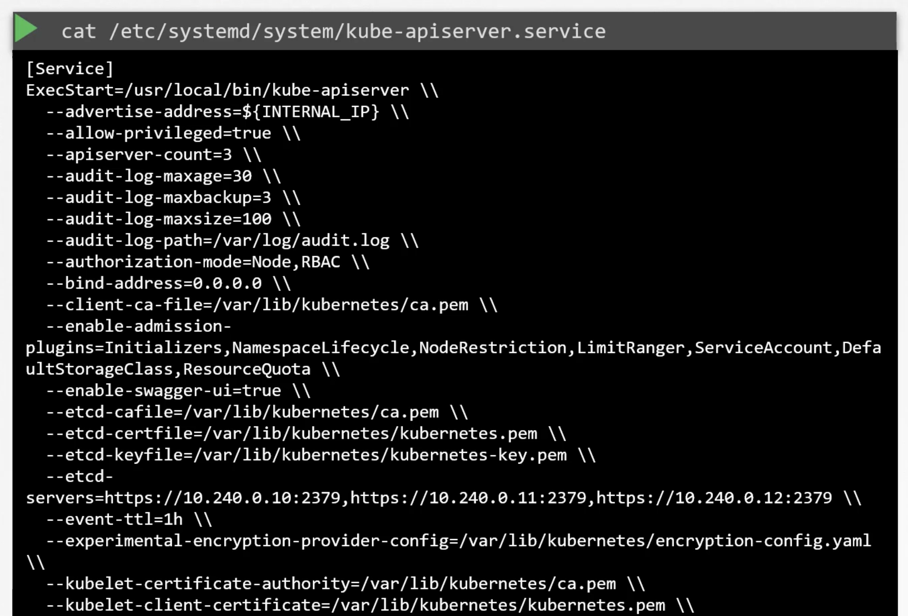
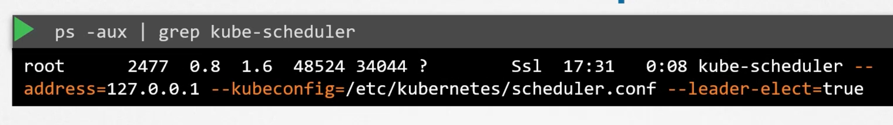
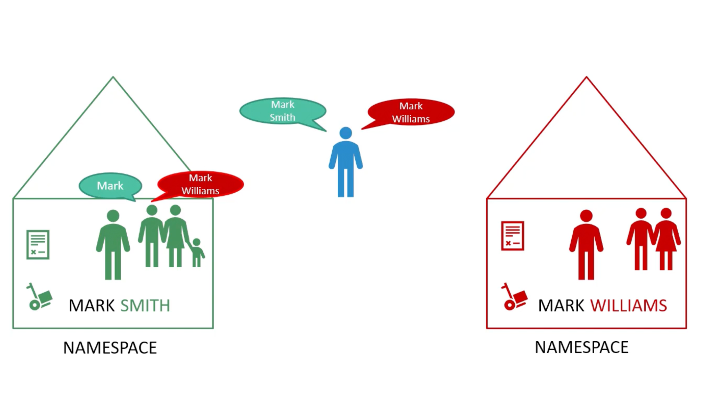

```mdx-code-block
import Tabs from '@theme/Tabs';
import TabItem from '@theme/TabItem';
```

## Docker vs Containerd


:::warning
`dockershim` was removed in Kubernetes `1.24`.
:::


### ctr
`ctr` is a CLI tool for interacting with containerd, the container runtime that powers Docker. It is a standalone tool that does not require Docker or any other container runtime to be installed. Remember not `user-friendly` and only support limited features.

It is solely used to debug containerd. The `nerdctl` project is a more user-friendly and stable user-experience for containerd.

```bash
ctr pull docker.io/library/alpine:latest
ctr run docker.io/library/redis:latest redis
```

### nerdctl
`nerdctl` provide like `docker` CLI experience for containerd. It also support `docker-compose`. It also supports the newest features of containerd:
- Encrypted container images.
- Lazy-pulling.
- P2P image distribution.
- Image signing and verification.
- Namespace in kubernetes.

```bash
nerdctl pull docker.io/library/alpine:latest
nerdctl run redis:alpine --name redis
nerdctl run --name nginx -d -p 8080:80 nginx:alpine
```

### crictl
`crictl` provides a CLI for interacting with CRI-compatible container runtimes. Installed separately. Used to inspect and debug container runtimes, not to create containers ideally. Works accross different container runtimes.

Used to debug container runtimes, not to create containers ideally. 

:::note
`crictl` is build by kubernetes community. While `ctr` and `nerdctl` are build by containerd community and for containerd.
:::

```bash
crictl pull docker.io/library/alpine:latest
crictl images
crictl ps -a
# You can list pods
crictl pods
```

### crictl vs docker


### Important notes

<Tabs>

<TabItem value="Before Kubernetes 1.24">


</TabItem>

<TabItem value="After Kubernetes 1.24">


</TabItem>

</Tabs>

<hr/>


## ETCD
`etcd` is a distributed reliable key-value store that is simple, secure, and fast. 

### Install
```bash
curl -l https://github.com/etcd-io/etcd/releases/download/v3.5.12/etcd-v3.5.12-darwin-amd64.zip
unzip etcd-v3.5.12-darwin-amd64.zip
mv etcd-v3.5.12-darwin-amd64/etcd* /usr/local/bin/
# Start etcd
/usr/local/bin/etcd # starts a service on port 2379
# default client
/usr/local/bin/etcdctl set key1 value1
/usr/local/bin/etcdctl get key1
/usr/local/bin/etcdctl --version
ETCDCTL_API=3 /usr/local/bin/etcdctl version
# Or for the entire session
export ETCDCTL_API=3
/usr/local/bin/etcdctl version
```

### History


### version three
```bash
/usr/local/bin/etcdctl put key1 value1
/usr/local/bin/etcdctl get key1
```

### etcd in Kubernetes
The etcd data store, stores information regarding the cluster. Such as the nodes, pods, configs, secrets, accounts, roles, bindings, etc. 

All the information and changes you make. It is stored in etcd, and once it is updated in the etcd server. Is the change considered to be complete.

:::note
Depending on how you setup your cluster, etcd is deployed differently. Throughout this section we will discuss two types of k8s deployments:
- `kubeadm` - The most common way to deploy a k8s cluster. Also, used in the practice test.
- `From Scratch` - Deploying a k8s cluster from scratch. Later, in the course we will discuss how to deploy a k8s cluster from scratch.
:::

### etcd manual
1. Download binaries.
2. Install and configure etcd as a service in the master node.

:::warning
There are so many options passed to the etcd service. Such as certificates, discussed later in the course. The other is about configuring etcd as a cluster. We will discuss this in the `k8s HA` section.

But, now you need to note the `--advertise-client-urls` this is the address on which the etcd server will listen for client requests. 

This is the url that should be configured in the `kube-apiserver` when it tries to reach the etcd server.


:::

### etcd in kubeadm
Kubeadm will deploy etcd as a pod in the `kube-system` namespace. You can explore the etcd database using the `etcdctl` utility. With in this pod.


### Explore etcd

:::note 
k8s stores data in the specific directory structure. The root directory is the `registry`. And under that you have the various k8s constructs. Such as `pods`, `services`, `configmaps`, `secrets`, `accounts`, `roles`, `bindings`, etc. 


:::


### HA etcd
In a high-availability environment, `you wil have multiple master nodes` in your cluster. And, you will have multiple etcd instances spread across the master nodes.

In that case make sure that the etcd instances know about each other. By, setting the right parameters in the etcd configuration file.


### etcd commands
<details>
<summary>click me</summary>

(Optional) Additional information about ETCDCTL UtilityETCDCTL is the CLI tool used to interact with ETCD.ETCDCTL can interact with ETCD Server using 2 API versions – Version 2 and Version 3. By default it’s set to use Version 2. Each version has different sets of commands.

For example, ETCDCTL version 2 supports the following commands:

```bash
etcdctl backup
etcdctl cluster-health
etcdctl mk
etcdctl mkdir
etcdctl set
```

Whereas the commands are different in version 3

```bash
etcdctl snapshot save
etcdctl endpoint health
etcdctl get
etcdctl put
```

To set the right version of API set the environment variable `ETCDCTL_API` command

`export ETCDCTL_API=3`

When the API version is not set, it is assumed to be set to version 2. And version 3 commands listed above don’t work. When API version is set to version 3, version 2 commands listed above don’t work.

Apart from that, you must also specify the path to certificate files so that ETCDCTL can authenticate to the ETCD API Server. The certificate files are available in the etcd-master at the following path. We discuss more about certificates in the security section. So don’t worry if this looks complex:

```bash
--cacert /etc/kubernetes/pki/etcd/ca.crt
--cert /etc/kubernetes/pki/etcd/server.crt
--key /etc/kubernetes/pki/etcd/server.key
```

So for the commands, I showed in the previous section to get all the keys in the ETCD database, you can run the following command:

```bash
kubectl exec etcd-controlplane -n kube-system -- sh -c "ETCDCTL_API=3 etcdctl get / --prefix --keys-only --limit=10 --cacert /etc/kubernetes/pki/etcd/ca.crt --cert /etc/kubernetes/pki/etcd/server.crt --key /etc/kubernetes/pki/etcd/server.key"
```

Yes, you must specify the ETCDCTL API version and path to certificate files.

</details>


## kube-api server
The primary management component of Kubernetes. When you run a `kubectl` command, the kubectl utility is in fact reaching to the kube-api server. It first authenticate the request and validates it. Then retrieves the data from the etcd cluster. And responds back to the kubectl utility.

You don't really need the kubectl you can invoke the apis directly using post requests.

### Create a pod
The following will create a pod object without assigning it to a node. Updates the information in the etcd server also.
```bash
curl -X POST /api/v1/namespaces/default/pods ...
```

The scheduler continuously watches the api server and realizes that there is a pod that is not assigned to a node. It will identify the right node to assign the pod to. And communicates that back to the api server. And then updates the information in the etcd cluster. The api-server then passes the information to the kubelet in the appropriate worker node.

The kubelet then creates the pod on the worker node and instructs the container runtime engine to deploy the application image. Once done the kubelet updates the status back to the api-server. And the api-server updates the etcd cluster.

A similar pattern is followed each time a change is requested. `The kube-api server is at the center of all the operations in k8s`.

The `kube-api server` is the only component that communicates with the `etcd` cluster directly.

If you bootstrapped the cluster using `kubeadm` tool then you don't need to worry about this. But, if you are deploying the cluster from scratch then the kube-api server is available as a binary in the k8s release page. Download it and configure it to run as a service in the master node.

The kube-api server is run with a lot of parameters. 


The kubernetes architecture consists of a lot of different components, working with each other and talking to each other in many different ways. So, they all need to know where the other components are.

There are different modes of authentication, authorizations, encryption, and security. And that is why we have so many options.

### kube-api server options
- Setup was made with kubeadm


- Setup manually



#### Or view the running process


## Kube Controller Manager
The `kube-controller-manager` manges various controllers in the k8s cluster. A controller is like an office or department within the master ship, that has there own set of responsibilities. Like an office to manage the containers on the ship. So, always watch status and takes action to remediate the situation.

In the k8s terms, a controller is a process that continuously monitors the state of various components in the cluster. And works to bring the current state to the desired state.

### Node controller
`Node controller`, is responsible for monitoring the state of the nodes in the cluster. it does that to the kube-api server. The node controller takes states of the nodes every five seconds. If it stops receiving heartbeats from a node, it marks the node as `Unreachable`. But it waits for 40 seconds before marking it as `Unreachable`. After a node is marked as `Unreachable`, the node controller gives it 5 minutes to come back online. If it doesn't come back online, the node controller removes the pods from the node and provision them on the healthy nodes.


### Replication Controller
The `replication controller` is responsible for monitoring the state of the replica sets in the cluster. And ensuring that the desired number of pods are running at all times. If the pod dies itt creates another one.

### Other controllers
The above were just two examples of controllers, there are many other controllers in the k8s cluster. Note: that whatever concept we have seen such as pods, services, deployments, replica sets, etc. And whatever intelligence is built in these constructs, it is implemented using these controllers. And they are all managed by the controllers. Such as:
- Deployment controller.
- Namespace controller.
- Endpoints controller.
- Service account controller.
- ...etc.

### Find Controllers
How do you see all these controllers? And where are they located in the k8s cluster?
They are all packaged into a single process known as the `kube-controller-manager`. When you install kube-controller-manager, you get all the controllers as well.

### Install kube-controller-manager
1. Download the kube-controller-manager binary from the k8s release page.
2. Extract it and run it as a service in the master node. 
3. You will find a list of options that you can pass to the kube to customize the behavior of the controllers. E.g. `--node-monitor-period`, `--node-monitor-grace-period`, `--pod-eviction-timeout`, etc.
4. Additional option called `--controllers` to specify which controllers to enable. By default, all the controllers are enabled.


<hr/>


### View KCM server options
It depends on how you setup your cluster. 

#### Used kubeadm
If you used `kubeadm` tool. The kubeadm tool deploys the kube-controller-manager as a pod in the `kube-system` namespace. 


You can see the options within the pod manifest file located at `/etc/kubernetes/manifests/kube-controller-manager.yaml`.


#### Non kubeadm setup
You can inspect the options by viewing the `kube-controller-manager.service` file.


You can also see the running process, and the effective options by running:
```bash
ps -aux | grep kube-controller-manager
```


## Kube Scheduler
It is responsible for scheduling pods on the worker nodes. The kube-scheduler is only responsible for which pod goes on which node. It doesn't actually place the pod on the node. That is the job of the kubelet. `The kubelet is the captain of the ship`.


### Why scheduler
When there are many containers and many ships, you need to make sure that the right container ends up on the right ship. 

In k8s, the scheduler decides which nodes pods are placed on. Depending on certain criteria such as:
- pods with different resource requirements. Like nodes in the cluster dedicated to a certain applications.

The scheduler looks at each pod and tries to find the best node for it. The scheduler goes into two phases to identify the best node for the pod.

<details>
<summary>click me</summary>


#### Phase one: Filter Nodes
The scheduler filters out the nodes that don't meet the requirements of the pod. Or the profile of the pod. E.g. The nodes that don't have a sufficient amount of CPU or memory resources required by the pod.

#### Phase two: Rank Nodes
The scheduler ranks the remaining nodes, to identify the best fit for the pod. Uses a priority function to assign a score to the nodes on `a scale from 0 to 10`. E.g. Calculate the amount of resources that will be free after placing the pod on the node. The node with the highest score is selected.

</details>

The above behavior can be customized and write your own scheduler.

You can also research on:
- Resource requirements and limits.
- Taints and tolerations.
- Node affinity and Selector.


### Install kube-scheduler
1. Download the kube-scheduler binary from the k8s release page.
2. Extract it and run it as a service in the master node.


#### kubeadm options for scheduler


#### Manual setup



## Kubelet
The captain of the ship. The kubelet is the primary node agent. It registers the node with the k8s cluster. When it receives instructions to load a container or a pod on the node. It requests the container runtime engine which may be docker to pull the required image. And run an instance. The kubelet then continuous to monitor the status of the pods an d the containers in it and reports back to the kube-api server. On a timely basis.


### Install kubelet
:::warning 
If you used kubeadm tool to bootstrap the cluster, `it doesn't deploy kubelet`. You must always manually install kubelet on the worker nodes.

1. Download the kubelet binary from the k8s release page.
2. Extract it and run it as a service in the worker node.


You can view the running kubelet process and the effective options by running:

:::

## Kube Proxy
Within a kubernetes cluster, every pod can reach any other pod. This is accomplished by deploying a pod networking solution to the cluster.

A `pod-network` is an internal virtual network that spans across all nodes. in the cluster. There are so many solutions available to deploy such a network. In the following case we have a web application deployed on the first node and a database application deployed on the second node. The web application can reach the database simply by using the ip of the database pod. But, there are no guarantees that the ip of the database pod will remain the same. The ip of the database pod can change if the pod is deleted and recreated. Or if the pod is moved to another node.


:::tip
A better way to access the database is using a service.
:::

So we create a service `db` to expose the database across the cluster. The web application can now access the database using the service name `db`. The service also gets an ip-address that is assigned to it.

The service can't join the pod network. Because the service is not an actual thing. It is not a container like pods. It doesn't have any interfaces or an actively listening process. It is just a virtual component that only lives in the k8s memory. But remember that the service is accessible across all the nodes.

That is where kube-proxy comes into play. The `kube-proxy` is the process that runs on each node. Its job is to look for new services and every time a new service is created it creates the appropriate rules on the node to forward traffic to these services to the backend pods. 

One way kube-proxy does this is using `iptables` rules. It creates an iptables rules on each node of the cluster to forward traffic heading to the ip of the service to the ip of the backend pods.


### Install kube-proxy
1. Download the kube-proxy binary from the k8s release page.
2. Extract it and run it as a service in the worker node.


:::note 
The kubeadm tool deploys the kube-proxy as pods in the `kube-system` namespace on each node. Actually, it is deployed as a `daemonset` so that it runs on each node of the cluster. A daemonset is a k8s construct that ensures that a pod runs on each node of the cluster.


:::


## Pods
Containers in a pod by default will have access to the same storage, network, namespace, 
and same fate. They will be created together, scheduled together, and die together. 

```bash
kubectl run nginx --image=nginx
```

::::note
A kubernetes definition file always contain 4 required top level fields.
```yaml
apiVersion:
kind:
metadata:

spec:
```

`apiVersion`: The version of the k8s API that you are using. E.g. `v1`, `apps/v1`. Depending on what we are trying to create we must use the correct version.

`kind`: The kind of the object that you are trying to create. E.g. `Pod`, `Service`, `Deployment`, `ReplicaSet`, etc.

`metadata`: The data about the object like its name, labels, annotations, etc. In a form of a dictionary. Also labels is a dictionary.

`spect`: The specification of the object. Where we provide additional information to kubernetes. `Different for different objects`.

#### Example
```yaml
apiVersion: v1
kind: Pod
metadata:
  name: myapp-pod
  labels:
    app: myapp
    type: front-end
spec:
  containers:
  - name: nginx-container
    image: nginx
```

```bash
kubectl create -f pod-definition.yaml
kubectl get pods
kubectl describe pod myapp-pod
####
kubectl run redis --image=redis123 --dry-run=client -o yaml > redis-definition.yaml
kubectl create -f redis-definition.yaml 
####
kubectl edit pod redis
# or
kubectl apply -f redis-definition.yaml 
####
```

:::tip
Understanding kubectl apply

Declarative Configuration Management: kubectl apply is designed for declarative management of Kubernetes resources. This means you describe the desired state of a resource in a YAML file, and Kubernetes works to reconcile the actual state of the cluster with your declared configuration.
Tracking Changes: To do this effectively, kubectl apply relies on the kubectl.kubernetes.io/last-applied-configuration annotation. This annotation stores a copy of the configuration you last applied to the resource. By comparing this annotation with your current YAML file, kubectl apply can determine the specific changes you intend to make.
Why the Warning Occurs

The warning arises because your redis-definition.yaml file doesn't have the kubectl.kubernetes.io/last-applied-configuration annotation. This likely indicates that the pod was either:

Created Manually: You might have created the pod directly using a command like kubectl run, without going through kubectl create --save-config or kubectl apply.
Created with an Older kubectl Version: Older versions of kubectl may not have automatically added this annotation.
Consequences

While the warning doesn't prevent the creation or update of your Pod, it has implications:

Limited Change Detection: Without the annotation, kubectl apply might have difficulty determining the exact differences between your desired configuration and the existing state of the Pod. This could lead to unexpected behavior if you modify the YAML file later.
Resolving the Warning

Future Updates: For seamless updates in the future, letting kubectl apply add the annotation is fine. It won't affect the current Pod's functionality.
Manual Addition: If you prefer, you can manually add the annotation before your next kubectl apply. Look up the current Pod configuration using kubectl get pod redis -o yaml and copy the relevant sections into your redis-definition.yaml.
Best Practices

Use kubectl create --save-config or kubectl apply Initially: These methods ensure the annotation is included from the start, streamlining future updates.
Declarative Management: Adopt a declarative workflow for managing Kubernetes resources. Using kubectl apply with properly formatted configuration files provides better change tracking and control.
Let me know if you'd like more clarification or examples!
:::

::::


## ReplicaSet
A `ReplicaSet` is a k8s object that ensures that a specified number of pod even if one is running. Also provides load balancing and scaling. 

:::note Replication Controller vs ReplicaSet
Both have the same purpose. But, they are not the same. Replication Controller is the older technology that is being replaced by ReplicaSet. 
:::

```yaml title="replicaset-definition.yaml"
apiVersion: apps/v1
kind: ReplicaSet
metadata:
    name: myapp-replicaset
    labels:
        app: myapp
        type: front-end
spec:
    template:
        metadata:
            name: myapp-pod
            labels: &commonLabels
                app: myapp
                type: front-end
        spec:
            containers:
                - name: nginx-container
                    image: nginx
    replicas: 3
    selector:
        matchLabels: *commonLabels
```

:::warning 
One major difference between a `ReplicaSet` and a `Replication Controller` is the `selector` field. It helps the replicaset identify what pods falls under its control. And it is a `required` field.

Remember that the `ReplicaSet` can managed pods that are not created by it.  
:::

The rule of the replicaset is to monitor the number of pods that are running. If the number of pods is less than the number of pods specified in the `replicas` field. The replicaset will create new pods to match the number of pods specified in the `replicas`  field. It is a process that monitor the pods.

It uses `labels` to filter the pods that it is managing.


### scale a replicaset

1. Update `replicas` field in the replicaset definition file.
2. Apply the changes to the replicaset.

```bash
kubectl replace -f replicaset-definition.yaml
# or and skip the first step
kubectl scale --replicas=6 -f replicaset-definition.yaml
# or and skip the first step
kubectl scale --replicas=6 replicaset myapp-replicaset
```

<Tabs>

<TabItem value="Before">

```yaml
apiVersion: apps/v1
kind: ReplicaSet
metadata:
    name: myapp-replicaset
    labels:
        app: myapp
        type: front-end
spec:
    template:
        metadata:
            name: myapp-pod
            labels: &commonLabels
                app: myapp
                type: front-end
        spec:
            containers:
                - name: nginx-container
                    image: nginx
    replicas: 3
    selector:
        matchLabels: *commonLabels
```

</TabItem>

<TabItem value="After">

```yaml
apiVersion: apps/v1
kind: ReplicaSet
metadata:
    name: myapp-replicaset
    labels:
        app: myapp
        type: front-end
spec:
    template:
        metadata:
            name: myapp-pod
            labels: &commonLabels
                app: myapp
                type: front-end
        spec:
            containers:
                - name: nginx-container
                    image: nginx
    replicas: 6
    selector:
        matchLabels: *commonLabels
```

</TabItem>

</Tabs>

:::tip 
Useful commands
```bash
kubectl api-resources | grep replicaset
kubectl explain replicaset | grep VERSION
```
:::

## Deployment
`Deployment` is a k8s object that manages a `ReplicaSet`. It provides declarative updates to the pods and ReplicaSets. It is a higher level construct that provides a way to update the pods and ReplicaSets. Also, provides a way to rollback to a previous version. And different deployment strategies.


Deployment strategies:
- Recreate.
- Rolling update.
- Blue/Green.
- Canary.

### Example
```yaml
apiVersion: apps/v1
kind: Deployment
metadata:
    name: myapp-deployment
    labels:
        app: myapp
        type: front-end
spec:
    template:
        metadata:
            name: myapp-pod
            labels: &commonLabels
                app: myapp
                type: front-end
        spec:
            containers:
                - name: nginx-container
                    image: nginx
    replicas: 3
    selector:
        matchLabels: *commonLabels
    deploymentStrategy:
        type: Recreate
```


## Exam Tips
As you might have seen already, creating and editing YAML files is a bit difficult, especially in the CLI. During the exam, you might find it difficult to copy and paste YAML files from the browser to the terminal. Using the `kubectl run` command can help in generating a YAML template. And sometimes, you can even get away with just the `kubectl run` command without having to create a YAML file at all. For example, if you were asked to create a pod or deployment with a specific name and image, you can simply run the `kubectl run` command.

Use the below set of commands and try the previous practice tests again, but this time, try to use the below commands instead of YAML files. Try to use these as much as you can going forward in all exercises.

Reference (Bookmark this page for the exam. It will be very handy):

https://kubernetes.io/docs/reference/kubectl/conventions/

```bash
kubectl run nginx --image=nginx
kubectl run nginx --image=nginx --dry-run=client -o yaml

kubectl create deployment --image=nginx nginx
kubectl create deployment --image=nginx nginx --dry-run=client -o yaml

kubectl create deployment --image=nginx nginx --dry-run=client -o yaml > nginx-deployment.yaml
```

Make necessary changes to the file (for example, adding more replicas) and then create the deployment.
```bash
kubectl create -f nginx-deployment.yaml
```

:::tip 
`--dry-run=client` is used to generate the YAML file `without actually creating` the object in the cluster. It is a good way to generate a YAML file quickly.
:::


## Services
Kubernetes `Services` enables communication between various components within and outside of the cluster. k8s services helps us connects applications together with other applications or users.

Services enable loose coupling between microservices in our application. 

External Communication:


### Service Types
- `ClusterIP`: The service creates a virtual IP inside the cluster to enable communication between different services.
- `NodePort`: The service makes an internal pod available on a port on the node. 
- `LoadBalancer`: The service provisions a load balancer for our application in supported cloud providers.

### NodePort
There are three pods involved:
- The port on the pod. Called `TargetPort`. Because that is where the service forwards the traffic to.
- The port on the service itself. Called `Port`. Remember these terms are form the `viewpoint of the service`. The service is in fact like a virtual service inside the node. Inside the cluster it has an IP address and that ip address is called `ClusterIP` of the service.
- Port on the node itself. Called `NodePort`. We use to access the webserver from externally. Note: NodePorts can only be in the range of 30,000-32,767.

```yaml
apiVersion: v1
kind: Service
metadata:
  name: myapp-service
spec:
  type: NodePort
  ports:
  - targetPort: 80   # Assumed to be the same as port if not specified
    port: 80         # The only mandatory field
    nodePort: 30008  # if not specified, k8s will assign a random port in the range of 30,000-32,767
```

:::note 
You can have multiple port mappings in a single service.

```yaml
apiVersion: v1
kind: Service
metadata:
  name: myapp-service
spec:
  type: NodePort
  ports:
  - targetPort: 80
    port: 80
    nodePort: 30008
  - targetPort: 81
    port: 81
    nodePort: 30009
```
:::

We will use labels and selectors to connect the service to the pods. 

```yaml
apiVersion: v1
kind: Service
metadata:
  name: myapp-service
spec:
  type: NodePort
  ports:
  - targetPort: 80
    port: 80
    nodePort: 30008
  selector:
    app: myapp
    type: front-end
```

If more than one pod has the same label, the service will load balance the traffic between the pods. And select them all as endpoints. It uses `Algorithm: Random` with `Session Affinity: Yes` by default.

:::note
Service object spans across all the nodes in the cluster. It is like a virtual service inside the cluster. It has an IP address and that IP address is called `ClusterIP` of the service.

You can assess your application using any node's IP address and the `NodePort` port number.

:::

### ClusterIP
A typical software application usually has different types of pods hosting different parts of the application. E.g. Pods running front-end, another set of pods running back-end services, and a set of pods running a key-value store like redis. 


#### Example

```yaml
apiVersion: v1
kind: Service
metadata:
  name: back-end
spec:
  type: ClusterIP   # default
  ports:
  - targetPort: 80  # The port on the pod
    port: 80        # Where the service is exposed
  selector:
    app: myapp
    type: back-end
```


### LoadBalancer
Let's turn our focus on the front-end or edge services. The front-end services are the ones that are exposed to the outside world. They are the ones that are accessed by the users.

#### Example Voting App
Question is which IP address you will give to your users.

:::danger
Note that even if your pods are only hosted on two of the nodes. They will still be accessible from all the ips of all the nodes in the cluster. 
:::


We want a single IP address. One way is to create a new VM for load balancing. 

```yaml
apiVersion: v1
kind: Service
metadata:
  name: front-end-service
spec:
  type: LoadBalancer
  ports:
  - targetPort: 80
    port: 80
    nodePort: 30008
  selector:
    app: myapp
    type: front-end
```

## Namespaces



### Default Namespaces


### Use cases
Use same cluster for `Dev`, `Test`, `Prod` Environments. But at the very same time isolate the resources between them.


Each of these namespaces can have its own set of policies. That define who can do what. You can also assign quota of resources to each namespace. 

### DNS
You must append the name of the namespace to the name of the service. E.g. For the web pod in the default namespace to connect to the database in the dev namespace. Use `<service-name>.namespace.svc.cluster.local` format.


You are able to do so because when a service is created a DNS entry is added automatically.in this format. Looking closely at the DNS name of the service. 

The last part `cluster.local` is the default domain name of the k8s cluster. `svc` is the default subdomain for services. And `namespace` is the name of the namespace in which the service is created. And then the name of the service itself.


### Operational Aspects
```bash
kubectl get namespaces
kubectl get pods --namespace=kube-system
```

You can run `kubectl create -f pod-definition.yaml --namespace=dev` to create a pod in the `dev` namespace. Or:

```yaml title="pod-definition.yaml"
apiVersion: v1
kind: Pod
metadata:
  name: myapp-pod
  namespace: dev
spec:
  containers:
  - name: nginx-container
    image: nginx
```

### Craete NS
You have two options `kubectl create namespace dev` or `kubectl create -f namespace-definition.yaml`.

```yaml title="namespace-definition.yaml"
apiVersion: v1
kind: Namespace
metadata:
  name: dev
```

### Context
Contexts are a used to manage multiple clusters and multiple environments from the same management system.

You can switch between namespaces using:
```bash
kubectl config set-context $(kubectl config current-context) --namespace=dev
```


<hr/>


### Resource Quota
Used to limit the amount of resources that can be used in a namespace. 

```yaml title="resource-quota.yaml"
apiVersion: v1
kind: ResourceQuota
metadata:
  name: compute-quota
  namespace: dev
spec:
  hard:
    pods: "10"
    requests.cpu: "4"
    requests.memory: 5Gi
    limits.cpu: "10"
    limits.memory: 10Gi
```

```bash
kubectl create -f resource-quota.yaml
```

## Imperative vs Declarative


<hr/>


#### In k8s


### Imperative Commands
These commands helps in quickly creating or modifying resources. As we don't have to deal with yaml files. Helpful in certification exams. However, they are limited in functionality. And will require forming long and complex commands. Such as for creating a multi-container pod or deployment.

Secondly, These commands are run once and forgotten. They are only available in the session history of the user who ran them. Hard to keep track of.


Creating object definition files or configuration files or manifests files. Can help us write down exactly what we need.


What id you run `craete` command if the object already exists? It will fail. With an error that the pod already exists. Also, when we are updating an object we have to make sure the object is created first before running `replace` command. If an object doesn't exist the replace command will fail.


### Declarative Commands


### Exam Tips
Use imperative commands for quick tasks to save time as much as possible. 


<details>
<summary>click me</summary>

While you would be working mostly the declarative way – using definition files, imperative commands can help in getting one-time tasks done quickly, as well as generate a definition template easily. This would help save a considerable amount of time during your exams.

Before we begin, familiarize yourself with the two options that can come in handy while working with the below commands:

`--dry-run`: By default as soon as the command is run, the resource will be created. If you simply want to test your command, use the `--dry-run=client` option. This will not create the resource; instead, it tells you whether the resource can be created and if your command is right.

`-o yaml`: This will output the resource definition in YAML format on the screen.

Use the above two in combination to generate a resource definition file quickly that you can then modify and create resources as required instead of creating the files from scratch.

#### POD
**Create an NGINX Pod**
```bash
kubectl run nginx --image=nginx
```

**Generate POD Manifest YAML file (-o yaml). Don’t create it(–dry-run)**
```bash
kubectl run nginx --image=nginx --dry-run=client -o yaml
```

#### Deployment
**Create a deployment**
```bash
kubectl create deployment --image=nginx nginx
```
**Generate Deployment YAML file (-o yaml). Don’t create it(–dry-run)**
```bash
kubectl create deployment --image=nginx nginx --dry-run=client -o yaml
```
**Generate Deployment with 4 Replicas**
```bash
kubectl create deployment nginx --image=nginx --replicas=4
```

You can also scale a deployment using the `kubectl scale` command.
```bash
kubectl scale deployment nginx--replicas=4
```

Another way to do this is to save the YAML definition to a file and modify
```bash
kubectl create deployment nginx --image=nginx --dry-run=client -o yaml > nginx-deployment.yaml
```

You can then update the YAML file with the replicas or any other field before creating the deployment.

#### Service
**Create a Service named redis-service of type ClusterIP to expose pod redis on port 6379**
```bash
kubectl expose pod redis --port=6379 --name redis-service --dry-run=client -o yaml
```
(This will automatically use the pod’s labels as selectors)

Or

```bash
kubectl create service clusterip redis --tcp=6379:6379 --dry-run=client -o yaml 
```
(This will not use the pods labels as selectors, instead, it will assume selectors as app=redis.

[You cannot pass in selectors as an option](https://github.com/kubernetes/kubernetes/issues/46191).

So, it does not work very well if your pod has a different label set. So, generate the file and modify the selectors before creating the service)

Create a Service named nginx of type NodePort to expose pod nginx’s port 80 on port 30080 on the nodes:
```bash
kubectl expose pod nginx --type=NodePort --port=80 --name=nginx-service --dry-run=client -o yaml
```
(This will automatically use the pod’s labels as selectors, [but you cannot specify the node port](https://github.com/kubernetes/kubernetes/issues/25478). You have to generate a definition file and then add the node port manually before creating the service with the pod.)

Or

```bash
kubectl create service nodeport nginx --tcp=80:80 --node-port=30080 --dry-run=client -o yaml
```
(This will not use the pod labels as selectors.)

Both the above commands have their own challenges. While one of them cannot accept a selector, the other cannot accept a node port. I would recommend going with the `kubectl expose` command. If you need to specify a node port, generate a definition file using the same command and manually input the nodeport before creating the service.

#### Reference:
- https://kubernetes.io/docs/reference/generated/kubectl/kubectl-commands
- https://kubernetes.io/docs/reference/kubectl/conventions/

</details>

### kubectl apply
All the three are compared to identify the differences between them. 


#### Declarative Config


:::note
The `last applied configuration` is stored in the live k8s object configuration as an annotation. It is in json format. And used by the `kubectl apply` command to determine the changes that need to be made to the object.

```yaml
metadata:
 name: myapp-pod
  annotations:
    kubectl.kubernetes.io/last-applied-configuration: |
      {
        "apiVersion": "v1",
        "kind": "Pod",
        "metadata": {
          "name": "myapp-pod",
          "labels": {
            "app": "myapp",
            "type": "front-end"
          }
        },
        "spec": {
          "containers": [
            {
              "name": "nginx-container",
              "image": "nginx"
            }
          ]
        }
      }
```
:::


:::danger
The above is only done when you run `apply` command.  The `create` or `replace` commands do not store the last applied configuration. 

You must bare in mind not to mix the imperative and declarative approaches while managing the kubernetes objects.

Once you use the apply command, going forward whenever a change is made. The apply command compares all three sections:
- The `live` configuration.
- The `last` applied configuration. `Stored within the live configuration as an annotation`.
- The `local` configuration file

For deciding what changes need to be made to the live configuration.
:::


