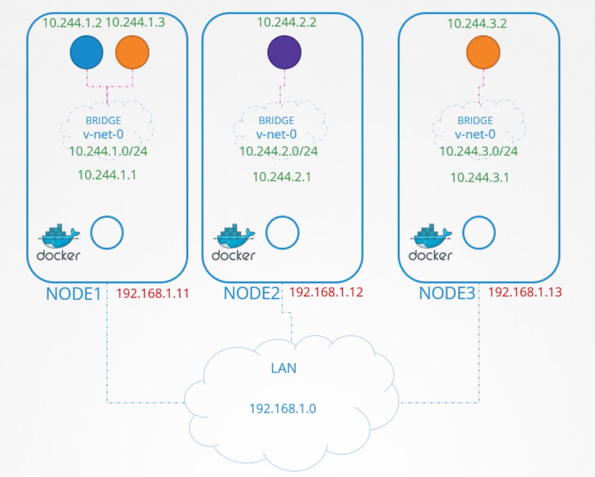

```mdx-code-block
import Tabs from '@theme/Tabs';
import TabItem from '@theme/TabItem';
```

In this section, we will discuss the networking concepts in Kubernetes. Some networking basics are required, such as IP addressing, routing, and DNS. 

We will start with the cluster networking needs, and then pod networking concepts. We will look at CNI in kubernetes, how cni can solve pod networking challenges, cluster DNS, how kubernetes implements dns internally. We then finish with ingress networking. 

## Linux Networking Basics
We have to hosts `A` and `B` connected to a switch. Host `A` has an interface `eth0`, and host `B` has an interface `eth0`. To connect them to a switch we need an interface on each host. `ip link` wether virtual or physical depending on the host.

Let us assume that the network the switch created is `192.168.1.0`. We then assign the hosts with ip addresses on the same network.
- `Host A`: `ip addr add 192.168.1.10/24 dev eth0`.
- `Host B`: `ip addr add 192.168.1.11/24 dev eth0`.

The two hosts can communicate now with each other through the switch. The switch can only enable communication within the network. 

We have another network containing hosts `C` and `D`. With `192.168.2.0` network. 
- `Host C`: `ip addr add 192.168.2.10/24 dev eth0`.
- `Host D`: `ip addr add 192.168.2.11/24 dev eth0`.

**How can B communicate with C?** That is where routers comes in. Just a server with many network interfaces/ports. The router gets two ips assigned. One on each network. 
- `Router-One`: 192.168.1.1
- `Router-Two`: 192.168.2.1

When system B tries to send a packet to system C, it sends it to the router. But how it will find the router?! That is when a Gateway comes in. The gateway is door to the room we are in. 

:::note
To see the existing routes on a linux system, we can use the `route` command. It displays the `kernel routing table`.
:::

You can see that there are no routing configurations as of now. So, in this condition system B will not be able to communicate with system C. Can only communicate with the systems in the same network.

To enable communication between the two networks, we need to add a route to the routing table. Run `ip route add 192.168.2.0/24 via 192.168.1.1`. This command tells the system to send all the packets destined to `192.168.2.0/24` network to the router on `192.168.1.1`.

This has to be configured on all the systems/hosts in the network. So host C to send a packet to host B. We will run `ip route add 192.168.1.0/24 via 192.168.2.1`.

Suppose these systems needs access to the internet. As there are so many networks, you can run `ip route add default via 192.168.2.1` on host C,D and `ip route add default via 192.168.1.1` on host A,B.

So in a single setup like this all what you need is a single routing table entry with the default gateway set to the router ip address.

:::note
A `0.0.0.0` entry in the gateway field, indicates that you don't need a gateway. For `192.168.2.0/24` network, the gateway is `0.0.0.0`.
:::

But say you have multiple routers in your network. One for the internet and another for the internal private network. Then you will have two separate entries for each network. One entry for the internal private network and another entry for the internet.

```bash title="Network Two: Host C,D"
ip route add 192.168.1.0/24 via 192.168.2.2
ip route add default via 192.168.2.1
```

## Router Setup
We have three hosts: A, B, and C. 

Host A, B are connected with network `192.168.1.0`. Host A is connected through a network interface `eth0` with ip address `192.168.1.5`. Host B is connected through a network interface `eth0` with ip address `192.168.1.6`.

Host C,D are connected with network `192.168.2.0`. Host B is connected through a network interface `eth1` to this network with ip address `192.168.2.6`. Host C is connected through a network interface `eth0` with ip address `192.168.2.5`.

**How do we get A to talk to C?!** If you `ping 192.168.2.5`, it will respond with `Connect: Network is unreachable`. Add: `ip route add 192.168.2.0/24 via 192.168.1.6` on host A.

Host C will need to send back responses to host A. So, run `ip route add 192.168.1.0/24 via 192.168.2.6` on host C.

We then need to allow host B to forward packets from one network interface to another. Wether a host can forward packets or not is controlled by the `sysctl` parameter `net.ipv4.ip_forward`. You can find it `cat /proc/sys/net/ipv4/ip_forward`. If it is `0`, it means the host cannot forward packets. If it is `1`, it means the host can forward packets.

Set `echo 1 > /proc/sys/net/ipv4/ip_forward` to enable packet forwarding. This is not persistent. To make it persistent, add `net.ipv4.ip_forward = 1` to `/etc/sysctl.conf`.

#### Take away
- `ip link`: List and modify network interfaces on the host.
- `ip addr`: To see ip addresses assigned to the interfaces.
- `ip addr add <ip>/<subnet> dev <interface>`: Assign an ip address to an interface. Changes made to this command are only valid till a restart. To make it persistent,set them in `/etc/network/interfaces` file.
- `ip route` or `route`: To see the routing table.
- `ip route add <network> via <gateway>`: Used to add route entry to route table.
- `cat /proc/sys/net/ipv4/ip_forward`: Check if the host can forward packets.


## DNS Configuration
In a network `192.168.1.0` we have two hosts A connected through `eth0` with ip address `192.168.1.10` and B connected through `eth0` with ip address `192.168.1.11`.

Host B is a DB server. Host A wants to `ping db`. 

**How does it know where `db` is?!** 

You can do this by adding an entry in the `/etc/hosts` file.

```bash
cat >> /etc/hosts <<EOF
192.168.1.11 db
EOF
```

Now, when you `ping db`, it will resolve to `192.168.1.11`. Whatever we put in the `/etc/hosts` file is the source of truth for host A. But that may not be true. Host A does not check if the ip address is correct or not.

Running `hostname` on host B will give you `host-2`. But host A does not care.

WHat happened above is known as **Name Resolution**. Within a small network of few systems. We can easily get away with entries in the `/etc/hosts` file. If one of the servers ip changed you need to modify it in all other servers. 

That is when it was decided to move all these entries into a single server. WHo would manage them centrally. We call that our DNS server. Then point all the hosts to the DNS server.

Our DNS server has the ip address `192.168.1.100`. Every host has a DNS resolution configuration file. In linux, it is `/etc/resolv.conf`. `cat /etc/resolv.conf` will show you the DNS server ip address.

The priority is `/etc/hosts` then the DNS server. But you can change the order. The order is defined inside `/etc/nsswitch.conf` file. `hosts: files dns` means first check the `/etc/hosts` file then the DNS server.

```bash
cat >> /etc/resolv.conf
nameserver 192.168.1.100
nameserver 8.8.8.8
```

#### Search
You can also add a search domain. If you `ping db`, it will first try `db` then `db.<search domain>`. 

```bash title="resolv.conf"
cat >> /etc/resolv.conf
nameserver 192.168.1.100
search mycompany.com prod.mycompany.com
```

#### Record Types
- `A Record`: Maps a hostname to an ip4 address.
- `AAAA Record`: Maps a hostname to an ipv6 address.
- `CNAME Record`: Maps a hostname to another hostname.


#### nslookup
`nslookup` is a command line tool to query DNS servers. But it will not consider entries in the `/etc/hosts` file.

#### dig
`dig` is another command line tool to query DNS servers. It is more powerful than `nslookup`. It returns more details in a simple form as they are stored in the server. 

```bash
dig db
```

## CoreDNS
From what is above we learned that: we need a DNS server to mange name resolution in large environments with many hostnames and ip addresses. 

We are given a server dedicated as the DNS server and a set of IPs to configure as entries in the server. There are many DNS server solutions out there; in this section, we will focus on a particular one – `CoreDNS`.

So, how do you get core DNS? CoreDNS binaries can be downloaded from their Github releases page or as a docker image. Let’s go the traditional route. Download the binary using curl or wget. And extract it. You get the coredns executable.

```bash title="CoreDNS Installation"
wget https://github.com/coredns/coredns/releases/download/v1.11.1/coredns_1.11.1_linux_amd64.tgz
tar -xzvf coredns_1.11.1_linux_amd64.tgz
./coredns
```

Run the executable to start a DNS server. It, by default, listens on port `53`, which is the default port for a DNS server.

Now, we haven’t specified the IP to hostname mappings. For that, you need to provide some configurations. There are multiple ways to do that. We will look at one.

First, we put all of the entries into the DNS servers `/etc/hosts` file. Then, we configure CoreDNS to use that file. CoreDNS loads its configuration from a file named `Corefile`.

Here is a simple configuration that instructs CoreDNS to fetch the IP to hostname mappings from the file `/etc/hosts`. When the DNS server is run, it now picks the IPs and names from the `/etc/hosts` file on the server.

```bash
cat > Corefile <<EOF
192.168.1.10 web
192.168.1.11 db
192.168.1.12 nfs
EOF

cat > Corefile <<EOF
. {
    file /etc/hosts
}
EOF

./coredns
```

CoreDNS also supports other ways of configuring DNS entries through plugins. We will look at the plugin that it uses for Kubernetes in a later section.

### Extra Material
- [Kubernetes DNS-Based Service Discovery.](https://github.com/kubernetes/dns/blob/master/docs/specification.md)
- [kubernetes.](https://coredns.io/plugins/kubernetes/)


## Network Namespaces
In this section we get introduced to network namespaces in linux. E.g. They are used in containers to implement `network isolation`. We will start with a simple host. 

**What are namespaces?!**

If your host was your house then namespaces are like rooms in your house. The room helps in providing privacy for each child. Each child can only see what is in their own room. As far as they are concerned, they are the only ones in the house. But you as a parent can see all the rooms. As well as other areas in the house. 

If you wish you can establish connectivity between two rooms. 

When it comes to networking, our host has its own interfaces that connect to the local area network. E.g. LAN: `192.168.1.0`, interfaces: `eth0` to that LAN with ip address `192.168.1.2`. Our host has its own routing and ARP tables. The container can has its own network interfaces e.g. `veth0`, routing and ARP tables.


To create a new network namespace in a linux host, `ip netns add <namespace-name>`. And to list the network namespaces, `ip netns list`.

To list interfaces on my host `ip link`. To view the same within a network namespace, `ip netns exec <namespace-name> ip link`. Or `ip -n <namespace-name> link`.

The same is true with the arp table. Run `arp` on host. And `ip netns exec <namespace-name> arp` within a network namespace. Same for routing tables `route` and `ip netns exec <namespace-name> route`.

As of now these network namespaces are isolated, no network connectivity. They have no interfaces of their own and they can not see the underlying host interfaces.

First connectivity between namespaces. We will use a virtual pipe. `ip link add veth-red type veth peer name veth-blue`. This creates a pair of virtual interfaces. One end is `veth-red` and the other is `veth-blue`. Attach `ip link set veth-red netns red` and `ip link set veth-blue netns blue` to the respective network namespaces.

`ip -n red addr add 192.168.15.1 dev veth-red` and `ip -n blue addr add 192.168.15.2 dev veth-blue`.

Then enable the interfaces `ip -n red link set veth-red up` and `ip -n blue link set veth-blue up`.

Verify connectivity by pinging `ip netns exec red ping 192.168.15.2` and `ip netns exec red arp`.

In that case where you have multiple namespaces and you want to connect them all. The solution is to have a virtual switch. **But how to create a virtual switch?** There are multiple ways to do that. One way is the native linux bridge. Or Open vSwitch.

We will discuss the `linux bridge`. To create an internal bridge network. We add a new interface to the host using `ip link add v-net0-0 type bridge`. As far as the host is concerned, this is just a new interface. Just like the `eth0` it appears in the `ip link` output.

Use the `ip link set v-net0-0 up` to enable the interface. For namespaces this interface is like a switch. That it can connect to. 

```bash
# Create namespaces
ip netns add red
ip netns add blue
# Create a bridge
ip -n red link del veth-red # The other end of the veth pair, is deleted automatically.
# Create new cables to connect the namespaces to the bridge.
ip link add veth-red type veth peer name veth-red-br
ip link add veth-blue type veth peer name veth-blue-br
# Now we have cables ready, let's connect them to the bridge.
ip link set veth-red netns red
ip link set veth-red-br master v-net-0
ip link set veth-blue netns blue
ip link set veth-blue-br master v-net-0
# Assign ip addresses to the interfaces in the namespaces.
ip -n red addr add 192.168.15.1 dev veth-red
ip -n red addr add 192.168.15.2 dev veth-blue
# Enable the interfaces in the namespaces.
ip -n red link set veth-red up
ip -n blue link set veth-blue up
#### Repeat the above for extra two namespaces: Yellow '192.168.15.3' and Black'192.168.15.4'.
```

We assigned our host the ip `192.168.1.2` to the host network. You can not reach any one of these interfaces from the host. 

Run the `ip addr add 192.168.15.5/24 dev v-net-0` to assign an ip address to the bridge. Now you can reach all the interfaces from the host. Now you can `ping 192.168.15.1` from the host.

Remember this entire network iss still private and restricted to the host. From within the namespaces you can not reach the outside world.

```bash
ip netns exec blue ping 192.168.1.3
ip netns exec blue route
ip netns exec blue ip route add 192.168.1.0/24 via 192.168.15.5
# Add NAT to the host
iptables -t nat -A POSTROUTING -s 192.168.15.0/24 -j MASQUERADE # MASQUERADE eq replace
# now pings will run
ip netns exec blue ping 192.168.1.3
# but 
ip netns exec blue ping 8.8.8.8
ip netns exec blue route 
ip netns exec blue ip route add default via 192.168.15.5
# Add Port Forwarding
iptables -t nat -A PREROUTING --dport 80 --to-destination 192.168.15.2:80 -j DNAT
```

:::warning
While testing the Network Namespaces, if you come across issues where you can't ping one namespace from the other, make sure you set the NETMASK while setting IP Address. ie: `192.168.1.10/24`

`ip -n red addr add 192.168.1.10/24 dev veth-red` Another thing to check is FirewallD/IP Table rules. Either add rules to IP Tables to allow traffic from one namespace to another. Or disable IP Tables all together (Only in a learning environment).
:::


## Docker Networking
Let us start with a single docker host on `192.168.1.10`. A server with docker engine installed on it. It has an ethernet interface `eth0` that connects to the LAN. When you run a container you have different networking options to choose from.

- `--network none`: No networking. The container will not have any network interfaces.
- `--network host`: The container will share the host network. The container will have the same ip address as the host. No isolation between the host and the container. E.g. if you deploy a web server listening on port 80 on the container. You can access it directly from LAN at `http://192.168.1.10:80`. If you tried to run another instance of the same container on the same host, you will get a port conflict.
- `--network bridge`: An internal private network is created which docker host and container attach to. The network has an address `172.17.0.0` by default. and each device get their own internal private network address on this network. 

**How does Docker create and manages this bridge network?!**

When docker is installed on the host it creates an `internal private network` called `bridge` by default. See it by `docker network ls`. Docker calls the network `bridge` but on the host it is called `docker0`. 

> Run `ip link` to see the network interfaces on the host.

Docker internally uses a technique similar to what we saw in the video on namespaces by running the `ip link add docker0 type bridge` command. 

> The bridge network is like an `interface` to the **host**, but a `switch` to the **namespaces** or containers within the host. So, the interface `docker0` on the host is assigned ip address `172.17.0.1` you can see it through `ip addr show docker0`.

Whenever a container is created docker creates a network namespace for it. Run `ip netns` command to list the namespaces. Note that there are a minor hack to get the ip nets to list namespaces created by docker. Check out the resources section. 

You can see the namespace associated with each container in the output of the `docker inspect` command.

**How does docker attach the container or its network to the bridge namespace?!** 

It creates a pair of virtual interfaces or a virtual-cable. Run `ip link` on docker host, you will see one end of the interface which is attached to the local bridge docker0. If you run the same command again with `ip -n <namespace-id> link` you will see the other end of the interface attached to the container namespace. The interface also gets an ip assigned within the network. You can view this by running `ip -n <namespace-id> addr` but within the container namespace. The container is assigned `172.17.0.3/16` ip address.

The above same procedure is followed for each container created.
1. Docker creates a namespace for the container.
2. Creates a pair of virtual interfaces.
3. Attaches one end to the container namespace.
4. Attaches the other end to the bridge network.

The interface pairs can be identified using their numbers. Odd and Even form a pair. 9 and 10, 7 and 8, 11 and 12. 


The containers are all part of the network now and they can all communicate with each other. 

**What about port mappings?!**

The container we created is an nginx so it serves applications on port 80. Since our container is within a `private network` inside the host. Only other containers in the same network or the host itself can access this web page. 

- Host is at: `192.168.1.10` inside the `192.168.1.0` network. And at `172.17.0.1` inside the `172.17.0.0` network.
- Container is at: `172.17.0.3` inside the `172.17.0.0` network.

```bash
# from host it works
curl http://172.17.0.3
```

Sure if you tried to do this outside the host you can not reach the container. To allow external users to access the container, you need to map the port. DOcker provide a port publish or port map option. 

When you run containers tell docker to map port 8080 on the docker host to port 80 on the container. With that done you can access the container using the ip of the docker host at port 8080 `curl http://192.168.1.10:8080` will be forwarded to the container at `172.17.0.3:80`.

**How does docker do this port mapping?!**

Create a nat rule for that using iptables to create an entry in the nat table to append the rules to the `PREROUTING` chain. 

```bash
# On the pre-requisite we have done something similar between two ports
iptables -t nat -A PREROUTING -j DNAT -dport 8080 --to-destination 80
# Docker does something similar, docker adds the rule to the DOCKER chain and sets destination to the container ip address.
iptables -t nat -A DOCKER -j DNAT -dport 8080 --to-destination 172.17.0.3:80
```

You can see the rule docker created by listing the rules in iptables. `iptables -nvL -t nat`. 


## Container Network Interfaces - CNI
We saw how network namespaces work.

1. Create an isolated network namespace.
2. How to create multiple network namespaces through a bridge network/interface.
3. How to create Virtual Cables or pipes, VETH pairs. With virtual interfaces on each end.
4. How to attach vEth "one end" to a namespace.
5. Attach other vEth "other end" to a bridge network.
6. Assign Ip addresses to the interfaces.
7. Enable the interfaces "bring them up".
8. ENable NAT or IP Masquerade "For external connectivity".

We then saw how docker did it for its bridge networking option. It was pretty much the same as what we did manually. Except that it uses different naming patterns. Other container solutions solve the same challenges in kind of the same way e.g. rkt, mesos, or any other solution that work with container and requires to configure networking between them. E.g. **_Kubernetes_**.


We are **_ALL_** trying to solve the very same networking challenges. By, researching and finally identifying a similar approach with our own little minor differences **why code and develop the same solution multiple times?! Why just create a single standard approach that everyone cam follow?!**

So we take all these ideas from the different solutions and move all the networking portions of it into a single program. And since it is for the bridge network we call it `bridge`. So we created a script that performs all the required tasks to get the container attached to the bridge network.

E.g. run the program and specify that you want to add this container to a particular namespace. `bridge add <container-id> /var/run/netns/<namespace-name>`. The bridge program takes care of the rest so the container runtime environment are relieved of those tasks.

E.g. whenever rkt or kubernetes creates a new container, they call the bridge program and pass the container id and the namespace to get networking configured for that container. `bridge add <container-id> /var/run/netns/<namespace-name>`.

**Can we create such a program ourselves?!** 

If you were doing so, what arguments and commands should it support?!, how do you make sure the program you create will work with all the container solutions out there?!, How do you know containers runtimes like kubernetes or rkt will evoke your program correctly?

That is where we need some standardization defined. How a container runtime will invoke, so that everyone can adhere to a single set of standards and develop solutions that work across runtimes.

The CNI is a standard that defines how container runtimes should invoke the network configuration program. It defines the arguments that the program should support. It defines the environment variables that the program should expect. It defines the return values that the program should provide. Simply, to solve container networking challenges in a container runtime environment. `They are referred to as plugins`.

The bridge program we referred to earlier is a CNI plugin. CNI comes with a list of supported plugins already. Such as `bridge`, `VLAN`, `IPVLAN`, `MACVLAN`, `WINDOWS`. As well as IPAM plugins such as `DHCP` and `HOST-LOCAL`. There are other plugins available  from third party organizations as well some examples are `weave works`, `flannel`, `cilium`, `vmware NSX`, `calico`, `infoBlox`, ...etc.

All of these container runtimes solutions implement CNI standards. So, any of them can work with any of these plugins. But there is one that is not on this list `Docker`. Docker does not implement CNI. it has its own set of standards known as `CNM` or `Container Network Model`. Which is another standard that aims at solving the same challenges as CNI but with some minor differences. Due to the differences, these plugins do not natively integrate with docker. You have to work around it. 

```bash
# Can not 
docker run --network cni-bridge nginx
# But you can, and that is pretty much how kubernetes does this
docker run --network none nginx
bridge add <container-id> /var/run/netns/<namespace-name>
```

WHen kubernetes create docker containers, it creates them on the none network. It then invokes the configured CNI plugin to take care of the rest of the networking configuration.

## Cluster Networking
In this section we discuss the networking configuration required on the master and worker nodes in a kubernetes cluster.

The kubernetes cluster consists of a master node and multiple worker nodes. 
1. Each node must have at least one network interface connected to a network say `192.168.1.0`.
    - M1: has `etho` to network `192.168.1.0`.
    - W1: has `eth0` to network `192.168.1.0`.
    - W2: has `eth0` to network `192.168.1.0`.
2. Each interface must have an ip address configured: 
    - M1: `192.168.1.10`.
    - W1 `192.168.1.11`. 
    - W2 `192.168.1.12`. 
3. The hosts must have a unique hostname set e.g.:
    - M1 `master-01`.
    - W1 `worker-01`.
    - W2 `worker-02`.
4. As well as a unique MAC address.
    - M1 `02:42:75:98:18:4a`.
    - W1 `02:42:ac:11:00:11`.
    - W2 `02:42:ac:11:00:1c`.
> You should note this especially, if you created the VMs by cloning from existing ones.
5. There are some ports that need to be opened as they are used by the various components in the control plane. 
    - `Master`: Should accept connections at `6443` for the API server, the worker nodes, kubectl tool, external users, and all other control plane components access the Kube-apiserver by this port. The kubelet on the master and worker nodes listen on `10250` and yes the kubelet can be present on the master node as well. The kube-scheduler requires `10259` and the kube-controller-manager requires `10257`. Finally, The etcd listens on `2379`.
    - `Worker`: The worker nodes exposes services for external access on ports `30,000-32,767`.
    - If you have **multiple masters**, All these ports needs to be opened on all the master nodes. And you need an additional port `2380` for the etcd clients so that they can communicate with each other.

The list of ports to be open are available in the official kubernetes documentation [here](https://kubernetes.io/docs/reference/networking/ports-and-protocols/).

## Ref


## Notes and Tips

**An important tip about deploying Network Addons in a Kubernetes cluster.**

In the upcoming labs, we will work with Network Addons. This includes installing a network plugin in the cluster. While we have used weave-net as an example, please bear in mind that you can use any of the plugins which are described here:

- https://kubernetes.io/docs/concepts/cluster-administration/addons/
- https://kubernetes.io/docs/concepts/cluster-administration/networking/#how-to-implement-the-kubernetes-networking-model

In the CKA exam, for a question that requires you to deploy a network addon, unless specifically directed, you may use any of the solutions described in the link above.

_**However**_, the documentation currently does not contain a direct reference to the exact command to be used to deploy a third-party network addon.

The links above redirect to third-party/ vendor sites or GitHub repositories, which cannot be used in the exam. This has been intentionally done to keep the content in the Kubernetes documentation `vendor-neutral`.

`Note:` In the official exam, all essential CNI deployment details will be provided

## Practice Test - Explore Environment
```bash
# Get internal ip address of control plane node
kubectl get nodes -o wide
# What is the network interface configured for cluster connectivity on the controlplane node? ... The internal ip `192.23.97.3` is used for node to node communication.
# ---> Next, find the network interface to which this IP is assigned by making use of the ip a command:
ip a | grep -B2 192.23.97.3
# to get MAX address run ip link show <interface>
ip link show eth0

# To get the MAC address of the interface on worker node
ssh node01
ip a | grep -B2 192.27.63.12
ip link show eth0

# To get the interface/bridge created by containerd on a host
ip address show type bridge

# To get the ip address of the default gateway
# Or if you were to ping google from controlplane node, which route does it take.
ip route

# What is the port that kube-scheduler is listening on?
ps -aux | grep kube-scheduler
# Or better
netstat -npl | grep -i kube-scheduler

# Count number of connections each port have
# Remove listening flag
netstat -anp | grep etcd | grep 2380 | wc -l 
netstat -anp | grep etcd | grep 2379 | wc -l
# That's because `2379` is the port of ETCD to which all control plane components connect to. `2380` is only for etcd peer-to-peer connectivity. When you have multiple controlplane nodes. In this case we don't.
```


:::tip netstat Command
Short for `Network Statistics`, the `netstat` command is used to display the current network connections and port activity on a system. 

`netstat` can be combined with subcommands or switches to alter the output. E.g.:
- `netstat -n`: Do not resolve number to names.
- `netstat -a`: Display active connections _**AND**_ which tcp or UDP ports are listening for connections. "0.0.0.0" or "[::]" it is listening on all interfaces not a single ip address.
- `netstat -p`: Display which program is used to make the connection.
- `netstat -f`: Display fully qualified domain names in the foreign address column.
:::


## Pod Networking
In this section we discuss the networking at the Pod layer. Kubernetes Pod Networking requirements: 
1. Every Pod should have an IP address.
2. Every Pod should be able to communicate with every other Pod in the same node.
3. Every Pod should be able to communicate with every other Pod on other nodes without **_NAT_**.


**Let us implement if ourselves first:**

We have a three node cluster, it doesn't matter wether it is a master or a worker node. They all run Pods either for management or workload purposes. As far as networking concern we gonna consider all of them as the same. Planning:
1. The nodes are parts of an external network and has ip addresses:
    - Network is `192.168.1.0`.
    - `Node One`: `192.168.1.11`.
    - `Node Two`: `192.168.1.12`.
    - `Node Three`: `192.168.1.13`.
2. When containers are created, k8s `create network namespaces` for them. To enable communication between them we need to attach these namespaces to a **network**. **But, What network?!** we've learned about bridge networks that can be created within nodes to attach namespaces. So we create a bridge network on each node.
```bash
# On each node run: To create a bridge network
ip link add v-net-0 type bridge
ip link add v-net-0 type bridge
ip link add v-net-0 type bridge

# Enable the interfaces
ip link set dev v-net-0 up
ip link set dev v-net-0 up
ip link set dev v-net-0 up

# Assign ip addresses to the bridge interfaces
# WHat ip address?! each bridge network will be in its own subnet.
# Choose any private ip range
# 10.244.1.0/24
# 10.244.2.0/24
# 10.244.3.0/24

# Set ip address for the bridge interface
ip addr add 10.244.1.0/24 dev v-net-0
ip addr add 10.244.2.0/24 dev v-net-0
ip addr add 10.244.3.0/24 dev v-net-0
```

Now we have built our base. The remaining steps is to be performed for each container. And every time a new container is created. 

```bash title="net-script.sh"
# To attach the container to the network
# we need a pipe or a virtual cable.
ip link add ...
# Attach one end to the container namespace
ip link set ...
# Attach the other end to the bridge network
ip link set ...

# Assign an ip address
ip -n <namespace-id> addr add ...
# Add a route to the default gateway
ip -n <namespace-id> route add default via <bridge-ip>

# What ip do we add ?!
# Either manage that ourselves or
# Store that in some kind of a database
# Assume for now 10.244.1.2 which is a free ip in the subnet.

# Bring up the interface
ip -n <namespace-id> link set ...
```

Repeat or run the script above for the second container `10.244.1.2`. The two containers can now communicate with each other. 

Copy the script to other nodes and run the script on them to assign ip address and connect those containers to their own _**internal networks**_.

Node two now has `10.244.2.2` and Node three has `10.244.3.2`.

Now, we solved the first part of the challenge. The Pods all got their own unique ip addresses. and they are able to communicate with each other on their own nodes. The next part is to enable them to reach other pods on other nodes. 

E.g. Pod at `10.244.1.2` wants to ping `10.244.2.2`. As of now, the first has no idea where the address `10.244.2.2`. Because it is on a different network than its own. So it routes to node one's default gateway that is `192.168.1.11`. But that gateway does not know either. Since `10.244.2.2` is on a private network on Node Two.

You need to add a route to Node One's routing table to route traffic destined for `10.244.2.2` via `192.168.1.12`.

```bash
# Run on node-one
ip route add 10.244.2.2 via 192.168.1.12
```

Once the route is added the `10.244.1.2` pod is able to ping `10.244.2.2`. Similarly, you need to add routes on the other nodes as well. That would work fine only in this simple setup.

The better solution is to do that on a router.

Network | Gateway
:--: | :--:
10.244.1.0/24 | 192.168.1.11
10.244.2.0/24 | 192.168.1.12
10.244.3.0/24 | 192.168.1.13

And point all hosts to use that as the default gateway. 

Now the individual little networks we created `10.244.1.0/24`, `10.244.2.0/24`, and `10.244.3.0/24` forms one large network with the address `10.244.0.0/16`.

#### Summary
It is time to tie everything together. We performed a number of manual steps to get the environment ready with the bridge networks and routing tables. We then wrote a script that can be run for each container that performs the necessary steps required to connect each container to the network. We then executed the script manually of course ya zat we do not want to do that as in large environments we will have thousands of pods created every minute. So **how do we run the script automatically when a pod is created on kubernetes?1** That is where CNI comes in acting as the middle man. 

CNI tells kubernetes that this is how you should  call a script as soon as you create a container, and CNI tells us this is how your script should look like. We need to modify the script a lil bit to meet the CNI standards. 


It will now have an **ADD** section, that would take care of adding a container to the network. And a **DELETE** section that will take care of deleting a container interface from the network and freeing the ip addresses. Then you script is ready. The container runtime on each node is responsible for creating containers whenever a container is created, the container runtime will look at CNI configuration `/etc/cni/net.d/net-script.conflist` passed as a command line argument. When it was run and identifies our script's name. It then looks in the CNI's bin directory `/opt/cni/bin/net-script.sh` to find our script and then executes it `/opt/cni/bin/net-script.sh add <container-id> <namespace-id>`. Then our script takes care of the rest. **How and where the CNO is configured in kubernetes later.**


## CNI in Kubernetes
In this section we discuss how CNI is configured inside a kubernetes cluster. As we discussed earlier, kubernetes is responsible for:
1. Container runtime must create a network namespace for each container.
2. identify network the container must be attached to.
3. Container runtime invoke Network Plugin (bridge) when a container is ADDed.
4. Container runtime invoke Network Plugin (bridge) when a container is DELETEd.
5. JSON format of the Network Plugin configuration file.

**Where do we specify the Network Plugin for Kubernetes to use?!**
The CNI Plugin is configured in the kubelet service on each node in the cluster. The cni-bin directory is `/opt/cni/bin/` has all the supported plugins as executables such as the bridge, dhcp, flannel, host-local, ...etc. And the cni-config directory is `/etc/cni/net.d/` has a set of configuration files this is where the kubelet looks to find which CNI plugin needs to be used. There are multiple files here it will choose the one in alphabetical order. 

```bash title="cat /etc/cni/net.d/10-bridge.conf"
{
    "cniVersion": "0.2.0",
    "name": "mynet",
    "type": "bridge",
    "bridge": "cni0",
    "isGateway": true,
    "ipMasq": true,
    "ipam": {
        "type": "host-local",
        "subnet": "10.22.0.0/16",
        "routes": [
            { "dst": "0.0.0.0/0" }
        ]
    }
}
```

:::tip
- `isGateway`: Defines whether the bridge interface should get an ip address assigned to it so it can act as a gateway for the containers.
- `ipMasq`: Defines if a NAT rule should be added for ip masquerading.
- `ipam`: Defines iPAM configuration. This is where you specify the subnet or the range of ip addresses that can be assigned to Pods and any necessary routes.
- `type="host-local"`: indicates that the ip addresses are managed locally on the host. Unlike the DHCP server maintaining them remotely.
:::


:::note CNI Weave
**Before going to the CNI weave lecture, we have an update for the Weave Net installation link. They have announced the end of service for Weave Cloud.**

As an impact, the old weave net installation link won’t work anymore `kubectl apply -f “https://cloud.weave.works/k8s/net?k8s-version=$(kubectl version | base64 | tr -d ‘\n’)”`.

Instead of that, use the latest link below to install the weave net:
```bash
kubectl apply -f https://github.com/weaveworks/weave/releases/download/v2.8.1/weave-daemonset-k8s.yaml
```

REFERENCES:
- https://github.com/weaveworks/weave/releases
:::

## CNI Weave Works
It deploys an agent or service on each node in the cluster. They communicate with each other to exchange information regarding the nodes, networks and Pods within them. Each agent or peer stores a topology of the entire setup. That way they know the Pods and the IPs on the other nodes. Weave creates its own bridge on the nodes and names it `weave`. Then assigns IP address to each network. The IPs shown here are just examples. 

> A single Pod may be attached to multiple bridge networks. 

For example you could have a Pod attached to the weave bridge as well as the docker bridge. What a Path a packet takes to reach destination depends on the route configured on the container. 

```bash
kubectl exec busybox -- ip route
```

Weave makes sure that the Pods get the correct route to reach the agent. And the agent then takes care of the other Pods. Now when a packet is sent from one Pod to another on another node. Weave intercepts the packet and identifies that it is on a separate network. Then encapsulates this packet into new one with new source and destination and sends it across the network.

Once on the other side the other Weave agent retrieves the packet, decapsulate it and forwards it to the destination Pod.

**How do we deploy Weave on a k8s Cluster?!**

Weave and weave peers can be deployed as a service or a daemons on each node in the cluster manually. Or if kubernetes is setup already then an easier way to do that is to deploy it as pods in the cluster. 

Once the base kubernetes system is ready with nodes and networking configured correctly between the nodes and the basic control plane components are deployed, weave can be deployed in the cluster with single `kubectl apply -f` command. 

```bash
kubectl apply -f https://github.com/weaveworks/weave/releases/download/v2.8.1/weave-daemonset-k8s.yaml
```

This deploys all the necessary components required for weave in the cluster. Most importantly the Weave peers are deployed as a daemonset. A daemonset ensures that one Pod of the given kind is deployed on each node in the cluster. This works perfectly for weave peers.

If you deployed your cluster using kubeadm tool and weave plugin. You can see the weave peers as pods deployed on each node. For troubleshooting purposes `kubectl logs weave-net-xxxxx weave -n kube-system`.

## Practice Test - CNI Weave
```bash
# Identify the container runtime endpoint
ps -aux | grep kubelet | grep --color container-runtime-endpoint
--container-runtime-endpoint=unix:///var/run/containerd/containerd.sock
```

## iPAM Weave
In this section we discuss ip address management - iPAM in Weave. 

> **This section doesn't concern the IP address assigned to nodes in the network. You can manage that on your own external iPAM solution.**

We have a LAN with `192.168.1.0` and three nodes:
- Node One: `192.168.1.11`.
- Node Two: `192.168.1.12`.
- Node Three: `192.168.1.13`.

What this section covers is how the virtual bridge networks and the nodes assign an IP subnet. And how are the Pods assigned an IP. Where is this information stored and who is responsible for ensuring there are no duplicate IPs assigned to Pods.

On each of the three nodes we have virtual networks:
- Node One: `10.244.1.0/24`. With bridge/interface `v-net-0` with ip assigned `10.244.1.1`.
- Node Two: `10.244.2.0/24`. With bridge/interface `v-net-0` with ip assigned `10.244.2.1`.
- Node Three: `10.244.3.0/24`. With bridge/interface `v-net-0` with ip assigned `10.244.3.1`.



**Who is responsible for assigning the IP addresses to the Pods?!** 

CNI says it is the responsibility of the CNI plugin, the network solution provider, to take care of assigning ips to Pods. CNI comes with two built-in plugins to which you can outsource the task of ensuring that Pods get unique IPs. They are `host-local` and `dhcp`. To manage the ip addresses local on each host use the `host-local` plugin. It is our responsibility to invoke that plugin in our script. Or make it more dynamic to support different kind of plugins.

The CNI configuration file at `/etc/cni/net.d/net-script.conf` has a section called iPAM in which we cam specify the type of the Plugin and the subnet and routes to be used. This details can be read from our script to invoke the appropriate plugin instead of hard coding it. To use host-local every time. 

Different network solution providers does it differently. Let us see how `Weave Works` manages IP addresses. Weave by default allocates the ip range `10.32.0.0/12` for the entire network. The range is from `10.32.0.1` to `10.47.255.254`. That is about a 1,048,574 ip addresses you can use for pods.

From this range the peers decide to split the ip addresses equally between them. And assigns one portion to each node.
- Node One: `10.32.0.1`.
- Node Two: `10.38.0.0`.
- Node Three: `10.44.0.0`.

Pods created on these nodes will have IPs in this range. These ranges are configurable with different options. 


## Service Networking
In this section we will discuss service networking in Kubernetes. In previous sections we discussed Pod Networking. How bridge networks are created with each node and how pods get a namespace created for them. And how interfaces are attached to these namespaces. And how pods gets ip addresses assigned to them within the subnet assigned for that node. We also discussed routes and other overlay techniques, so pods on different nodes get to talk to each other forming a large virtual network where all pods can reach each other.

You would rarely configure pods to communicate directly with each other. If you want a pod to access services hosted on other Pod you would always use a service. 

Let us quickly recap the different kinds of services available in Kubernetes. 

Say we have two pods on the same node, a blue and an orange pod. To make the orange pod `10.244.1.3` accessible to the blue pod `10.244.1.2`, we create an `orange-service: 10.99.13.178`. The blue pod can now access the orange pod through the orange-service ip or its name. We will talk about name resolution in the next section. For now let us just focus on ip addresses. 

The blue and the orange pod are on the same node. **What about access from the other Pods on the other nodes?!** When a service is created it is accessible from all pods of the cluster irrespective of the node they are on. While a service is hosted on the node a service is hosted across the cluster. This type of service is known as `ClusterIP`. If the orange pod is hosting a database application that is to be only accessible from within the cluster, we would create a ClusterIP service.

Say for instance the purple pod on node02 `10.244.2.2` is hosting a web application. To make the web application on the pod accessible outside the cluster. We create another service called `NodePort` service `10.99.13.178`. All the other pods can access the service using its ip address. But in addition it also exposes the application on a port on all in the cluster. That way external users or applications have access to the service.

Our focus in this section is more on services and less on Pods. **How are these services are getting these IP addresses and how they are made available across all nodes in the cluster. How is the service made available to external users through a port on each node?! WHo is doing that and how and where can we see it?!**

We will start with a clear state we have a three node cluster:
- Node One: `192.168.1.11`.
- Node Two: `192.168.1.12`.
- Node Three: `192.168.1.13`.

No pods or services yet. We know that each kubernetes node runs a kubelet process, which is responsible for creating Pods. Each kubelet service on each node watches the changes in the cluster through the kube-apiserver. And every time a new Pod is to be created, it creates the Pod in the node it then invoke the CNI plugin to configure networking for that Pod. Similarly, each node runs another component called `kube-proxy`.

Kube-proxy watches the changes in the cluster through the kube-apiserver. And every time a new **service** is created, kube-proxy gets into action. Unlike pods services are not created on nodes neither assigned to them. Services are a cluster wide concept/resource. As a matter of fact they don't exist at all. There is nothing listening on the IP of the service. We have seen that Pods have containers and containers have namespaces with interfaces and ips assigned to those interfaces. With services nothing like that exist. There are no processes or namespaces or interfaces for a service. It is just a virtual object. 

**How do they get an IP address?! And how were we able to access the application on the Pod through service?!**

When we create a service object in kubernetes, it is assigned an IP address from predefined range. The kube-proxy component running on each node, gets that IP address and creates **_forwarding rules_** on each node in the cluster. Saying any traffic coming to this ip address of a service, should go to the ip of the POD. Once that is in place, whenever a pod tries to reach the IP of the service, it is forwarded to the PODs IP address. Which is accessible from any node in the cluster. 

Remember it is not just the IP it is the IP and the Port combination. Whenever services are created or deleted the kube-proxy component creates or deletes these rules. 

**How are these rules created?!**

kube-proxy supports different ways such as userspace where kube-proxy listens on a port for each services and proxies connections to the Pods. By creating `ipvs` rules. Or the third and the default option and the one familiar to us is the `iptables` mode. 

The proxy mode can be set using `--proxy-mode` flag while configuring the kube-proxy service. If this is not set it defaults to `iptables`.

**How iptables are configured by kube-proxy?! How can you see them on the nodes?!**

Say we have a Pod named db deployed on node01 with ip address `10.244.1.2`. We create a service of a type `ClusterIP` named `db-service` with ip address `10.103.132.104`. This range is specified in the kube-apiserver configuration file under `--service-cluster-ip-range`. Which is be default set to `ipNet 10.0.0.0/24`. In our case it is set to `10.96.0.0/12` so range is from `10.96.0.0` to `10.111.255.255`. A relative point to mention here when I setup my Pod networking, I provided a Pod network CIDR of range `10.244.0.0/16`. Which gives my Pods ip addresses from `10.244.0.0` to `10.244.255.255`. What ever ranges you specify for each of these networks, The SHOULD **NOT** overlap. Both of them should have their own dedicated range of IPs to work with. 

You can see the rules created by kube-proxy on each node by running `iptables -L -t nat | grep db-service`. This is done by adding a DNAT rule to ip tables. 


Similarly, when we create a service of type `NodePort`. You can also see kube-proxy creating those rules on logs through `cat /var/log/kube-proxy.log`.

## Cluster DNS
In this section we will discuss about DNS in the kubernetes cluster. Tools that may help are `host`, `nslookup` and `dig`.

In this section we will see:
- [ ] What names are assigned to what objects?!
- [ ] Service DNS records.
- [ ] Pod DNS records.
- [ ] What are the different ways you can reach on Pod from another. 

Currently, we have a three node in our cluster with pods and services deployed on them. Each node has a node name and an IP address assigned to it:
- Node One: `node01.kubecluster.org` with IP `192.168.1.11`.
- Node Two: `node02.kubecluster.org` with IP `192.168.1.12`.
- Node Three: `node03.kubecluster.org` with IP `192.168.1.13`.

The nodeNames and ip addresses of the cluster are probably registered in a DNS server in your organization. Now **How is that managed?! Who access them?!** are not of concern in this section.

***This section we discuss about DNS resolution within the cluster.*** Between the different components in the cluster such as Pods and Services. Kubernetes deploys a built-in DNS server by default when you setup a cluster. 

Remember we don't care about nodes we focus of Pods and services within the cluster. As long as our cluster networking is setup correctly following the best practices we learned so far in this section. And all pods and services can get their own IP address and can reach each other. We should be good. 

Let us just start with two pods and a service. We have a `test` Pod at `10.244.1.5`. And a `web` Pod at `10.244.2.5`. Looking at the IPs we can guess they are on different nodes. TO make the web server accessible to the test pod we expose a service `web-service` at `10.107.37.188`. Whenever a service is created the kubernetes DNS service creates A record for the service. It maps the service name to the IP address so within the cluster any Pod can reach the service `curl http://web-service`. If they are on the same namespace you can just use the **service name**. But, if we assumed the web service were in a different namespace named `apps` then to refer to it from the default namespace you would have to say `curl http://web-service.apps` the last name of the service is the namespace it is in. 

For each namespace the DNS server creates a subdomain. All the services are grouped together into another subdomain called `svc`. 

All Pods and services for a namespace are grouped together in a subdomain named after the namespace. All the services are grouped together in a subdomain named `svc`. You can reach your service with the name `curl http://web-service.apps.svc`. FInally, all the services and Pods are grouped together in a ***root domain*** for the cluster. Which is set to `cluster.local` by default. So you can reach the service with the name `curl http://web-service.apps.svc.cluster.local`. It is called the ***fully qualified domain name*** for the service. This is how services are resolved within the cluster.

**What about Pods?!** Records for Pods are ***NOT*** created by default. But, we can enable that explicitly. Once enabled records are created for pods as well. It does ***NOT*** use the Pod name tho, for each Pod kubernetes generates a name by replacing the dots in the IP address with dashes. Then namespace, and type is set to pod, the root domain is always `cluster.local` if not configured otherwise. So you can reach the Pod at `10.244.2.5` with the name `curl http://10-244-2-5.apps.pod.cluster.local`. Or the test Pod at `10.244.1.5` with the name `curl http://10-244-1-5.default.pod.cluster.local`.

## DNS in Kubernetes
In this section we will discuss how kubernetes implement DNS in the cluster. We will see how you can address a service or a pod from another pod.

Say you were given two Pods blue test `10.244.1.5` and purple web `10.244.2.5`. **how would you do it?!** Based on what we learnt in the pre-requisite section on DNS. An easy way to get them to resolve each other is to add an entry into each of their `/etc/hosts` file. On the first pod I would say `web 10.244.2.5` and on the second pod I would say `test 10.244.1.5`. **But when you have a large number of Pods and services?!** Be a good boy and move them into a central DNS server. Then point these pods to the dns server by adding an entry in their `/etc/resolv.conf` file. Specify that `nameserver 10.96.0.10`. Every time a new pod is created we add a record in the DNS server for that Pod so that other Pods can reach it. And configure the `/etc/resolv.conf` file to point to the DNS server. So that the new Pod can resolve the names of the other Pods also.

The above is kinda how kubernetes does it. Except that it does ***NOT*** create entries for Pods to map pod names to ip addresses. That is done for services only.

For Pods it forms hostnames by replacing the dots in the ip address with dashes. Kubernetes implements the dns in the same way. It deploys a DNS server within the cluster. Prior to `v1.12` the DNS server implemented by k8s was known as kube-dns. With `v1.12` the recommended DNS server is `CoreDNS`.

**How is the `CoreDNS` setup up in the cluster?!**

The CoreDNS server is deployed as a Pod in the kube-system namespace in the kubernetes cluster. Well they are deployed as two Pods for ***redundancy***. As part of a replicaset within a deployment. 

This Pod runs the CoreDNS executable. CoreDNS requires a configuration file `cat /etc/coredns/Corefile`. So does kubernetes uses a file named Corefile. Within this file we have a number of plugins configured. The ones highlighted in orange.


Plugins are configured for handling errors, reporting health, monitoring metrics, cache ..etc. The Plugin that makes CoreDNS work with kubernetes is the `kubernetes` plugin. And this is where the top level domain name for the cluster `cluster.local` is configured. So every record in the CoreDNS server falls under this domain. With the kubernetes plugin there are multiple options. 

The Pod option inside is what is responsible for creating record for Pods in the cluster. We talked a bout a record being created for each Pod by replacing the dots in the ip address with dashes `10-244-1-5.default.pod.cluster.local`. That is disabled by default. But it can be enabled with this entry `pods insecure`. 

Any record that this DNS can not solve, for example a Pod tries to reach `google.com` it is forwarded to the nameservers specified in the CoreDNS Pod `/etc/resolv.conf` file. Is set to use the nameserver from the kubernetes node. 

Also, note that this Corefile is passed into the Pod as a configMap object. Run `kubectl get configmap -n kube-system` to see the CoreDNS configMap. That way if you need to modify this configuration. You can edit the config map object. 

```yaml title="coredns-configmap.yaml"
apiVersion: v1
kind: ConfigMap
metadata:
  name: coredns
  namespace: kube-system
data:
  Corefile: |
    .:53 {
        errors
        health {
            lameduck 5s
        }
        ready
        kubernetes cluster.local in-addr.arpa ip6.arpa {
            pods insecure
            fallthrough in-addr.arpa ip6.arpa
            ttl 30
        }
        prometheus :9153
        forward . /etc/resolv.conf {
            max_concurrent 1000
        }
        cache 30
        loop
        reload
        loadbalance
    }
```

```yaml title="coredns-deployment.yaml"
apiVersion: apps/v1
kind: Deployment
metadata:
  name: coredns
  namespace: kube-system
  labels:
    k8s-app: kube-dns
spec:
  replicas: 2
  selector:
    matchLabels:
      k8s-app: kube-dns
  template:
    metadata:
      labels:
        k8s-app: kube-dns
    spec:
      volumes:
      - name: config-volume
        configMap:
          name: coredns
          # defaultMode: 420
          items:
          - key: Corefile
            path: Corefile
      containers:
      - name: coredns
        image: registry.k8s.io/coredns/coredns:v1.10.1
        args: ["-conf", "/etc/coredns/Corefile"]
        volumeMounts:
        - name: config-volume
          readOnly: true
          mountPath: /etc/coredns
        securityContext:
          allowPrivilegeEscalation: false
          capabilities:
            add: ["NET_BIND_SERVICE"]
            drop: ["ALL"]
            readOnlyRootFilesystem: true
```

We now have the CoreDNS Pod up and running using the appropriate kubernetes plugin. It watches the kubernetes cluster for new Pods or services, and every time a Pod or a service is created it adds a record for it in its database.

Next is for the Pod to point to the DNS server. ***What address do the Pod use to reach the DNS server?!*** When we deploy the CoreDNS solution. It also creates a service to make it available to other components in the cluster. The service is named as `kube-dns` by default. The ip address of this `kube-dns` service is configured as the nameserver on the Pods. Now you don't have to configure this yourself. The DNS configuration on the Pods are done by kubernetes automatically when the Pods are created. ***Want to guess which kubernetes component is responsible for that?!*** The kubelet, if you look at the config file of the kubelet `cat /var/lib/kubelet/config.yaml` you will see the ip of the DNS server. 

```yaml
clusterDNS:
- 10.96.0.10
clusterDomain: cluster.local
```

Once the Pods are configured with the right nameserver `cat /etc/resolv.conf`. You can now resolve other Pods and services. If you tried to manually resolve a service or a Pod using `nslookup`, `dig` or the `host` command. It will return the fully qualified domain name of the service or the Pod:
```bash
host web-service
web-service.apps.svc.cluster.local has address 10.107.37.188
```

**How did it look up for the full name?!** The `resolve.conf` file also has a search entry

```bash title="/etc/resolv.conf Inside a Pod"
cat /etc/resolv.conf
nameserver 10.96.0.10
search default.svc.cluster.local svc.cluster.local cluster.local
```

It only has search entries for services, for Pods you need to use the FQDN.

## Ingress
Say you are deploying a web application for a company called `www.my-online-store.com`. You built the web application and deployed it on a kubernetes cluster as a pod in a deployment. You application needs a DB so you deploy a MySQL database as a pod and creates a service of type `ClusterIP` for the DB called `mysql-service`. To make the application accessible from outside the cluster you create a service of type `NodePort` called `web-service` on Port `38080`. The users can now access your application with ***any on the nodes IP addresses on port `38080`.*** That setup works and users are able to access your application. But, when traffic increases we increase the number of replicas. And the service takes care of spreading the traffic across the replicas. However, if you have ever deployed a production grade application before. You know that there are many more things involved in addition to simply splitting the traffic between the Pods. E.g. We don NOT want the users to have to type the ip address every time. So you configure your DNS server to point to the IP of the nodes. `www.my-online-store.com:38080` points to `<node-ip>`. You also do not want your users to remember the Port number. However service node port can only allocate high number ports which are greater than 30000. So now you bring in an additional layer between your dns server and your cluster like a proxy server. That proxies requests on port 80 to port 38080 on your nodes. Then you point your DNS to this proxy server. Users can now access the application at `http://my-online-store.com`. This is if your application is hosted ***on-premises*** in your data center. 

Let us take a step back and see what you can do if you were in a public cloud environment like GCP. In that case instead of creating a service of type NodePort you would create a service of type `LoadBalancer`. Kubernetes sends a request to GCP to provision a network load balancer for this service. On receiving the request GCP would deploy a load balancer configured to route traffic to this service port on all the nodes and return the information to kubernetes. The load balancer has an external IP that can be provided to users to access your application. In this case we set the DNS to point to the external IP of the load balancer. And users access the application at `http://my-online-store.com`.

Company business grows and now you have new services for your customers. E.g. a video streaming service. You want the users to be able to access the video streaming service at `http://my-online-store.com/watch`. You would like to make the old store accessible at `http://my-online-store.com/wear`. The developer team developed the video streaming application as a completely separate application. As it has nothing to do with the existing one. However, in order to share the same cluster resources. You deployed the new application as a separate deployment within the same cluster. And created a service of type load balancers named `video-service` kubernetes provisions ports `38282` for the service. And also provisions a network load balancer in GCP with a static IP address. **You must pay for each of these load balancers**. New challenges arise, how to route traffic between each of these load balancers based on the url that the user type in we need a higher load balancer or a proxy. Like `/watch` should go to `load-balancer-1` and `/wear` should go to `load-balancer-2`. Every time you add a new services you have to go and reconfigure the front load balancer. Finally, you need to enable SSL for your application. **Where do you configure that?!** it can be done at different levels. Wether at the application level, or at the load balancer level.

That is where the need for `Ingress` arise. Ingress helps your users access your application using a single externally accessible URL that you can configure to route to different services based on the URL path. At the same time implementing SSL security as well. We can think of Ingress as a layer seven load balancer built-in to the kubernetes cluster that can be configured using native kubernetes primitives just like any other resource in kubernetes. Now even with Ingress you still need to expose it to make it accessible from outside the cluster. So you still has to publish it as a NodePort or a cloud native load balancer. But that is just one time configuration. Going forward all our configuration: load balancing, authentication, SSL, routing, ...etc. can be done using Ingress.

**How does it work?! Where is it?! Can we see it?! How can we configure it?! How does it loadbalance?! How does it implement SSL?!**

Without Ingress **How would you implement all of these?!** A reverse proxy is a common solution. Or a load balancer solution like HAProxy, Nginx or Traefik. Plus deploy them on a kubernetes cluster and configure them to route traffic to other services. The configuration involves defining URL routes, configuring SSL certificates, ...etc.

Ingress is implemented in kubernetes in kinda the same way. You first deploy a supported solution which happens to be any of `HAProxy`, `Nginx`, and `Traefik`. And then specify a set of rules to configure ingress. The solution you deploy is called `Ingress Controller`. And set of rules are called `Ingress Resources`. Note that Ingress Resources are created in the same way as any other kubernetes resource. A kubernetes cluster does ***NOT*** come with a default Ingress Controller. 

### Ingress Controller
Nginx, Contour, Traefik, Istio, and HAProxy are some of the popular Ingress Controllers. Out of this GCE and Nginx are being supported and maintained by the kubernetes project.

In this section we will use Nginx as an example. They are not just another load balancer or Nginx server. Load balancers are just a part of the ingress controllers. They have additional intelligence builtin to monitor the kubernetes cluster for new definitions or ingress resources. And configure the Nginx server accordingly. An Nginx controller is deployed as just another deployment in kubernetes. So, we start with a deployment definition file.

```yaml title="nginx-ingress-controller.yaml"
apiVersion: apps/v1
kind: Deployment
metadata:
  name: nginx-ingress-controller
spec:
  replicas: 1
  selector:
    matchLabels:
      app: nginx-ingress
  template:
    metadata:
      labels:
        app: nginx-ingress
    spec:
      containers:
      - name: nginx-ingress-controller
        image: quay.io/kubernetes-ingress-controller/nginx-ingress-controller:0.21.0
        args:
        - /nginx-ingress-controller
        - --configmap=$(POD_NAMESPACE)/nginx-configuration
        - --default-backend-service=app-space/default-backend-service
        # Rest I don't know about
        - --publish-service=$(POD_NAMESPACE)/ingress-nginx-controller
        - --election-id=ingress-controller-leader
        - --watch-ingress-without-class=true
        - --controller-class=k8s.io/ingress-nginx
        - --ingress-class=nginx
        - --configmap=$(POD_NAMESPACE)/ingress-nginx-controller
        - --validating-webhook=:8443
        - --validating-webhook-certificate=/usr/local/certificates/cert
        - --validating-webhook-key=/usr/local/certificates/key
        env:
        - name: POD_NAME
          valueFrom:
            fieldRef:
              fieldPath: metadata.name
        - name: POD_NAMESPACE
          valueFrom:
            fieldRef:
              fieldPath: metadata.namespace
        ports:
        - name: http
          containerPort: 80
        - name: https
          containerPort: 443
---
apiVersion: v1
kind: Service
metadata:
  name: nginx-ingress
spec:
  type: NodePort
  ports:
  - name: http
    port: 80
    targetPort: 80
    protocol: TCP
  - name: https
    port: 443
    targetPort: 443
    protocol: TCP
  selector:
    name: nginx-ingress
---
apiVersion: v1
kind: ServiceAccount
metadata:
  name: nginx-ingress-serviceaccount
---
kind: ConfigMap
apiVersion: v1
metadata:
  name: nginx-configuration
```

### Ingress Resource
Once the Nginx controller is deployed. You can create an Ingress Resource. Which are a set of rules and configurations applied on the ingress controller. You can configure roles to forward all traffic to a single application. Or route traffic to different applications based on the URL path. Or you can route users based on the domain name itself. For example, if the user visits `wear.my-online-store.com` then route the user to the wear application. And if the user visits `watch.my-online-store.com` then route the user to the watch application. 

```yaml title="ingress-wear.yaml"
apiVersion: extensions/v1beta1
kind: Ingress
metadata:
  name: ingress-wear
spec:
  backend:
    serviceName: wear-service
    servicePort: 80
```

```yaml title="ingress-wear-watch.yaml"
apiVersion: extensions/v1beta1
kind: Ingress
metadata:
  name: ingress-wear-watch
spec:
  rules:
  - http:
    paths:
    - path: /wear
      backend:
        serviceName: wear-service
        servicePort: 80
    - path: /watch
      backend:
        serviceName: watch-service
        servicePort: 80
    # Any thing else goes to 404-service
    - backend:
        serviceName: 404-service
        servicePort: 80
```

```yaml title="ingress-wear-watch.yaml"
apiVersion: extensions/v1beta1
kind: Ingress
metadata:
  name: ingress-wear-watch
spec:
  rules:
  - host: wear.my-online-store.com
    http:
      paths:
      - backend:
          serviceName: wear-service
          servicePort: 80
  - host: watch.my-online-store.com
    http:
      paths:
      - backend:
          serviceName: watch-service
          servicePort: 80
```

### Article
In this article, we will see what changes have been made in previous and current versions in Ingress. Like in **apiVersion**, **serviceName** and **servicePort** etc.

<Tabs>

<TabItem value="Old">

```yaml title="ingress-wear-watch.yaml" showLineNumbers {1,9-12,15,16}
apiVersion: extensions/v1beta1
kind: Ingress
metadata:
  name: ingress-wear-watch
spec:
  rules:
  - http:
    paths:
    - path: /wear
      backend:
        serviceName: wear-service
        servicePort: 80
    - path: /watch
      backend:
        serviceName: watch-service
        servicePort: 80
    # Any thing else goes to 404-service
    - backend:
        serviceName: 404-service
        servicePort: 80
```

</TabItem>

<TabItem value="New">

```yaml title="ingress-wear-watch.yaml" showLineNumbers {1,9-15,19-22}
apiVersion: networking.k8s.io/v1
kind: Ingress
metadata:
  name: ingress-wear-watch
spec:
  rules:
  - http:
    paths:
    - path: /wear
      pathType: Prefix
      backend:
        service:
          name: wear-service
          port:
            number: 80
    - path: /watch
      pathType: Prefix
      backend:
        service:
          name: watch-service
          port:
            number: 80
```

</TabItem>

</Tabs>


Now, in k8s version `v1.20+`, we can create an Ingress resource in the imperative way like this:-

```bash
kubectl create ingress --rule="host/path=service:port"
kubectl create ingress ingress-test --rule="wear.my-online-store.com/wear*=wear-service:80"
```

For more information and examples [visit](https://kubernetes.io/docs/reference/generated/kubectl/kubectl-commands#-em-ingress-em-)

#### REFERENCES:
- [Ingress.](https://kubernetes.io/docs/concepts/services-networking/ingress/)
- [Path Types.](https://kubernetes.io/docs/concepts/services-networking/ingress/)

### Annotations and rewrite-target
Different ingress controllers have different options that can be used to customize the way it works. NGINX Ingress controller has many options that can be seen here. I would like to explain one such option that we will use in our labs. The Rewrite target option.

Say our watch app displays the video streaming webpage at ` http://:/` And our wear app displays the apparel webpage at `http://:/`.

We must configure Ingress to achieve the below. When user visits the URL on the left, his/her request should be forwarded internally to the URL on the right. Note that the `/watch` and `/wear` URL path are what we configure on the ingress controller so we can forward users to the appropriate application in the backend. The applications don’t have this URL/Path configured on them:

Raw | Rewrite Target
:--: | :--:
`http://:/watch` | `http://:/`
`http://:/wear` | `http://:/`

If not for rewrite target, the watch and wear at the end of the target URLs. The target applications are not configured with `/watch` or `/wear` paths. They are different applications **built specifically for their purpose**, so they don’t expect `/watch` or `/wear` in the URLs. And as such the requests would fail and throw a 404 not found error.


To fix that we want to “ReWrite” the URL when the request is passed on to the watch or wear applications. We don’t want to pass in the same path that user typed in. So we specify the rewrite-target option. This rewrites the URL by replacing whatever is under rules->http->paths->path which happens to be /pay in this case with the value in rewrite-target. This works just like a search and replace function. E.g. `replace(path, rewrite-target)` in our case `replace("/path","/")`.

```yaml
apiVersion: extensions/v1beta1
kind: Ingress
metadata:
  name: test-ingress
  namespace: critical-space
  annotations:
    nginx.ingress.kubernetes.io/rewrite-target: /
spec:
  rules:
  - http:
      paths:
      - path: /pay
        backend:
          serviceName: pay-service
          servicePort: 8282
```

Another example can be `replace("/something(/|$)(.*)", "/$2")`

```yaml
apiVersion: extensions/v1beta1
kind: Ingress
metadata:
  annotations:
    nginx.ingress.kubernetes.io/rewrite-target: /$2
  name: rewrite
  namespace: default
spec:
  rules:
  - host: rewrite.bar.com
    http:
      paths:
      - backend:
          serviceName: http-svc
          servicePort: 80
        path: /something(/|$)(.*)
```

## Deploy Ingress Controller

```yaml title="nginx-ingress-controller.yaml"
apiVersion: v1
kind: Namespace
metadata:
  name: ingress-nginx
```

The NGINX Ingress Controller requires a ConfigMap object. Create a ConfigMap object with name `ingress-nginx-controller` in the `ingress-nginx` namespace. No data needs to be configured in the ConfigMap.

```yaml title="nginx-ingress-controller.yaml"
apiVersion: v1
kind: ConfigMap
metadata:
  name: ingress-nginx-controller
  namespace: ingress-nginx
```

The NGINX Ingress Controller requires **two ServiceAccounts**. Create both ServiceAccount with name `ingress-nginx` and `ingress-nginx-admission` in the ingress-nginx namespace.

```yaml title="nginx-ingress-controller.yaml"
apiVersion: v1
kind: ServiceAccount
metadata:
  name: ingress-nginx
  namespace: ingress-nginx
---
apiVersion: v1
kind: ServiceAccount
metadata:
  name: ingress-nginx-admission
  namespace: ingress-nginx
```

Create Roles, RoleBindings, ClusterRoles, and ClusterRoleBindings for the NGINX Ingress Controller. The NGINX Ingress Controller requires these roles and role bindings to access the Kubernetes API:

```yaml
apiVersion: rbac.authorization.k8s.io/v1
kind: Role
metadata:
  labels:
    app.kubernetes.io/component: controller
    app.kubernetes.io/instance: ingress-nginx
    app.kubernetes.io/managed-by: Helm
    app.kubernetes.io/name: ingress-nginx
    app.kubernetes.io/part-of: ingress-nginx
    app.kubernetes.io/version: 1.1.2
    helm.sh/chart: ingress-nginx-4.0.18
  name: ingress-nginx
  namespace: ingress-nginx
rules:
- apiGroups:
  - ""
  resources:
  - namespaces
  verbs:
  - get
- apiGroups:
  - ""
  resources:
  - configmaps
  - pods
  - secrets
  - endpoints
  verbs:
  - get
  - list
  - watch
- apiGroups:
  - ""
  resources:
  - services
  verbs:
  - get
  - list
  - watch
- apiGroups:
  - networking.k8s.io
  resources:
  - ingresses
  verbs:
  - get
  - list
  - watch
- apiGroups:
  - networking.k8s.io
  resources:
  - ingresses/status
  verbs:
  - update
- apiGroups:
  - networking.k8s.io
  resources:
  - ingressclasses
  verbs:
  - get
  - list
  - watch
- apiGroups:
  - ""
  resourceNames:
  - ingress-controller-leader
  resources:
  - configmaps
  verbs:
  - get
  - update
- apiGroups:
  - ""
  resources:
  - configmaps
  verbs:
  - create
- apiGroups:
  - ""
  resources:
  - events
  verbs:
  - create
  - patch
---
apiVersion: rbac.authorization.k8s.io/v1
kind: Role
metadata:
  annotations:
    helm.sh/hook: pre-install,pre-upgrade,post-install,post-upgrade
    helm.sh/hook-delete-policy: before-hook-creation,hook-succeeded
  labels:
    app.kubernetes.io/component: admission-webhook
    app.kubernetes.io/instance: ingress-nginx
    app.kubernetes.io/managed-by: Helm
    app.kubernetes.io/name: ingress-nginx
    app.kubernetes.io/part-of: ingress-nginx
    app.kubernetes.io/version: 1.1.2
    helm.sh/chart: ingress-nginx-4.0.18
  name: ingress-nginx-admission
  namespace: ingress-nginx
rules:
- apiGroups:
  - ""
  resources:
  - secrets
  verbs:
  - get
  - create
---
apiVersion: rbac.authorization.k8s.io/v1
kind: RoleBinding
metadata:
  labels:
    app.kubernetes.io/component: controller
    app.kubernetes.io/instance: ingress-nginx
    app.kubernetes.io/managed-by: Helm
    app.kubernetes.io/name: ingress-nginx
    app.kubernetes.io/part-of: ingress-nginx
    app.kubernetes.io/version: 1.1.2
    helm.sh/chart: ingress-nginx-4.0.18
  name: ingress-nginx
  namespace: ingress-nginx
roleRef:
  apiGroup: rbac.authorization.k8s.io
  kind: Role
  name: ingress-nginx
subjects:
- kind: ServiceAccount
  name: ingress-nginx
  namespace: ingress-nginx
---
apiVersion: rbac.authorization.k8s.io/v1
kind: RoleBinding
metadata:
  annotations:
    helm.sh/hook: pre-install,pre-upgrade,post-install,post-upgrade
    helm.sh/hook-delete-policy: before-hook-creation,hook-succeeded
  labels:
    app.kubernetes.io/component: admission-webhook
    app.kubernetes.io/instance: ingress-nginx
    app.kubernetes.io/managed-by: Helm
    app.kubernetes.io/name: ingress-nginx
    app.kubernetes.io/part-of: ingress-nginx
    app.kubernetes.io/version: 1.1.2
    helm.sh/chart: ingress-nginx-4.0.18
  name: ingress-nginx-admission
  namespace: ingress-nginx
roleRef:
  apiGroup: rbac.authorization.k8s.io
  kind: Role
  name: ingress-nginx-admission
subjects:
- kind: ServiceAccount
  name: ingress-nginx-admission
  namespace: ingress-nginx
---
apiVersion: rbac.authorization.k8s.io/v1
kind: ClusterRole
metadata:
  labels:
    app.kubernetes.io/instance: ingress-nginx
    app.kubernetes.io/managed-by: Helm
    app.kubernetes.io/name: ingress-nginx
    app.kubernetes.io/part-of: ingress-nginx
    app.kubernetes.io/version: 1.1.2
    helm.sh/chart: ingress-nginx-4.0.18
  name: ingress-nginx
rules:
- apiGroups:
  - ""
  resources:
  - configmaps
  - endpoints
  - nodes
  - pods
  - secrets
  - namespaces
  verbs:
  - list
  - watch
- apiGroups:
  - ""
  resources:
  - nodes
  verbs:
  - get
- apiGroups:
  - ""
  resources:
  - services
  verbs:
  - get
  - list
  - watch
- apiGroups:
  - networking.k8s.io
  resources:
  - ingresses
  verbs:
  - get
  - list
  - watch
- apiGroups:
  - ""
  resources:
  - events
  verbs:
  - create
  - patch
- apiGroups:
  - networking.k8s.io
  resources:
  - ingresses/status
  verbs:
  - update
- apiGroups:
  - networking.k8s.io
  resources:
  - ingressclasses
  verbs:
  - get
  - list
  - watch
---
apiVersion: rbac.authorization.k8s.io/v1
kind: ClusterRole
metadata:
  annotations:
    helm.sh/hook: pre-install,pre-upgrade,post-install,post-upgrade
    helm.sh/hook-delete-policy: before-hook-creation,hook-succeeded
  labels:
    app.kubernetes.io/component: admission-webhook
    app.kubernetes.io/instance: ingress-nginx
    app.kubernetes.io/managed-by: Helm
    app.kubernetes.io/name: ingress-nginx
    app.kubernetes.io/part-of: ingress-nginx
    app.kubernetes.io/version: 1.1.2
    helm.sh/chart: ingress-nginx-4.0.18
  name: ingress-nginx-admission
rules:
- apiGroups:
  - admissionregistration.k8s.io
  resources:
  - validatingwebhookconfigurations
  verbs:
  - get
  - update
---
apiVersion: rbac.authorization.k8s.io/v1
kind: ClusterRoleBinding
metadata:
  labels:
    app.kubernetes.io/instance: ingress-nginx
    app.kubernetes.io/managed-by: Helm
    app.kubernetes.io/name: ingress-nginx
    app.kubernetes.io/part-of: ingress-nginx
    app.kubernetes.io/version: 1.1.2
    helm.sh/chart: ingress-nginx-4.0.18
  name: ingress-nginx
roleRef:
  apiGroup: rbac.authorization.k8s.io
  kind: ClusterRole
  name: ingress-nginx
subjects:
- kind: ServiceAccount
  name: ingress-nginx
  namespace: ingress-nginx
---
apiVersion: rbac.authorization.k8s.io/v1
kind: ClusterRoleBinding
metadata:
  annotations:
    helm.sh/hook: pre-install,pre-upgrade,post-install,post-upgrade
    helm.sh/hook-delete-policy: before-hook-creation,hook-succeeded
  labels:
    app.kubernetes.io/component: admission-webhook
    app.kubernetes.io/instance: ingress-nginx
    app.kubernetes.io/managed-by: Helm
    app.kubernetes.io/name: ingress-nginx
    app.kubernetes.io/part-of: ingress-nginx
    app.kubernetes.io/version: 1.1.2
    helm.sh/chart: ingress-nginx-4.0.18
  name: ingress-nginx-admission
roleRef:
  apiGroup: rbac.authorization.k8s.io
  kind: ClusterRole
  name: ingress-nginx-admission
subjects:
- kind: ServiceAccount
  name: ingress-nginx-admission
  namespace: ingress-nginx
```

Let us now deploy the Ingress Controller. Create the Kubernetes objects using the given file. The Deployment and it's service configuration is given below:

```yaml
apiVersion: apps/v1
kind: Deployment
metadata:
  labels:
    app.kubernetes.io/component: controller
    app.kubernetes.io/instance: ingress-nginx
    app.kubernetes.io/managed-by: Helm
    app.kubernetes.io/name: ingress-nginx
    app.kubernetes.io/part-of: ingress-nginx
    app.kubernetes.io/version: 1.1.2
    helm.sh/chart: ingress-nginx-4.0.18
  name: ingress-nginx-controller
  namespace: ingress-nginx
spec:
  minReadySeconds: 0
  revisionHistoryLimit: 10
  selector:
    matchLabels:
      app.kubernetes.io/component: controller
      app.kubernetes.io/instance: ingress-nginx
      app.kubernetes.io/name: ingress-nginx
  template:
    metadata:
      labels:
        app.kubernetes.io/component: controller
        app.kubernetes.io/instance: ingress-nginx
        app.kubernetes.io/name: ingress-nginx
    spec:
      containers:
      - args:
        - /nginx-ingress-controller
        - --publish-service=$(POD_NAMESPACE)/ingress-nginx-controller
        - --election-id=ingress-controller-leader
        - --watch-ingress-without-class=true
        - --default-backend-service=app-space/default-http-backend
        - --controller-class=k8s.io/ingress-nginx
        - --ingress-class=nginx
        - --configmap=$(POD_NAMESPACE)/ingress-nginx-controller
        - --validating-webhook=:8443
        - --validating-webhook-certificate=/usr/local/certificates/cert
        - --validating-webhook-key=/usr/local/certificates/key
        env:
        - name: POD_NAME
          valueFrom:
            fieldRef:
              fieldPath: metadata.name
        - name: POD_NAMESPACE
          valueFrom:
            fieldRef:
              fieldPath: metadata.namespace
        - name: LD_PRELOAD
          value: /usr/local/lib/libmimalloc.so
        image: registry.k8s.io/ingress-nginx/controller:v1.1.2@sha256:28b11ce69e57843de44e3db6413e98d09de0f6688e33d4bd384002a44f78405c
        imagePullPolicy: IfNotPresent
        lifecycle:
          preStop:
            exec:
              command:
              - /wait-shutdown
        livenessProbe:
          failureThreshold: 5
          httpGet:
            path: /healthz
            port: 10254
            scheme: HTTP
          initialDelaySeconds: 10
          periodSeconds: 10
          successThreshold: 1
          timeoutSeconds: 1
        name: controller
        ports:
        - name: http
          containerPort: 80
          protocol: TCP
        - containerPort: 443
          name: https
          protocol: TCP
        - containerPort: 8443
          name: webhook
          protocol: TCP
        readinessProbe:
          failureThreshold: 3
          httpGet:
            path: /healthz
            port: 10254
            scheme: HTTP
          initialDelaySeconds: 10
          periodSeconds: 10
          successThreshold: 1
          timeoutSeconds: 1
        resources:
          requests:
            cpu: 100m
            memory: 90Mi
        securityContext:
          allowPrivilegeEscalation: true
          capabilities:
            add:
            - NET_BIND_SERVICE
            drop:
            - ALL
          runAsUser: 101
        volumeMounts:
        - mountPath: /usr/local/certificates/
          name: webhook-cert
          readOnly: true
      dnsPolicy: ClusterFirst
      nodeSelector:
        kubernetes.io/os: linux
      serviceAccountName: ingress-nginx
      terminationGracePeriodSeconds: 300
      volumes:
      - name: webhook-cert
        secret:
          secretName: ingress-nginx-admission

---
apiVersion: v1
kind: Service
metadata:
  labels:
    app.kubernetes.io/component: controller
    app.kubernetes.io/instance: ingress-nginx
    app.kubernetes.io/managed-by: Helm
    app.kubernetes.io/name: ingress-nginx
    app.kubernetes.io/part-of: ingress-nginx
    app.kubernetes.io/version: 1.1.2
    helm.sh/chart: ingress-nginx-4.0.18
  name: ingress-nginx-controller
  namespace: ingress-nginx
spec:
  ports:
  - port: 80
    protocol: TCP
    targetPort: 80
    nodePort: 30080
  selector:
    app.kubernetes.io/component: controller
    app.kubernetes.io/instance: ingress-nginx
    app.kubernetes.io/name: ingress-nginx
  type: NodePort
```

Create the ingress resource to make the applications available at /wear and /watch on the Ingress service. Also, make use of rewrite-target annotation field: `nginx.ingress.kubernetes.io/rewrite-target: /`

`Ingress` resource comes under the `namespace scoped`, so don't forget to create the ingress in the `app-space` namespace.

```yaml
---
apiVersion: networking.k8s.io/v1
kind: Ingress
metadata:
  name: ingress-wear-watch
  namespace: app-space
  annotations:
    nginx.ingress.kubernetes.io/rewrite-target: /
    nginx.ingress.kubernetes.io/ssl-redirect: "false"
spec:
  rules:
  - http:
      paths:
      - path: /wear
        pathType: Prefix
        backend:
          service:
           name: wear-service
           port: 
            number: 8080
      - path: /watch
        pathType: Prefix
        backend:
          service:
           name: video-service
           port:
            number: 8080
```


