```mdx-code-block
import Tabs from '@theme/Tabs';
import TabItem from '@theme/TabItem';
```

**Remember that we saw how to download and install a scheduler in the previous section.** Here we look at the various ways to customize and configure how the scheduler behaves.

In this section we will cover the following topics related to Scheduling in Kubernetes:
- Manual Scheduling.
- DaemonSet.
- Labels and Selectors.
- Resources limits and requests.
- Multiple schedulers.
- Scheduler Events.


## Manual Scheduling
Imagine a case you don't want to rely on the built-in scheduler and instead want to manually schedule a pod. You can do this by setting the `nodeName` field in the pod spec. 

`nodeName` is the name of the node where the pod should be scheduled. If the node name is not found, the pod will not be scheduled. And it would continue to be in the `Pending` state.

Normally the scheduler goes through all the pods, looking for the ones that don't have a node assigned to them. Those are the candidates for scheduling. It then identifies the best node for the pod by running the scheduling algorithm. Once identified, it assigns the pod to the node. By setting the `nodeName` property of the node by creating a `binding object`.

You can only set the `nodeName` field when creating a pod. Kubernetes will not allow you to modify it after the pod has been created. Another way is to create a binding object and then send a post request to the pods binding api. Thus mimicking the behavior of the actual scheduler.

:::info
```yaml title="pod-bind-definition.yaml"
apiVersion: v1
kind: Binding
metadata:
  name: nginx
target:
    apiVersion: v1
    kind: Node
    name: node02
```

```bash
curl --header "Content-Type:application/json" --request POST --data @pod-bind-definition.yaml http://$SERVER/api/v1/namespaces/default/pods/$PODNAME/binding/
```
:::


## Labels
Labels are key-value pairs that are attached to objects, such as pods. They are used to organize and group objects.

## Annotations
Annotations are used to record extra details for informatory purposes. E.g.:
```yaml
metadata:
  annotations:
    buildVersion: 1.0.0
    contactDetails: "email:johnDoe@example.com"
```

## Selectors
```bash
kubectl get po -l env=dev --no-headers | wc -l
```

## Taints and Tolerations
In this section, we will discuss pod-node relationship and how to restrict what pods are placed on what nodes.

The concept of taints and tolerations, can be explained using a bug and a person. First we will spray the person with a bug repellent "taint". Some bugs will be "tolerant" to the repellent and will still land on the person. Others will not be able to tolerate the repellent and will not land on the person.

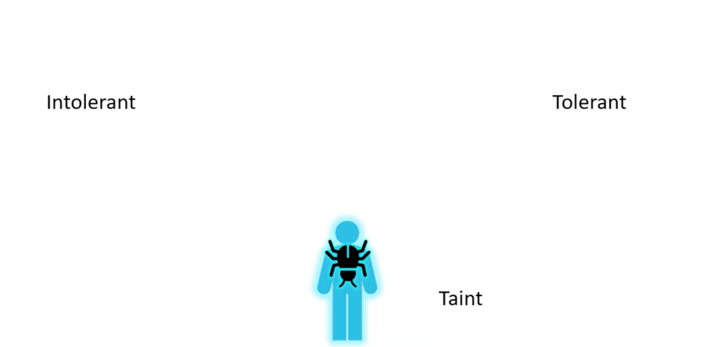

So, there are two things that decide if a bug lands on the person:
1. The taint on the person.
2. The tolerance of the bug to that particular taint.


Getting back to kubernetes, the person is the node and the bugs are the pods. Note that taints and tolerations have nothing to do with security or intrusion on the cluster. They are used to set restrictions on what parts can be scheduled on what nodes.

### Example One
We will start with a simple cluster with three worker nodes. And A-D pods. Node one has special computing capabilities and we want to schedule only certain pods on it. We can do this by adding a taint to the node and a toleration to the pods. So, by default pods have no tolerations which means unless specified otherwise, none of the pods can tolerate any taints. Don't forget to add tolerations to pod D. 

How can you that:
```bash
kubectl taint nodes node-name key=value:taint-effect
# Example
kubectl taint nodes node01 special=true:NoSchedule
kubectl taint nodes node01 app=blue:NoSchedule
```

There are three taint effects:
- `NoSchedule`: Pods will not be scheduled on the node.
- `PreferNoSchedule`: The scheduler will try to avoid placing a pod on the node but it's not a hard restriction.
- `NoExecute`: Existing pods on the node will be evicted if they do not tolerate the taint. New pods will not be scheduled on the node.


For pod tolerations, you can add the following to the pod spec:
```bash
kubectl taint nodes node-name special=true:NoSchedule
```

```yaml
apiVersion: v1
kind: Pod
metadata:
  name: pod-name
spec:
    containers:
    - name: container-name
        image: image-name
    tolerations:
    - key: "special"
      operator: "Equal"
      value: "true"
      effect: "NoSchedule"
```

:::tip
Beside the worker nodes we have the master node. By default, schedular does not schedule pods on the master node. Why is that ?

When the kubernetes cluster is set up, the master node is tainted with `NoSchedule` taint. A best practice is to not deploy any pods on the master node. 

```bash
kubectl describe node kubemaster | grep Taint
Taints: node-role.kubernetes.io/master:NoSchedule
```
:::

:::danger Untaint a Node
We can use kubectl taint but adding an hyphen at the end to remove the taint (untaint the node):
```bash
kubectl taint nodes controlplane node-role.kubernetes.io/control-plane:NoSchedule-
node/controlplane untainted
```
:::

## Node Selectors
Simple and easier method to assign pods to nodes. Kubernetes use labels to match and assign pods to nodes. 

```yaml title="pod-definition.yaml"
apiVersion: v1
kind: Pod
metadata:
  name: pod-name
spec:
  containers:
  - name: container-name
    image: image-name
  nodeSelector:
    size: Large
```

```bash
kubectl label nodes <node-name> <label-key>=<label-value>
```

### Cons
- It's a static configuration. If the node is down, the pod will not be scheduled on another node.
- What if we require more complex rules to assign pods to nodes? Large or medium size nodes. Or "Not small" ?

## Node Affinity
Primary purpose is ensure that pods are hosted on particular nodes. 

```yaml title="pod-definition.yaml"
apiVersion: v1
kind: Pod
metadata:
  name: pod-name
spec:
  containers:
  - name: container-name
    image: image-name
  affinity:
    nodeAffinity:
    requiredDuringSchedulingIgnoredDuringExecution:
      nodeSelectorTerms:
      - matchExpressions:
        - key: size
          operator: In
          values: 
          - Large
          - Medium
        - key: size
          operator: NotIn
          values: 
          - Small
        - key: size
          operator: Exists
```

### Type
type of node affinity, defines the behavior of the scheduler with respect to the affinity rule:
- Available:
    - `requiredDuringSchedulingIgnoredDuringExecution`.
    - `preferredDuringSchedulingIgnoredDuringExecution`.
- Planned:
    - `requiredDuringSchedulingRequiredDuringExecution`.
    - `preferredDuringSchedulingRequiredDuringExecution`.

There are two states in the lifecycle of a pod when considering node affinity:
- `DuringScheduling`: The pod does not exist and being scheduled for the first time.
- `DuringExecution`: The pod has been scheduled and is running on a node.

Types | DuringScheduling | DuringExecution
:--: | :--: | :--:
requiredDuringSchedulingIgnoredDuringExecution | Required | Ignored
preferredDuringSchedulingIgnoredDuringExecution | Preferred | Ignored


The two new types expected to be available in the future, only have a difference `DuringExecution` phase. A new option called `RequiredDuringExecution` is introduced. Which will evict any pods that are running on nodes and do not match the affinity rule.

Types | DuringScheduling | DuringExecution
:--: | :--: | :--:
requiredDuringSchedulingRequiredDuringExecution | Required | Required
preferredDuringSchedulingRequiredDuringExecution | Preferred | Required

:::tip
To get the list of labels of a node:
```bash
kubectl get nodes node01 -o jsonpath='{.metadata.labels}' | jq
```
:::

:::tip
Apply a label to a node:
```bash
kubectl label node node01 color=blue
```
:::

:::tip
Query Taints of a node:
```bash
kubectl get nodes node01 -o jsonpath='{.spec.taints}' | jq
```
:::


## Taints, Tolerations and Node Affinity
:::info
#### Taints & Tolerations:
- `Purpose`: Prevent pods from scheduling on specific nodes unless they explicitly tolerate the taint.
- `In your scenario`: Taints on your special nodes (color=blue:NoSchedule, etc.) ensure that normal pods (those without a matching toleration) cannot be scheduled on them.

However, taints and tolerations does not guarantee that the pods would only prefer these nodes. So, the red pod lands on one of the other nodes. That don't have a taint set. `This is not desirable`.

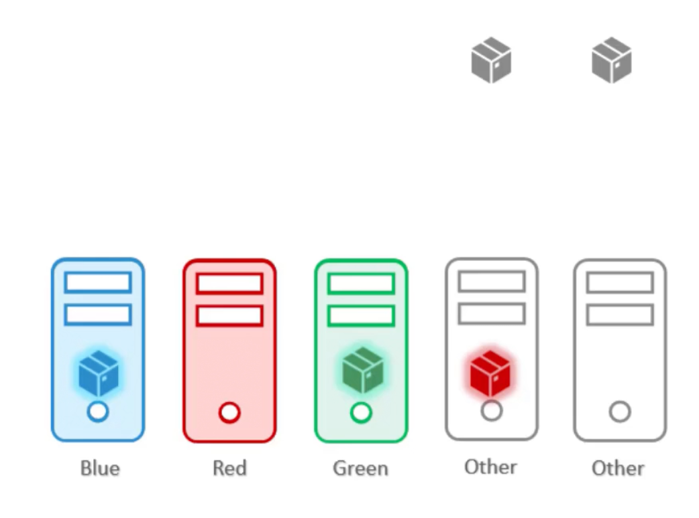

#### Node Affinity:
- `Purpose`: Attract pods to specific nodes based on node properties.
- `In your scenario`: The node affinity rule in your blue-pod.yaml ensures that your blue-pod aims to be scheduled only on nodes labeled color=blue.

In this case the pods end up on the right node. However, the doesn't guarantee that other "normal" pods are not placed on the special nodes.

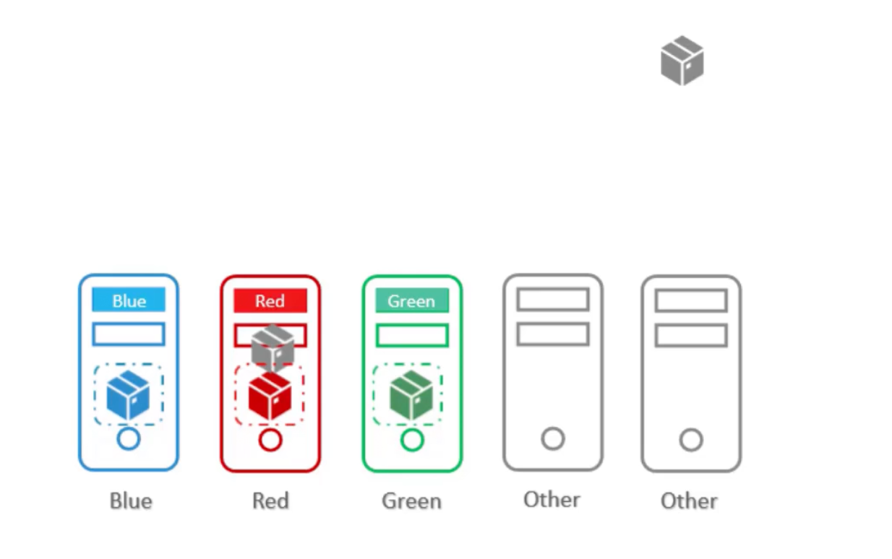
:::

1. Use taints and tolerations to repel *other* pods from being placed on our special-nodes.
2. Use node affinity to prevent our special-pods from being placed on *other* nodes.

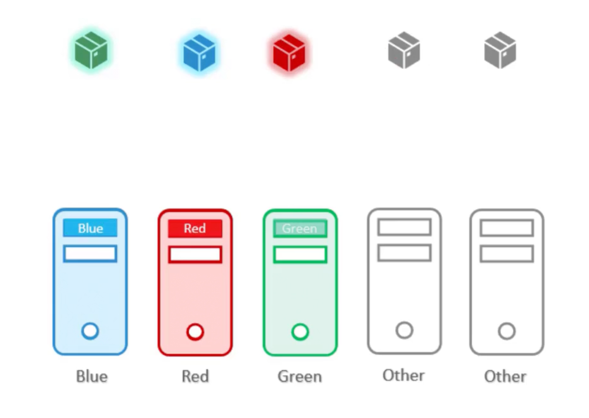

#### Example
We have five nodes, three of them are special red, green, blue respectively. And we have five pods, three of them needs to be scheduled on the special nodes. 


```bash
# [1] Apply taint to the special nodes
kubectl taint nodes node-one color=blue:NoSchedule
kubectl taint nodes node-two color=red:NoSchedule
kubectl taint nodes node-three color=green:NoSchedule

# [2] Add labels to the special nodes
kubectl label nodes node-one color=blue
kubectl label nodes node-two color=red
kubectl label nodes node-three color=green
```

```yaml title="blue-pod.yaml"
apiVersion: v1
kind: Pod
metadata:
  name: blue-pod
spec:
    containers:
    - name: blue-container
        image: ziadh/blue-container
    tolerations:
    - key: "color"
      operator: "Equal"
      value: "blue"
      effect: "NoSchedule"
    affinity:
      nodeAffinity:
        requiredDuringSchedulingIgnoredDuringExecution:
          nodeSelectorTerms:
          - matchExpressions:
            - key: color
              operator: In
              values: 
              - blue
```

```yaml title="red-pod.yaml"
apiVersion: v1
kind: Pod
metadata:
  name: red-pod
spec:
  containers:
  - name: red-container
      image: ziadh/red-container
  tolerations:
  - key: "color"
    operator: "Equal"
    value: "red"
    effect: "NoSchedule"
  affinity:
    nodeAffinity:
      requiredDuringSchedulingIgnoredDuringExecution:
        nodeSelectorTerms:
        - matchExpressions:
          - key: color
            operator: In
            values: 
            - red
```

```yaml title="green-pod.yaml"
apiVersion: v1
kind: Pod
metadata:
  name: green-pod
spec:
  containers:
  - name: green-container
      image: ziadh/green-container
  tolerations:
  - key: "color"
    operator: "Equal"
    value: "green"
    effect: "NoSchedule"
  affinity:
    nodeAffinity:
      requiredDuringSchedulingIgnoredDuringExecution:
        nodeSelectorTerms:
        - matchExpressions:
          - key: color
            operator: In
            values: 
            - green
```

```yaml title="normal-pod-one.yaml"
apiVersion: v1
kind: Pod
metadata:
  name: normal-pod-one
spec:
  containers:
  - name: normal-container-one
      image: ziadh/normal-container-one
```

```yaml title="normal-pod-two.yaml"
apiVersion: v1
kind: Pod
metadata:
  name: normal-pod-two
spec:
  containers:
  - name: normal-container-two
      image: ziadh/normal-container-two
```

## Resource Requirements
The `kube-scheduler` uses the resource requests and limits to make scheduling decisions. It tries to place the pod on a node that has enough resources to meet the pod's resource requests. If no node has enough resources, the pod remains in the `Pending` state until the resources are available. And you can see under event section of the pod: `FailedScheduling No nodes are available that match all of the predicates: Insufficient cpu (3).`

### Resource Requests
The amount of resources that the container is guaranteed to get. The scheduler uses this information to decide which node to place the pod on.

```yaml title="pod-definition.yaml"
apiVersion: v1
kind: Pod
metadata:
  name: pod-name
spec:
  containers:
  - name: container-name
    image: image-name
    ports:
    - containerPort: 80
    resources:
      requests:
        memory: "4Gi"
        cpu: 2
```

### Resource - CPU
You can specify any value as low as `0.1` (100m) which is equivalent to 1/10th of a CPU core. So, one count of CPU is equal to 1 core of CPU:
- 1 AWS vCPU.
- 1 GCP/Azure Core.
- 1 Hyperthread.

:::info 
Same thing with Memory.

Unit | Description
:--: | :--:
1 Gi (Gibibyte) | 1,073,741,824 bytes
1 Mi (Mebibyte) | 1,048,576 bytes
1 Ki (Kibibyte) | 1,024 bytes

Unit | Description
:--: | :--:
1 G (Gigabyte) | 1,000,000,000 bytes
1 M (Megabyte) | 1,000,000 bytes
1 K (Kilobyte) | 1,000 bytes
:::

### Resource limits
The maximum amount of resources that the container can use. If the container tries to use more than the limit, it will be throttled. If the container continues to use more than the limit, it will be terminated.

```yaml title="pod-definition.yaml"
apiVersion: v1
kind: Pod
metadata:
  name: pod-name
spec:
  containers:
  - name: container-name
    image: image-name
    ports:
    - containerPort: 80
    resources:
      requests:
        memory: "4Gi"
        cpu: 2
      limits:
        memory: "8Gi"
        cpu: 4
```

:::danger
If the pod tried to use more than the cpu limit it will be `throttled`. But, if it tried to use more than the memory limit it will be `terminated` with an `OOM (Out of Memory)` error.
:::


### Default Behavior
If you don't specify the resource requests and limits, the container will be given access to the entire node's resources.  

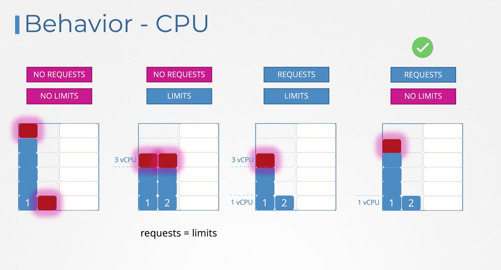

<hr/>

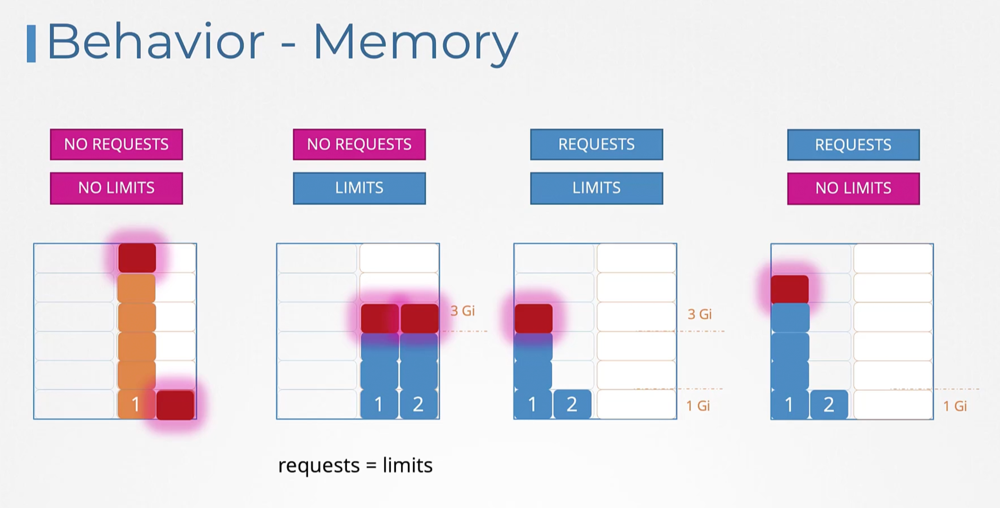


### Limit Range
Available at the namespace level.

```yaml title="limit-range-cpu.yaml"
apiVersion: v1
kind: LimitRange
metadata:
  name: cpu-resource-limit-constraint
spec:
  limits:
  - default: # default limit
      cpu: 500m
    defaultRequest: 
      cpu: 500m
    max:
      cpu: 1
    min:
      cpu: 100m
    type: Container
```

```yaml title="limit-range-memory.yaml"
apiVersion: v1
kind: LimitRange
metadata:
  name: memory-resource-limit-constraint
spec:
  limits:
  - default: # default limit
      memory: 1Gi
    defaultRequest: 
      memory: 1Gi
    max:
      memory: 1Gi
    min:
      memory: 500Mi
    type: Container
```

These limits are enforced at pod creation. If you craete or change limit-range, it will not affect the existing pods.


### Resource Quotas
Defined at a namespace level. It is used to limit the total amount of resources that can be used in a namespace.

```yaml title="resource-quota.yaml"
apiVersion: v1
kind: ResourceQuota
metadata:
  name: resource-quota
spec:
  hard:
    pods: "10"
    requests.cpu: "4"
    requests.memory: 5Gi
    limits.cpu: "10"
    limits.memory: 10Gi
```


## Edit Pods and Deployments

#### Edit a POD
Remember, you CANNOT edit specifications of an existing POD other than the below:
- spec.containers[*].image
- spec.initContainers[*].image
- spec.activeDeadlineSeconds
- spec.tolerations

For example, you cannot edit the environment variables, service accounts, and resource limits (all of which we will discuss later) of a running pod. But if you really want to, you have 2 options:

1.  Run the `kubectl edit pod` command. This will open the pod specification in an editor (vi editor). Then edit the required properties. When you try to save it, you will be denied. This is because you are attempting to edit a field on the pod that is not editable.

A copy of the file with your changes is saved in a temporary location as shown above.

You can then delete the existing pod by running the command:

`kubectl delete pod webapp`

Then create a new pod with your changes using the temporary file

`kubectl create -f /tmp/kubectl-edit-ccvrq.yaml`

2. The second option is to extract the pod definition in YAML format to a file using the command `kubectl get pod webapp -o yaml >&nbsp;my-new-pod.yaml`. Then make the changes to the exported file using an editor (vi editor). Save the changes `vi my-new-pod.yaml`. Then delete the existing pod `kubectl delete pod webapp`. Then create a new pod with the edited file `kubectl create -f my-new-pod.yaml`.


#### Edit a Deployment
With Deployments, you can easily edit any field/property of the POD template. Since the pod template is a child of the deployment specification, with every change the deployment will automatically delete and create a new pod with the new changes. So if you are asked to edit a property of a POD part of a deployment you may do that simply by running the command `kubectl edit deployment my-deployment`.

## DemonSet
DemonSet are like replica sets, as in it helps you deploy multiple instances of a pod. But, it ensures that one pod runs on each node. When ever a new node is added to the cluster, a replica of the pod is automatically added to the new node. 

### Use cases
- Deploy a monitoring agent on every node.
- Deploy a log collector on every node.


Earlier while discussing the kubernetes architecture, we learned that one of the worker node components is that is required on every node in the cluster is the `kube-proxy`. That is one good use case for a DemonSet. The `kube-proxy` component can be deployed as a DemonSet in the cluster. 


Another use case is for networking. Networking solutions such as weave-net require a network agent to be running on every node. 

### Example
```yaml title="daemonset-definition.yaml"
apiVersion: apps/v1
kind: DaemonSet
metadata:
  name: monitoring-daemon
spec:
  selector:
    matchLabels:
      name: monitoring-daemon
  template:
    metadata:
      labels:
        name: monitoring-daemon
    spec:
      containers:
      - name: monitoring-daemon
        image: monitoring-image
```

```bash
kubectl get daemonsets
kubectl describe daemonsets monitoring-daemon
```

### How does it work
We discussed before that you can bypass the scheduler by setting the `nodeName` field in the pod spec. That is how it used to be until k8s version 1.12. In k8s version 1.12, the DaemonSet uses the default scheduler and node affinity rules to schedule the pods on nodes


## Static Pods
Static pods are managed directly by the kubelet daemon on a specific node, without the API server observing them. Unlike Pods that are managed by the control plane (for example, a Deployment), static pods are managed directly by the kubelet daemon on a specific node.

The kubelet will periodically check a directory for static pod manifest files `/etc/kubernetes/manifests` and create the pods they define. If the kubelet is unable to create the pod (for example if the pod is invalid), it will repeatedly try to create the pod until it is able to do so. Also if you removed the pod-definition from the directory, the kubelet will delete the pod.

### How to Configure
<Tabs>

<TabItem value="First Method">

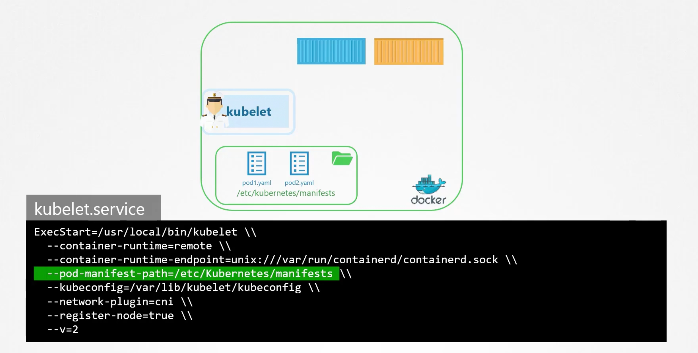

</TabItem>

<TabItem value="Second Method">

Setups using the kubeadm tool uses this approach:

```yaml title="kubelet-config.yaml"
staticPodPath: /etc/kubernetes/manifests
```

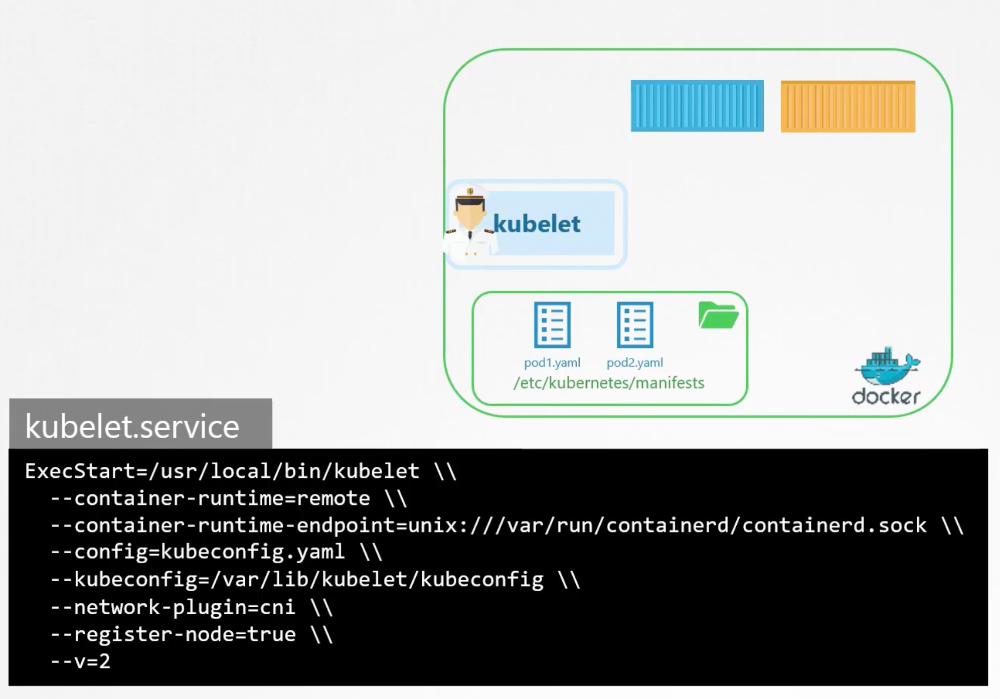

</TabItem>

</Tabs>


### Note
- Static pods are always bound to one node.
- They are not managed by the control plane. But if the kubelet is part of the cluster it will create a mirror object in the API server.
- Use `docker ps` to see the static pods.


### Use cases
- Install the control plane components as static pods. And that is how the `kubeadm` tool actually sets up the cluster. Start by installing kubelet on all the master nodes. Then create the pod definition files that uses docker images of the various control plane components such as `apiserver.yaml`, `controller-manager.yaml`, `etcd.yaml`.


### DaemonSet vs Static Pods
Static Pods | DaemonSet
:--: | :--:
Crated by the kubelet | Created by the Kube-API server (DaemonSet controller)
Deploy Control Plane components | Deploy monitoring agents, log collectors, network agents
`Ignored by the Kube-Scheduler` | `Ignored by the Kube-Scheduler`


## Multiple Schedulers
The default scheduler distributes pods evenly across the nodes in the cluster. But id you have a specific use case, you can create your own scheduler. Kubernetes is highly extensible.

You can deploy it as default or non-default-extra scheduler. So some applications can use the default scheduler and others can use the extra scheduler.

When constructing a k8s pod or a deployment, you can specify the scheduler name in the specs.

```yaml title="custom-scheduler.yaml"
apiVersion: kubescheduler.config.k8s.io/v1
kind: KubeSchedulerConfiguration
profiles:
- schedulerName: tut-scheduler
```

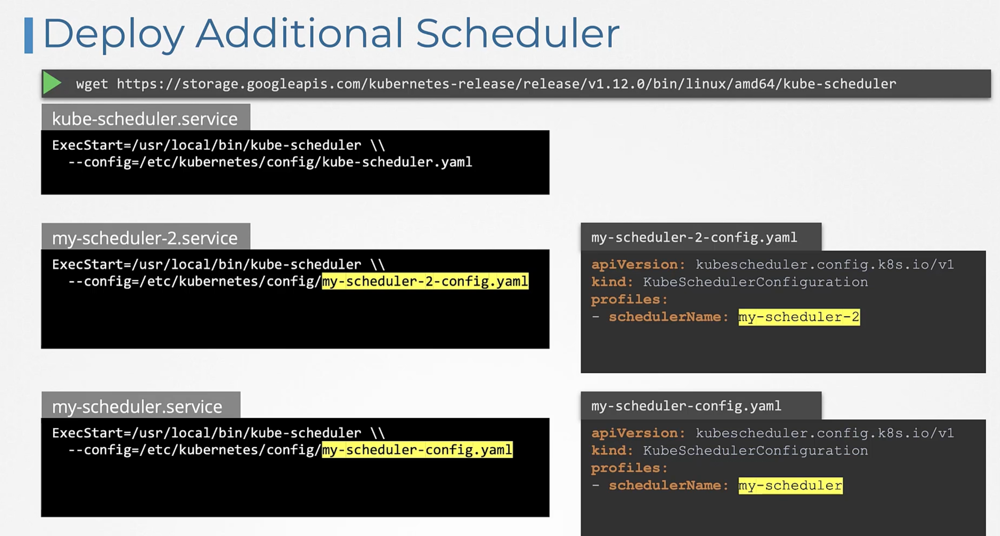

#### Use Pods
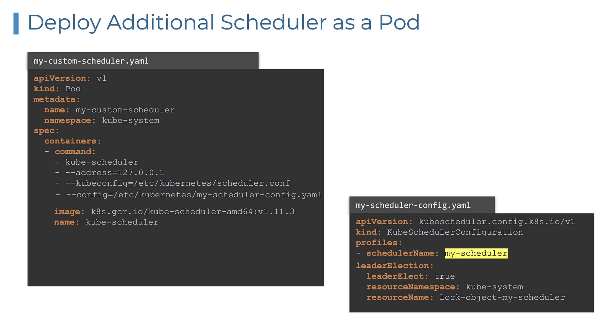


```yaml title="pod-definition.yaml"
apiVersion: v1
kind: Pod
metadata:
  name: pod-name
spec:
  containers:
  - name: container-name
    image: image-name
  schedulerName: tut-scheduler
```

### View Events
If you wanted to know which scheduler was used to schedule a pod, you can use the `kubectl get events -o wide` command. 

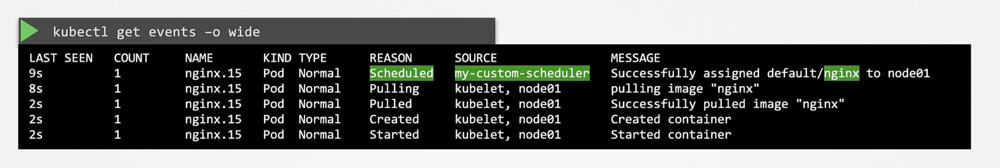


### View Logs
You can also view the logs of the scheduler to see the events that are happening. You can do this by running the `kubectl logs <scheduler-pod-name> -n kube-system` command.


<details>
<summary>click me</summary>

```yaml title="custom-scheduler.yaml"
---
apiVersion: v1
kind: Pod
metadata:
  labels:
    run: custom-scheduler
  name: custom-scheduler
  namespace: kube-system
spec:
  serviceAccountName: custom-scheduler
  containers:
  - command:
    - /usr/local/bin/kube-scheduler
    - --config=/etc/kubernetes/custom-scheduler/custom-scheduler-config.yaml
    image: registry.k8s.io/kube-scheduler:v1.29.0  # changed
    livenessProbe:
      httpGet:
        path: /healthz
        port: 10259
        scheme: HTTPS
      initialDelaySeconds: 15
    name: kube-second-scheduler
    readinessProbe:
      httpGet:
        path: /healthz
        port: 10259
        scheme: HTTPS
    resources:
      requests:
        cpu: '0.1'
    securityContext:
      privileged: false
    volumeMounts:
      - name: config-volume
        mountPath: /etc/kubernetes/custom-scheduler
  hostNetwork: false
  hostPID: false
  volumes:
    - name: config-volume
      configMap:
        name: custom-scheduler-config
```

```yaml title="custom-scheduler-configmap.yaml"
apiVersion: v1
data:
  custom-scheduler-config.yaml: |
    apiVersion: kubescheduler.config.k8s.io/v1
    kind: KubeSchedulerConfiguration
    profiles:
      - schedulerName: custom-scheduler
    leaderElection:
      leaderElect: false
kind: ConfigMap
metadata:
  creationTimestamp: null
  name: custom-scheduler-config
  namespace: kube-system
```

```yaml title="custom-scheduler-config.yaml"
apiVersion: kubescheduler.config.k8s.io/v1
kind: KubeSchedulerConfiguration
profiles:
  - schedulerName: custom-scheduler
leaderElection:
  leaderElect: false
```

```yaml title="pod-definition.yaml"
apiVersion: v1
kind: Pod
metadata:
  name: pod-name
spec:
  containers:
  - name: container-name
    image: image-name
  schedulerName: custom-scheduler
```

</details>


## Scheduler Profiles
Pods are awaiting in a Scheduling Queue. They are sorted by priority defined in the `priorityClassName` field in the pod definition file.

```yaml title="priority-class.yaml"
apiVersion: scheduling.k8s.io/v1
kind: PriorityClass
metadata:
  name: high-priority
value: 1000000
globalDefault: false
description: "This priority class should be used for XYZ service pods only."
```

```yaml title="pod-definition.yaml"
apiVersion: v1
kind: Pod
metadata:
  name: pod-name
spec:
  priorityClassName: high-priority
  containers:
  - name: container-name
    image: image-name
```

The above is the scheduling phase, then we enter the filtering phase. Here the nodes that can't accommodate the pod are removed from the list. 

Next phase is the scoring phase. Here nodes are scored different weights. The scheduler will score each node a score based on free resources after the pod is scheduled. The node with the highest score will be picked up.

In the binding phase the pod is bound to the node. The scheduler will create a binding object and send a post request to the pods binding api.

### Plugins

All of these operations are achieved with certain plugins. While in the Scheduling Queue it is the `PrioritySort` Plugin that sorts the pods and orders them based on the priority configured on the pods. 

In the Filtering Stage it is the `NodeResourcesFit` Plugin that identifies the nodes that has sufficient resources required by the pod and filters out the nodes that doesn't. Also, the `NodeName` Plugin that checks if the pod has a nodeName mentioned in the pod spec. Another example is the `NodeUnschedulable` Plugin That filters out nodes that has the Unschedulable flag set to true.

In the Scoring Stage it is the `NodeResourcesFit` Plugin. Another example would be the `ImageLocality` Plugin that scores the nodes based on the availability of the image on the node.

In the Binding Stage it is the `DefaultBinder` Plugin that binds the pod to the node. That provides the binding mechanism.

### Extension Points

The highly customizable nature of kubernetes makes it possible for us to customize what plugins go where. And for us to write our own Plugin and plug it here. That is achieved by what is called `Extension Points`. At each stage there is an extension point to which a plugin can be plugged to.

As a matter of a fact there is more extensions before and after filter phase, e.g. `preFilter` and `postFilter` extensions. Same with `preScore` and `reserve` extensions in scoring phase. And `permit`, `preBind` and `postBind` extensions in the binding phase.

#### Example on Scheduling Plugins and Extension Points

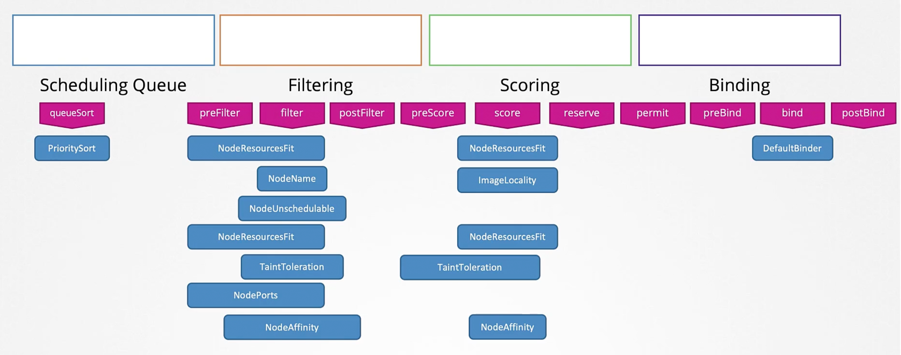


### Scheduler Profiles
Previously, we have discussed multiple schedulers. But, issues arise while maintaining these processes and race conditions can arise.

Since the 1.18 release, Kubernetes has introduced the concept of `Scheduler Profiles`. This allows you to define multiple scheduling configurations "Profiles" in a single scheduler. Now all profiles are managed by a single scheduler "binary".

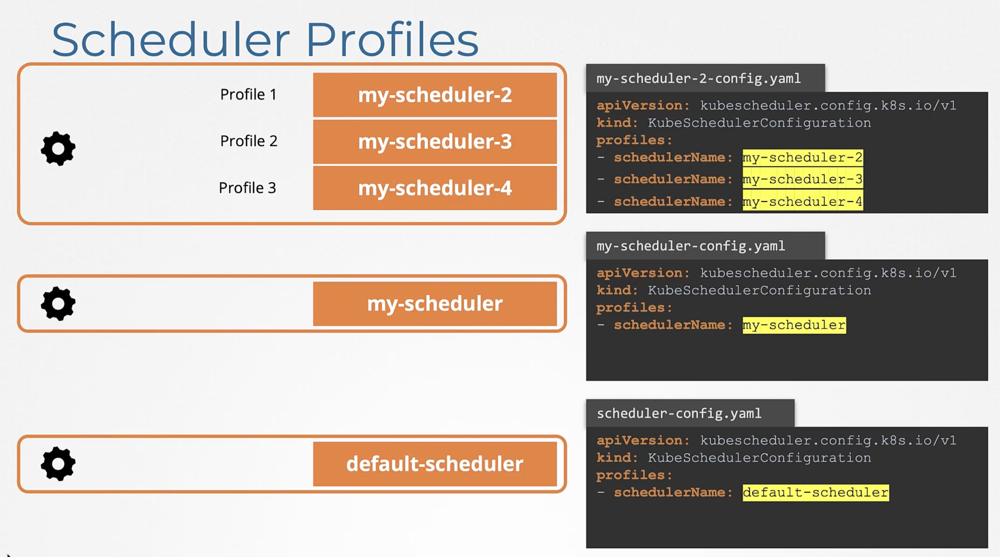

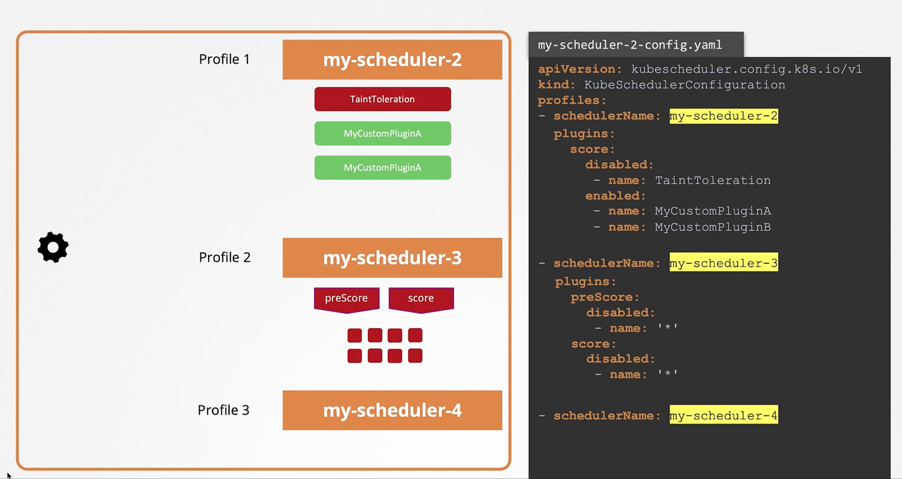


## References
- [Scheduler code hierarchy overview.](https://github.com/kubernetes/community/blob/master/contributors/devel/sig-scheduling/scheduling_code_hierarchy_overview.md)
- [Advanced Scheduling in Kubernetes](https://kubernetes.io/blog/2017/03/advanced-scheduling-in-kubernetes/)
- [How does the Kubernetes scheduler work?](https://jvns.ca/blog/2017/07/27/how-does-the-kubernetes-scheduler-work/)
- [How does Kubernetes' scheduler work? "StakeOverFlow"](https://stackoverflow.com/questions/28857993/how-does-kubernetes-scheduler-work)


