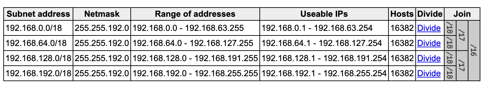

```mdx-code-block
import Tabs from '@theme/Tabs';
import TabItem from '@theme/TabItem';
```

In this playground we will gain the practical experience of provisioning an EKS cluster using:
- Terraform.
- Prometheus.

First, we start with creating the VPC `192.168.0.0/16`. Later we will create the internet Gateway, then four subnets, two public and two private each in a different availability zone. After that we will create two NAT Gateways, one in each public subnet. After that we will proceed to define three routing tables, Finally, we will create the EKS cluster itself. Also, add one instance group to that cluster.

After that, in order to demonstrate how can we expose the services to outside world. We will create a simple application and one of them will use the public load balancer and the other will use the internal load balancer.

## Terraform Init
1. Create a new user in AWS IAM. Console then navigate to IAM.
2. Click on `Add user`.
3. Name user `terraform`. 
4. Select `Programmatic access` only.
5. Place it in the `AdministratorAccess` group.
6. Create the user and download the credentials.

### Configure AWS
```bash
cat new_user_credentials.csv

# Enter the credentials, put default:
# - region as `us-east-1`
# - output as `json`
aws configure --profile terraform 

cat ~/.aws/config
cat ~/.aws/credentials
```

### Terraform
```tf title="provider.tf"
terraform {
  required_providers {
    aws = {
      source  = "hashicorp/aws"
      version = "5.45.0"
    }
  }
}

provider "aws" {
  profile = "terraform"
  region  = "us-east-1"
}
```

### State
We will store the state locally for now. Later we will move it to S3. ***Use remote state for production***.

## VPC
```tf title="vpc.tf"
# Resource: aws_vpc
# https://registry.terraform.io/providers/hashicorp/aws/latest/docs/resources/vpc
# https://docs.aws.amazon.com/eks/latest/userguide/network_reqs.html

resource "aws_vpc" "main" {
  cidr_block = "192.168.0.0/16"

  # Makes instances shared on the host.
  instance_tenancy = "default"

  # Required for EKS:
  # 1. Enable DNS support in the VPC.
  # 2. Enable DNS hostnames in the VPC.
  enable_dns_support   = true
  enable_dns_hostnames = true

  # Additional Arguments:
  enable_classiclink = false
  enable_classiclink_dns_support = false
  assign_generated_ipv6_cidr_block = false

  tags = {
    Name = "main"
  }
}

output "vpc_id" {
  value = aws_vpc.main.id
  description = "The ID of the VPC."
  sensitive = false
}
```

## Test
```bash
terraform fmt
terraform validate
terraform init
terraform plan
terraform apply
```

## Internet Gateway
Internet Gateway is the horizontally scalable redundant and highly available VPC component, that allows communication between VPC and the internet. 

```tf title="igw.tf"
# Resource: aws_internet_gateway
# https://registry.terraform.io/providers/hashicorp/aws/latest/docs/resources/internet_gateway

resource "aws_internet_gateway" "main" {
  vpc_id = aws_vpc.main.id

  tags = {
    Name = "main"
  }
}
```

```bash
terraform fmt
terraform validate
terraform plan
terraform apply
```

Now we have the VPC, IGW and the igw attached to the VPC.

## Subnets
We will create two public subnets and two private subnets. Each in a different availability zone.



```tf title="subnets.tf"
# Resource: aws_subnet
# https://registry.terraform.io/providers/hashicorp/aws/latest/docs/resources/subnet

# Divide the VPC into 4 subnets:
# https://www.davidc.net/sites/default/subnets/subnets.html

resource "aws_subnet" "public_1" {
  vpc_id = aws_vpc.main.id

  cidr_block = "192.168.0.0/18"
  availability_zone = "us-east-1a"

  # Required for EKS: Instances launched into the subnet
  # should be assigned a public IP address.
  map_public_ip_on_launch = true

  tags = {
    Name = "public-us-east-1a"
    "kubernetes.io/cluster/eks" = "shared"
    "kubernetes.io/role/elb" = "1"
  }
}

resource "aws_subnet" "public_2" {
  vpc_id = aws_vpc.main.id

  cidr_block = "192.168.64.0/18"
  availability_zone = "us-east-1b"

  # Required for EKS: Instances launched into the subnet
  # should be assigned a public IP address.
  map_public_ip_on_launch = true

  tags = {
    Name = "public-us-east-1b"
    "kubernetes.io/cluster/eks" = "shared"
    "kubernetes.io/role/elb" = "1"
  }
}

resource "aws_subnet" "private_1" {
  vpc_id = aws_vpc.main.id

  cider_block = "192.168.128.0/18"
  availability_zone = "us-east-1a"

  tags = {
    Name = "private-us-east-1a"
    "kubernetes.io/cluster/eks" = "shared"
    "kubernetes.io/role/internal-elb" = "1"
  }
}

resource "aws_subnet" "private_2" {
  vpc_id = aws_vpc.main.id

  cider_block = "192.168.192.0/18"
  availability_zone = "us-east-1b"

  tags = {
    Name = "private-us-east-1b"
    "kubernetes.io/cluster/eks" = "shared"
    "kubernetes.io/role/internal-elb" = "1"
  }
}
```

```bash
terraform fmt
terraform validate
terraform plan
terraform apply
```

There are not public and private subnets, just containers for now. We will add the NAT Gateways next and then the routing tables.

## NAT Gateways
NAT Gateway is a managed service that allows instances in the private subnet to connect to the internet. 

NAT Gateway works in a way that is translates the private ip address to the public ip address to get internet access.

We will also need to allocate an Elastic IP address for each NAT Gateway.

```tf title="eips.tf"
# Resource: aws_eip
# https://registry.terraform.io/providers/hashicorp/aws/latest/docs/resources/eip

resource "aws_eip" "nat_1" {
  depends_on = [aws_internet_gateway.main]
}

resource "aws_eip" "nat_2" {
  depends_on = [aws_internet_gateway.main]
}
```

```tf title="natgw.tf"
# Resource: aws_nat_gateway
# https://registry.terraform.io/providers/hashicorp/aws/latest/docs/resources/nat_gateway

resource "aws_nat_gateway" "gw_1" {
  allocation_id = aws_eip.nat_1.id
  subnet_id = aws_subnet.public_1.id

  tags = {
    Name = "nat-gw-1"
  }
}

resource "aws_nat_gateway" "gw_2" {
  allocation_id = aws_eip.nat_2.id 
  subnet_id = aws_subnet.public_2.id

  tags = {
    Name = "nat-gw-2"
  }
}
```

## Routing Tables
A route table contains a set of rules, called routes, that are used to determine where network traffic from your subnet or gateway is directed.

When you create a VPC AWS will automatically create a special main route table, it controls the routing for all subnets that are not explicitly associated with any other route table.

Route table consists of two columns, The first column is the destination and the second column is the target.

Target has a Gateway network interface or connection through which to send the destination traffic. E.g. Can be an Internet Gateway, peering connection or local. Local means that the traffic will not leave the VPC.

We will create two types of routing tables, the first one is the public route table. You have the VPC and the internet GW. Just add default route to the Internet GW. The first route is inherited from the main route table.

Destination | Target
:--: | :--:
192.168.0.0/16 | local
0.0.0.0/0 | ***igw-id***

The second type is the private route table. In this example we have the VPC, Internet GW and NAT GW in the public subnet.

Destination | Target
:--: | :--:
192.168.0.0/16 | local
0.0.0.0/0 | ***natgw-id***

Extra we will see how to setup VPC peering. E.g. we have two VPCs `192.168.0.0/16` and `10.0.0.0/16` and we created a peering connection called `pcx-id`. The routing table can be as follows:

First VPC `192.168.0.0/16` route table:
Destination | Target
:--: | :--:
192.168.0.0/16 | local
10.0.0.0/16 | ***pcx-id***

```tf title="route-tables.tf"
# Resource: aws_route_table
# https://registry.terraform.io/providers/hashicorp/aws/latest/docs/resources/route_table

resource "aws_route_table" "public" {
  vpc_id = aws_vpc.main.id

  route {
    cidr_block = "0.0.0.0/0"
    gateway_id = aws_internet_gateway.main.id
  }

  tags = {
    Name = "public"
  }
}

resource "aws_route_table" "private_1" {
  vpc_id = aws_vpc.main.id
  
  route {
    cidr_block = "0.0.0.0/0"
    nat_gateway_id = aws_nat_gateway.gw_1.id
  }

  tags = {
    Name = "private-1"
  }
}

resource "aws_route_table" "private_2" {
  vpc_id = aws_vpc.main.id
  
  route {
    cidr_block = "0.0.0.0/0"
    nat_gateway_id = aws_nat_gateway.gw_2.id
  }

  tags = {
    Name = "private-2"
  }
}
```

## Route Table Association
```tf title="route-table-association.tf"
# Resource: aws_route_table_association
# https://registry.terraform.io/providers/hashicorp/aws/latest/docs/resources/route_table_association

resource "aws_route_table_association" "public_1" {
  subnet_id      = aws_subnet.public_1.id
  route_table_id = aws_route_table.public.id
}

resource "aws_route_table_association" "public_2" {
  subnet_id      = aws_subnet.public_2.id
  route_table_id = aws_route_table.public.id
}

resource "aws_route_table_association" "private_1" {
  subnet_id      = aws_subnet.private_1.id
  route_table_id = aws_route_table.private_1.id
}

resource "aws_route_table_association" "private_2" {
  subnet_id      = aws_subnet.private_2.id
  route_table_id = aws_route_table.private_2.id
}
```

## EKS
We will start by creating the role that will be used. When we create the EKS cluster we will use this rule to attach to eks. And eks will use this rule to create AWS resources for kubernetes clusters.

A policy grants an entity permission to assume the role.

```tf title="eks.tf"
# Resource: aws_iam_role
# https://registry.terraform.io/providers/hashicorp/aws/latest/docs/resources/iam_role

resource "aws_iam_role" "eks_cluster" {
  name = "eks-cluster"

  assume_role_policy = <<POLICY
  {
    "version": "2012-10-17",
    "statement": [
      {
        "Effect": "Allow",
        "Principal": {
          "Service": "eks.amazonaws.com"
        },
        "Action": "sts:AssumeRole"
      }
    ]
  }
  POLICY
}


# Resource: aws_iam_role_policy_attachment
# https://registry.terraform.io/providers/hashicorp/aws/latest/docs/resources/iam_role_policy_attachment

resource "aws_iam_role_policy_attachment" "amazon_eks_cluster_policy" {
  # https://github.com/SummitRoute/aws_managed_policies/blob/master/policies/AmazonEKSClusterPolicy
  policy_arn = "arn:aws:iam::aws:policy/AmazonEKSClusterPolicy"

  role = aws_iam_role.eks_cluster.name
}


# Resource: aws_eks_cluster
# https://registry.terraform.io/providers/hashicorp/aws/latest/docs/resources/eks_cluster

resource "aws_eks_cluster" "eks" {
  name = "eks"

  # Amazon Resource Name (ARN) of the IAM role that provides permission for
  # the kubernetes control plane to make calls to aws API operations on your 
  # behalf.
  role_arn = aws_iam_role.eks_cluster.arn

  # Desired Kubernetes master version
  version = "1.29"

  vpn_config {
    endpoint_private_access = false
    endpoint_public_access = true

    # Must be in at least two subnets in two different
    # availability zones.
    subnet_ids = [
      aws_subnet.public_1.id,
      aws_subnet.public_2.id,
      aws_subnet.private_1.id,
      aws_subnet.private_2.id
    ]
  }

  depends_on = [
    aws_iam_role_policy_attachment.amazon_eks_cluster_policy
  ]
}
```

## instance group
```tf title="eks-node-groups.tf"
# Resource: aws_iam_role
# https://registry.terraform.io/providers/hashicorp/aws/latest/docs/resources/iam_role

resource "aws_iam_role" "nodes_general" {
  name = "eks-node-group-general"

  assume_role_policy = <<POLICY
  {
    "Version": "2012-10-17",
    "Statement": [
      {
        "Effect": "Allow",
        "Principal": {
          "Service": "ec2.amazonaws.com"
        },
        "Action": "sts:AssumeRole"
      }
    ]
  }
  POLICY
}


# Resource: aws_iam_role_policy_attachment
# https://registry.terraform.io/providers/hashicorp/aws/latest/docs/resources/iam_role_policy_attachment

resource "aws_iam_role_policy_attachment" "amazon_eks_worker_node_policy_general" {
  # https://github.com/SummitRoute/aws_managed_policies/blob/master/policies/AmazonEKSWorkerNodePolicy
  policy_arn = "arn:aws:iam::aws:policy/AmazonEKSWorkerNodePolicy"

  role = aws_iam_role.nodes_general.name
}

resource "aws_iam_role_policy_attachment" "amazon_eks_cni_policy_general" {
  # https://github.com/SummitRoute/aws_managed_policies/blob/master/policies/AmazonEKS_CNI_Policy
  policy_arn = "arn:aws:iam::aws:policy/AmazonEKS_CNI_Policy"

  role = aws_iam_role.nodes_general.name
}

resource "aws_iam_role_policy_attachment" "amazon_ec2_container_registry_read_only" {
  # https://github.com/SummitRoute/aws_managed_policies/blob/master/policies/AmazonEC2ContainerRegistryReadOnly
  policy_arn = "arn:aws:iam::aws:policy/AmazonEC2ContainerRegistryReadOnly"

  role = aws_iam_role.nodes_general.name  
}


# Resource: aws_eks_node_group
# https://registry.terraform.io/providers/hashicorp/aws/latest/docs/resources/eks_node_group

resource "aws_eks_node_group" "nodes_general" {
  cluster_name = aws_eks_cluster.eks.name
  node_group_name = "nodes-general"
  node_role_arn = aws_iam_role.nodes_general.arn

  # Identifiers of EC2 subnets to associate with the EKS Node Group.
  # These subnets must have the following resource tags:
  # - kubernetes.io/cluster/CLUSTER_NAME: owned
  # Where CLUSTER_NAME is replaced with the name of the EKS cluster.
  subnet_ids = [
    aws_subnet.private_1.id,
    aws_subnet.private_2.id
  ]

  scaling_config {
    desired_size = 1
    max_size = 1
    min_size = 1
  }

  # Valid values: AL2_x86_64, AL2_x86_64_GPU, AL2_ARM_64
  ami_type = "AL2_x86_64" 

  # Valid values: ON_DEMAND, SPOT
  capacity_type = "ON_DEMAND"

  disk_size = 20 # GiB

  # Force version update if existing Pods are unable to be drained
  # due to a pod disruption budget issue.
  force_update_version = false

  # Docs: https://aws.amazon.com/ec2/instance-types/
  instance_types = ["t3.small"]

  labels = {
    role = "nodes-general"
  }

  # If not specified, then inherited from the EKS master plane.
  version = "1.29"

  depends_on = [
    aws_iam_role_policy_attachment.amazon_eks_worker_node_policy_general,
    aws_iam_role_policy_attachment.amazon_eks_cni_policy_general,
    aws_iam_role_policy_attachment.amazon_ec2_container_registry_read_only
  ]
}
```

## Test
```bash
terraform fmt
terraform validate
terraform plan
terraform apply
```

To add context to kubectl. Run the following command:
```bash
rm ~/.kube/config
aws eks --region us-east-1 update-kubeconfig --name eks --profile terraform

kubectl get svc
```

## Load Balancer
```yaml title="app.yaml"
---
apiVersion: apps/v1
kind: Deployment
metadata:
  name: nginx
  labels:
    app: nginx
spec:
  replicas: 1
  selector:
    matchLabels:
      app: nginx
  template:
    metadata:
      labels:
        app: nginx
    spec:
      containers:
      - name: nginx
        image: nginx:1.14.2
        ports:
        - containerPort: 80
---
apiVersion: v1
kind: Service
metadata:
  name: internal-nginx-service
  annotations:
    service.beta.kubernetes.io/aws-load-balancer-type: nlb
    service.beta.kubernetes.io/aws-load-balancer-cross-zone-load-balancing-enabled: "true"
    service.beta.kubernetes.io/aws-load-balancer-internal: 0.0.0.0/0
spec:
  selector:
    app: nginx
  type: LoadBalancer
  ports:
    - protocol: TCP
      port: 80
---
apiVersion: v1
kind: Service
metadata:
  name: external-nginx-service
  annotations:
    service.beta.kubernetes.io/aws-load-balancer-type: nlb
    service.beta.kubernetes.io/aws-load-balancer-cross-zone-load-balancing-enabled: "true"
spec:
  selector:
    app: nginx
  type: LoadBalancer
  ports:
    - protocol: TCP
      port: 80
```

```bash
kubectl apply -f k8s/app.yaml

kubectl get all
```

## Add users, roles to EKS
Unfortunately, EKS does not support AWS IAM roles. Which means when ever you want to add a new user. You have to update kubernetes config map. On the other hand you can create roles or multiple roles with different access levels to the cluster. And let new users to use or assume that role. It will behave to the Group in some sense. It is more flexible way of managing users. And lets you modify the kubernetes config map ***ONLY*** once.

```bash
kubectl edit -n kube-system configmap/aws-auth
```

You can create kubernetes roles and bind users to that role. Very easy to add users to eks cluster and grant admin access. Then we will create the role with admin access and create a user that would be able to assume that role.

```bash
aws eks --region us-east-1 update-kubeconfig --name eks --profile terraform
```

Now time to create `rbac.yaml`:

```yaml title="rbac.yaml"
---
apiVersion: rbac.authorization.k8s.io/v1
kind: ClusterRole
metadata:
  name: reader
rules:
- apiGroups: ["*"]
  resources: ["deployments", "pods", "services", "configmaps", "secrets"]
  verbs: ["get", "list", "watch"]
---
apiVersion: rbac.authorization.k8s.io/v1
kind: ClusterRoleBinding
metadata:
  name: reader
subjects:
- kind: Group
  name: reader
  apiGroup: rbac.authorization.k8s.io
roleRef:
  kind: ClusterRole
  name: reader
  apiGroup: rbac.authorization.k8s.io
---
```

Create AWS policy that will allow users to view nodes and workloads across all the eks clusters in AWS management console. So, we need to map IAM users to RBAC in kubernetes.

1. Open Console, navigate to IAM service. And create a policy.
```json title="AmazonEKSDeveloperPolicy"
{
  "Version": "2012-10-17",
  "Statement": [
    {
      "Effect": "Allow",
      "Action": [
        "eks:DescribeNodegroup",
        "eks:listNodegroup",
        "eks:DescribeCluster",
        "eks:ListClusters",
        "eks:AccessKubernetesApi",
        "ssm:GetParameter",
        "eks:ListUpdates",
        "eks:ListFargateProfiles"
      ],
      "Resource": "*"
    }
  ]
}
```

It is a best practice not to attach directly policies to your users, but rather create groups and attach those policies to groups and then put your users in those groups. That would simplify user management. 

1. Go to Console and Craete a group `eks-developer`.
2. Change Policy Type to `Customer Managed`.
3. Attach `AmazonEKSDeveloperPolicy` to the group.

It is time now to create the user that we will grant those read-permissions within the cluster and AWS management console. Call it `developer` give it both `Programmatic access` and `AWS Management Console access`. Add `developer` user to the `eks-developer` group. Finally, download the `new_user_credentials.csv`.

```bash
cat new_user_credentials.csv
aws configure --profile developer
```

Now we need to modify the kubernetes configmap. And map our user to the kubernetes group. We need a user with an admin access or at least can modify configmaps in kube-system namespace. We will use `terraform` user.

```bash
kubectl edit -n kube-system configmap/aws-auth
```

```yaml
apiVersion: v1
kind: ConfigMap
metadata:
  name: aws-auth
  namespace: kube-system
data:
  mapUsers: |
    - userarn: arn:aws:iam::123456789012:user/developer
      username: developer
      groups:
      - system:masters
      - reader
  mapRoles: |
    - rolearn: arn:aws:iam::123456789012:role/eks-cluster
      username: system:node:{{EC2PrivateDNSName}}
      groups:
      - system:bootstrappers
      - system:nodes
```

```bash
aws eks --region us-east-1 update-kubeconfig --name eks --profile developer

kubectl config view --minify

kubectl auth can-i get pods
kubectl auth can-i create pods
```

The second part we will create a role and add this role to kubernetes configmap. Also, create the IAM user in AWS console and map that role to kubernetes. And that user would be able to perform any action within the kubernetes cluster. It will get the root access.

1. Navigate to Console, IAM service.
2. Policies then create policy.
```json title="AmazonEKSAdminPolicy"
{
  "Version": "2012-10-17",
  "Statement": [
    {
      "Effect": "Allow",
      "Action": ["eks:*"],
      "Resource": "*"
    },
    {
      "Effect": "Allow",
      "Action": "iam:PassRole",
      "Resource": "*",
      "Condition": {
        "StringEquals": {
          "iam:PassedToService": "eks.amazonaws.com"
        }
      }
    }
  ]
}
```

The above policy will allow the user to perform any actions on eks on any eks cluster. Also, it will allow you to pass roles to eks service to perform service action on your behalf.
3. Name it `AmazonEKSAdminPolicy`.


Next step is to create the eks admin role. 

1. Navigate to Console, IAM service.
2. Roles then create role.
3. Select `Another AWS account` and enter the account id.
4. Filter by `Customer Managed`.
5. Attach the `AmazonEKSAdminPolicy` to the role.
6. Name the role `eks-admin`.

Optionally you can get and describe this role:
```bash
aws iam get-role --profile terraform --role-name eks-admin
```

Now let us establish trust between users and roles. In order to do that we need to create another AWS policy:
1. Navigate to Console, IAM service.
2. Policies then create policy.
```json title="AmazonEKSAdminTrustPolicy"
{
  "Version": "2012-10-17",
  "Statement": [
    {
      "Effect": "Allow",
      "Action": ["sts:AssumeRole"],
      "Resource": "arn:aws:iam::123456789012:role/eks-admin"
    }
  ]
}
```

Users with this policy will be able to assume the role `eks-admin`. 
3. Name it `AmazonEKSAssumePolicy`.

We will create another user we will call it `manager` that will be able to use that role. And get admin access from kubernetes cluster. It will get access in AWS console management. Plus, within kubernetes we will be able to map this role to the system master group. Within the RBAC system in kubernetes. That mean user will get admin access in the aws side and kubernetes side.

1. Navigate to Console, IAM service.
2. Users then create user.
3. Name it `manager` and give it `Programmatic access` and `AWS Management Console access`.
4. The best practice is to put users in groups. And attach this policy to groups but in this case we gonna attach policy to the user directly.
5. Click attach policy. Filter by `Customer Managed` and attach `AmazonEKSAssumePolicy`.
6. Download the `new_user_credentials.csv`.

Configure profile in terminal to use the new user:
```bash
cat new_user_credentials.csv
aws configure --profile manager
```

Verify we have access to that role and to assume that role:
```bash
aws sts assume-role --role-arn arn:aws:iam::123456789012:role/eks-admin --role-session-name manager-session --profile manager
```

Now we still need to configure the kubernetes configmap. 
```bash
aws eks --region us-east-1 update-kubeconfig --name eks --profile terraform

kubectl edit -n kube-system configmap/aws-auth
```

```yaml
apiVersion: v1
kind: ConfigMap
metadata:
  name: aws-auth
  namespace: kube-system
data:
  mapUsers: |
    - userarn: arn:aws:iam::123456789012:user/developer
      username: developer
      groups:
      - system:masters
      - reader
  mapRoles: |
    - rolearn: arn:aws:iam::123456789012:role/eks-admin
      username: eks-admin
      groups:
      - system:masters
    - rolearn: arn:aws:iam::123456789012:role/eks-cluster
      username: system:node:{{EC2PrivateDNSName}}
      groups:
      - system:bootstrappers
      - system:nodes
```

Now we need to create the additional profile for that role. We will call it eks-admin-profile
```bash
vi ~/.aws/config
```

```ini
[profile terraform]
[profile developer]
[profile manager]
; We will need to create the profile for the eks-admin role
[profile eks-admin]
role_arn = arn:aws:iam::123456789012:role/eks-admin
; source profile is the user that would be able to assume that role
source_profile = manager
```

Update kubernetes kubectl config on last time.
```bash
aws eks --region us-east-1 update-kubeconfig --name eks --profile eks-admin

kubectl config view --minify

# Actions Resource: Any action on any resource.
kubectl auth can-i "*" "*"
```


## REFERENCES
- [EKS User guide Docs](https://docs.aws.amazon.com/eks/latest/userguide/creating-a-vpc.html)
- [Amazon EKS by Anton Putra](https://youtube.com/playlist?list=PLiMWaCMwGJXkbN7J_j3qFEZVBacdoYCPJ&si=6Oyu8WaY8D-79Slo)