```mdx-code-block
import Tabs from '@theme/Tabs';
import TabItem from '@theme/TabItem';
```


In this section we will discuss:
- What GitOps is?
- GitOps Principles

## Intro
- Infrastructure as Code
- Policy as Code
- Configuration as Code
- Network as Code

X as code approach. Plus, No code reviews and no unit tests or config tests. And most importantly the problem of `Manual k8s/Network changes" like who the F did this?

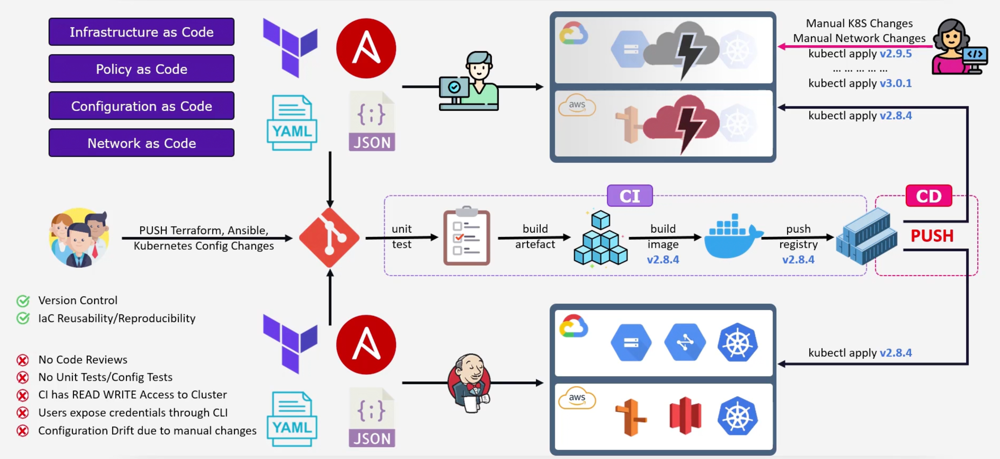


## GitOps Methodology
GitOps is a ***framework*** where the entire code delivery process is controlled by Git. GitOps can be considered as an extension of Infrastructure as Code (IaC) that uses Git as the version control system.

A GitOps Operator runs in the cluster and ensures that the desired state of the cluster matches the state defined in the Git repository. The GitOps Operator can also apply them in a different cluster as well.

## GitOps Principles
GitOps has four principles:
1. GitOps Is `Declarative`.
2. GitOps Apps Are `Versioned` and `Immutable`. Source of truth is Git.
3. GitOps Apps Are `Pulled Automatically`. GitOps Operator or Software agents, pull the changes from the Git repository.
4. GitOps Apps Are `Continuously Reconciled`. Three states `Observe`, `Diff`, and `Act`.

## DevOps vs GitOps

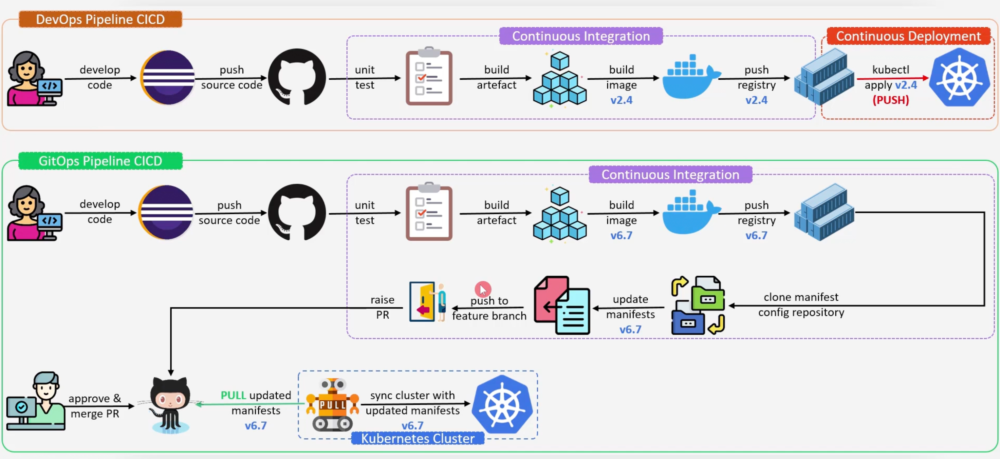

## Push vs Pull Deployments
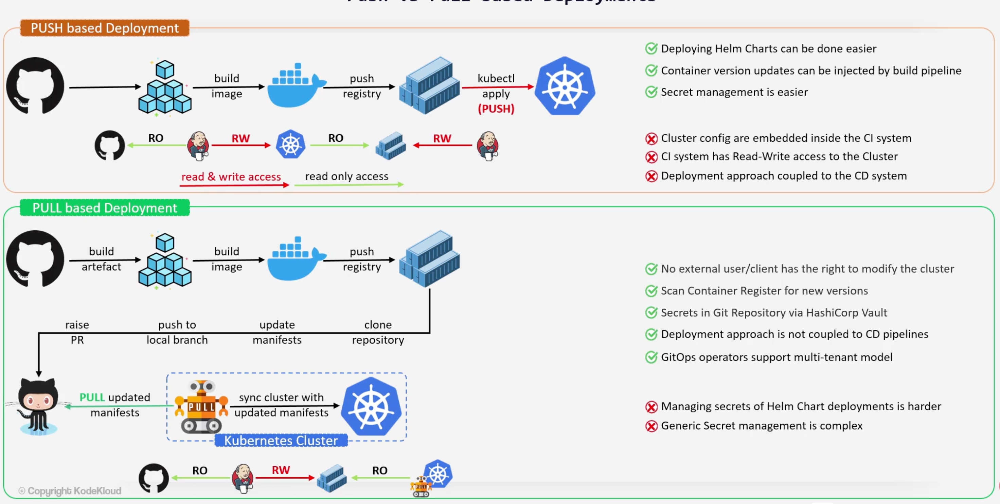


## Concepts and Terminologies
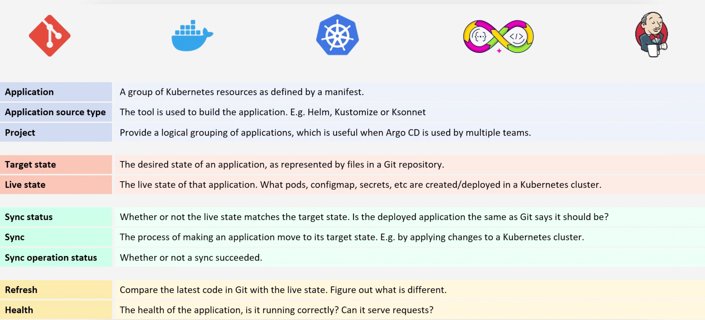


## Features
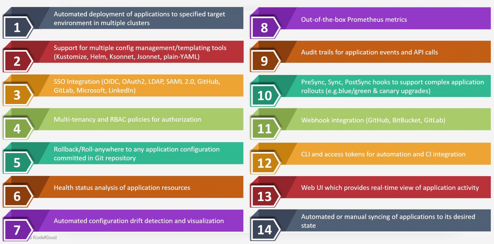


## Architecture
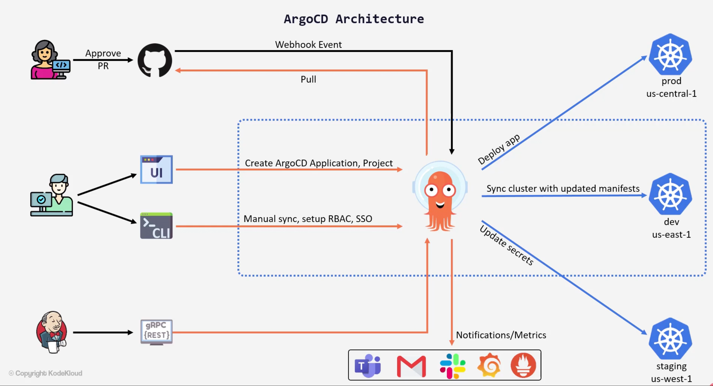

## Installation Options
```bash
kubectl create namespace argocd
kubectl apply -n argocd -f https://raw.githubusercontent.com/argoproj/argo-cd/stable/manifests/install.yaml
```

```bash
helm repo add argo https://argoproj.github.io/argo-helm
helm update
helm search repo argo
helm install my-argo-cd argo/argo-cd --version 4.8.0 # Default is the non HA version
```

To interact with the ArgoCD API server, we need to download the CLI.
```bash
curls -sSL -o /usr/local/bin/argocd https://github.com/argoproj/argo-cd/releases/latest/download/argocd-linux-amd64

chmod +x /usr/local/bin/argocd
```

## Applications
An application is a Kubernetes ***Custom Resource Definition (CRD)*** which represents a deployed application in a cluster. An application is defined by two pieces of information:
- The source: A Git repository and a path within that repository. Where the desired state of the kubernetes manifests live.
- The destination: A target cluster and namespace.
- Also: Project Name, Sync Policy, ...etc.

We can have in the source helm charts, kustomize, jsonnet, ...etc.

An application can be created using the `CLI Yaml specification` or the `UI`.

```bash
argocd app create color-app \
--repo https://github.com/sid/app-1.git \
--path team-a/color-app \
--dest-namespace color \
--dest-server https://kubernetes.default.svc 
```

Once the application is created is pulls the application manifests from the git repository and applies them to the target cluster.

```yaml title="color-app.yaml"
apiVersion: argoproj.io/v1alpha1
kind: Application
metadata:
  name: color-app
  namespace: argocd
spec:
  project: default
  source:
    repoURL: https://github.com/sid/app-1.git
    targetRevision: HEAD
    path: team-a/color-app
  destination:
    server: https://kubernetes.default.svc
    namespace: color
  syncPolicy:
    automated:
      selfHeal: true
    syncOptions:
    - CreateNamespace=true
```


## Demo CLI
```bash
argocd app create

argocd app list

argocd app create color-app \
--repo https://github.com/sid/app-1.git \
--path team-a/color-app \
--dest-namespace color \
--dest-server https://kubernetes.default.svc 

argocd app sync color-app
```


## Project
Create a custom project.

```bash
# The default project can deploy applications
# to any destination cluster and ALL namespaces
# and the B*tch can connect to any source!
# Wild, hmmm!
argocd proj list

k -n argocd get applications,appproj

# Let us create a better project ;)
```

```bash
argocd app create solar-system-app-2 \
--repo https://3000-port-6e66d15b8add4d94.labs.kodekloud.com/bob/gitops-argocd \
--path solar-system \
--dest-namespace solar-system \
--dest-server https://kubernetes.default.svc 
```


## Reconciliation loop
The reconciliation function tries to bring the actual state of the cluster to the desired state. 

The reconciliation loop is how often your argoCD application will sync from git. 

The default timeout is 3 minutes. It is called the application reconciliation timeout.

```bash
kubectl -n argocd describe po argocd-repo-server | grep -i reconciliation

kubectl -n argocd patch configmap argocd-cm -p '{"data": {"timeout.reconciliation": "300s"}}'

kubectl -n argocd rollout restart deploy argocd-repo-server

# Now it will check for changes in GIT repo every 5 minutes
kubectl -n argocd describe po argocd-repo-server | grep -i reconciliation -B1
```

The api-server can be setup to receive webhooks events in order to remove the pulling delay.

Within our git provider we can setup a webhook to send a POST request to the argoCD api-server.


## Health Checks

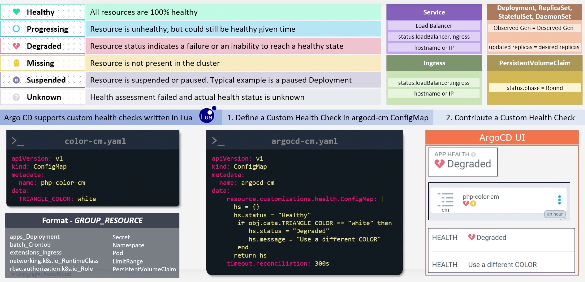


## Sync Strategies

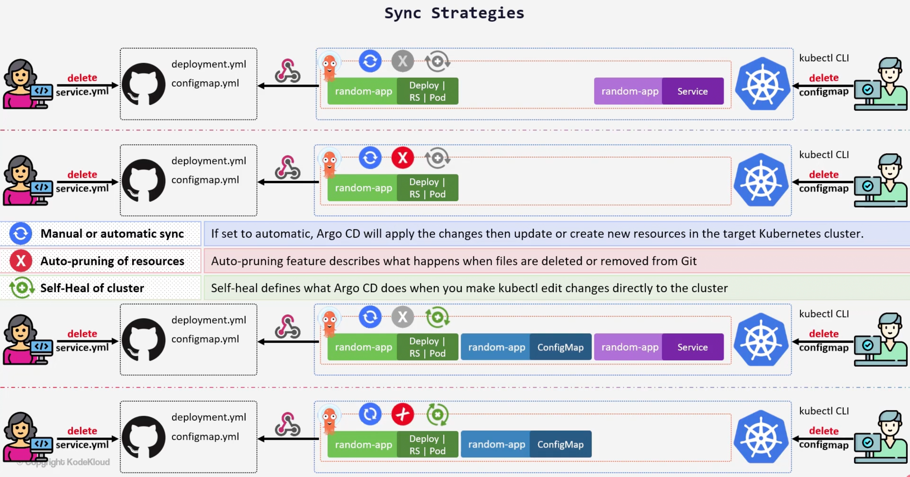

## Declarative

```yaml title="declarative/mono-app/geocentric-app.yaml"
apiVersion: argoproj.io/v1alpha1
kind: Application
metadata:
  name: geocentric-model-app
  namespace: argocd
spec:
  project: default
  source:
    repoURL: https://github.com/sidd-harth/test-cd.git
    targetRevision: HEAD
    path: ./declarative/manifests/geocentric-model
  destination:
    server: https://kubernetes.default.svc
    namespace: geocentric-model
  syncPolicy:
    syncOptions:
    - CreateNamespace=true
    automated:
      prune: true
      selfHeal: true
```

## App of Apps

```yaml title="declarative/multi-app/app-of-apps.yaml"
apiVersion: argoproj.io/v1alpha1
kind: Application
metadata:
  name: app-of-apps
spec:
  project: default
  source:
    repoURL: https://github.com/sidd-harth/test-cd.git
    targetRevision: HEAD
    path: ./declarative/app-of-apps
  destination:
    server: https://kubernetes.default.svc
    namespace: argocd
  syncPolicy:
    automated:
      prune: true
      selfHeal: true
```

```yaml title="declarative/app-of-apps/circle-app.yaml"
apiVersion: argoproj.io/v1alpha1
kind: Application
metadata:
  name: circle-app
  namespace: argocd
spec:
  project: default
  source:
    repoURL: https://github.com/sidd-harth/test-cd.git
    targetRevision: HEAD
    path: ./declarative/manifests/circle
  destination:
    server: https://kubernetes.default.svc
    namespace: circle
  syncPolicy:
    syncOptions:
    - CreateNamespace=true
```

```bash
kubectl -n argocd apply -f app-of-apps.yaml
```

## Helm
Remember:
- `Chart.yaml`.
- `templates/NOTES.txt`.
- `templates/_helpers.tpl`.


## Multi Cluster Deployment 
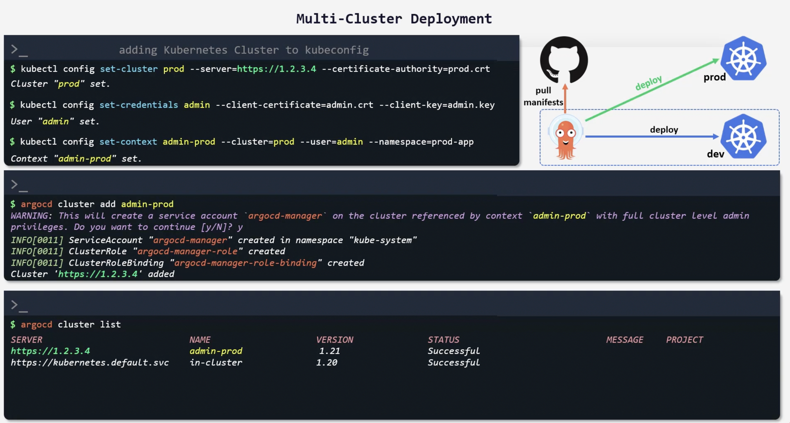

## RBAC
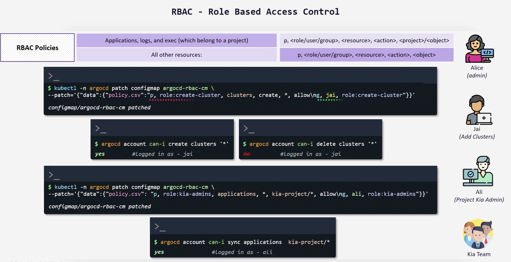

## User Management

### Local user management
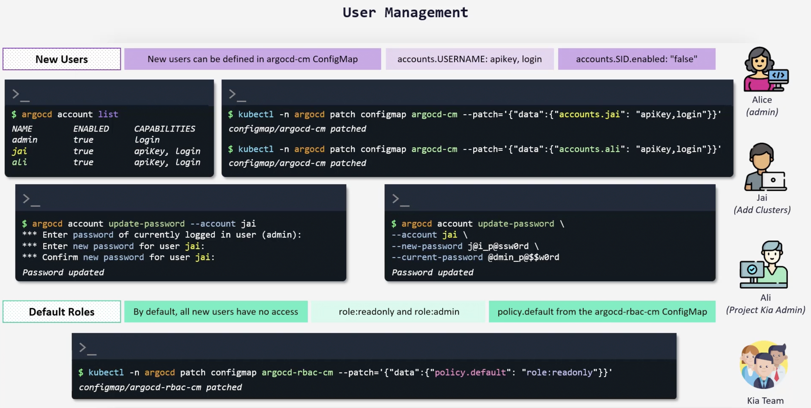

### Dex Okta Connector
Dex is an identity service that uses OpenID Connect to drive authentication for other apps. When a user logs in using dex, the user's identity is usually stored and authenticated by an external identity provider iDp like Okta, Google, GitHub, ...etc.

Dex acts as a shim between client application and the identity provider. In this example, the client application is ArgoCD and the IdP is Okta.

Dex supports multiple IdPs. If we go with okta we can go with a SAML application. 

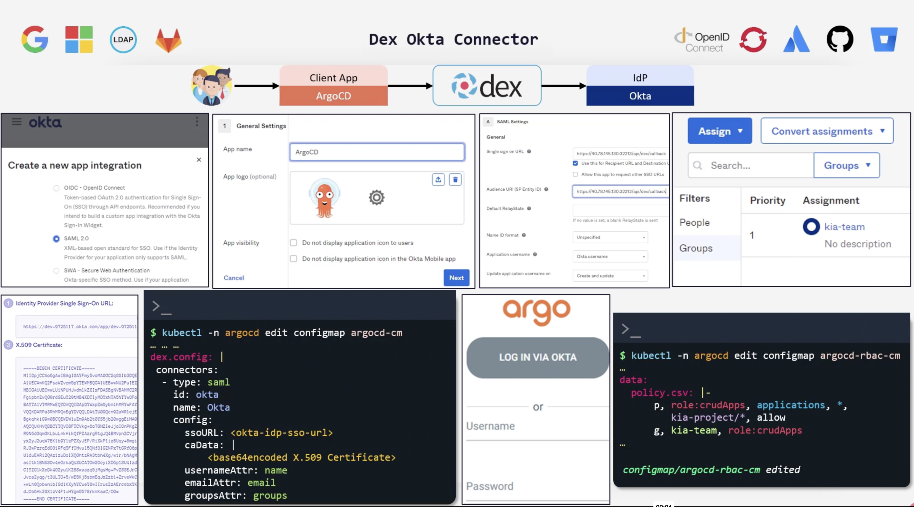

## Bitnami Sealed Secrets


## Vault
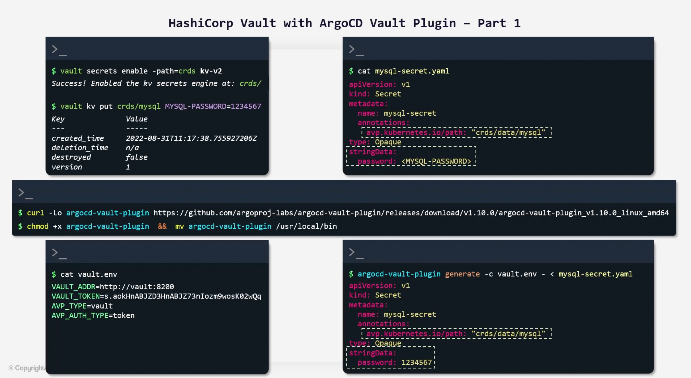

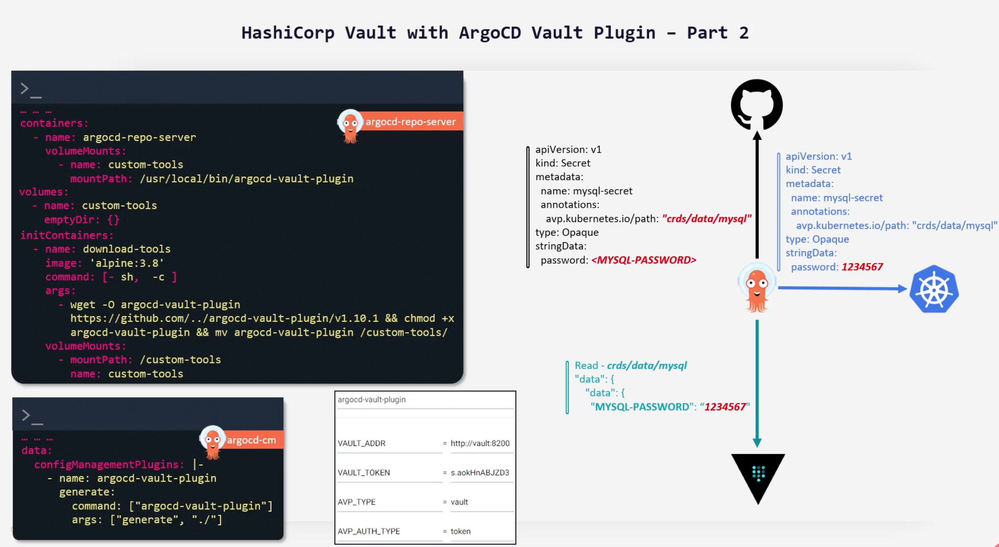

## Alertmanager

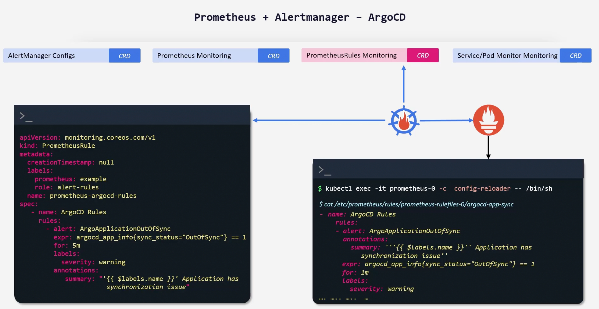

## Notification


## CICD & GitOps

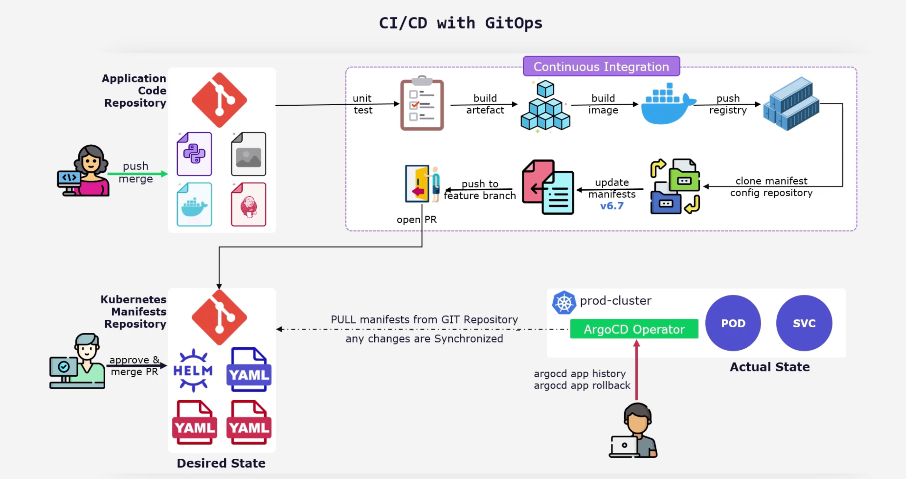


