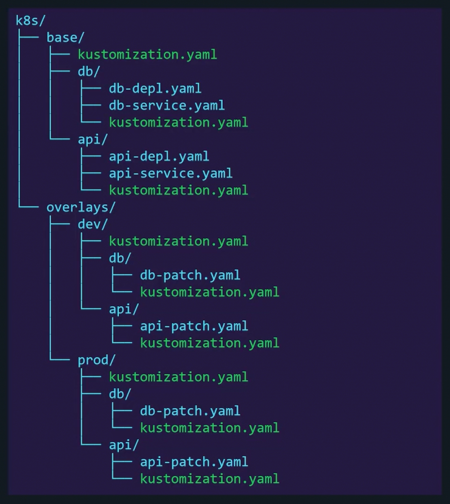
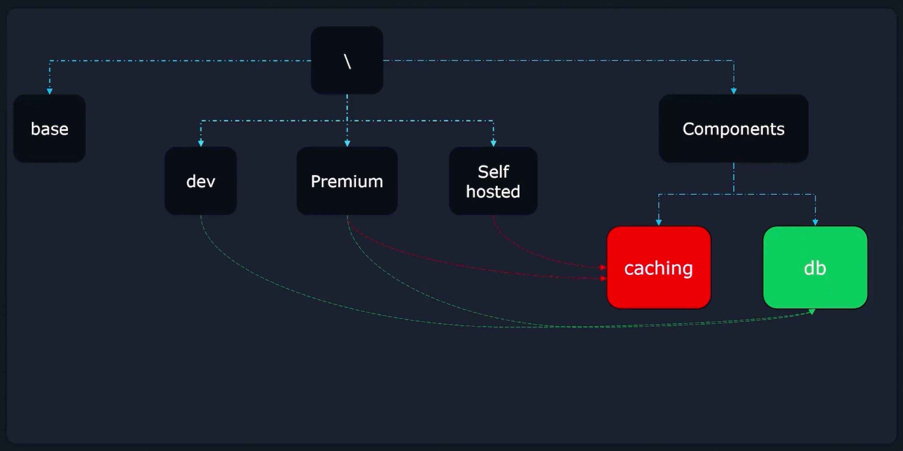
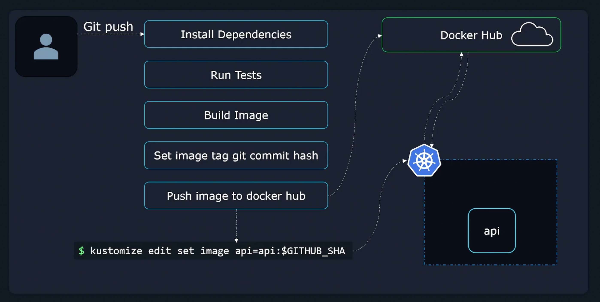

```mdx-code-block
import Tabs from '@theme/Tabs';
import TabItem from '@theme/TabItem';
```

In this section we will learn about Kustomize, and how to use it deploy and make modifications to Kubernetes resources across different environments.


## Problem Statement & Idealogy
We have to first know what problem Kustomize is solving. So, assume we have the following deployment:

```yaml
apiVersion: apps/v1
kind: Deployment
metadata:
  name: nginx-deployment
spec:
  replicas: 1
  selector:
    matchLabels:
      component: nginx
  template:
    metadata:
      labels:
        component: nginx
    spec:
      containers:
      - name: nginx
        image: nginx
```

We will have multiple environments e.g. `dev`, `stg`, `prod`. We want to kustomize our deployment so it behaves differently in each one of our environments. E.g. replicas count is per environment bases.

One of the simplest solutions is to create separate directories for each environment and have a separate deployment file in each directory. We will end up ***duplicating*** the configs across all our environments. 

A better solution is to use Kustomize:
We need to reuse our k8s configs and only modify what needs to be changed. Keep it DRY.

Kustomize has two key terms that we have to understand:
- **Base**: The base config represents the common configuration that is shared across all environments. And provides default values.
- **Overlay**: The overlay allows us to customize the behavior on a per-environment basis. 


```yaml title="base/deployment.yaml"
apiVersion: apps/v1
kind: Deployment
metadata:
  name: nginx-deployment
spec:
  replicas: 1
  selector:
    matchLabels:
      component: nginx
  template:
    metadata:
      labels:
        component: nginx
    spec:
      containers:
      - name: nginx
        image: nginx
```

```yaml title="overlays/dev/deployment.yaml"
spec:
  replicas: 1
```

```yaml title="overlays/stg/deployment.yaml"
spec:
  replicas: 2
```

```yaml title="overlays/prod/deployment.yaml"
spec:
  replicas: 3
```

## Folder Structure
- `k8s` directory:
    - `base` directory:
        - `kustomization.yaml`.
        - `nginx-deploy.yaml`.
        - `service.yaml`.
        - `redis-deploy.yaml`.
    - `overlays` directory:
        - `dev` directory:
            - `kustomization.yaml`.
            - `deployment.yaml`.
        - `stg` directory:
            - `kustomization.yaml`.
            - `deployment.yaml`.
        - `prod` directory:
            - `kustomization.yaml`.
            - `deployment.yaml`.

> Base Config: Shared of default across all environments.
> Overlay Config: Environment specific configurations that add or modify the base config.


## Workflow
We will have our `Base Configs` and `Overlay Configs` as inputs to kustomize then it will Output the `Final Manifests` files.

Kustomize comes built-in with kubectl. We may need to install it tho. As the one that comes with kubectl is not always the latest version.

We are not making any use of complex and hard to read templating engines like Helm.

## Helm vs Kustomize
Helm solves the same issue by making use of go templates to allow assigning variables to properties.

But helm ***way more than*** just a tool to customize configurations on a per-environment basis. Helm is also a complete ***package manager*** for your app. E.g. yum, apt, npm, etc.

Helm is complex and comes with extra features like conditionals, loops, functions, and hooks.

## Install Kustomize
pre-requisite: 
- kubernetes cluster.
- kubectl installed on local machine and configured to connect to the cluster.

```bash
curl -s "https://raw.githubusercontent.com/kubernetes-sigs/kustomize/master/hack/install_kustomize.sh"  | bash

kustomize version --short
```

## kustomization.yaml
Kustomize looks for `kustomization.yaml` file in the directory where it is run. You can not change its name. And there are two things that needs to exist in it:
- `resources`: List of all the resources to be managed by kustomize.
- `commonLabels`: Customizations that need to be made.

```yaml title="k8s/kustomization.yaml"
resources:
- nginx-deploy.yaml
- nginx-service.yaml

commonLabels:
  compony: KodeKloud
```

```bash
kustomize build k8s
```

```yaml title="k8s/nginx-deploy.yaml"
apiVersion: apps/v1
kind: Deployment
metadata:
  name: nginx-deployment
  labels:
    company: KodeKloud
spec:
  replicas: 1
  selector:
    matchLabels:
      component: nginx
      company: KodeKloud
  template:
    metadata:
      labels:
        component: nginx
        company: KodeKloud
    spec:
      containers:
      - name: nginx
        image: nginx
---
apiVersion: v1
kind: Service
metadata:
  name: nginx-loadbalancer-service
  labels:
    company: KodeKloud
spec:
  ports:
  - port: 80
    protocol: TCP
    targetPort: 3000
  selector:
    component: nginx
    company: KodeKloud
  type: LoadBalancer
```

What we learned:
1. Kustomize will look for a `kustomization.yaml` file that contains two things:
    - `resources`: List of all kubernetes manifests kustomize should manage.
    - All the customizations that should be applied to the resources.
2. The kustomize build command combines all the manifests and applies the defined transformations.
3. The `kustomize build` command does not apply/deploy the kubernetes resources. It only generates the final manifests.
4. (TO APPLY) take output and redirect it to `kubectl apply -f -` to apply the changes.

## Kustomize Output
```bash
kustomize build k8s

kustomize build k8s | kubectl apply -f -
# Or
kubectl apply -k k8s

kustomize build k8s | kubectl delete -f -
# Or
kubectl delete -k k8s
```


## Kustomize API version and Kind
```yaml title="k8s/kustomization.yaml"
# (Optional) 
apiVersion: kustomize.config.k8s.io/v1beta1
kind: Kustomization
```

## Managing Directories


```bash
kustomize build k8s | kubectl apply -f -

kubectl apply -k k8s
```


## Common Transformers
- `commonLabels`: Add labels to all resources.
- `commonAnnotations`: Add annotations to all resources.
- `namePrefix/nameSuffix`: Add a prefix or suffix to the name of all resources.
- `namespace`: Set the namespace for all resources.

```yaml title="k8s/kustomization.yaml"
apiVersion: kustomize.config.k8s.io/v1beta1
kind: Kustomization

commonLabels:
  org: KodeKloud

namespace: lab

namePrefix: KodeKloud-
nameSuffix: -dev

commonAnnotations:
  branch: master
```

## Image Transformers
```yaml title="k8s/kustomization.yaml"
apiVersion: kustomize.config.k8s.io/v1beta1
kind: Kustomization

images:
- name: nginx
  newTag: 1.16
  newName: haproxy
```

## Patches Intro
kustomize patches provides another method to customize kubernetes resources. Unlike common transformers, patches provides a more "surgical" approach to targeting one or more sections in a kubernetes resource.

To create a patch we have to provide three different parameters:
- `Operation type`: Add, Remove, Replace, ...etc.
- `Target`: What resource should this patch be applied to:
    - `kind`: The kind of resource.
    - `name`: The name of the resource.
    - Version/Group
    - Namespace
    - LabelSelector
    - AnnotationSelector
- `Value`: The value to be patched.

```yaml title="k8s/api-depl.yaml"
apiVersion: apps/v1
kind: Deployment
metadata:
  name: api-deployment
spec:
  replicas: 1
  selector:
    matchLabels:
      component: api
  template:
    metadata:
      labels:
        component: api
    spec:
      containers:
      - name: nginx
        image: nginx
```

```yaml title="k8s/kustomization.yaml"
patches:
- target:
    kind: Deployment
    name: api-deployment
  patch: |-
  - op: replace
    path: /metadata/name
    value: web-deployment
- target:
    kind: Deployment
    name: api-deployment
  patch: |-
  - op: replace
    path: /spec/replicas
    value: 5
```

## Define a Patch
in Kustomize there are two ways to define a patch:
- `Json 6902`: You need to provided **target** and the **patch details**. [RFC 6902](https://datatracker.ietf.org/doc/html/rfc6902).
- `Strategic Merge Patch`: Uses regular kubernetes configs to define the patch.

```yaml title="k8s/kustomization.yaml"
patches:
- patch: |-
    apiVersion: apps/v1
    kind: Deployment
    metadata:
      name: api-deployment
    spec:
      replicas: 5
```

## Different Patch Types
Basically, `Json 6902 Inline` vs  `Separate File`. Before we saw the Inline method. Now we will see the Separate File method.

```yaml title="k8s/kustomization.yaml"
patches:
- path: replica-patch.yaml
  target:
    kind: Deployment
    name: nginx-deployment
```

```yaml title="k8s/replica-patch.yaml"
- op: replace
  path: /spec/replicas
  value: 5
```

SAme with `Strategic Merge Patch`:
```yaml title="k8s/kustomization.yaml"
patches:
- replica-patch.yaml
```

```yaml title="k8s/replica-patch.yaml"
apiVersion: apps/v1
kind: Deployment
metadata:
  name: api-deployment
spec:
  replicas: 5
```

## Patches Examples

### Dictionary Patch
```yaml title="k8s/api-depl.yaml"
apiVersion: apps/v1
kind: Deployment
metadata:
  name: api-deployment
spec:
  replicas: 1
  selector:
    matchLabels:
      component: api
  template:
    metadata:
      labels:
        component: api
    spec:
      containers:
      - name: nginx
        image: nginx
```

<Tabs>

<TabItem value="Json 6902">

```yaml title="k8s/kustomization.yaml"
patches:
- target:
    kind: Deployment
    name: api-deployment
  patch: |-
    - op: replace
      path: /spec/template/metadata/labels/component
      value: web
```

</TabItem>

<TabItem value="Strategic Merge Patch">

```yaml title="k8s/kustomization.yaml"
patches:
- patch: |-
    apiVersion: apps/v1
    kind: Deployment
    metadata:
      name: api-deployment
    spec:
      template:
        metadata:
          labels:
            component: web
```

</TabItem>

</Tabs>

### Add a new Key
```yaml title="k8s/api-depl.yaml"
apiVersion: apps/v1
kind: Deployment
metadata:
  name: api-deployment
spec:
  replicas: 1
  selector:
    matchLabels:
      component: api
  template:
    metadata:
      labels:
        component: api
    spec:
      containers:
      - name: nginx
        image: nginx
```

<Tabs>

<TabItem value="Json 6902">

```yaml title="k8s/kustomization.yaml"
patches:
- target:
    kind: Deployment
    name: api-deployment
  patch: |-
    - op: add
      path: /spec/template/metadata/labels/org
      value: KodeKloud
```

</TabItem>

<TabItem value="Strategic Merge Patch">

```yaml title="k8s/kustomization.yaml"
patches:
- patch: |-
    apiVersion: apps/v1
    kind: Deployment
    metadata:
      name: api-deployment
    spec:
      template:
        metadata:
          labels:
            org: KodeKloud
```

</TabItem>

</Tabs>

### Remove

<Tabs>

<TabItem value="Json 6902">

```yaml
patches:
- target:
    kind: Deployment
    name: api-development
  patch: |-
  - op: remove
    path: /epc/template/metadata/labels/org
```

</TabItem>

<TabItem value="Strategic Merge Patch">

```yaml title="k8s/kustomization.yaml"
patches:
- patch: |-
    apiVersion: apps/v1
    kind: Deployment
    metadata:
      name: api-deployment
    spec:
      template:
        metadata:
          labels:
            org: null
```

</TabItem>

</Tabs>

### Patches List
```yaml title="k8s/api-depl.yaml"
apiVersion: apps/v1
kind: Deployment
metadata:
  name: api-deployment
spec:
  replicas: 1
  selector:
    matchLabels:
      component: api
  template:
    metadata:
      labels:
        component: api
    spec:
      containers:
      - name: nginx
        image: nginx
```

The container section expects a list.

<Tabs>

<TabItem value="Json 6902">

```yaml title="k8s/kustomization.yaml"
patches:
- target:
    kind: Deployment
    name: api-deployment
  patch: |-
    - op: replace
      path: /spec/template/spec/containers/0
      value:
        name: haproxy
        image: haproxy
```

</TabItem>


<TabItem value="Strategic Merge Patch">

```yaml title="k8s/kustomization.yaml"
patches:
- patch: |-
    apiVersion: apps/v1
    kind: Deployment
    metadata:
      name: api-deployment
    spec:
      template:
        spec:
          containers:
          - name: nginx
            image: haproxy
```

</TabItem>

</Tabs>

### Add List

<Tabs>

<TabItem value="Json 6902">

```yaml title="k8s/kustomization.yaml"
patches:
- target:
    kind: Deployment
    name: api-deployment
  patch: |-
    - op: add
      # "-" means append to the end
      # "0" means insert at the beginning
      # "i" means insert at index i
      path: /spec/template/spec/containers/-
      value:
        name: haproxy
        image: haproxy
```

</TabItem>

<TabItem value="Strategic Merge Patch">

```yaml title="k8s/kustomization.yaml"
patches:
- patch: |-
    apiVersion: apps/v1
    kind: Deployment
    metadata:
      name: api-deployment
    spec:
      template:
        spec:
          containers:
          - name: haproxy
            image: haproxy
```

</TabItem>

</Tabs>


### Replace List

<Tabs>

<TabItem value="Json 6902">

```yaml title="k8s/kustomization.yaml"
patches:
- target:
    kind: Deployment
    name: api-deployment
  patch: |-
    - op: replace
      path: /spec/template/spec/containers/0
      value:
        name: haproxy
        image: haproxy
```

</TabItem>

<TabItem value="Strategic Merge Patch">

```yaml title="k8s/kustomization.yaml"
patches:
- patch: |-
    apiVersion: apps/v1
    kind: Deployment
    metadata:
      name: api-deployment
    spec:
      template:
        spec:
          containers:
          - name: nginx
            image: haproxy
```

</TabItem>

</Tabs>

## Overlays
```bash
tree k8s
k8s
├── base
│   ├── kustomization.yaml
│   ├── nginx-deploy.yaml
│   ├── redis-depl.yaml
│   └── service.yaml
└── overlays
    ├── dev
    │   ├── config-map.yaml
    │   └── kustomization.yaml
    ├── prod
    │   ├── config-map.yaml
    │   ├── grafana-depl.yaml
    │   └── kustomization.yaml
    └── stg
        ├── config-map.yaml
        └── kustomization.yaml

5 directories, 11 files
```

```yaml title="k8s/base/nginx-deploy.yaml"
apiVersion: apps/v1
kind: Deployment
metadata:
  name: nginx-deployment
spec:
  replicas: 1
```

We want to change `replicas` per environment basis:

```yaml title="k8s/base/kustomization.yaml"
resources:
- nginx-deploy.yaml
- redis-depl.yaml
- service.yaml
```

```yaml title="k8s/overlays/dev/kustomization.yaml"
bases:
- ../../base

patches:
- target:
    kind: Deployment
    name: nginx-deployment
  patch: |-
    - op: replace
      path: /spec/replicas
      value: 2
```

```yaml title="k8s/overlays/prod/kustomization.yaml"
bases:
- ../../base

resources:
- grafana-depl.yaml

patches:
- patch: |-
    - op: replace
      path: /spec/replicas
      value: 3
```

### Directory Structure



## Components
Components provides the ability to define reusable pieces of configuration logic(resources + patches) that can be included in multiple overlays.

Components are useful in situations where applications support multiple optional features that need to be enabled only in a subset of overlays.



### Example


```yaml title="k8s/components/db/postgres-depl.yaml"
apiVersion: apps/v1
kind: Deployment
metadata:
  name: postgres-deployment
spec:
  replicas: 1
  selector:
    matchLabels:
      component: postgres
  template:
    metadata:
      labels:
        component: postgres
    spec:
      containers:
      - name: postgres
        image: postgres
```

```yaml title="k8s/components/db/kustomization.yaml"
apiVersion: kustomize.config.k8s.io/v1beta1
kind: Component # Important

resources:
- postgres-depl.yaml

secretGenerator:
- name: postgres-cred
  literals:
  - password=postgres123

patches:
- deployment-patch.yaml
```

```yaml title="k8s/components/db/deployment-patch.yaml"
# A Strategic Merge Patch
# Targeting the `api-depl` in the `k8s/base` directory
apiVersion: apps/v1
kind: Deployment
metadata:
  name: api-deployment
spec:
  template:
    spec:
      containers:
      - name: api
        env:
        - name: DB_PASSWORD
          valueFrom:
            secretKeyRef:
              name: postgres-cred
              key: password
```

```yaml title="k8s/overlays/dev/kustomization.yaml"
bases:
- ../../base

components:
- ../../components/db
```

## Generators
***What problem does `secretGenerator` and `configMapGenerator` solve?*** In this example we have:
- `k8s/api-depl.yaml`
- `k8s/db-configMap.yaml`

```yaml title="k8s/db-configMap.yaml"
apiVersion: v1
kind: ConfigMap
metadata:
  name: db-credentials
data:
  # You want to do that inside a secret actually
  # Anything we do in this demo also applies to
  # secrets
  password: "password1"
```

```yaml title="k8s/api-depl.yaml"
apiVersion: apps/v1
kind: Deployment
metadata:
  name: nginx-deployment
spec:
  replicas: 1
  selector:
    matchLabels:
      component: nginx
  template:
    metadata:
      labels:
        component: nginx
    spec:
      containers:
      - name: nginx
        image: nginx
        env:
        - name: DB_PASSWORD
          valueFrom:
            configMapKeyRef:
              name: db-credentials
              key: password
```

```bash
kubectl exec nginx-deployment-xxxx -- env | grep DB_PASSWORD
kubectl exec nginx-deployment-xxxx -- printenv | grep -i db
```

A couple of month later we wanted to change the password of our database.. We have to tell kubernetes we updated this. You will change the `db-configMap.yaml` file and then apply it. But the `nginx-deployment` is ***unchanged***.

```bash
kubectl rollout restart deployment nginx-deployment
```

### Secret / Config Generator
When you define a generator in kustomize. It is going to create a `ConfigMap` or `Secret` resource for you. But it appends a `hash` to the name of the resource. e.g. `db-credentials-xxxxx`. When you create a `deployment.yaml` file you just reference the `db-credentials` and kustomize will automatically update the `deployment.yaml` file with the new name of the `ConfigMap` or `Secret`. 

Overtime we wanted to update the password of the database. Our generator will create a new `ConfigMap` or `Secret` with a new name. And then update the `deployment.yaml` file with the new name of the `ConfigMap` or `Secret`. That will trigger a rollout of the deployment ^^.

### Configure generators
```yaml title="kustomization.yaml"
configMapGenerator:
- name: db-credentials
  literals:
  - password=password1
```

Result:

```yaml title="configMap.yaml"
apiVersion: v1
kind: ConfigMap
metadata:
  name: db-credentials-xxxxx
data:
  password: password1
```

### File Generators

```yaml title="kustomization.yaml"
configMapGenerator:
- name: nginx-config
  files:
  - nginx.conf

configMapGenerator:
- name: ingress-nginx-14314
  files:
  - ingress-nginx-14314.json
  options:
    disableNameSuffixHash: true
    labels:
      grafana_dashboard: "1"
```

```yaml title="Nginx.conf"
server {
  listen 80;
  server_name example.com;
  location / {
    proxy_pass http://localhost:3000;
  }
}
```

Result:

```yaml title="configMap.yaml"
apiVersion: v1
kind: ConfigMap
metadata:
  name: nginx-config-xxxxx
data:
  nginx.conf: |
    server {
      listen 80;
      server_name example.com;
      location / {
        proxy_pass http://localhost:3000;
      }
    }
```

### Secret Generators
```yaml title="kustomization.yaml"
secretGenerator:
- name: db-cred
  literals:
  - password=password1
```

Result:

```yaml title="secret.yaml"
apiVersion: v1
kind: Secret
type: Opaque
metadata:
  name: db-cred-xxxx
data:
  password: cGFzc3dvcmQx
```

## Garbage Collection
Setup kubernetes to automatically clean `stale configs`. 

```bash title="First Way"
kubectl apply -k k8s/overlays/prod --prune -l app-config=my-config
```

## Imperative Commands
kustomize provides the ability to imperatively update the `kustomization.yaml` files using `edit` command.

```bash
kustomize edit --help

kustomize edit set image nginx=nginx:1.2.2

kustomize edit set namespace staging

kustomize edit set label org:KodeKloud env:staging

kustomize edit set replicas nginx-deployment=3


kustomize edit add configmap db-creds --from-literal=password=password1 --from-literal=username=root 

kustomize edit add resource db/db-depl.yaml
```

```yaml title="k8s/kustomization.yaml"
images:
- name: nginx
  newTag: 1.2.2

namespace: staging

commonLabels:
  org: KodeKloud
  env: staging

replicas:
- count: 5
  name: nginx-deployment

configMapGenerator:
- name: db-creds
  literals:
  - password=password1
  - username=root

resources:
- db/db-depl.yaml
```

***Which `kustomization.yaml` file are we updating?!*** the one in the directory you ran the command from. 

### Example




