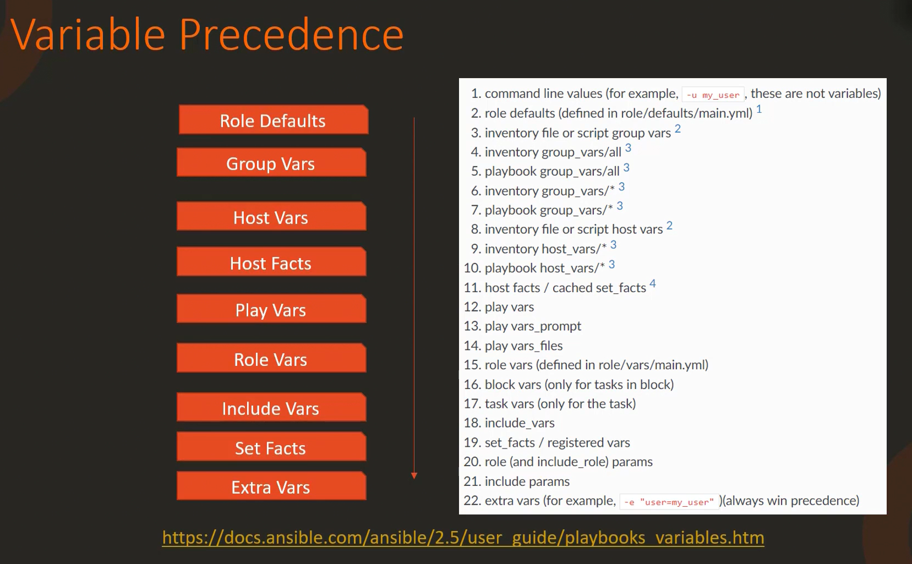

```mdx-code-block
import Tabs from '@theme/Tabs';
import TabItem from '@theme/TabItem';
```

## What is Ansible
Ansible is an it automation tool that automates:
- Provisioning.
- Configuration management.
- Continuous delivery.
- Application deployment.
- Security and compliance.

## Ansible Configuration file
The default ansible configuration file at `/etc/ansible/ansible.cfg` governs the default behavior of ansible using a set of parameters. It is divided into several sections:
```cfg
[defaults]
inventory = /etc/ansible/hosts
log_path = /var/log/ansible.log

[inventory]
enable_plugins = host_list, virtualbox, yaml, constructed

[privilege_escalation]

[paramiko_connection]

[ssh_connection]

[persistent_connection]

[colors]
```
With in these sections you have options and values. Most of them in th default section.

***How to work, override default configuration files?!***
- Global at `/etc/ansible/ansible.cfg`
- Add `ansible.cfg` for Application Specific at:
    - `/opt/network-playbooks`.
    - `/opt/web-playbooks`.
    - `/opt/db-playbooks`.
- Or `$ANSIBLE_CONFIG=/opt/ansible-web-reusable.cfg ansible-playbook playbook.yml`.

### Precedence
1. `ANSIBLE_CONFIG` environment variable.
2. `ansible.cfg` in the current directory.
3. `.ansible.cfg` in the home directory.
4. `/etc/ansible/ansible.cfg`.

### Overwrite
You can set an environment variable right before running ansible-playbook command.
```bash
# But do check documentation first, Or use ansible config command. 
ANSIBLE_GATHERING=explicit ansible-playbook playbook.yaml 

# to persist
export ANSIBLE_GATHERING=explicit
ansible-playbook playbook.yaml

# Or 
# Create a local copy of the configuration file inside
# /opt/web-playbooks/ansible.cfg
```

```bash title="To debug"
ansible-config list
ansible-config view
ansible-config dump
```

## Ansible Inventory
Ansible is Agentless. A simple ssh connectivity is enough.

Information about these target systems in an inventory file. If you do not create one. ***Ansible will use the default inventory file*** located at `/etc/ansible/hosts/`.

### Sample
The inventory file is in an ENI like format.  
```bash
server-one.company.com
server-two.company.com

[mail]
server-three.company.com
server-four.company.com

[db]
server-five.company.com
server-six.company.com

[web]
server-seven.company.com
server-eight.company.com
```

We can also group different servers together by defining it like above.

***Use aliases***.

```bash
web  ansible_host=server-one.company.com   ansible_connection=ssh   ansible_user=root
db   ansible_host=server-two.company.com   ansible_connection=winrm ansible_user=admin
mail ansible_host=server-three.company.com ansible_connection=ssh   ansible_ssh_pass=P@ssw0rd
web2 ansible_host=server-four.company.com  ansible_connection=winrm

localhost ansible_connection=localhost
```

Other inventory Parameters are:
- `ansible_connection` ssh/winrm/localhost. It defines how ansible connects
- `ansible_port` 22/5986
- `ansible_user` root/administrator
- `ansible_ssh_pass` Password

## Inventory Formats
***Why do you need different inventory formats ??***

Consider the example of two companies. The first is a small startup with a few services handling basic functions like web hosting and database management.

The second is a multinational corporation with hundreds of servers spread around the globe. Handling diverse functions like e-commerce, customer-support and data analysis.

For the small startup. A simple INI format inventory would suffice. It is like a basic organizational chart with only a few departments.

However, for the multinational corporation. A more detailed and structured inventory would be needed. This is where the yaml format comes in. It is like a complex organizational chart with various departments, sub-departments and teams.

The different inventory also offer flexibility, allowing you tio group your servers based on their roles like web servers, database servers and application servers in a company. Or their geographic locations like servers in the US, Europe or Asia. Or any other criteria that makes sense for your organization.

Ansible supports two types of inventory formats:
- INI: The simplest and most straight forward. 
- Yaml: More structured and flexible than the INI format.
```yaml
all:
  children:
    webservers:
      hosts:
        web-one.example.com:
        web-two.example.com:
    dbservers:
      hosts:
        db-one.example.com:
        db-two.example.com:
```

## Grouping and Parent Child Relationship
Create a parent group called web servers. And child groups for each location.

<Tabs>
<TabItem value="INI">

```.ini
[web_servers:children]
webservers_us
webservers_eu

[webservers_us]
server1_us.com ansible_host=192.168.8.101
server2_us.com ansible_host=192.168.8.102

[webservers_eu]
server1_eu.com ansible_host=10.12.0.101
server2_eu.com ansible_host=10.12.0.102
```

</TabItem>
<TabItem value="YAML">

```yaml
all:
  children:
    webservers:
      children:
        webservers_us:
          hosts:
            server1_us.com:
              ansible_host: 192.168.8.101
            server2_us.com:
              ansible_host: 192.168.8.102
        webservers_eu:
          hosts:
            server1_eu.com:
              ansible_host: 10.12.0.101
            server2_eu.com:
              ansible_host: 10.12.0.102
```

</TabItem>
</Tabs>

## Ansible variables
Stores information that varies with each host.

```ini
web1 ansible_host=server-one.company.com   ansible_connection=ssh   ansible_user=root
db   ansible_host=server-two.company.com   ansible_connection=winrm ansible_user=admin
web2 ansible_host=server-four.company.com  ansible_connection=winrm
```

```yaml title="Playbook.yaml"
-
    name: Add DNS server to resolv.conf
    hosts: localhost
    vars:
        dns_server: 10.1.250.10 
    tasks:
        - lineinfile:
            path: /etc/resolv.conf
            line: 'nameserver 10.1.250.10'
```

We can also have variables defined in a separate file dedicated for variables. We will discuss them later when we talk about include and rows.
```
variable1: value1
variable2: value2
```

Using variables:
```yaml title="Playbook.yaml"
-
    name: Add DNS server to resolv.conf
    hosts: localhost
    vars:
        dns_server: 10.1.250.10 
    tasks:
        - lineinfile:
            path: /etc/resolv.conf
            line: 'nameserver {{ dns_server }}'
```

Another example:
```yaml
-
  name: Set Firewall Configuration
  hosts: web
  tasks:
  - firewalld:
      service: https
      permanent: true
      state: enabled
  - firewalld:
      port: 8081/tcp
      permanent: true
      state: disabled
  - firewalld:
      port: 161-162/udp
      permanent: true
      state: disabled
  - firewalld:
      port: 192.0.2.0/24
      Zone: internal
      state: enabled
```

```yaml
-
  name: Set Firewall Configuration
  hosts: web
  tasks:
  - firewalld:
      service: https
      permanent: true
      state: enabled
  - firewalld:
      port: '{{ http_port }}'/tcp
      permanent: true
      state: disabled
  - firewalld:
      port: '{{ snmp_port }}'/udp
      permanent: true
      state: disabled
  - firewalld:
      port: '{{ inter_ip_range }}'/24
      Zone: internal
      state: enabled
```

```.ini
# Sample Inventory File
Web http_port=8081 snmp_port=161-162 inter_ip_range=192.0.2.0
```

Even a better way is to move the file into a variable file with the name of the host:
```.var title="web.yaml"
http_port: 8081
snmp_port: 161-162
inter_ip_range=192.0.2.0
```

It is called Jinja2 Templating.

:::warning
Remember to enclose it with quotes. But if the variable is with in a sentence then that is not really required.
:::

### Variable Types
- ***String Variables***: Sequence of characters. Can be defined in a playbook, inventory, or passed as command line arguments.
- ***Number Variables***: Can hold Int or Float point values. Can be used in Math Operations.
- ***Boolean Variables***: Can hold either truthy or falsy values. Often used in conditional statements. 
- ***List Variables***: Hold an ordered collection of values. Can be of any type. 
- ***Dictionary Variables***: Hold key-value pairs. Can be used to store complex data structures. As they can be of any type.
```yaml
username: "admin"
max_connections: 100
debug: true
# Valid True: True, 'true', 't', 'yes', 'y', 'on', '1', 1, 1.0
# Valid False: False, 'false', 'f', 'no', 'n', 'off', '0', 0, 0.0
packages:
- httpd
- mariadb
- php
user:
    name: "admin"
    uid: 1001
```

Example:
```yaml
- name: Install Packages Playbook
  hosts: your_target_hosts
  vars:
    packages:
    - nginx
    - postgresql
    - git
  tasks:
  - name: Display All Packages
    debug:
      var: packages
  - name: Display First Package
    debug:
      var: "The first package is {{ packages[0] }}"
  - name: Install packages using package manager (apt/yum)
    become: true
    debug:
      msg: "Installing {{ item }}"
    loop: "{{ packages }}"
  - name: Access specific values in a dictionary
    debug:
      msg: "The user name is {{ user.name }} and the user id is {{ user.uid }}"
```

## Registering vars and vars Precedence
```.ini
web1 ansible_host=172.20.1.100
web2 ansible_host=172.20.1.101
web3 ansible_host=172.20.1.102

[web_servers]
web1
web2
web3

[web_servers:vars]
# The following is a group variable called dns server.
dns_server=10.5.5.3
```

When the ansible playbook is run, ansible creates these hosts objects in its memory. It then identifies which group each host belongs to. And then associate the group variables to each host.

Each host gets its own copy of that group variable. And that is used throughout the playbook execution.

If we defined the same variable on the host as well.
```.ini
web1 ansible_host=172.20.1.100
web2 ansible_host=172.20.1.101 dns_server=10.5.5.4 
web3 ansible_host=172.20.1.102

[web_servers]
web1
web2
web3

[web_servers:vars]
# The following is a group variable called dns server.
dns_server=10.5.5.3
```

When ansible playbook is run. It:
- First associate the group variables and then the host variables.

To conclude, Host variables take precedence over group variables. And play variables take precedence over host variables.

We can even pass the variable from the command line.
```bash
ansible-playbook playbook.yaml --extra-vars "dns_server=10.5.5.6" # Highest precedence
```

1. Command Line Variables.
2. Play Variables.
3. Host Variables.
4. Group Variables.

For a comprehensive list of all the variables that ansible uses:


### Example
```yaml
---
- name: Check /etc/hosts file
  hosts: all
  tasks:
  - shell: cat /etc/hosts
    register: result
  - debug:
    var: result.stdout
```

:::note
The data stored in the variable depends entirely on the module used. Different modules output data in different formats.
:::

::::info Scope of Registered Variables
Any variable created using the register directive falls under the scope of that host. That variable is then associated to that host and made available for the rest of the playbook execution.

In this case the result variable. has the results of the command at execution for its respective host.

:::warning
Remember they are under the host scope. So, they can be used in the next play if required.
:::
::::

Another easy way to view the output of a task if you do not want to use the debug module, is to use the Ansible command line option `-v` or `--verbose`.

```bash
ansible-playbook -i inventory playbook.yaml -v
```

## Variable Scoping
```.ini title="/etc/ansible/hosts"
web1 ansible_host=172.20.1.100
web2 ansible_host=172.20.1.101 dns_server=10.5.5.4
web3 ansible_host=172.20.1.102
```

```yaml
---
- name: Print DNS Server
  hosts: all
  tasks:
  - debug:
    msg: "The DNS Server is {{ dns_server }}"
```

No it will not work.

:::note
When the ansible playbook is run, the first thing that it does is breaks down the groups and associate variables to hosts. So, when the playbook is run, there is just one scope. ***The host scope.***
:::

### Example
```yaml
---
- name: Play1
  hosts: web1
  vars:
    ntp_server: 10.1.1.1
  tasks
  - debug:
      var: ntp_server
- name: Play2
  hosts: web2
  tasks:
  - debug:
      var: ntp_server
```

The above playbook will output in the second play "VARIABLE IS NOT DEFINED!".

And this is the second type of scope. ***The play scope.***

Finally, there are global variables. E.g. passing a variable as a extra-vars in the command line.

```bash
ansible-playbook playbook.yaml --extra-vars "ntp_server=10.1.1.1"
```

## Magic Variables
The host variables are associated with each host. When ansible playbook starts it first creates three sub processes for each host. 

Before the tasks are run on each host. Ansible goes through a variable interpolation stage. Where it picks up variables from different sources.

A magic variable called `hostvars` is created.

```yaml
---
- name: Print DNS Server
  hosts: all
  tasks:
  - debug:
    msg: "The DNS Server is {{ hostvars[inventory_hostname]['dns_server'] }}"
```

If facts are gathered you can access them using `ansible_facts`.

```yaml
---
- name: Print Facts
  hosts: all
  tasks:
  - debug:
    msg: "The DNS Server is {{ hostvars['web2'].dns_server }}"
  - debug:
    msg: "The OS Family is {{ hostvars['web2'].ansible_facts.architecture }}"
  - debug:
    msg: "The OS Family is {{ hostvars['web2']['ansible_facts']['os_family'] }}"
```

Another magic variable is `groups`. Groups returns all hosts under a givin group. 

```.ini 
[web_servers]
web1
web2
```

```yaml
msg: "{{ groups['web_servers'] }}"
web1
web2
```

Group names are the other ways around `group_names`. Returns all the groups the current host is a member of.

```yaml
msg: "{{ group_names }}" # web1
web_servers
americas
```

Also, `inventory_hostname` a magic variable that gives you the name of the host that is currently being executed in the inventory file.

## Facts
When you run a playbook, and when ansible connects to a target machine. It first collect information about that machine. Such as its basic system architecture, version of operating system, processor details, memory details, serial numbers, etc.

It collects information about the host network connectivity, the different interfaces, IP Addresses, FQDNs, Mac addresses, etc.

As well as device information like, disks, volumes, mounts, and the amount of space available on them etc. The date and time on those systems and other settings as well.

The above information are known as facts in Ansible. Ansible gathers all these facts using setup module.

The setup module is run automatically by ansible to gather facts about the hosts when you run a playbook, even if you did not use this module in your playbook.

For example, in this playbook we have only one task:
```yaml
---
- name: Print hello message
  hosts: all
  tasks:
  - debug:
    msg: "Hello World"
```

All facts are stored in a variable called `ansible_facts`.

```yaml
---
- name: Print Facts
  hosts: all
  tasks:
  - debug:
    var: ansible_facts
```

These details could come in handy within your playbooks. For example, if you were configuring devices and logical volumes on your nodes, you could make certain decisions based on the information about disks gathered as facts.

If you do not want ansible to gather facts about the hosts:
```yaml
---
- name: Print Facts
  hosts: all
  gather_facts: no
  tasks:
  - debug:
    var: ansible_facts
```

It is by default set to implicit inside `/etc/ansible/ansible.cfg`.

:::note
Ansible only gathers facts about hosts that are part of the playbook.
:::

## Playbooks
Playbooks are ansible's orchestration language. It is in playbooks where we define what we want ansible to do. It is a set of instructions you provide Ansible to work its magic.

E.g. it can be as simple as running a series of commands on different servers in a sequence and restarting those servers in particular order.

Or it can be as complex as deploying hundreds of VMs in a public and private cloud infrastructure. Provisioning storage to VMs, setting up their network connectivity, and cluster configuration. Configuring applications on them. Such as web servers or database servers. Load balancers, and monitoring components.

Installing and configuring backup clients. Updating configuration database with information. About the new VMs, etc. 

***A closer Look at how Playbooks are structured***:
```yaml
# A single yaml file. Containing a set of plays.
# Play: Defines a set of tasks to be run on hosts.
# Task: An action to be performed on a host.
#   - Execute a command.
#   - Run a script.
#   - Install a package.
#   - Shutdown/Restart.
---
- name: Play One
  hosts: localhost
  tasks:
  - name: Execute command 'date'
    command: date
  - name: Execute script on server
    script: test_script.sh
  - name: Install httpd service
    yum:
      name: httpd
      state: present
  - name: Start web server
    service:
      name: httpd
      state: started
```

:::note
A playbook is a list of dictionaries in YAML terms. Each play is a dictionary has a set of properties. 

This is not the same for the tasks, tasks is a list or an array as denoted by the dashes. Lists are ordered collections of items. So the positions of entries matter.
:::

:::warning
The hosts is always set at the play level. 
:::

## Modules
The different actions run by a task are called modules. In the above case:
- command.
- script.
- yum.
- service.

Information about ansible modules available on Ansible documentation Or run `ansible-doc -l` to list all the modules.

Finally, once you successfully build the ansible playbook, we run it using the ansible-playbook command.

```bash
ansible-playbook playbook.yaml
ansible-playbook --help
```

## Verify Modules
```bash
# Playbooks Verification before executing them in production environments. Is a crucial Practice.
# Like rehearsal before the actual performance.
# Allowing you to catch and rectify any errors or unexpected behaviors in a controlled environment.
```

Ansible provides several modes for verifying playbooks:
- Check mode: The check mode is a `dry run` mode where Ansible executes the playbook without making any actual changes on the hosts. to run a playbook in check mode, use the `--check` option.
```yaml title="install_nginx.yaml"
# ansible-playbook install_nginx.yaml --check
---
- hosts: webservers
  tasks:
  - name: Ensure nginx
    apt:
      name: nginx
      state: present
    become: true 
```

::::note
Not all ansible modes support check mode.

:::warning
If a task does not support check mode, the playbook will skip it.
:::
::::
- Diff mode: Diff mod when used with check mode, shows the difference between the current state and the state after the playbook is run. Which can be useful for understanding what changes a playbook will make. To run a playbook in diff mode, use the `--diff` option.
```yaml title="configure_nginx.yaml"
# ansible-playbook configure_nginx.yaml --check --diff
---
- hosts: webservers
  tasks:
  - name: Configure nginx
    lineinfile:
      path: /etc/nginx/nginx.conf
      line: 'client_max_body_size 100M;'
    become: true
```

In addition to check mode, and diff mode, ansible also provides a `--syntax-check` option. It checks the syntax of playbook for any errors.

```bash
ansible-playbook playbook.yaml --syntax-check
```

## Lint 
```bash
ansible-lint playbook.yaml
```

## Conditionals

<Tabs>
<TabItem value="Debian">

```yaml
---
- name: Install Nginx
  hosts: webservers
  tasks:
  - name: Install Nginx on Debian
    apt:
      name: nginx
      state: present
```

</TabItem>
<TabItem value="RedHat">

```yaml
---
- name: Install Nginx
  hosts: webservers
  tasks:
  - name: Install Nginx on RedHat
    yum:
      name: nginx
      state: present
```

</TabItem>

<TabItem value="Conditional">

```yaml
---
- name: Install Nginx
  hosts: webservers
  tasks:
  - name: Install Nginx on Debian
    apt:
      name: nginx
      state: present
    when: ansible_os_family == 'Debian' and ansible_distribution_version == '16.04'
  - name: Install Nginx on RedHat
    yum:
      name: nginx
      state: present
    when: ansible_os_family == 'RedHat' or ansible_os_family == 'SUSE'
```

</TabItem>
</Tabs>

### Example
```yaml
---
- name: Install Softwares
  hosts: all
  vars:
    packages:
      - name: nginx
        required: true
      - name: mysql
        required: True
      - name: apache
        required: False
  tasks:
  - name: Install "{{ item.name }}" on Debian
    apt:
      name: "{{ item.name }}"
      state: present
    when: item.required == True
    loop: "{{ packages }}"
```

### Example Two
```yaml
---
- name: Check status of a service and email if its down.
  hosts: localhost
  tasks:
  - command: service httpd status
    register: result
  - mail:
      to: admin@company.com
      subject: Service Alert
      body: Httpd Service is down
      when: result.stdout.find('down') != -1
```

## Conditional Part Two
```yaml
---
- name: Install Nginx on Ubuntu 18.04
  apt:
    name: nginx=1.18.0
    state: present
  when: ansible_facts['os_family'] == 'Debian' and ansible_facts['distribution_major_version'] == '18'
```

## Loops 
```yaml
---
- name: Create users
  hosts: all
  vars:
    users:
      - name: user1
        uid: 1001
      - name: user2
        uid: 1002
      - name: user3
        uid: 1003
  tasks:
  - name: Create users
    user:
      name: "{{ item.name }}"
      uid: "{{ item.uid }}"
    loop: "{{ users }}"
```

## Modules
Ansible modules are categorized into several groups based on their functionality:
- System: Actions to be performed on the system level. such as managing users, groups modifying Ip tables, firewall configuration on the system Working with logical volumes groups, mounting operations or working with services. For example, starting, stopping or restarting services in a system.
```bash
User
Group 
Hostname
Iptables
Lvg
Lvol
Make
Mount
Ping
Timezone
Systemd
Service
```
- Command modules: are use to execute commands or scripts on a host. Or an interactive execution using expect module by responding to prompts.
```bash
Command
Expect
Raw
Script
Shell
```
- File Modules: Helps in working with files. E.g. use the ACL module to set and retrieve ACL information on files.USe archive and unarchive module to compress and decompress files. USe find, lineinfile and replace module to modify the contents of an existing file.
```bash
ACL
Archive
Copy
File
Find
Lineinfile
Replace
Stat
TEMP
Unarchive
```
- Databases Modules: help in working with databases. E.g. MongoDB, MySQL, MSSQL..etc.
```bash
Mongodb
Mssql
Mysql
Postgresql
Proxysql
vertica 
```
- The cloud Section has a vast collection of modules, for various diferent cloud providers like Amazon, Azure, Docker, Google, Openstack, VMware being just a few of them.
- Windows modules helps you use ansible in windows environment.
- Many many more. A comprehensive list can be found at [docs.ansible.com](https://docs.ansible.com)

### Command Module 
Used to execute commands on the target hosts. The paramters of the command module as listed in the documentation page are:

:::note
The reason why Ansible use `started` not `start` is ***idempotency***.

> An operation is idempotent if  the result of performing it once is exactly the same as the result of performing it repeatedly without any intervening actions.
:::

## Plugins


## Handlers
```yaml
---
- name: Deploy Application
  hosts: application_servers
  tasks:
  - name: Copy Application Code
    copy:
      src: app_code/
      dest: /opt/application/
    notify: Restart Application Service
  handlers:
  - name: Restart Application Service
    service:
      name: application_service
      state: restarted
```

## Roles
```yaml
tasks:
- name: Install Pre-requisite Packages
  apt:
    name: "{{ item }}"
    state: present
  with_items:
    - python
    - python-pip
    - python-dev
- name: Install MySQL Server
  apt:
    name: mysql-server
    state: present
- name: Start MySQL Service
  service:
    name: mysql
    state: started
- name: Configure MySQL
  mysql_db:
    name: my_db
    state: present
```

```yaml
- name: Install and Configure MySQL
  hosts: db_servers
  roles:
    - mysql
```

```bash
ansible-galaxy init mysql
ansible-galaxy search mysql
ansible-galaxy install geerlingguy.mysql
ansible-galaxy list
ansible-config dump | grep ROLE 
```

```yaml
- name: Install and configure MySQL
  hosts: db_servers
  roles:
    - role: geerlingguy.mysql
      vars:
        mysql_root_password: password
        mysql_databases:
          - name: my_db
        mysql_users:
          - name: my_user
            password: password
            priv: '*.*:ALL'
```

## Collections
```bash
ansible-galaxy collection install network.cisco
```
