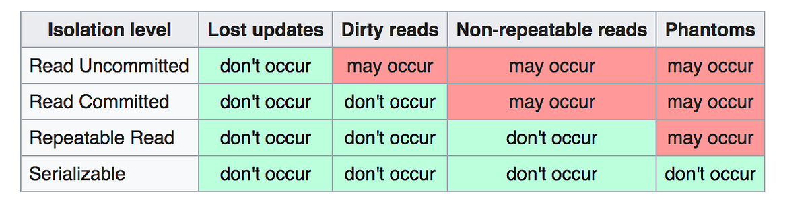

```mdx-code-block
import Tabs from '@theme/Tabs';
import TabItem from '@theme/TabItem';
```

## Course Info
[Fundamentals of Database Engineering](https://www.udemy.com/course/database-engines-crash-course) Learn ACID, Indexing, Partitioning, Sharding, Concurrency control, Replication, DB Engines, Best Practices and More!

## Content
- [ ] 02Hr 16min ACID.
- [ ] 01Hr 12min Internals.
- [ ] 02Hr 06min Indexing.
- [ ] 00Hr 43min B± Trees.
- [ ] 00Hr 50 min Partitioning.
- [ ] 01Hr 17min Sharding.
- [ ] 01Hr 15min Concurrency Control.
- [ ] 00Hr 32min Replication.
- [ ] 01hr 50min System Design.
- [ ] 01Hr 04min Database Engines.
- [ ] 00Hr 34min Database Cursors.
- [ ] 01Hr 05min SQL vs NoSQL.
- [ ] 01Hr 30min Database Security.
- [ ] 00Hr 23min Encrypted Data.
- [ ] 03Hr 30min Q&A.
- [ ] 05Hr 40min Discussions.

## ACID
ACID stands for Atomicity, Consistency, Isolation, Durability. Content:
1. ***First what is a Database Transaction?***
2. ***ACID Properties.***

### What is a Database Transaction?
A collection of queries that are treated as one unit of work. It is impossible to have everything you want in one query. E.g. Account Deposit (SELECT, UPDATE, UPDATE).

***What is a transaction lifespan?*** A transactions always begins with a `BEGIN` statement. It ends with a `COMMIT` or `ROLLBACK` statement. If a transaction is not committed, it is rolled back. Everything you write is not Durable until you commit.

***The nature of transactions.*** Usually, transactions are used to change and modify data. However, it is perfectly normal to have a read only transaction. The db engine will optimize itself. E.g. generate a report and you want to get a consistent snapshot based at the time of the transaction.

```sql
BEGIN;
SELECT BALANCE FROM ACCOUNT WHERE ACCOUNT_ID = 1;
IF BALANCE > 100 THEN
    UPDATE ACCOUNT SET BALANCE = BALANCE - 100 WHERE ACCOUNT_ID = 1;
    UPDATE ACCOUNT SET BALANCE = BALANCE + 100 WHERE ACCOUNT_ID = 2;
END IF;
COMMIT;
```

:::warning Negative Balance
If you ever see data that is negative, that is an indication of inconsistent data.
:::

:::info 
When you do not start a transaction, the db engine will automatically start a transaction for you. This is called an `autocommit` transaction. ***This is not recommended for production.***
:::

### Atomicity
Atomicity means that a transaction is all or nothing. All queries must succeed.

***What happens if the database crashes in the middle of a transaction?*** Incase of a prior to commit crash, All successful queries should be rolled back. Once the database restarts, it should detect the incomplete transaction and roll it back.

There are optimistic and pessimistic strategies for handling transactions. Optimistic is when you assume that everything will go well (So fast). Pessimistic is when you assume that everything will go wrong (Commit will be slow but rollback is lighting fast).

:::note
Lack of atomicity, leads to inconsistency.
:::

:::warning Long Running Rollbacks
Some rollbacks can take as long as an hour!!!. For long transactions, especially in sql server. CPU and Memory will be getting hammered. 
:::

### Isolation
To understand isolation, we need to answer the following questions:
- ***Can my inflight transaction see changes made by other transactions?*** If it is a single user that is fine but we have many tcp connections, we need to isolate them. There are no right or wrong answer. It depends on what you want!

As a result of the above we get a bunch of read phenomena. E.g. Dirty Reads, Non-Repeatable Reads, Phantom Reads. They are bad side effects.

Isolation levels were introduced to solve the undesirable read phenomena.

## Consistency
One of the properties that were traded off in many platforms. 

Consistency in Data, which represents the state of the data that is currently persisted. ***Is what you have in disk consistent ?!***

Consistency in Reads, your data might be consistent on disk but the reading of data becomes inconsistent because you have multiple instances, and they are slightly out of sync.

:::waring
Consistency applies to the system as a whole. Across all the shards, partitions, across all the replicas.
:::

## Read Phenomena
### Dirty Reads 
occurs when a transaction reads shared data that has been modified by another transaction but that transaction is not yet committed. There is a chance that this change will be rolled back or committed. Dirty means: you wrote something but that write is not flushed yet.

:::warning
Remember that you have to have always a bounded query. E.g.:
```sql
-- This is not a bounded query
SELECT PID, QNT*PRICE FROM  SALES;
-- This is a bounded range query
SELECT PID, QNT*PRICE FROM SALES WHERE DATE BETWEEN '2021-01-01' AND '2021-01-31'; 
```
:::

#### Example:
PID | QNT | PRICE
--- | --- | ---
Product 1 | 10 | 5
Product 2 | 20 | 4

```sql
-- TX1
BEGIN;
SELECT PID, QNT*PRICE FROM SALES;
-- Product 1: 50
-- Product 2: 80

-- TX2
BEGIN;
UPDATE SALES SET QNT = QNT+5 WHERE PID = 'Product 1'; -- Sold an extra 5 units of product 1
-- Product 1 | 15 | 5

-- TX1
SELECT SUM(QNT*PRICE) FROM SALES;
-- Should be: 50 + 80 = 130$
-- But it is: 75 + 80 = 155$
-- Reason: we read a "dirty" value that has not been committed yet.

-- TX1
COMMIT;

-- TX2
ROLLBACK; -- We did not make 5 extra sales, false alarm.
```

### Non-Repeatable Reads 
Occurs when a transaction reads the same row twice but gets different data each time. 

#### Example:
PID | QNT | PRICE
--- | --- | ---
Product 1 | 10 | 5
Product 2 | 20 | 4

```sql
-- TX1
BEGIN;
SELECT PID, QNT*PRICE FROM SALES;
-- Product 1: 50
-- Product 2: 80

-- TX2
BEGIN;
UPDATE SALES SET QNT = QNT+5 WHERE PID = 'Product 1'; -- Sold an extra 5 units of product 1
-- Product 1 | 15 | 5
-- This is not a dirty read because we persisted the change. A valid write.
COMMIT;

-- TX1
SELECT SUM(QNT*PRICE) FROM SALES;
-- Should be: 50 + 80 = 130$
-- But it is: 75 + 80 = 155$
-- Inconsistent results.
COMMIT;
```

:::note
This is not a dirty read because it is an actual committed read. But ***the problem is***, this is an Non Repeatable Read. 

> The same query is returning different results.
:::

Fixing Non-Repeatable Reads, is expensive. A lot of databases support it through MVCC (Multi Version Concurrency Control). But not easy as now you have to keep a version of the row at its original state.

PostgreSQL does that, any update creates a new version of the row. While MySQL, Oracle and SQL Server changes the file value. But, keeps another table called the undo. But the undo stack keeps an actual write to disk.

So if a TX wants to read in PostgreSQL, it will read the original version. But in MySQL, it can not read this, it has to go and crack open the undo log (expensive). 

### Phantom Reads 
Occurs when a transaction reads a set of rows that satisfy a certain condition, but another transaction inserts or deletes rows that satisfy that condition before the first transaction completes. E.g. range queries. It is different from non-repeatable reads because it is not about the same row but a set of rows. And you did not actually read it in the first place.

Phantom reads always happens. 

#### Example:
PID | QNT | PRICE
--- | --- | ---
Product 1 | 10 | 5
Product 2 | 20 | 4

```sql
-- TX1
BEGIN;
SELECT PID, QNT*PRICE FROM SALES;
-- Product 1: 50
-- Product 2: 80

-- TX2
-- it did not update anything, it just inserted a new row.
BEGIN;
INSERT INTO SALES (PID, QNT, PRICE) VALUES ('Product 3', 10, 10);
COMMIT;

-- TX1
SELECT SUM(QNT*PRICE) FROM SALES;
-- Should be: 50 + 80 = 130$
-- But it is: 50 + 80 + 10 = 140$
-- Inconsistent results.
COMMIT;

-- It is not a non-repeatable read because we did not read the new row before. Previously we read the same rows and they changed values.
```

***Why we differentiate between the three?*** It is because of the implementation. It comes down to locking. 

Non Repeatable Reads when we read something, we want to guarantee repeatable reads. Anything that the TX reads, obtains a lock on it.

But you can not see the new row to lock it! 

### Lost Update 
A scenario in which two or more transactions update the same row, but neither transaction is aware of the modification made by the other transaction, and the second change overwrites the first modification.

#### Example:
PID | QNT | PRICE
--- | --- | ---
Product 1 | 10 | 5
Product 2 | 20 | 4

```sql
-- TX1 and TX2 are running concurrently.

-- TX1
BEGIN;

-- TX2
BEGIN;

-- TX1
UPDATE SALES SET QNT = QNT+1o WHERE PID = 'Product 1';
-- Product 1 | 20 | 5

-- TX2
-- QNT is reading the orginal value of 10. Because they started at the same time.
UPDATE SALES SET QNT = QNT+5 WHERE PID = 'Product 1';
-- Product 1 | 15 | 5

COMMIT; -- TX2

SELECT SUM(QNT*PRICE) FROM SALES;
-- Should be: 180$ 
-- But it is: 155$
-- Our update was overwritten by the other transaction. And as a result we LOST the update.

COMMIT; -- TX1
```

## Isolation Levels
Isolation levels for inflight transactions. They are a way to control the read phenomena. There are 4 isolation levels:
1. Read Uncommitted.
2. Read Committed.
3. Repeatable Read.
4. Serializable.

You set Isolation levels at the beginning of the transaction. 

```sql
SET TRANSACTION ISOLATION LEVEL READ COMMITTED;

BEGIN;
SELECT * FROM SALES;
COMMIT;
```

:::warning
Each DBMS implements Isolation Levels differently.
:::



### Read Uncommitted
No isolation. Any change from outside is visible to the TX, committed or not. 

> As a result you can get Dirty Read 

:::info
No database supports Read Uncommitted, Except for SQL Server.
:::

### Read Committed
Each query in a TX only sees committed changes by other TXs. 

> As a result Non-repeatable read can occur.

:::info
One of the most popular isolation levels. This is the default isolation level for many database engines.
:::

### Repeatable Read
The isolation level that was invented to fix the non-repeatable read; The TX will make sure that when a query reads a row, that row will remain unchanged while it is running.
 
:::note
The TX will make sure that when the query reads a row. ONLY when it needs to read tho. But if you did not read it the db engine will NOT store a copy of that row.
:::

:::info SnapShot Isolation Level
This isolation level takes a whole snapshot of the database.
:::

> This isolation level does not cure phantom read.


:::warning
PostgreSQL Repeatable Read is actually a Snapshot Isolation. Everything is versioned. When you start a TX you timestamp which version you are in.
:::

### Snapshot
Each query in a TX only sees changes that have been committed up to the start of the TX. It is like a snapshot version of the database at that moment.

It was invited to fix Phantom Read.

### Serializable
TXs are run `as if` they serialized one after the other. Depends on DB Engine.

### Implementation
- Each DBMS implements Isolation Level differently.
- Pessimistic - Row level locks, table locks, page locks to avoid lost updates.
- Optimistic - No locks, just tracks if things changed and fail the transaction if so. And the user should retry. No database prefer this approach.
- Repeatable Read "locks" the rows it reads but it could be expensive if you read a lot of rows, postgres implements RR as snapshot. That is why you do not get `phantom reads` with postgres in repeatable read mode.
- Serializable are usually implemented with optimistic concurrency control, you can implement it pessimistically with SELECT FOR UPDATE. Remember: `Serializable` means one after the other.
 
:::warning Lock escalation
Take care of lock escalation, you can lock your entire table.
:::

:::note
Lock management is expensive. Especially, row level locks.
:::
