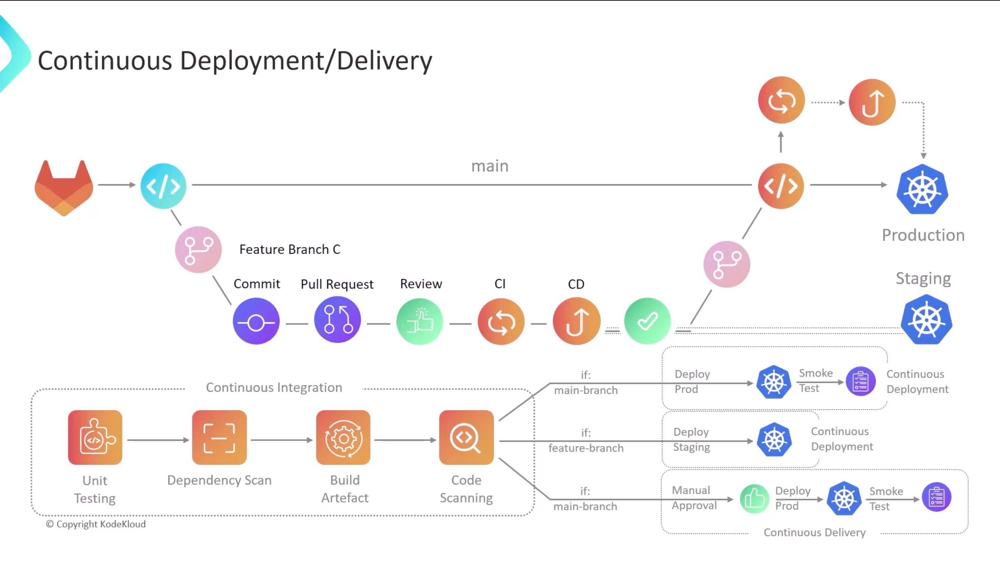
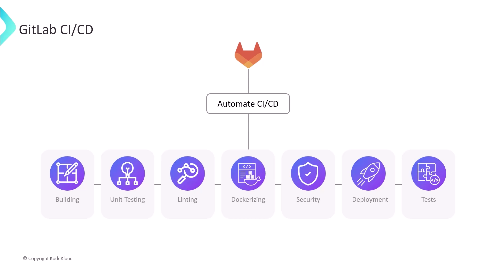
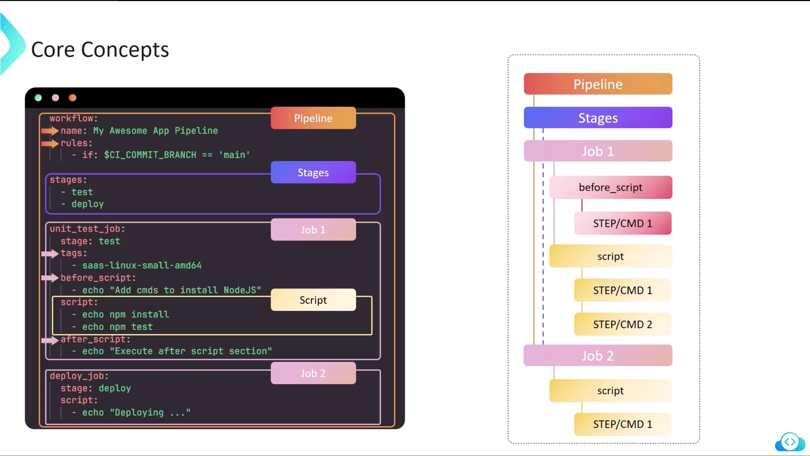
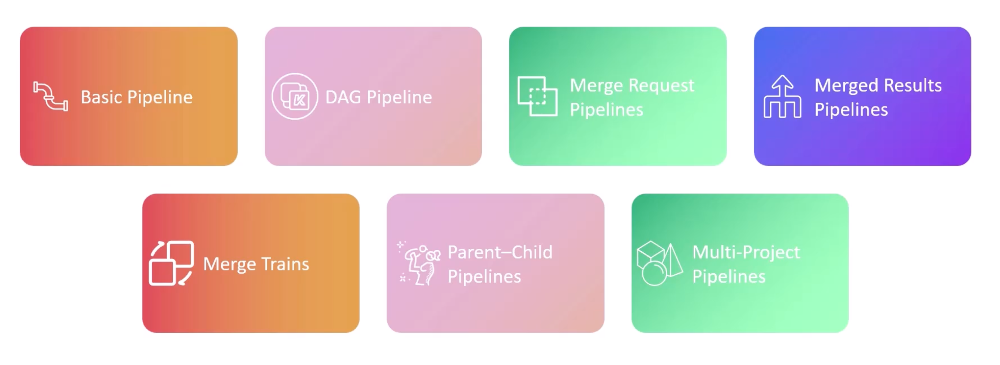

```mdx-code-block
import Tabs from '@theme/Tabs';
import TabItem from '@theme/TabItem';
```

## CICD




## Runners
- Software as a service (SaaS) runners.
- Self hosted runners.

## Core Concepts


## Pipeline Types



