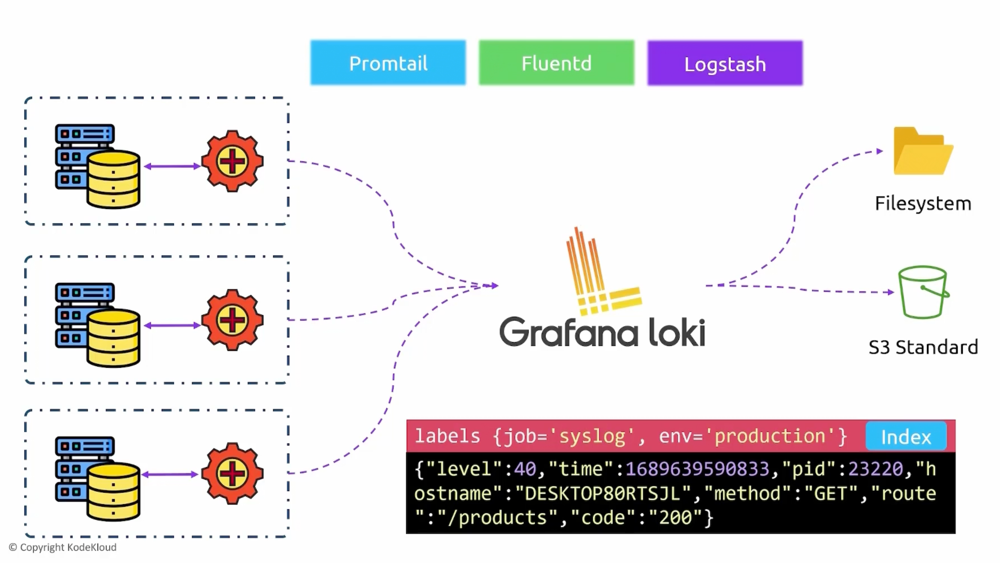

```mdx-code-block
import Tabs from '@theme/Tabs';
import TabItem from '@theme/TabItem';
```

## Loki
- Cost Effective and Easy to Operate.
- Does _NOT_ index Full text from logs e.g. Elastic Search.
- It does only index labels or metadata from logs.

## Architecture of Loki
Assume we have a couple of servers or applications that we want to collect logs from. To get logs from the server to loki instance. We will need to install a client on our servers.

The client is pretty flexible could be any of the following: promtail, fluentd, logstash. The agents are responsible to grab the logs then stream them to the loki instance. 

When the logs arrive you will get the basic log and on top of that, you will receive the metadata or labels.

There are a variety of storage options. E.g. filesystem or object storage like s3 buckets.



To query the logs from the server we will use LogQL is the query language to interact with Loki.

