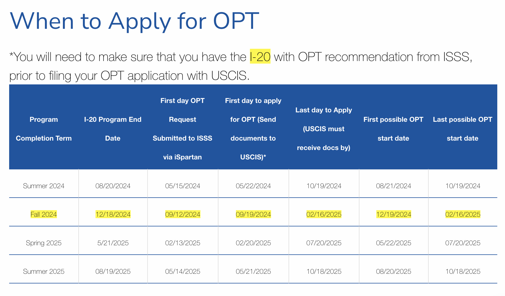

```mdx-code-block
import Tabs from '@theme/Tabs';
import TabItem from '@theme/TabItem';
```

## Options to Explore
- [ ] Two Year Home Residency
    - Fulbright.
    - Onsi Sawiris
- [ ] OPT >>> H1B
    - SJSU
    - Full Scholarship

## SJSU
Pros:
    - Free Premium Housing.
    - In the middle of Silicon valley.
Cons:
    - Tuition Fees on you.
    - Traveling and monthly stipend on you.

### SJSU ACADEMIC YEAR CALENDAR
- Summer Semester:                       69 days
- Transition Period (Spring to Summer):  12 days
- Fall Semester:                        125 days
- Spring Semester:                      123 days

#### FALL
- Start Date: Aug 17
- End   Date: Dec 19
- Total:          125 days

Details:
- August: 31 days - 16 days (August 17 to August 31) = 15 days
- September:                                         = 30 days
- October:                                           = 31 days
- November:                                          = 30 days
- December:                                          = 19 days
- Total: 15 + 30 + 31 + 30 + 19 = 125  days

#### FALL to SPRING
- Start Date: Dec 19
- End   Date: Jan 22
- Total: (May 22 till May 31 + 22 days) = 33 days

#### SPRING
- Start Date: Jan 22
- End   Date: May 24
- Total:          123 days

Details:
- January: 31 days - 21 days (January 22 to January 31) =  10 days
- February:                                             =  28 days (assuming a non-leap year: next leap year will happen in 2028)
- March:                                                =  31 days
- April:                                                =  30 days
- May:                                                  =  24 days
- Total days in Spring Semester: 10 + 28 + 31 + 30 + 24 = 123 days

#### SPRING to SUMMER
- Start Date: May 22
- End   Date: Jun  2
- Total: (May 22 till May 31 + 2 days) = 12 days

#### SUMMER
- Start Date: Jun  2
- End   Date: Aug 10
- Total: 69 days

Details:
- June: 30 days - 2 days (June 2 to June 30) = 28 days
- July:                                      = 31 days
- August:                                    = 10 days
- Total days in Summer Semester: 28 + 31 + 10 = 69 days

#### SUMMER to FALL
- Start Date: Aug 10
- End   Date: Aug 17
- Total: 7 days

#### Summary
- Fall:            `125 days`
- Fall to Spring:   33 days
- Spring:          `123 days`
- Spring to Summer: 12 days
- Summer:           `69 days`
- Summer to Fall:    7 days
- >>> Total: 125 + 33 + 123 + 12 + 69 + 7 = 369

### Housing Expenses and Food
- iHouse will cover All three semesters 125 + 123 + 69 = 317
- I should cover the transition periods:
    - 100 USD per day * (33+12+7) = 100 * 52 = 5,200 USD / Year

> Total per year is: 5,200 USD

### Pre Completion OPT
- Pre-Completion Optional Practical Training (OPT) is a temporary employment authorization issued by the U.S. Citizenship and Immigration Services (USCIS).
- This type of work authorization occurs prior to students' degree completion and before the program end date stated on the I-20.
- Students must have already completed at least `one academic year (fall and spring semester)` as a full-time student to be eligible for Pre-Completion OPT. 
    - `That is 9 months`.
- Pre-Completion OPT can be full-time (more than 20 hours per week) or part-time (20 hours or less per week). 
- Full-time Pre-Completion OPT is only available to students: 
    a. During summer _OR_
    b. Graduate students who have completed all course requirements and are only left with a project/thesis/comprehensive exam in their final semester.
- We recommend you schedule an [appointment](https://www.sjsu.edu/isss/about/contact.php) with an International Student Advisor to discuss pre-completion OPT.
- What if I have Pre-Completion authorization, but don’t ever find a job?
    - >>> The time you utilize, regardless of whether you find a job or not, will be `deducted from the 12 months of OPT` you are granted, but your F-1 status will still remain valid. 

### Post Completion OPT
> To be completed



### Total Tuition Cost
Mandatory Registration Fees    | Part-Time Rate 1.0 - 6.0 Units | Full-Time Rate 6.1 or More Units
:--:                           | :--:                           | :--:
Tuition Fee                    | $2,208                         | $3,804
Student Association Fee        | $110                           | $110
Student Union Fee              | $428                           | $428
Health Ctr Facility Fee        | $40                            | $40
Document Fee                   | $19                            | $19
Student Success Excel Tech Fee | $376                           | $376
Student Health Fee             | $190                           | $190
Totals                         | $3,371                         | `$4,967`

> Non-California Resident Students: Pay the amount in the table (above) plus `$420` per unit. For information on residency rules and regulations, visit Office of the Registrar @https://sjsu.edu/registrar/registration/residency/index.php

We will have a total of 33 units at [ms-software-engineering](https://www.sjsu.edu/cmpe/academic/ms-software-engineering/msse-program-requirements.php)
- 9 units of degree core courses
    - `CMPE 272` Enterprise Software Overview
    - `CMPE 202` Software Systems Engineering
    - `CMPE 255` Data Mining
- 9 units of required specialization courses
    - Take two required specialization core classes from one of the six specializations plus one specialization choice class from one of the other five specializations. Visit the web page for each of the specializations for details.
- 6 units of elective courses
- 3 unit GWAR class
- 6 units of master's project or thesis
= 3*9+6 = 33

To be a full time student you can not take less than: 12 units per semester

#### First Plan
Three semesters each: 
- Fall:           4 courses = 12 units
- Spring:         4 courses = 12 units
- Fall: 3 courses =  9 units `?? NOT FULL TIME STUDENT`
    - Take extra three units
    - Move a course to another semester, left with GP only and Pre-OPT
>>> Start OPT in December

#### Second Plan
Two semesters 9 months with: 6 courses = 18 units, then 5 courses with 15 units.
- Fall:   6 courses = 18 units
- Spring: 5 courses = 15 units

>>> Start OPT in June

- Pros:
- Cons:
    - Enough time to search for an OPT ??

#### Third Plan
Three semesters plus Pre-Completion OPT:
- Fall (August-December): 5 courses = 15 units
- Spring (Jan    - June    ): 4 courses = 12 units
- Summer (June   - August  ): `Pre-Completion OPT`
- Fall   (August - December): `Pre-Completion OPT` + GP 6 units

>>> Start OPT in December

- Fall (August-December): 5 courses = 15 units
    - Total Cost:
        - 4,967 + 15 * 420 = 11,267 USD
        - 5 * 800 = 4,000 USD
        - >>> `Total`: 11,267 >>> 11,267 + 4000 = 15,267 USD 
- Spring (Jan - June): 4 courses = 12 units
    - Total Cost:
        - 4,967 + 12 * 420 = 10,007 USD
        - 5 * 800 = 4000 USD
        - `Total`: 10,007 >>> 10,007 + 4000 = 14,007 USD
- Summer (June-August): `Pre-Completion OPT`
    - Total Earning: 
        - 35 (`avg`) * 4 (part-time) * (69+7+12-25) days = 35 * 4 * (69+7+12-25) =  `8,820` USD
        - 35 (`avg`) * 8 (full-time) * (69+7+12-25) days = 35 * 8 * (69+7+12-25) = `17,640` USD
        - NOTE:
            - Will be working Full Time.
            - No idea: 
                - How many week ends but I estimated them to be `25 days` from May 22 till Aug 17
                - When exactly I will find a job.
    - Total Cost:
        - 100 * (69+7+12) days = 8800 USD
        - Ref: Housing in Summer: @https://www.sjsu.edu/housing/docs/2024-summer/2024_Summer_Rates.pdf
    - Final Total: 13230 (`avg`) - 8800 = `+4430 USD`
- Fall (August-Decembers): `Pre-Completion OPT` + GP 6 units
    - Total Cost:
        - 4,967 + 6 * 420 = 7,487 USD
    - Total Earnings:
        - avg 35 * 4 * (125-36) = `+12,460` USD
    - Final Total: 12,460 - 7,487 = `+4,973` USD

Third Plan total cost is:
BEST  CASE Scenario: -15,267 -14,007 +4430 +4,973  = 10,663 USD
WORST CASE Scenario: -15,267 -14,007 -8,800 -7,487 = 45,561 USD

## REFERENCES
- [Pre OPT](https://www.sjsu.edu/isss/current-students/employment/pre-opt.php#item-d25e349)
- [Fall Registration Fees](https://www.sjsu.edu/bursar/fees-due-dates/tuition-other-fees/fall.php)
- [Tuition and Other Fees](https://www.sjsu.edu/bursar/fees-due-dates/tuition-other-fees/index.php)
- [Post Completion OPT](https://www.sjsu.edu/isss/current-students/employment/post-opt.php)
- [24 Month STEM Extension](https://www.sjsu.edu/isss/current-students/employment/stem/index.php)
