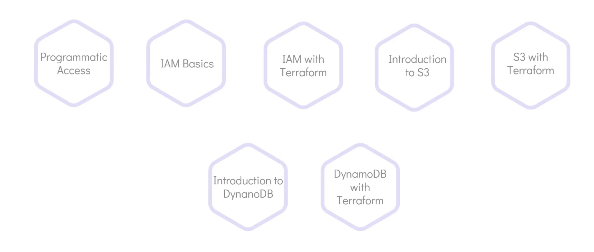
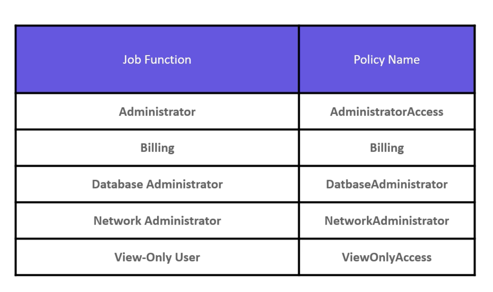

```mdx-code-block
import Tabs from '@theme/Tabs';
import TabItem from '@theme/TabItem';
```

## Objectives


<hr/>


<hr/>



<hr/>


<hr/>


## Old Way


## Infrastructure as Code (IaC)

<Tabs>

<TabItem value="CLI">


</TabItem>

<TabItem value="Console">


</TabItem>

<TabItem value="Ansible">


</TabItem>

<TabItem value="Terraform">


</TabItem>

</Tabs>

## IaC Types


### Configuration Management
- Ansible
- Puppet
- Chef
- SaltStack

#### Features
- Designed to install and manage software on existing servers.
- Maintains Standard Structure.
- Version Control.
- `Idempotent`.

### Server Templating Tools
These are tools that allows you to create a custom image of a vm or a container, e.g.:
- Docker.
- Packer.
- Vagrant.

#### Features
- Pre Install Software and Dependencies.
- Virtual Machine or Docker Images.
- Immutable Infrastructure.

### Provisioning Tools
- Terraform.
- CloudFormation.

#### Features
Used to provision infrastructure resources, e.g.:
- Virtual Machines.
- Database Instances.
- Networking Components "VPCs, Subnets, Security Groups, ...etc".

Also, Terraform supports `Multiple Providers`.


## Why Terraform?
- The code we wrote is the state we want our infrastructure to be in.
- Terraform works in three phases:
    - Init: Initialize the projects and identify the providers.
    - Plan: Drafts a plan to get to the target state.
    - Apply: Apply the plan to the infrastructure.
- Every object that Terraform manages is called a `Resource`.
- Terraform manages the lifecycle of the resource from provisioning to configuration to decommissioning.
- Terraform stores the state of the infrastructure in a file called `terraform.tfstate`, as it is seen in the real world. And it will ensure that the infrastructure is in the state that is defined in the configuration file.
- The state is a blueprint of the infrastructure deployed in the cloud.
- Terraform is `Idempotent`, which means that it will only make the necessary changes to the infrastructure to get it to the desired state.
- Terraform can also import existing infrastructure into its state. Which was created manually or by other tools. And bring it under its management.
- Terraform Cloud and Enterprise offer a lot of features that help in managing the infrastructure and the team. Also, a central place to store the state file and manage the changes. And UI.


## Installation
Visit the docs [here](https://developer.hashicorp.com/terraform/install?product_intent=terraform).

```bash title="Install Terraform Ubuntu/Debian"
wget -O- https://apt.releases.hashicorp.com/gpg | sudo gpg --dearmor -o /usr/share/keyrings/hashicorp-archive-keyring.gpg
echo "deb [signed-by=/usr/share/keyrings/hashicorp-archive-keyring.gpg] https://apt.releases.hashicorp.com $(lsb_release -cs) main" | sudo tee /etc/apt/sources.list.d/hashicorp.list
sudo apt update && sudo apt install terraform
```

## HCL - Declarative Language


## Resource
An object that Terraform can manage, e.g.:
- File on a localhost.
- vm on Cloud.
- Services like "S3 bucket, RDS, ...etc".

## HCL Syntax
The HCL file consists of blocks, arguments. A block is defied within curly braces `{}`. It contains a set of arguments in key-value pairs format representing the configuration  details.

```hcl title="HCL syntax example"
<block> <parameters> {
    <key> = <value>
    <key> = <value>
}
```

:::note Example
You can access the docs [here](https://registry.terraform.io/providers/hashicorp/local/latest/docs/resources/file).

```.tf title="local.tf"
resource "local_file" "example" {
    filename = "/tmp/example.txt"
    content  = "Hello, World!"
}
```

<hr/>


- The block name is `resource` keyword.
- The resource type is `local_file`. It consists of two parts, the provider name before the underscore `local` and the resource after the underscore `after`. Note that it is a fixed value depends on the provider.
- The resource name is `pet`. It is a user-defined name and it is used to refer to the resource in other parts of the configuration.
- The arguments are `filename` and `content`. They are the configuration details of the resource.
:::

:::note EC2 Example
```.tf title="aws-ec2.tf"
resource "aws_instance" "example" {
  ami           = "ami-0c55b159cbfafe1f0"
  instance_type = "t2.micro"
}
```
:::

:::note S3 Example
```.tf title="aws-s3.tf"
resource "aws_s3_bucket" "example" {
  bucket = "my-tf-test-bucket"
  acl    = "private"
}
```

### Commands
```bash
terraform init
terraform plan
terraform apply -auto-approve
terraform show
terraform destroy -auto-approve
terraform init -upgrade
terraform output
terraform validate
terraform fmt
terraform providers
terraform providers mirror /root/terraform/new_local_file # will mirror the provider configuration to the new path
terraform refresh # sync the state file with the real-world infrastructure e.g. manual update. It is also ran by default before `plan` and `apply`. you can disable it by `terraform apply --refresh=false`.
terraform graph # visualize the dependency graph of the resources.
terraform graph | dot -Tsvg > graph.svg # save the graph to a file.

terraform state show local_file.file
```


## Providers
You can access the docs [here](https://registry.terraform.io/browse/providers).
- **Official**: AWS, Azure, Google Cloud, ...
- **Partner**: Datadog, New Relic, ... A third party provider that has gone with partner process with HashiCorp.
- **Community**: A provider that is not officially supported by HashiCorp. Individuals or companies can create and publish their own providers.

:::tip terraform init
The `terraform init` is a safe command to run multiple times, without affecting the infrastructure.
:::

:::note Plugins
The plugins are downloaded in a hidden directory `.terraform/plugins` in the root of the project.
:::

:::tip source address
The plugin name that you see like `hashicorp/local` is the `source address` of the plugin. It is used to identify and download the plugin in the registry.

The first part of the name `hashicorp` is the Organizational namespace. It is followed by the type `local` which is the name of the provider. 

The plugin name can also have an optional hostname at the front e.g. `registry.terraform.io/hashicorp/local`.

By default, Terraform will download the latest version of the plugin. 
:::

## Configuration Directory


```hcl title="main.tf"
terraform {
  required_providers {
    linode = {
      source = "linode/linode"
      version = "1.13.3"
    }
  }
}
```


## Multi Provider
```hcl title="multi-provider.tf"

resource "local_file" "pet_name" {
  content = "We love pets!"
  filename = "/root/pets.txt"
}


resource "random_pet" "my-pet" {
  prefix = "Mrs"
  separator = "."
  length = "1"
}
```

## Variables

<Tabs>

<TabItem value="main.tf">

```hcl title="main.tf"
resource "local_file" "pet_name" {
  filename = var.filename
  content  = var.content
}

resource "random_pet" "my-pet" {
  prefix    = var.prefix
  separator = var.separator
  length    = var.length
}
```

</TabItem>

<TabItem value="variables.tf">

```hcl title="variables.tf"
variable "filename" {
  description = "The filename of the file"
  type        = string
  default     = "/root/pets.txt"
}

variable "content" {
  description = "The content of the file"
  type        = string
  default     = "We love pets!"
}

variable "prefix" {
  description = "The prefix of the pet"
  type        = string
  default     = "Mrs"
}

variable "separator" {
  description = "The separator of the pet"
  type        = string
  default     = "."
}

variable "length" {
  description = "The length of the pet"
  type        = string
  default     = "1"
}
```

</TabItem>

</Tabs>

:::note allowed types


```hcl title="variables.tf"
variable "prefix" {
  default = ["Mrs", "Mr"]
  type = list(string)
  description = "The prefix of the pet"
}

variable "file-content" {
  type = map
  default = {
    "statement-one" = "We love pets!"
    "statement-two" = "We love animals!"
  }
}
```

```hcl title="main.tf"
resource "random_pet" "my-pet" {
  prefix = var.prefix[0]
  separator = var.separator
  length = var.length
}

resource local_file my-pet {
  filename = "/root/pets.txt"
  content = var.file-content["statement-one"]
}
```


```hcl title="variables.tf"
variable "bella" {
  type = object({
    name = string
    color = string
    age = number
    food = list(string)
    favorite_pet = bool
  })

  default = {
    name = "Bella"
    color = "White"
    age = 3
    food = ["Chicken", "Fish"]
    favorite_pet = true
  }
}

variable kitty {
  type = tuple([string, number, bool])
  default = ["Kitty", 2, false]
}
```


:::

:::note List vs Set
Set is a list with unique elements.
:::


## Supply vars from CLI
```hcl
variable "region" {
  description = "The region to launch the instance"
  type        = string
}
```

```bash
terraform apply -var="region=us-west-1"
export TF_VAR_region=us-west-1
```

## Variable Definition Files
:::tip Variable Definition Files
Variable definition files can have any name and either `.tfvars` or `.tfvars.json` extension.

So:
- `terraform.tfvars`
- `terraform.tfvars.json`
- `*.auto.tfvars`
- `*.auto.tfvars.json`
- Or use `-var-file` flag to specify the file. E.g. `terraform apply -var-file= variables.tfvars`.
:::

```hcl title="<anything>.tfvars"
filename = "/root/pets.txt"
content  = "We love pets!"
prefix   = "Mrs"
separator = "."
length   = "1"
```

## Precedence
You can view the docs [here](https://developer.hashicorp.com/terraform/language/values/variables).


## Resource attributes
```hcl
resource "time_static" "example" {}

resource "local_file" "time" {
  filename = "/tmp/time.txt"
  content  = time_static.example.rfc3339
}
```

## Resource Dependencies
- Implicit Dependencies.
```hcl
resource "local_file" "pet" {
  filename = var.filename
  content  = "My favv pet is ${random_pet.my-pet.id}"
}

resource "random_pet" "my-pet" {
  prefix    = var.prefix
  separator = var.separator
  length    = var.length
}
```
- Explicit Dependencies.
```hcl
resource "local_file" "pet" {
  filename = var.filename
  content  = "My favv pet is Mr. Chattie"

  depends_on = [
    random_pet.my-pet
  ]
}

resource "random_pet" "my-pet" {
  prefix    = var.prefix
  separator = var.separator
  length    = var.length
}
```

```hcl
resource "local_file" "whale" {
  filename = "/root/whale"
  content = "whale"

  depends_on = [ local_file.krill ]
}

resource "local_file" "krill" {
  filename = "/root/krill"
  content = "krill"
}
```

## Output Variables
The best use of terraform output is:
- When you want to quickly display details about the provisioned infrastructure on the screen.
- Or to feed the output to another IaC tool or script.
```hcl
resource "random_pet" "my-pet" {
  prefix    = var.prefix
  separator = var.separator
  length    = var.length
}

output pet-name {
  value = random_pet.my-pet.id
  description = "Record the value of the pet name"
}
```

## Terraform State

- `terraform.tfstate` file is the state file that contains the current state of the infrastructure. It is a JSON file. Terraform uses it as a source of truth to know what is currently deployed in the real-world infrastructure.


:::tip State File
Terraform uses state file to track dependencies between resources. E.g. you removed two resources, so know looking only at configuration files. You can't know which one to remove first. But the state file will tell you that.

Also, for performance reasons. It is not reasonable to reconcile the infrastructure with the configuration files every time you run a terraform command. So, Terraform uses the state file to know what is currently deployed and what is not.


:::


:::tip Refresh False
Terraform will use cached attributes from the state file. It will not refresh the state from the real-world infrastructure. It is useful when you want to quickly apply changes to the infrastructure without waiting for the refresh to complete.

> terraform apply --refresh=false
:::


:::danger State File
- State files should be kept secure and private. It is suggested to use a remote backend to store the state file. E.g. Terraform Cloud, S3, Azure Blob Storage, ...etc.
- Configuration files should not contain sensitive data. E.g. passwords, keys, ...etc. And are recommended to be stored in distributed version control systems.

You should never attempt to modify the state file manually. Relay on Terraform `state` commands to manage the state file.
:::

## Configuration Drift
- Configuration Drift is the difference between the real-world infrastructure and the configuration files. It leaves the infrastructure in a complex state. Which will make any subsequent changes to the infrastructure difficult to manage.


## Lifecycle Rules
```hcl 
resource "aws_instance" "example" {
  ami           = "ami-0c55b159cbfafe1f0"
  instance_type = "t2.micro"

  lifecycle {
    create_before_destroy = true
    // or
    prevent_destroy = true
  }
}
```


### Ignore changes
```hcl
resource "aws_instance" "example" {
  ami           = "ami-0c55b159cbfafe1f0"
  instance_type = "t2.micro"
  tags = {
    Name = "example"
  }

  lifecycle {
    ignore_changes = [
      tags["Name"],
    ]
    # or ignore_changes = all
  }
}
```

## Data Sources
```hcl
resource "local_file" "pet" {
  filename = var.filename
  content  = "My favv pet is ${data.local_file.dogs.content}"
}

data "local_file" "dogs" {
  filename = "/root/dogs.txt"
}
```

```hcl
output "os-version" {
  value = data.local_file.content
}

data "local_file" "os" {
  filename = "/etc/os-release"
}
```

## Meta Arguments
Meta arguments can be used with any resource block, e.g.:
- `depends_on`
- `life_cycle`
- `count`

### Count

<Tabs>

<TabItem value="v1">

```hcl
variable "filename" {
  type = string
  default = [
    "/root/pets.txt",
    "/root/dogs.txt",
    "/root/cats.txt"
  ]
}

resource "local_file" "pet" {
  filename = var.filename[count.index]
  count = 3
}
```

</TabItem>

<TabItem value="v2">

```hcl
variable "filename" {
  type = string
  default = [
    "/root/pets.txt",
    "/root/dogs.txt",
    "/root/cats.txt",
    "/root/cows.txt",
    "/root/whales.txt"
  ]
}

resource "local_file" "pet" {
  filename = var.filename[count.index]
  count = length(var.filename)
}
```

</TabItem>

</Tabs>


::::warning Removing while using count
If you removed "/root/pets.txt", instead of destroying only one resource. Terraform will replace two resources and destroy one.


:::note Count
When you use count, the resources become a list of resources.

#### Example
```hcl
variable "filename" {
  type = string
  default = [
    "/root/pets.txt",
    "/root/dogs.txt",
    "/root/cats.txt",
    "/root/cows.txt",
    "/root/whales.txt"
  ]
}

resource "local_file" "pet" {
  filename = var.filename[count.index]
  count = length(var.filename)
}

output "pets" {
  value = local_file.pet
}
```
#### Output

:::

#### Understand Results


Yes now we have the infrastructure as we intended. But `this is not the ideal approach`. 
::::


### For Each

<Tabs>

<TabItem value="v1">

```hcl
variable "filename" {
  type = set(string)
  default = [
    "/root/pets.txt",
    "/root/dogs.txt",
    "/root/cats.txt",
    "/root/cows.txt",
    "/root/whales.txt"
  ]
}

resource "local_file" "pet" {
  filename = each.value
  for_each = var.filename
}
```

</TabItem>

<TabItem value="v2">

```hcl
variable "filename" {
  type = list(string)
  default = [
    "/root/pets.txt",
    "/root/dogs.txt",
    "/root/cats.txt",
    "/root/cows.txt",
    "/root/whales.txt"
  ]
}

resource "local_file" "pet" {
  filename = each.value
  for_each = toset(var.filename)
}
```

</TabItem>

</Tabs>

:::note For Each
When you use for_each, the resources become a map of resources.


#### Resources are now a map

:::


### Count vs For Each


### Other
There are other meta arguments in Terraform, e.g.:
- `provisioner`.
- `providers`.
- `backends`.

## Version Constraints
Providers use `plugin-based` architecture. By default, Terraform will download the latest version of the plugin. But you can specify the version of the plugin to use.

<Tabs>

<TabItem value="Fixed Version">

```hcl {5}
terraform {
  required_providers {
    local = {
      source = "hashicorp/local"
      version = "2.4.1"
    }
  }
}
```

</TabItem>

<TabItem value="Any Except">

```hcl {5}
terraform {
  required_providers {
    local = {
      source = "hashicorp/local"
      version = "!= 2.4.1"
    }
  }
}
```

</TabItem>

<TabItem value="Less Than">

```hcl {5}
terraform {
  required_providers {
    local = {
      source = "hashicorp/local"
      version = "< 2.4.1"
    }
  }
}
```

</TabItem>

<TabItem value="Greater Than">

```hcl {5}
terraform {
  required_providers {
    local = {
      source = "hashicorp/local"
      version = "> 2.4.1"
    }
  }
}
```

</TabItem>

<TabItem value="Range">

```hcl {5}
terraform {
  required_providers {
    local = {
      source = "hashicorp/local"
      version = "> 1.2.0, < 2.0.0, != 1.5.0"
    }
  }
}
```

</TabItem>

<TabItem value="Semantic">

:::tip 

```hcl {5}
terraform {
  required_providers {
    local = {
      source = "hashicorp/local"
      version = "~> 1.2"
    }
  }
}
```

In `version = "~> 1.2"`, the `~>` is a shorthand for `>=`. It means that the version should be greater than or equal to `1.2` and less than `2.0`.

In `version = "~> 1.2.0"`, the `~>` is a shorthand for `>=`. It means that the version should be greater than or equal to `1.2.0` and less than `1.3.0`.
:::

</TabItem>

</Tabs>


## AWS
:::tip Heredoc
You can use heredoc to write the policy document in a separate file. And then use the `file` function to read the file and pass it to the `policy` attribute.

Heredoc is a way to write multi-line strings. It is used to write a string that spans multiple lines. It starts with `<<` followed by a delimiter. And ends with the same delimiter.
:::

### IAM

<details>
<summary>A quick review</summary>

Iam policies.





:::tip IAM policies vs roles
- IAM policies are attached to users, groups, and roles.
- IAM roles are used to delegate permissions to entities that you trust. E.g. a service or a user in another account.
:::

</details>

### IAM & IaC

```hcl
resource "aws_iam_user" "admin-user" {
  name = "ziadh"
  tags = {
    Description = "Technical Team Leader"
  }
}

resource "aws_iam_policy" "adminUser" {
  name = "adminUser"
  description = "Admin User Policy"
  policy = <<EOF
  {
    "Version": "2012-10-17",
    "Statement": [
      {
        "Effect": "Allow",
        "Action": "*",
        "Resource": "*"
      }
    ]
  }
  EOF
} 


resource "aws_iam_user_policy_attachment" "adminUser" {
  user = aws_iam_user.admin-user.name
  policy_arn = aws_iam_policy.adminUser.arn
}
```

### S3 & IaC
```hcl
terraform {
  required_providers {
    aws = {
      source = "hashicorp/aws"
      version = "4.15.0"
    }
  }
}

provider "aws" {
  region = "us-east-1"
}

resource "aws_s3_bucket" "dc_bucket" {
  bucket = "dc-is-better-than-marvel"
}

resource "aws_s3_object" "upload" {
  bucket = "pixar-studios-2020"
  key    = "woody.jpg"
  source = "/root/woody.jpg"
}

```

### DynamoDB & IaC
```hcl
terraform {
  required_providers {
    aws = {
      source = "hashicorp/aws"
      version = "4.15.0"
    }
  }
}

provider "aws" {
  region                      = var.region
  skip_credentials_validation = true
  skip_requesting_account_id  = true

  endpoints {
    dynamodb                       = "http://aws:4566"
  }
}


resource "aws_dynamodb_table" "project_sapphire_inventory" {
  name           = "inventory"
  billing_mode   = "PAY_PER_REQUEST"
  hash_key       = "AssetID"

  attribute {
    name = "AssetID"
    type = "N"
  }
  attribute {
    name = "AssetName"
    type = "S"
  }
  attribute {
    name = "age"
    type = "N"
  }
  attribute {
    name = "Hardware"
    type = "B"
  }
  global_secondary_index {
    name             = "AssetName"
    hash_key         = "AssetName"
    projection_type    = "ALL"
    
  }
  global_secondary_index {
    name             = "age"
    hash_key         = "age"
    projection_type    = "ALL"
    
  }
  global_secondary_index {
    name             = "Hardware"
    hash_key         = "Hardware"
    projection_type    = "ALL"
    
  }
}

resource "aws_dynamodb_table_item" "upload" {
  table_name = aws_dynamodb_table.project_sapphire_inventory.name
  hash_key   = aws_dynamodb_table.project_sapphire_inventory.hash_key
  item = <<EOF
 {
  "AssetID": {"N": "1"},
  "AssetName": {"S": "printer"},
  "age": {"N": "5"},
  "Hardware": {"B": "true" }
}
EOF
}

```


### EC2 & IaC
```hcl

# [1]: Prepare ssh key pair
resource "tls_private_key" "ssh_key" {
  algorithm = "ED25519"
}

output "private_key" {
  value = tls_private_key.ssh_key.private_key_openssh
  sensitive=true
}

output "public_key" {
  value = tls_private_key.ssh_key.public_key_openssh
  sensitive=true
}

resource "local_file" "ssh_key_pair" {
  filename = "ssh_key_pair"
  content = tls_private_key.ssh_key.private_key_openssh
}

resource "local_file" "ssh_key_pair_pub" {
  filename = "ssh_key_pair.pub"
  content = tls_private_key.ssh_key.public_key_openssh
}

resource "aws_eip" "lb" {
  domain = "vpc"
  instance = aws_instance.ubuntu-latest-server.id
}

# [2]: Create EC2 instance
resource "aws_instance" "ubuntu-latest-server" {
  ami           = "ami-0c55b159cbfafe1f0"
  instance_type = "t2.micro"
  key_name      = tls_private_key.ssh_key.key_name
  vpc_security_group_ids = [
    aws_security_group.ssh_access.id
  ]
  tags = {
    Name = "ubuntu-latest-server"
  }
}

# [3]: Security group SSH access
resource "aws_security_group" "ssh_access" {
  name        = "ssh_access"
  description = "Allow SSH access"
  vpc_id      = "vpc-0c55b159cbfafe1f0"

  ingress {
    description = "Allow SSH access from anywhere"
    from_port   = 22
    to_port     = 22
    protocol    = "tcp"
    cidr_blocks = ["0.0.0.0/0"]
  }
}

output "public_ip" {
  value = aws_instance.ubuntu-latest-server.public_ip
}

```


## Remote State
:::danger 
- You should never attempt to modify the state file manually.
- You should never store the state file in a version control system.


Use a `remote backend` to store the state file. E.g. Terraform Cloud, S3, Azure Blob Storage, ...etc.

You can check the following articles:
- [AWS Terraform S3 and dynamoDB backend.](https://angelo-malatacca83.medium.com/aws-terraform-s3-and-dynamodb-backend-3b28431a76c1)
- [Deploying a Terraform Remote State Backend with AWS S3 and DynamoDB.](https://hackernoon.com/deploying-a-terraform-remote-state-backend-with-aws-s3-and-dynamodb)
:::

### Reasons
1. Forgot to pull the latest state file from the repo. `Disaster`.
2. No state locking mechanism. `Concurrency issues`.
3. Bad practice to expose sensitive data `ip-addresses, dns, db passwords..etc" residing inside the state file. `Security issues`.

## State Commands
We have several commands to manage the state file, e.g.:
- list.
- mv.
- pull.
- rm.
- show.


### list
```bash
terraform state list # Print resource addresses
```

### show
```bash
terraform state show aws_instance.example # Show details of a resource
```

### mv


### pull


### rm
But make sure to remove the resource from the configuration file first. Otherwise, Terraform will try to recreate the resource. Also note that the resource will not be destroyed in the real-world infrastructure. It will only be removed from the state file.


## Provisioners
Provisioners are used to execute scripts on a local or remote machine as part of resource creation or destruction. They are used to bootstrap the resource, e.g.:
- Install software.
- Configure the resource.
- Run a script.


:::danger 
As a best practice, you should avoid using provisioners as much as possible. According to terraform documentation, `Provisioners should only be used as a last resort. For example, when existing resources are not supported by Terraform.`

Whenever possible make use of options natively supported by the provider. E.g.:
- `user_data` for EC2.
- `init` for GCP.
- `startup_script` for Azure.
:::

:::danger user data only first boot
`user_data` is only executed on the first boot of the instance. If you want to run a script every time the instance is booted, you should use a provision

```hcl
resource "aws_instance" "cerberus" {
  ami           = var.ami
  instance_type = var.instance_type
  key_name = aws_key_pair.cerberus-key.key_name
  user_data = <<EOF
    #!/bin/bash
    sudo yum update -y
    sudo yum install nginx -y
    sudo systemctl start nginx
  EOF
}
```

Adding user data later won't install nginx.

:::

### Remote Exec
```hcl
resource "aws_instance" "example" {
  ami           = "ami-0c55b159cbfafe1f0"
  instance_type = "t2.micro"

  provisioner "remote-exec" {
    inline = [
      "sudo apt update",
      "sudo apt install -y nginx",
      "sudo systemctl start nginx",
      "sudo systemctl enable nginx"
    ]
  }

  connection {
    type = "ssh"
    user = "ubuntu"
    host = self.public_ip
    private_key = tls_private_key.ssh_key.private_key_openssh
  }
}
```

:::warning
No guarantee that the script will run successfully. `There must exist a network connection between the local machine and the remote machine`. 

Also, provisioners are not included in plan output. As you can put any command in the provisioner. So, Terraform will not be able to predict the changes that will be made to the infrastructure.
:::

### Local Exec
Useful to gather some data and store it in a file. E.g.:
- Public IP address.
- Instance ID.
- DNS name.


```hcl
resource "aws_instance" "example" {
  ami           = "ami-0c55b159cbfafe1f0"
  instance_type = "t2.micro"

  provisioner "local-exec" {
    command = "echo ${self.public_ip} > ip_address.txt"
  }

  provisioner "local-exec" {
    when = destroy
    command = "echo ${self.public_ip} > ip_address.txt"
  }
}
```

:::note Create time provisioners
By default, provisioners are executed after the resource is created. 

But, destroy time provisioners are executed before the resource is destroyed. It is useful to clean up the resources before they are destroyed.
:::

:::tip use on_failure
Here `/temp` is a directory that does not exist. So, the command will fail. But we can use `on_failure` to continue the execution of the script. As we don't want the failure of the script to stop the execution of the resource.

```hcl
resource "aws_instance" "example" {
  ami           = "ami-0c55b159cbfafe1f0"
  instance_type = "t2.micro"

  provisioner "local-exec" {
    command = "echo ${self.public_ip} > /temp/ip_address.txt"
    on_failure = continue
  }
}
```
:::

## Taint
Taint is used to mark a resource for recreation. It is useful when you want to recreate a resource without destroying and recreating the entire infrastructure.

```bash
terraform taint aws_instance.example
terraform untaint aws_instance.example
```

## Debugging
::::tip log levels
You can set `TF_LOG` to one of the log levels (in order of decreasing verbosity) `TRACE`, `DEBUG`, `INFO`, `WARN` or `ERROR` to change the verbosity of the logs. Trace is the most verbose and info is the least verbose.

#### Example
```bash
export TF_LOG=TRACE
```


Setting `TF_LOG` to `JSON` outputs logs at the TRACE level or higher, and uses a parseable JSON encoding as the formatting.

:::warning 
The `JSON` encoding of log files is not considered a stable interface. It may change at any time, without warning. It is meant to support tooling that will be forthcoming, and that tooling is the only supported way to interact with JSON formatted logs.
:::
::::

:::tip store logs permanently
You can store the logs permanently by setting `TF_LOG_PATH` to the path of the log file. E.g. `TF_LOG_PATH=/tmp/terraform.log`.

To disable logging to a file, use `unset TF_LOG_PATH`.
:::


## Import
Import is used to import existing infrastructure into the state file. It is useful when you have existing infrastructure that was created manually or by other tools. And you want to bring it under Terraform management.

```bash
terraform import aws_instance.example i-1234567890abcdef0
```

You will need to add the resource to the configuration file. And then run `terraform plan` to see the changes that will be made to the infrastructure. And then run `terraform apply` to apply the changes.

```hcl
resource "aws_instance" "example" {
  {# resource attributes #}
}
```

```bash
terraform show -json | jq '.values.root_module.resources[] | select(.type == "aws_instance" and .name == "jade-mw")'
```


## Modules
Modules are used to organize the configuration into reusable units. They are used to create reusable components. E.g.:
- VPC module.
- EC2 module.
- RDS module.

:::warning
Resources addresses are unique. So, you can't have two resources with the same address. But you can have two resources with the same name if they are in different modules.

#### Example
```hcl title="tut-app-uk/main.tf"
resource "aws_instance" "example" {
  ami           = "ami-0c55b159cbfafe1f0"
  instance_type = "t2.micro"
}
```

Would be `module.tut-app-uk.aws_instance.example` if it was in a module called `tut-app-uk`.
:::

#### Example


<hr/>


<hr/>


## Functions
Terraform has a lot of built-in functions that you can use in your configuration files. E.g.:
- `abs`.
- `ceil`.
- `chomp`.
- `cidrsubnet`.
- `coalesce`.
- `coalescelist`.
- `compact`.
- `concat`.
- `contains`.
- `dirname`.
- `distinct`.
- `element`.
- `file`.
- `flatten`.
- `format`.
- `formatlist`. 


### Console
```bash
terraform console
```

### Example
```hcl
terraform {
  required_providers {
    aws = {
      source = "hashicorp/aws"
      version = "4.15.0"
    }
  }
}

provider "aws" {
  region                      = var.region
  skip_credentials_validation = true
  skip_requesting_account_id  = true
  s3_use_path_style = true
  endpoints {
    ec2 = "http://aws:4566"
    iam = "http://aws:4566"
    s3 = "http://aws:4566"
  }
}

variable "region" {
  default = "ca-central-1"
}
variable "cloud_users" {
  type = string
  default = "andrew:ken:faraz:mutsumi:peter:steve:braja"
  
}
variable "bucket" {
  default = "sonic-media"
}

variable "media" {
  type = set(string)
  default = [ 
    "/media/tails.jpg",
    "/media/eggman.jpg",
    "/media/ultrasonic.jpg",
    "/media/knuckles.jpg",
    "/media/shadow.jpg",
  ]
  
}
variable "sf" {
  type = list
  default = [
    "ryu",
    "ken",
    "akuma",
    "seth",
    "zangief",
    "poison",
    "gen",
    "oni",
    "thawk",
    "fang",
    "rashid",
    "birdie",
    "sagat",
    "bison",
    "cammy",
    "chun-li",
    "balrog",
    "cody",
    "rolento",
    "ibuki"
  ]
}

resource "aws_iam_user" "cloud" {
  name = split(":", var.cloud_users)[count.index]
  count = length(split(":", var.cloud_users))
}
```

## Workspaces
```hcl
variable "region" {
  default = "us-west-1"
}

variable "instance_type" {
  default = "t2.micro"
}

variable "ami" {
  default = {
    "ProjectA" = "ami-0c55b159cbfafe1f0",
    "ProjectB" = "ami-0c55b159cbfafe1f0"
  }
}

resource "aws_instance" "example" {
  ami           = lookup(var.ami, terraform.workspace)
  instance_type = var.instance_type
  tags = {
    Name = "${terraform.workspace}-example"
  }
}
```

```bash
terraform workspace new dev # adds and selects the workspace
terraform workspace new prod # adds and selects the workspace
terraform workspace list
terraform workspace select dev
terraform workspace select prod
```

### State


## Providers
List of all providers examples.

### tls 
```hcl 
resource "tls_private_key" "pvtkey" {
  algorithm = "RSA"
  rsa_bits = 4096
}

resource "local_file" "key_details" {
  filename = "/root/key.txt"
  content = "${tls_private_key.pvtkey.private_key_pem}"
}
```


### random
```hcl
resource "random_uuid" "id1" {}

resource "random_integer" "order1" {
  min     = 1
  max     = 99999
}

output "id1" {
  value = random_uuid.id1.result
}

output "order1" {
  value = random_integer.order1.result
}
```


:::tip random_password
You can use the `random_password` resource to generate a random password. It is useful when you want to generate a random password for a user or a service.

```bash
terraform output -json | jq -r '.password.value'
```

```hcl title="password.tf"
variable "length" {
  description = "The length of the password"
  type        = number
  default     = 16
}

resource "random_password" "password-generator" {
  length = var.length < 16 ? 16 : var.length
  special = true
  override_special = "!@#$%^&*()_+"
}

output "password" {
  value = random_password.password-generator.result
  sensitive = true
}
```